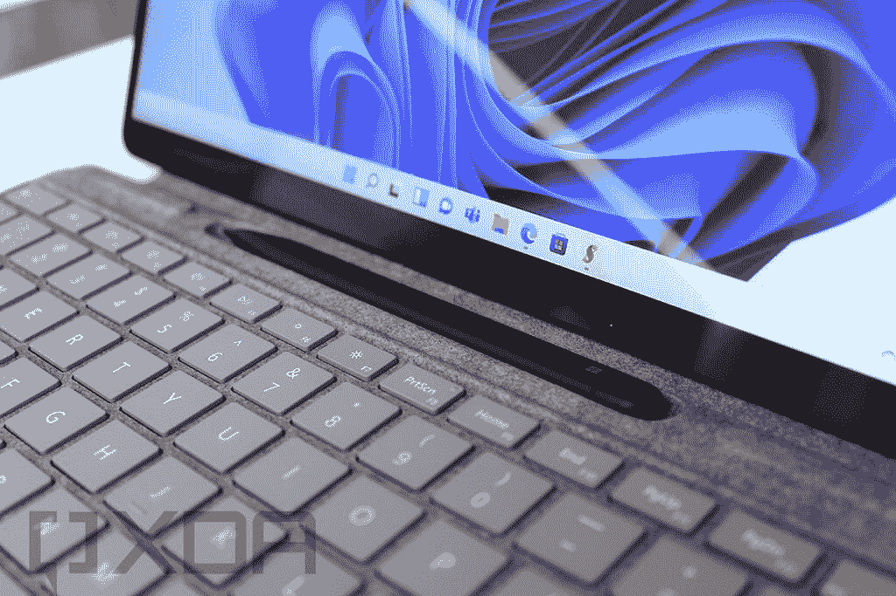

# Surface Pro 8 vs Surface Go 3:该买哪款平板？

> 原文：<https://www.xda-developers.com/surface-go-3-vs-pro-8/>

微软最近推出了 [Surface Pro 8](https://www.xda-developers.com/surface-pro-8/) 和 [Surface Go 3](https://www.xda-developers.com/surface-go-3/) ，这两款设备将代表你在 [Windows 11](https://www.xda-developers.com/windows-11/) 上可以获得的最佳体验。这两款都是平板电脑，它们本身都是很棒的设备，但它们的价格区间非常不同。马上，那应该帮助决定哪一个是最适合你的。

但是如果你想对它们有更多的了解，我们就来看看它们的独特之处。有充分的理由想要其中任何一个，即使 Surface Pro 8 显然是最优质的产品，Surface Go 3 也有很多优势。

## Surface Pro 8 vs Surface Go 3:规格

首先，让我们来看看这两款平板电脑之间的规格概要。之后我们会更深入地探讨这些差异。

|  | 

Surface Pro 8

 | 

Surface Go 3

 |
| --- | --- | --- |
| **处理器** | 

*   英特尔酷睿 i3-1115G4(最高 4.1GHz，双核)(仅限商业客户)
*   英特尔酷睿 i5-1135G7(最高 4.2GHz，四核)
*   英特尔酷睿 i7-1185G7(最高 4.9GHz，四核)

 | 

*   英特尔奔腾金色 6500Y(最高 3.4GHz，双核)
*   英特尔酷睿 i3-10100Y(最高 3.9GHz，双核)

 |
| **图形** |  |  |
| **闸板** |  |  |
| **存储** |  |  |
| **显示** | 

*   13 英寸 PixelSense Flow (2880 x 1920)显示屏，刷新率高达 120Hz，支持触摸和表面笔

 | 

*   10.5 英寸 PixelSense (1920 x 1280)，触摸屏，支持表面笔

 |
| **音频** | 

*   两个配有杜比全景声的 2W 立体声扬声器

 | 

*   两个带杜比音频的 2W 立体声扬声器

 |
| **网络摄像头** | 

*   500 万像素、1080 像素前置网络摄像头
*   10MP 4K/1080 p 后置摄像头

 | 

*   500 万像素全高清前置摄像头
*   800 万像素全高清后置摄像头，带自动对焦功能

 |
| **生物认证** |  |  |
| **电池** | 

*   长达 16 小时的电池续航时间

 | 

*   长达 10 小时的典型设备使用时间

 |
| **端口** | 

*   2 个 Thunderbolt 4(USB C 类)端口
*   表面连接端口
*   3.5 毫米耳机插孔

 | 

*   1 个 USB 类型-C
*   1 个表面连接端口
*   3.5 毫米耳机插孔
*   microSD 读卡器

 |
| **连通性** | 

*   Wi-Fi 6 +蓝牙 5.1
*   可选:LTE(高通骁龙 X20)

 | 

*   Wi-Fi 6 +蓝牙 5.0
*   可选:LTE Advanced Pro(高通骁龙 X16)

 |
| **颜色** |  |  |
| **尺寸(WxDxH)** | 

*   11.3 x 8.2 x 0.37 英寸(287.02 x 208.28 x 9.4 毫米)

 | 

*   9.65 x 6.9 x 0.33 英寸(245 x 175 x 8.3 毫米)

 |
| **重量** |  |  |
| **起始价格** | 1，099.99 美元(搭载英特尔酷睿 i5 处理器的消费者机型) | $399 |

## 性能:Surface Pro 8 遥遥领先

仅仅看一下规格列表，很明显 Surface Pro 8 是两款设备中更强大的。它由第 11 代 15W 英特尔酷睿处理器提供支持，无论是在 CPU 还是 GPU 方面，都比上一代产品带来了巨大的性能飞跃。相比之下，Surface Go 3 配备了 5W/7W 处理器，没有英特尔 Iris Xe 显卡。自然，在性能方面会有很大的差距。

我们通常使用 Geekbench 5 来比较分数，但 Surface Go 3 处理器还没有在数据库中。但是，我们可以使用 Geekbench 4 进行这种比较。以下是这些处理器的外观:

|  | 

英特尔奔腾金色 6500Y

 | 

英特尔酷睿 i3-10100Y

 | 

英特尔酷睿 i5-1135G7

 | 

英特尔酷睿 i7-1185G7

 |
| --- | --- | --- | --- | --- |
| Geekbench 4 评分(单核/多核) | 3,647 / 5,963 | 4,359 / 7,643 | 5,628 / 17,649 | 6,694 / 22,344 |

这种差异并不显著，尤其是在多核结果方面。那是因为 Surface Go 3 内部的处理器只有两个核心，而 Surface Pro 8 有四个核心。

其余的规格也大相径庭。Surface Go 3 最大容量为 8GB 内存和 128GB 固态硬盘，这是 Surface Pro 8 的基本配置。你可以将 Pro 8 升级到最高 32GB 的 RAM 和 1TB 的存储(如果添加 LTE，则限制为 256GB)，因此自然是两者中最强大的。

Surface Pro 8 在电池续航时间方面也胜出，平板电脑的尺寸更大，可以容纳更大的电池。微软宣称典型使用时间长达 16 小时，而 Surface Go 3 的使用时间为 10 小时。

但是需要指出的是，所有这些都是可以预期的。这两款设备价格差异巨大，当然 Pro 8 更强大。这并不一定意味着你会对 Surface Go 3 有不好的体验，它仍然是一款坚实的入门级平板电脑。对于偶尔浏览网页的人和年轻学生来说，这仍然是一个有效的选择。

## 显示屏:Pro 8 更大更快

当我们观察这些平板电脑的显示屏时，这一趋势仍在继续。同样，Surface Go 3 以其价格提供了很好的体验。它配备了 10.5 英寸全高清+ (1920 x 1280)显示屏，甚至拥有其他 Surface 设备所拥有的 3:2 纵横比。这在这个价位上是非常罕见的，而且它带来了很好的观看体验。

> Surface Pro 8 拥有 120Hz 刷新率显示屏和杜比视界。

但当然，Surface Pro 8 是在不同的层面上。它有一个更大的 13 英寸显示屏，也有更多的像素，分辨率为 2280 x 1920。不仅如此，它还支持杜比视觉和高达 1120Hz 的刷新率，让一切感觉更加流畅。如果你是一个墨迹爱好者，Surface Pro 8 内部有一个新的处理器，可以在 Surface Slim Pen 2 中实现触觉反馈，让你感觉像是用笔在纸上写字。这是一种奇妙的体验。

Surface Pro 8 和 Go 3 的音频设置相差不远，它们都有一对 2W 扬声器提供立体声，并且它们直接指向屏幕前方。不同的是 Surface Pro 8 支持杜比 Atmos 环绕声，而 Go 3 只支持“杜比音频”。这意味着电影和电视节目可能会在 Pro 8 上更加身临其境。

再次转向网络摄像头，你会在这两种设备上获得可靠的体验。前置网络摄像头是一个 500 万像素的传感器，支持全高清视频，非常适合视频通话。即使在高端设备上，也不是每个品牌都在使用全高清网络摄像头，但微软甚至在其平价的 Surface Go 3 中使用了这些摄像头。

不同之处在于背面，Surface Go 3 使用 800 万像素的摄像头拍摄全高清视频，而 Pro 8 则使用 100 万像素的摄像头，能够在 4K 进行录制。它们都有自动对焦功能。

## 设计:Surface Go 3 更加便携

虽然 Surface Pro 8 和 Go 3 都是非常便携的设备，但这是你可能更喜欢 Surface Go 3 的一个领域。由于更小的 10.5 英寸显示屏，这款平板电脑明显更轻，仅重 1.2 磅，更小的尺寸意味着它作为平板电脑也更易于管理。用一只手握住更容易，而且您可能会发现触摸屏幕的每个部分也更容易。最终，这并不是一个巨大的差异，Surface Pro 8 仍然可以很容易地带到任何地方。

> *Surface Pro 8 使用了新的键盘盖，内置了 Surface Slim Pen 2 的存储空间。*

两款平板电脑都支持 Type Cover/Signature 键盘，以及 Surface Pen，但它们现在的方式不同了。Surface Go 3 有自己的 Type Cover，自然更小，而且它的圆形设计支持经典的 Surface Pen。Surface Pen 通过磁力附着在笔记本电脑的侧面，它使用不可充电电池。

与此同时，Surface Pro 8 旨在与 Surface Slim Pen 2 配合使用，后者采用轻薄设计，旨在存放在新的 Surface Pro 签名键盘内。这提供了更安全的存储，因为你不能轻易把笔弄松，但它也可以在存储时给电池充电。由于 Surface Pro 8 的底盘更加圆润，你已经不能在侧面附加经典的 Surface Pen 了，但是如果你想的话还是可以使用的。

 <picture></picture> 

Surface Slim Pen 2 and Surface Pro 8

在端口方面，Surface Pro 8 比 Surface Go 3 有一个相当大的优势，那就是 Thunderbolt 4 支持。如果你想使用 Thunderbolt 坞站、显示器或外部 GPU，Surface Pro 8 可以让你做到这一切，它是首批做到这一点的 Surface PCs 之一。除了两个 Thunderbolt 4 端口，它还有一个 Surface Connect 端口和一个耳机插孔，Surface Go 3 也有。然而，Surface Go 3 没有两个 Thunderbolt 端口，而是有一个标准的 USB Type-C 端口和一个 microSD 读卡器。

## 连接:两者都有 LTE

对于超移动用户来说，好消息是 LTE 连接在这两种型号上都可用，或者至少在未来会可用。在发布时，只有 Wi-Fi 型号可供购买，但 LTE 版本将对两者都可用。得益于骁龙 X20 调制解调器，Surface Pro 8 应该能提供稍快的速度，该调制解调器承诺下载速度高达 1.2Gbps，上传速度为 150Mbps..Surface Go 3 使用骁龙 X16 调制解调器，下载速度高达 1Gbps，上传速度与 X20 相似，这并不算太远。

需要提到的一个警告是，为 Surface Pro 8 添加 LTE 会将您的存储空间限制在最大 256GB。这仍然超过了 Surface Go 3 所能提供的，但这是一个许多人可能会觉得麻烦的限制。

这两款平板电脑都支持 Wi-Fi 6，这是现有的最新标准(除了扩展的 Wi-Fi 6E)。Surface Go 3 也支持蓝牙 5.0，而 Pro 8 有蓝牙 5.1。这两个版本之间的差异不是很大，所以这两个版本之间的体验应该不会有太大的不同。

## 结果

正如我们在开始时所说，很明显，Surface Pro 8 是这次比较中更高端、整体更好的设备。英特尔 Tiger Lake 处理器的性能升级使它成为一台非常快速的机器，而且它可以配置更多的存储和 RAM。最重要的是，它有一个超清晰的 13 英寸显示屏，刷新率为 120Hz，它最终增加了 Thunderbolt 支持，这意味着你可以连接各种外设，包括外部 GPU 来玩游戏。

然而，如果你预算紧张，只是想要一些学校或休闲使用的东西，Surface Go 3 仍然是最好的入门级 Windows 平板电脑之一。全高清+显示屏在这类设备中已经很少见了，全高清网络摄像头也是如此(背面还有一个)。性能也明显比上一代产品好，所以它应该会给你一个基本任务的坚实体验。

根据您的预算和需求，在这两款设备之间进行选择应该相当简单。做出决定后，您可以使用下面的链接购买您喜欢的设备。否则，你可以查看最好的[Surface PC](https://www.xda-developers.com/best-microsoft-surface-pcs/)来找到其他适合你需求的。

 <picture></picture> 

Surface Pro 8

##### 微软 Surface Pro 8

Surface Pro 8 是微软的旗舰平板电脑，它采用了全新的设计，120Hz 的显示屏，Thunderbolt 4 等等。

 <picture></picture> 

Surface Pro Signature Keyboard with Surface Slim Pen 2

##### 微软 Surface Pro 签名键盘

Surface Pro Signature 键盘通过键盘和触控板补充了 Surface Pro 8，使其感觉更像一台笔记本电脑。这个捆绑包还包括 Surface Slim Pen 2，它采用磁性存储，在键盘中充电。

如果你更喜欢 Surface Go 3，你可以通过以下链接购买它，以及 Surface Go Type Cover 和 Surface Pen:

 <picture></picture> 

Surface Go 3

##### 微软 Surface Go 3

Surface Go 3 用新的第 10 代处理器刷新了其前身。

 <picture></picture> 

Surface Go Type Cover

##### 微软 Surface Go USB 盖

Surface Go 类型的外壳允许您像使用笔记本电脑一样使用 Surface Go 3，添加键盘和触控板。此外，它可以在您不使用屏幕时保护屏幕。

 <picture></picture> 

Surface Pen

##### 微软 Surface Pen

Surface Pen 可以让你轻松地在 Surface Go 3 上进行绘图和书写。它具有 4，096 级压力和倾斜支持，可以轻松存放在平板电脑的侧面。