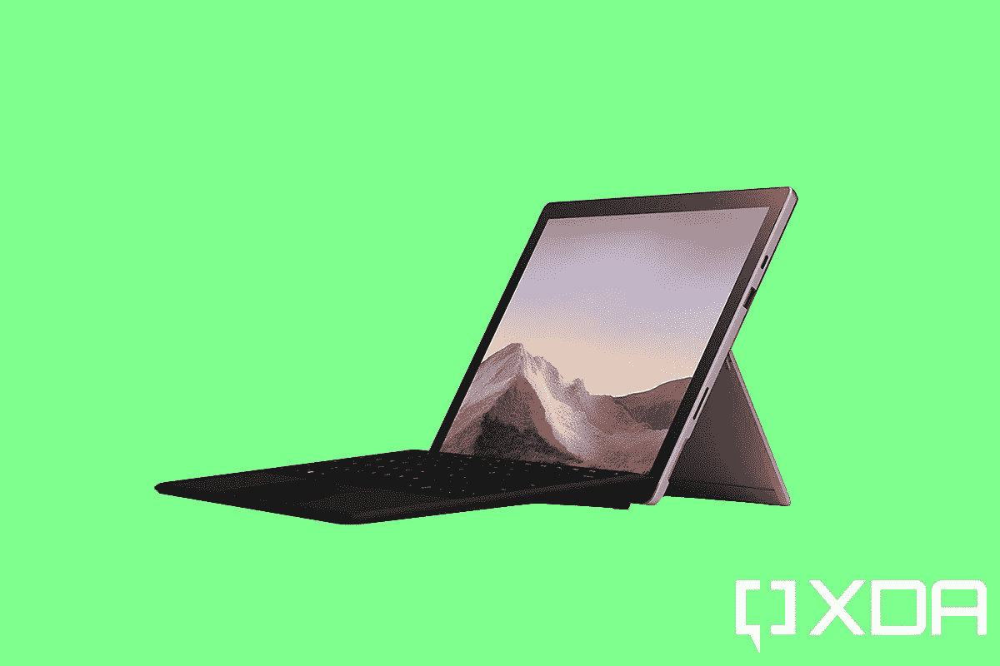
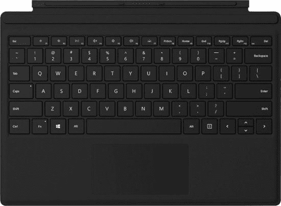

# Surface Laptop 4 vs Surface Pro 7:哪款 Surface 适合你？

> 原文：<https://www.xda-developers.com/surface-laptop-4-vs-surface-pro-7/>

微软最新的便携式电脑是 Surface Laptop 4，但这家位于雷德蒙德的公司提供各种各样的 Surface 设备。与 Surface Laptop 4 最平价的是 Surface Pro 7。它们都属于高级产品，内部结构相似，但外形不同。在这两者之间做出决定可能会有点令人困惑，所以我们希望为您做出选择！

## Surface Laptop 4 与 Surface Pro 7:规格

|  | 

Surface Laptop 4 13.5

 | 

Surface Pro 7

 | 

Surface Pro 7+

 |
| --- | --- | --- | --- |
| 

中央处理器

 | 英特尔酷睿 i5-1135 G7 英特尔酷睿 i7-1185G7AMD 锐龙 5 4680U Surface 版 | 英特尔酷睿 i3-1005 G1 英特尔酷睿 i5-1035 G4 英特尔酷睿 i7-1065G7 | 英特尔酷睿 i3-1115 G4 英特尔酷睿 i5-1135 G7 英特尔酷睿 i7-1165G7 |
| 

国家政治保卫局。参见 OGPU

 | 英特尔 Iris XeAMD 镭龙 | 英特尔 UHD 显卡英特尔 Iris Plus 显卡 | 英特尔 UHD 显卡英特尔 Iris Xe |
| 

身体

 | 12.1x8.8x0.57 英寸(308 x 223 x 14.5 毫米) | 11.5x7.9x0.33 英寸(292 x201 x 8.5 毫米) |
| 

重量

 | 阿尔坎塔拉:2.79 磅(1，265 克)铝:2.84 磅(1，288 克) | i3、i5: 1.7 磅(775 克)i7: 1.74 磅(790 克) | i3、i5 (Wi-Fi): 1.7 磅(770 克)i5 (LTE): 1.75 磅(796 克)i7 (Wi-Fi): 1.73 磅(784 克) |
| 

显示

 | 屏幕:13.5 英寸像素传感器显示屏分辨率:2256 x 1504 (201 PPI)宽高比:3:2 支持表面笔触摸:10 点多点触摸 | 屏幕:12.3 英寸 PixelSense 显示屏分辨率:2736 x 1824 (267 PPI)宽高比:3:2 触控:10 点多点触控 |
| 

港口

 | 1 个 USB 3.2 Gen 2 Type-C(1 个)USB 3.2 Gen 2 Type-A(1 个)表面连接(1 个)3.5 毫米音频 | 1 个 USB 3.2 Gen 2 Type-C(1 个)USB 3.2 Gen 2 Type-A(1 个)Surface Connect(1 个)3.5 毫米音频(1 个)MicroSDXC | (1)USB 3.2 Gen 2 Type-C(1)USB 3.2 Gen 2 Type-A(1)Surface Connect(1)3.5 毫米音频(LTE 型号上的 nano-SIM |
| 

存储选项

 | 固态硬盘选项:256GB、512GB 或 1TB | 固态硬盘选项:128GB、256GB、512GB 或 1TB | 可拆卸固态硬盘选项:128GB 或 256GB (Wi-Fi 或 LTE)512GB 或 1TB (Wi-Fi) |
| 

内存选项

 | 8GB、16GB 或 32GB LPDDR4x 内存 | 4GB、8GB 或 16GB LPDDR4x 内存 | 8GB 或 16GB LPDDR4x 内存(Wi-Fi 或 LTE)32GB LPDDR4x 内存(Wi-Fi) |
| 

电池

 | 电池容量标称值(WH)47.4 电池容量最小值(WH) 45.8 | 电池容量标称值(WH)46.5 电池容量最小值(WH) 43.2 | 电池容量标称值(WH)50.4 电池容量最小值(WH) 48.8 |
| 

连通性

 | Wi-Fi 6: 802.11ax 兼容蓝牙无线 5.0 技术 | Wi-Fi 6: 802.11ax 兼容蓝牙无线 5.0 技术 LTE Advanced 支持可拆卸 SIM 卡和 e SIM 高通骁龙 X20 LTE 调制解调器支持的频段:1、2、3、4、5、7、8、12、13、14、19、20、25、26、28、29、30、38、39、40、41、66 |
| 

摄像头和音频

 | Windows Hello face 身份验证摄像头(前置)720p 高清 f2.0 摄像头(前置)双远场 Studio 麦克风和杜比全景声扬声器 | Windows Hello face 认证摄像头(前置)500 万像素前置摄像头，支持 1080p 全高清视频 800 万像素后置自动对焦摄像头，支持 1080p 全高清视频双远场演播室麦克风 1.6 瓦立体声扬声器，支持杜比音频 |
| 

材料

 | 铝制可选 Alcantara 键盘 | 镁 |
| 

颜色；色彩；色调

 | 铂金、哑光黑、冰蓝色、砂岩 | 铂金色，哑光黑色 |
| 

操作系统（Operating System）

 | Windows 10 主页 | Windows 10 专业版 |
| 

定价

 | 起价 999 美元 | 起价 749.99 美元 | 起价 849.99 美元 |

注意，Surface Pro 7+是专门为企业打造的。这就是为什么它随 Windows 10 Pro 一起发货，价格反映了操作系统的升级。这是在 1 月宣布的[，这是在 Surface Pro 中获得第 11 代处理器的唯一方式。普通消费者仍然可以在 Surface Pro 7 中获得第 10 代处理器。](https://www.xda-developers.com/microsoft-surface-pro-7-plus-businesses/)

## 设计:Surface Laptop 4 是笔记本电脑，Surface Pro 7 是平板电脑

这两款产品的主要区别在于它们的外形不同。Surface Laptop 4 是一款翻盖式笔记本，而 Surface Pro 7 是一款平板电脑。各有利弊，看你的喜好了。

如果你在寻找更传统的东西，那就是 Surface Laptop 4 的用武之地。这是一台笔记本电脑，就像你以前的电脑一样。它确实有 Surface Pen 支持，但是用起来不太实用。

Surface Pro 7 是为配合笔使用而设计的。如果你喜欢画画或做手写笔记，这绝对是你要走的路。你也可以给它装上键盘，把它变成一台更传统的电脑。

尽管是一台平板电脑，但 Surface Pro 7 不会让你错过端口。好吧，你不会比 Surface Laptop 4 错过更多。它们都有一个 USB 3.2 Gen 2 Type-A 端口、一个 USB 3.2 Gen 2 Type-C 端口和一个 Surface Connect 端口。Surface Laptop 4 的一个优势是能够移除键盘和更换存储。这是在专注于商务的 Surface Pro 7+中出现的，但在 Pro 7 中没有。

他们也有非常不同的风格。Surface Laptop 4 由铝制成，有四种颜色。您可以选择铂金色、哑光黑色、砂岩色和冰蓝色。它的重量为 2.79 或 2.84 磅，取决于你选择的型号，而镁制 Surface Pro 7 的起价为 1.7 磅。当然，铅字封面会额外增加 0.68 磅。

说到颜色选择，Surface Pro 7 只有铂金和哑光黑两种颜色。这是因为更容易生产阳极氧化铝。镁是较轻的材料，这就是为什么它在平板电脑中有意义，但铝更容易制成漂亮的颜色。

一些人认为 Surface Pro 7 实际上是 T2 最好的可转换笔记本电脑之一。最重要的是放在膝盖上感觉舒服。

## 显示器:Surface Pro 7 的屏幕更小

就像所有的 Surface 产品一样，笔记本电脑 4 和 Pro 7 都配有 3:2 显示屏，但笔记本电脑上的显示屏更大。微软在 Surface Pro 7 上使用了 12.3 英寸的屏幕，自 2015 年的 Surface Pro 4 以来，这一点一直没有改变。Surface Laptop 4 拥有 13.5 英寸的显示屏。也有 15 英寸的型号，但 15 英寸笔记本电脑和 12.3 英寸平板电脑的使用情况有很大差异。

如上所述，它们都有 Surface Pen 支持。它们还在顶部挡板中配备了用于 Windows Hello 面部识别的红外摄像头。事实上，自从 Windows 10 推出以来，这已经成为几乎所有 Surface 产品的主要产品。

两种屏幕的另一个关键区别是 Surface Pro 7 的像素密度更高，为 267ppi。Surface Laptop 4 的价格仅为 201 英镑。这与 Surface Pro 7 的近 500 万像素和 Surface Laptop 4 的近 340 万像素相差约 160 万像素。因为这两个屏幕都不是特别大，所以你可能看不出有什么不同。这两种分辨率都远远超过了我们在其他笔记本电脑上看到的 1080p 分辨率。

## 键盘:Surface Laptop 4 的底座更加坚固

就像外形一样，键盘也完全不同。Surface Laptop 4 有一个标准键盘，正如你对笔记本电脑的期望。Surface Pro 7 有一个可拆卸式盖子。这两种产品在打字时感觉非常不同。

使用 Surface Pro 类型的外壳，您可以将其取下，扣上，将其折叠在设备后面，并以多种方式使用它。然而，当你在上面打字时，它感觉不如合适的底座坚固。这就是为什么在做决定时记住外形很重要。为了获得更好的打字体验，Surface Laptop 4 是不二之选。如果你选择 Surface Pro 7，你真的应该计划在相当多的用例中将它用作平板电脑。

正如我们所知，微软喜欢 Alcantara 面料，所以两种键盘都在顶部提供了这种材料。这实际上是 Surface Pro 7 更丰富多彩的选择的来源，因为你可以获得罂粟红、冰蓝色或铂金色的签名类型外壳。将这些颜色与哑光黑色或铂金平板电脑混合搭配会很有趣。还有一款黑色封面，不叫“Signature”，因为不是 Alcantara 面料。

对于 Surface Laptop 4，如果你选择白金或冰蓝色，你会得到 Alcantara。如果你得到哑光黑色或砂岩，你得到的是铝制键盘。

## 性能:Surface Pro 7 仍在使用上一代硬件

通常情况下，Surface 笔记本电脑和 Surface Pro 在性能上没有显著差异。它们都使用类似的处理器，尽管 Surface Laptop 4 中的 Core i7 比 Surface Pro 7+中的 Core i7 略胜一筹。但当 Surface Pro 7+宣布采用第 11 代处理器时，微软没有理会 Surface Pro 7。

这意味着，如果你是一个普通消费者，你仍然只能得到第 10 代处理器。这里实际上有一个非常显著的区别。第 10 代和第 11 代都基于 10 纳米工艺，这很好。但英特尔一直在加大其集成显卡的投入。

第 10 代是一个很好的开始，将 Iris Plus 显卡装入其芯片，比 UHD 显卡有了很大的提升。在第 11 代中，我们现在有了 Iris Xe。事情发展到了一个全新的水平。如果你关心图形性能，Surface Laptop 4 是不二之选。如果你真的想要一台平板电脑，看看你是否能得到 Surface Pro 7+，或者只是等待 Surface Pro 8。

|  | 

Surface 笔记本电脑 4Core i7-1185G7

 | 

Surface Pro 7Core i5-1035G4

 | 

surface Pro 7+酷睿 i5-1135G7

 |
| 

PCMark 8:主页

 | 4,331 | 3,376 | 3,521 |
| 

PCMark 8:创意

 | 4,777 | 3,749 |  4,192 |
| 

PCMark 8:工作

 | 3,925 | 3,339 | 3,403 |
| 

PCMark 10

 | 4,784 | 4,030 |  3,963 |
| 

极客工作台

 | 1,551 / 5,829 | 661 / 2,271 |  1,358 / 5,246 |
| 

电影院长凳

 | 1,295 / 5,194 | 1,239 / 4,401 |  1,235 / 2,854 |

另外需要注意的是，Surface Laptop 4 的基本型号配备了 AMD 锐龙 5 4680U Surface Edition 处理器。它是英特尔酷睿 i5 的竞争对手，从各方面来看，它与酷睿 i5 不相上下。

## 价格:Surface Laptop 4 的入门价格更高，但性价比更高

虽然 Surface Laptop 4 是三款中最贵的，但它也是你需要的附加组件最少的。下面是 Surface Laptop 4 定价的明细。

| 

Surface 笔记本电脑 4 CPU

 | 

随机存取存储

 | 

储存；储备

 | 

价格

 |
| AMD 锐龙 5 4680U Surface 版 | 8GB | 256GB | $999.99 |
| AMD 锐龙 5 4680U Surface 版 | 16GB | 256GB | $1,199.99 |
| 英特尔酷睿 i5-1135G7 | 8GB | 512GB | $1,299.99 |
| 英特尔酷睿 i5-1135G7 | 16GB | 512GB | $1,499.99 |
| 英特尔酷睿 i7-1185G7 | 16GB | 512GB | $1,699.99 |
| 英特尔酷睿 i7-1185G7 | 32GB | 1TB | $2,299.99 |

这个定价非常简单。当我们谈论 Surface Pro 7 时，事情变得有点复杂。这是因为虽然它的起始价格和最低规格较低，但你会想买一个 Type Cover 和一只 Surface Pen。Surface Pro 型号外壳售价 129.99 美元，Alcantara Signature 型号外壳售价 159.99 美元。Surface Pen 是额外的 99.99 美元。

| 

Surface Pro 7 - CPU

 | 

随机存取存储

 | 

储存；储备

 | 

价格

 |
| 英特尔酷睿 i3-1005G1 | 4GB | 128GB | $749.99 |
| 英特尔酷睿 i5-1035G4 | 8GB | 128GB | $899.99 |
| 英特尔酷睿 i5-1035G4 | 8GB | 256GB | $1,199.99 |
| 英特尔酷睿 i5-1035G4 | 16GB | 256GB | $1,399.99 |
| 英特尔酷睿 i7-1065G7 | 16GB | 256GB | $1,499.99 |
| 英特尔酷睿 i7-1065G7 | 16GB | 512GB | $1,899.99 |
| 英特尔酷睿 i7-1065G7 | 16GB | 1TB | $2,299.99 |

你可以看到，当你比较类似的配置时，Surface Laptop 4 实际上比 Surface Pro 7 便宜。最重要的是，Surface Pro 7 使用的是最新一代的规格。此外，Surface Pro 7 还需要单独购买一堆东西。

## 那么我应该买 Surface Laptop 4 还是 Surface Pro 7 呢？

可能还值得注意的是，还有另一种更现代的 Surface Pro，称为 Surface Pro X。它实际上是最好的 4G LTE 笔记本电脑之一，虽然它比 Surface Pro 7 更薄，但它有一个 ARM 处理器。它对经常外出的人来说意义更大，而且它是这两款电脑的不同使用案例。

当涉及到 Surface 笔记本电脑和基于英特尔技术的 Surface Pro 之间的选择时，这取决于你是想要笔记本电脑还是平板电脑。为了需要 Surface Pro，你真的应该想用笔。你应该对绘画、写作或其他需要平板电脑的事情感兴趣。

否则，笔记本电脑是显而易见的。它有更大的屏幕和更好的键盘，适合任何需要良好打字体验的人。它也更便宜，尤其是考虑到它自带键盘。

Surface Pro 7 的另一个主要缺点是，它是一款急需更新的产品。目前，其他所有高端电脑都在使用第 11 代处理器。出于某种原因，当微软刷新 Pro 7 时，它将新产品设为企业专属。

Surface Laptop 4 就是一款很棒的产品。但归根结底，这取决于你是想要笔记本电脑还是平板电脑。

 <picture></picture> 

Surface Pro 7

##### 微软 Surface Pro 7

Surface Pro 7 是微软的优质 Windows 10 平板电脑，内置支架、笔支持等。

 <picture></picture> 

Surface Laptop 4 (Ryzen 7/512GB)

##### 微软 Surface Laptop 4

Surface Laptop 4 是微软的铝制笔记本电脑，有四种颜色，可选 Alcantara 键盘。

 <picture></picture> 

Surface Pro Type Cover

##### 微软 Surface Pro 签名 USB 盖

微软 Surface Pro 平板电脑的键盘

 <picture></picture> 

Surface Pen

##### 微软 Surface Pen

用于 Microsoft Surface 设备的笔