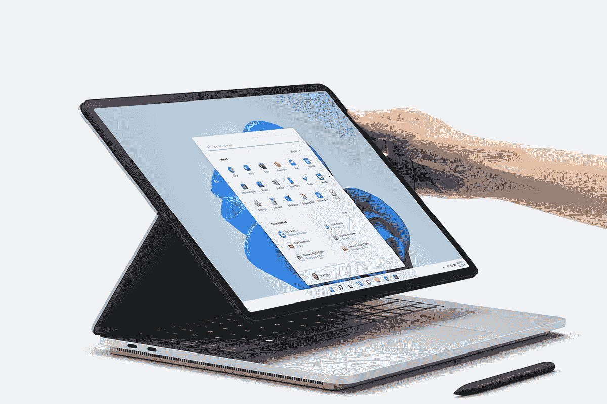

# Surface Laptop 5 vs Laptop Studio:该买哪个？

> 原文：<https://www.xda-developers.com/surface-laptop-5-vs-surface-laptop-studio/>

微软最近在其最新的硬件活动中推出了 Surface Laptop 5，虽然许多人可能希望看到 T2 Surface Laptop Studio 2，但事实并非如此。与 [Surface Laptop Studio](https://www.xda-developers.com/surface-laptop-studio-review/) 相比，Surface Laptop 5 内部仍然有更新的硬件，但仍然有理由倾向于后者，比如它的可转换外形，允许它从笔记本电脑转换到平板电脑。

但是你应该买哪一个呢？我们将仔细研究这两款设备，以帮助您根据自己的需求和预算确定应该购买哪一款。

## Surface Laptop 5 vs Surface Laptop Studio:规格

|  | 

Surface 笔记本电脑 5

 | 

Surface Laptop Studio

 |
| --- | --- | --- |
| 

**操作系统**

 | 

*   Windows 11 家庭版(消费者)
*   Windows 11/10 专业版(企业版)

 | 

*   Windows 11 家庭版(消费者)
*   Windows 11/10 专业版(企业版)

 |
| 

**CPU**

 | 

*   **13.5 英寸**
    *   消费者
        *   第 12 代英特尔酷睿 i5-1235U(最高 4.4GHz，10 个内核，12 个线程)
        *   第 12 代英特尔酷睿 i7-1255U(最高 4.7GHz，10 个内核，12 个线程)

    *   商业
        *   第 12 代英特尔酷睿 i5-1245U(最高 4.4GHz，10 个内核，12 个线程)
        *   第 12 代英特尔酷睿 i7-1265U(最高 4.8GHz，10 个内核，12 个线程)

*   **15 英寸:**
    *   消费者
        *   第 12 代英特尔酷睿 i7-1255U(最高 4.7GHz，10 个内核，12 个线程)

    *   商业
        *   第 12 代英特尔酷睿 i7-1265U(最高 4.8GHz，10 个内核，12 个线程)

 | 

*   第 11 代英特尔酷睿 i5-11300H(最高 4.4GHz，4 核，8 线程)
*   第 11 代英特尔酷睿 i7-11370H(最高 4.8GHz，4 核，8 线程)

 |
| 

**图形**

 |  | 

*   **集成:**英特尔 Iris Xe 显卡
*   **独立(酷睿 i7 型号)**
    *   英伟达 GeForce RTX 3050 Ti(消费者)
    *   英伟达 RTX A2000(商用)

 |
| 

**显示**

 | 

*   **13.5 英寸**
    *   13.5 英寸 PixelSense 显示屏，3:2 宽高比，2256 x 1504，201 PPI，触摸屏
    *   杜比视觉智商

*   **15 英寸**
    *   15 英寸 PixelSense 显示屏，3:2 宽高比，2496 x 1664，201 PPI，触摸屏
    *   杜比视觉智商

 | 

*   14.4 英寸 PixelSense 显示屏，3:2 宽高比，2400 x 1600，201 PPI，120Hz 动态刷新率，触摸屏
*   杜比视觉
*   使用 Surface Slim Pen 2 支持触觉信号

 |
| 

**储存**

 |  | 

*   256GB
*   512GB
*   1TB 固态硬盘
*   2TB 固态硬盘

 |
| 

**闸板**

 | 

*   8GB LPDDR5x
*   16GB LPDDR5x
*   32GB LPDDR5x

 | 

*   16GB LPDDR4x
*   32GB LPDDR4x

 |
| 

**电池**

 | 

*   **13.5 英寸:**长达 19 小时的典型设备使用时间
*   **15 英寸:**长达 18 小时的典型设备使用时间

 | 

*   **英特尔酷睿 i5 型号:**长达 19 小时的典型设备使用时间
*   **英特尔酷睿 i7 型号:**长达 18 小时的典型设备使用时间

 |
| 

**端口**

 | 

*   1 个 Thunderbolt 4/USB 4(C 型)端口
*   1 个 USB 3.1 类型 A
*   3.5 毫米耳机插孔
*   表面连接端口

 | 

*   2 个 Thunderbolt 4/USB 4 C 型端口
*   表面连接端口
*   3.5 毫米耳机插孔

 |
| 

**音频**

 | 

*   杜比全景声扬声器
*   双通道远场录音室话筒

 | 

*   配有杜比全景声的四声道全方位扬声器
*   声音清晰的双录音室话筒

 |
| 

**摄像机**

 | 

*   前置 720p 高清摄像头

 | 

*   前置 1080p 全高清摄像头

 |
| 

**Windows Hello**

 |  |  |
| 

**连通性**

 | 

*   Wi-Fi 6 802.11ax
*   蓝牙 5.1

 | 

*   Wi-Fi 6 802.11ax
*   蓝牙 5.1

 |
| 

**颜色**

 | 

*   **13.5 英寸**
    *   铂金搭配 Alcantara 面料
    *   哑光黑色(金属)
    *   鼠尾草(金属)
    *   砂岩(金属)

*   **15 英寸**
    *   铂(金属)
    *   哑光黑色(金属)

 |  |
| 

**尺寸(WxDxH)**

 | 

*   **13.5 英寸:** 308 x 223 x 14.5 毫米(12.1 x 8.8 x 0.57 英寸)
*   **15 英寸:** 340 x 244 x 14.7 毫米(13.4 x 9.6 x 0.58 英寸)

 | 

*   323.28 x 228.32 x 18.94 毫米(12.72 x 8.98 x 0.746 英寸)

 |
| 

**重量**

 | **13.5 英寸(Alcantara):** 2.8 磅(1.272 千克) **13.5 英寸(金属):** 2.86 磅(1.297 千克) **15 英寸:** 3.44 磅(1.56 千克) | 起始重量为 3.83 磅 |
| 

**起始价格**

 | $999.99 | $1,599.99 |

## 性能:Surface Laptop 5 拥有更快的处理器，但没有 GPU

正如我们在顶部所说，Surface Laptop 5 比 Laptop Studio 拥有更新的组件。毕竟刚刚刷新，而工作室已经一年了。英特尔的第 12 代处理器大幅提升了性能，虽然 Surface Laptop Studio 拥有更多耗电的 35W CPUs，但 Surface Laptop 5 在性能方面遥遥领先，这要归功于内核和线程数量的大幅增加。令人印象深刻的是，它在 Cinebench 和 Geekbench 等基准测试中遥遥领先，

|  | 

Surface 笔记本电脑 5 英特尔酷睿 i7-1255U

 | 

Surface Laptop Studio 英特尔酷睿 i7-11270H，NVIDIA RTZ a 2000

 |
| --- | --- | --- |
| 

Cinebench R23

 | 1,576 / 8,214 | 1,504 / 6,283 |
| 

极客工作台 5

 | 1,662 / 8,711 | 1,546 / 5,826 |
| 

3DMark

 | 1,772 | 5,075 |

然而，Surface Laptop 5 有一样东西是没有的:独立 GPU。Surface Laptop Studio，特别是 Core i7 型号，配备了 Nvidia GeForce RTX 3050 Ti(或商务型号中的 RTX A2000)，这使其在 3D 渲染和其他受益于 GPU 的任务方面具有巨大优势。您可以看到像 3DMark 这样的基准测试会产生多大的差异。就性能而言，酷睿 i5 笔记本电脑 Studio 可能没有太大意义，但酷睿 i7 型号仍然有价值。

当然，这也有不好的一面，那就是电池寿命。虽然微软宣称这两款笔记本电脑的价格相近，但这在很大程度上取决于你的使用情况。Surface Laptop Studio 拥有更多耗电处理器，独立 GPU 也消耗更多电力，因此电池寿命往往会更短，正如我们在评测中发现的那样。还有其他因素会影响这一点，如笔记本电脑工作室的 120Hz 屏幕，但如果你需要尽可能长的电池寿命，你可以随时关闭它。

在内存方面，两款笔记本电脑的最大内存都是 32GB，尽管 Surface Laptop Studio 在默认情况下更强大一些，因为基本款的最大内存是 16GB。Laptop Studio 还配备了高达 2TB 的固态硬盘，因此你可以获得比 Surface Laptop 5 多一点的存储空间，Surface Laptop 5 的最大存储空间为 1TB。

## 显示器:同样清晰，但 Surface Laptop Studio 更平滑

说到显示器，这两款笔记本电脑其实有很多共同点。Surface Laptop 5 有 13.5 英寸或 15 英寸两种尺寸，而 Surface Laptop Studio 配备了 14.4 英寸的显示屏，它们都有不同的分辨率。然而，它们都具有相同的精确像素密度 201PPI，这意味着它们看起来都很棒，很清晰。

最大的区别在于刷新率，Surface Laptop Studio 的 120Hz 显示屏可以根据情况动态调整刷新率。这有助于动画和运动在屏幕上看起来更流畅，使整个体验感觉更愉快。此外，它非常适合游戏，因此您可以更好地利用独立的 Nvidia GPU。

每个显示器都有相同的精确像素密度 201PPI，这意味着它们看起来都很棒，很清晰。

两款笔记本电脑都支持 Surface Pen 或 Slim Pen，但 Surface Laptop Studio 是两者中唯一支持 Surface Slim Pen 2 上的触觉信号的，这意味着它可以在笔中产生微小的振动，让你感觉像是在真正的纸上使用真正的笔。另一方面，虽然两个显示器都支持杜比视觉，但 Laptop 5 是唯一一个支持杜比视觉智商的显示器，这意味着它可以在不同的照明条件下更好地使用 HDR。

Surface Laptop Studio 的另一个优势就在那个显示屏的正上方。它有一个全高清(1080p)网络摄像头，这是你在 2022 年应该期待的笔记本电脑。不管出于什么原因，微软决定在 Surface Laptop 5 上保留 720p 摄像头，所以如果你想在会议期间保持最佳状态，Surface Laptop Studio 绝对是更好的选择。

至于声音，这两款笔记本电脑都使用 Omnisonic 扬声器，这基本上意味着扬声器隐藏在键盘下，可以向你的方向发出声音。然而，Surface Laptop Studio 的设置更强大，有四个扬声器，而 Laptop 5 只有两个扬声器。两款笔记本电脑都有两个录音室麦克风，但 Surface Laptop 5 支持语音清晰度功能，这使得在语音通话中更容易被听到和听到他人。

## 设计:Surface Laptop Studio 拥有多功能的外形

这可以说是在这两款笔记本电脑之间进行选择的最大决定性因素。Surface Laptop 5 只是一台笔记本电脑，对许多人来说，这就是你所需要的一切。你所能做的就是把它当作笔记本电脑使用，所以尽管它有触摸屏和笔支持，但这样使用起来并不方便。

Surface Laptop Studio 不仅仅是一台笔记本电脑。

Surface Laptop Studio 的功能要丰富得多。它起初看起来像一台笔记本电脑，但一旦打开，如果你想看电影或用控制器玩游戏，你可以将屏幕底部拉得更靠近你，或者你可以将屏幕放在笔记本电脑的底座上，本质上使它成为一台平板电脑。这对于触摸和笔的使用来说更有吸引力，它有助于使这成为创造性工作的一个奇妙的设备。Surface Laptop Studio 不仅仅是一台笔记本电脑，虽然不是每个人都需要它，但对于那些需要更多东西的人来说，它非常酷。

 <picture></picture> 

Surface Laptop Studio

这两款笔记本电脑看起来都像你对 Surface 设备的预期一样现代时尚。Surface Laptop 5 具有多种颜色的优势，包括哑光黑、鼠尾草和砂岩，但 Surface Laptop Studio 只有 Surface 设备闻名的标志性铂金色。虽然我们会说它看起来仍然很棒，但它因此变得不那么独特了。

至于便携性，正如你所料，Surface Laptop 5 显然是赢家。如果你选择 13.5 英寸的型号，它的重量只有 2.8 磅，15 英寸的型号重 3.44 磅。与此同时，Surface Laptop Studio 不带独立 GPU 的价格为 3.83 磅，带 Nvidia 显卡的价格为 4 磅。因为 Surface Laptop Studio 旨在容纳像 35W CPUs 这样的强大规格，所以它必须更厚更重，尽管它仍然非常便携。不过，如果你是学生或经常在移动的人，Surface Laptop 5 可能更有意义。

## 端口和连接:Surface Laptop 5 有 USB Type-A

最后，让我们谈谈端口，坦率地说，Surface Laptop 5 和 Laptop Studio 之间并没有什么不同。Surface Laptop 5 配有一个 Thunderbolt 4 端口，这是今年新增加的，还有 USB Type-A、一个 Surface Connect 端口和一个 3.5 毫米耳机插孔。物理连接器与 Surface Laptop 4 没有变化，但 USB-C 端口升级到了 Thunderbolt 4。

另一方面，Surface Laptop Studio 拥有大多数相同的东西，但它没有 USB Type-A 端口，而是有第二个 Thunderbolt 4 端口。这是否是一个优势取决于你对[坞站和枢纽](https://www.xda-developers.com/best-usb-c-hub/)的立场。USB Type-A 允许您兼容更多外设，因为大多数外设仍然使用该端口连接。当你只有 Thunderbolt 端口时，你更可能需要适配器。另一方面，Thunderbolt 还可以处理显示器和外部 GPU 等东西，因此通过提供两个端口，您可以获得更多的多功能性。

至于无线连接，它们本质上是一样的。两者都支持 Wi-Fi 6 和蓝牙 5.1，但都没有蜂窝连接。如果你想要那种移动性的东西，带 5G 的 [Surface Pro 9 可能对你更有意义。](https://www.xda-developers.com/surface-pro-9/)

## Surface Laptop 5 vs Surface Laptop Studio:最终想法

通常情况下，你选择哪种笔记本电脑完全取决于你的个人需求和你打算如何使用你的设备。如果你更关心 CPU 性能和能效，Surface Laptop 5 是更好的选择，因为它采用了第 12 代英特尔处理器。它也是更轻的选择，即使是 15 英寸的型号也比 14.4 英寸的 Surface Laptop Studio 更轻。对于大多数人来说，无论是学生、办公室工作人员还是更多的临时用户，这都是一条必经之路。

Surface Laptop Studio 面向更特定的受众。如果您需要游戏或创意工作的 GPU 性能，这是一个更合适的选择，即使它现在已经过时了。它还有一个更通用的外形，非常适合创意专业人士(除了非常有趣之外)。此外，您可以获得更平滑的 120Hz 显示屏，网络摄像头的分辨率也更高。这是一款非常适合在家工作的笔记本电脑，因为电池续航时间和便携性不是太大的问题。

如果你真的需要额外的 GPU 性能或外形，你应该只购买 Surface Laptop Studio。

当然，还有价格的问题，与 999 美元的 Surface Laptop 5 相比，Surface Laptop Studio 的价格要贵得多，起价为 1599 美元。如果你想要一个独立的 GPU，它实际上是 2099.99 美元起。这强调了如果你真的需要额外的 GPU 性能或外形，你应该只购买 Surface Laptop Studio。对于大多数人来说，Surface Laptop 5 更有意义。

无论您的偏好如何，您都可以使用下面的链接购买这两款笔记本电脑。两者都是很棒的设备，而且你现在就可以买到一些最好的 Surface 电脑。如果这两款都不适合你，你可能还想看看[最好的笔记本电脑](https://www.xda-developers.com/best-laptops/)。

 <picture></picture> 

Surface Laptop Studio

##### 微软 Surface Laptop Studio

Surface Laptop Studio 是一款面向创作者的强大笔记本电脑，配备 35W 英特尔处理器和英伟达 RTX 显卡。此外，它采用独特的外形，可用于不同的模式。

##### 微软 Surface Laptop 5

Surface Laptop 5 是一款轻型笔记本电脑，有 13.5 英寸或 15 英寸两种型号，它搭载了多达 10 个内核和 12 条线程的第 12 代英特尔处理器。