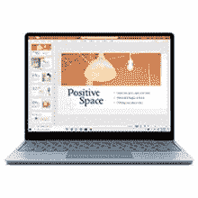

# 配备 256GB 存储空间的微软 Surface Laptop Go 现已降价 200 美元出售

> 原文：<https://www.xda-developers.com/surface-laptop-go-sale-april-2022/>

Surface Laptop Go 旨在成为微软 Surface Laptop 系列机型的廉价替代品，同时保留人们想要的超极本的大部分功能。现在，你可以在亚马逊以 699.99 美元的价格买到 256GB 的高端产品，比原价节省了 200 美元。这不像今年早些时候的 650 美元那么低，但仍然是一笔不错的交易。

这款笔记本电脑有一个 12.4 英寸的 1536 x 1024 触摸屏，比 Surface 笔记本电脑系列的屏幕更小，分辨率更低，但保持了相同的 3:2 纵横比。它配备了英特尔酷睿 i5-1035G1 处理器，256GB 固态硬盘，720p 前置摄像头，8GB 内存，以及 Windows Hello 电源按钮上的指纹识别器。这款笔记本电脑支持 Wi-Fi 6、蓝牙 5，并通过 Surface Connect 端口或 USB Type-C 充电。

 <picture></picture> 

Microsoft Surface Laptop

##### 微软 Surface Laptop Go

这是顶级的 Surface 笔记本电脑 Go，配有酷睿 i5 处理器和 8GB 内存。只有铂金色选项以特价出售。

入门级 Surface Go 笔记本电脑只有 4GB 内存和 64GB eMMC 存储，因此相比之下，这款配备 8GB 内存和适当 SSD 存储的高端版本绝对是更好的购买选择。主要问题是显示器分辨率低，并且只有两个 USB 端口——一个 USB Type-A 和一个 USB Type-C。笔记本电脑另一侧的 Surface Connect 端口仅用于专有的磁性充电器或[微软昂贵的 Surface Dock 2](https://www.amazon.com/NEW-Microsoft-Surface-Dock-2/dp/B086Q92563?tag=xda-3p5qrn6-20&ascsubtag=UUxdaUeUpU40920&asc_refurl=https%3A%2F%2Fwww.xda-developers.com%2Fsurface-laptop-go-sale-april-2022%2F&asc_campaign=Short-Term) 。

同样值得注意的是[据报道，微软即将发布 Surface Laptop Go 2](https://www.xda-developers.com/microsofts-surface-laptop-go-2-coming-soon/) ，采用更新的第 11 代英特尔处理器，并增加了一个“Sage”颜色选项。然而，新型号可能不会很快降价 200 美元出售。

根据当前这批笔记本电脑的生产时间，Surface Laptop Go 2 可能会预装 Windows 11。如果没有，可以免费升级——这款笔记本电脑不会缺少 TPM 模块或运行 Windows 11 所需的任何其他组件。