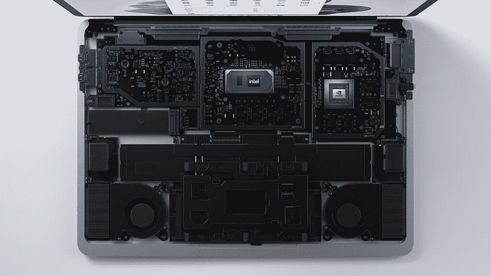
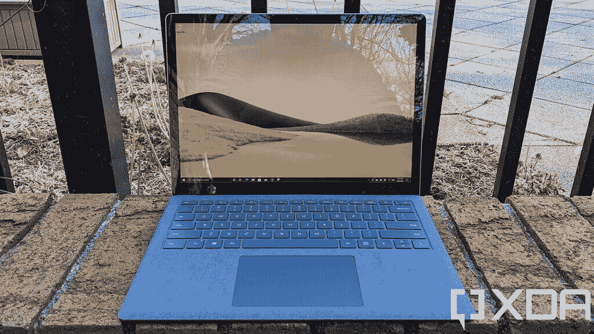
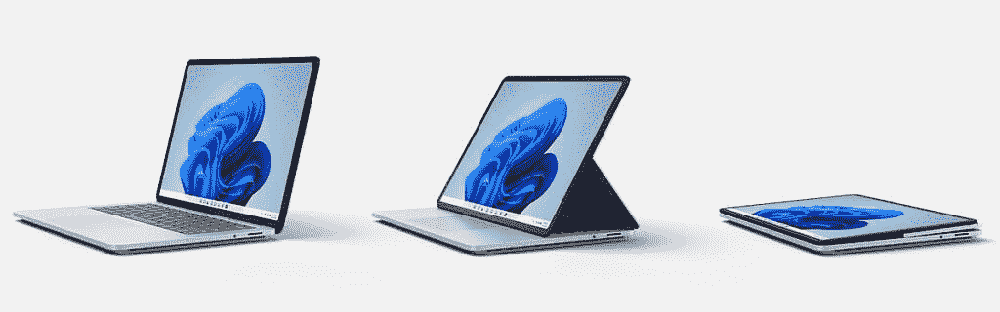

# Surface Laptop Studio vs Surface Laptop 4:你该买哪个？

> 原文：<https://www.xda-developers.com/surface-laptop-studio-vs-laptop-4/>

微软最近推出了 Surface Laptop 家族的全新成员 [Surface Laptop Studio](https://www.xda-developers.com/surface-laptop-studio/) 。从 Surface Book 和 Surface Studio 中获得灵感，这是微软迄今为止最强大的 [Surface PC](https://www.xda-developers.com/best-microsoft-surface-pcs/) 。然而，它不是 Surface Laptop 4 的替代品，那么 Surface Laptop Studio 与微软的主流笔记本电脑相比如何呢？

顾名思义，Surface Laptop Studio 更适合创意专业人士，它的规格和设计与此相匹配。与此同时，Surface Laptop 4 更像是一款面向更主流使用场合的设备，比如学校或办公室工作。它们是相当不同的设备，每一种都有优缺点，这使得它们对不同类型的用户更具吸引力。让我们仔细看看你应该为自己选择哪一个。

## 规范

我们先来看一下这些笔记本电脑的简要规格。这将揭示一些主要的差异。

|  | 

Surface Laptop Studio

 | 

Surface Laptop 4

 |
| --- | --- | --- |
| **处理器** | 

*   英特尔酷睿 H35 i5-11300H(最高 4.4GHz，四核)
*   英特尔酷睿 H35 i7-11370H(最高 4.8GHz，四核)

 | 13.5 英寸:

*   英特尔酷睿 i5-1135G7(最高 4.2GHz，四核)
*   英特尔酷睿 i7-1185G7(最高 4.9GHz，四核)
*   AMD 锐龙 5 4680U 微软 Surface Edition(最高 4GHz，6 核)

15 英寸

*   英特尔酷睿 i7-1185G7(最高 4.9GHz，四核)
*   AMD 锐龙 7 4980U 微软 Surface Edition(最高 4.4GHz，8 核)

 |
| **图形** | 

*   英特尔 Iris Xe 显卡(酷睿 i5 型号)
*   NVIDIA GeForce RTX 3050 Ti(酷睿 i7 型号)

 | 

*   英特尔 Iris Xe 显卡
*   AMD 镭龙显卡

 |
| **撞锤** |  |  |
| **存储** |  |  |
| **显示** | 

*   14.4 英寸 PixelSense Flow (2400 x 1600)，Dolby Vision，最高 120Hz 刷新率，触摸，Surface Pen 支持

 | 

*   13.5 英寸 PixelSense (2256 x 1504)，触摸屏，支持 Surface Pen
*   15 英寸 PixelSense (2496 x 1664)，触控笔支持

 |
| **音频** | 

*   配有杜比全景声的四声道全方位扬声器

 | 

*   配有杜比全景声的 Omnisonic 立体声扬声器

 |
| **网络摄像头** | 

*   1080p 前置网络摄像头

 |  |
| **生物认证** |  |  |
| **电池** | 58Wh

*   酷睿 i5:长达 19 小时的电池续航时间
*   酷睿 i7:长达 18 小时的电池续航时间

 | 47.4 小时

*   13.5 英寸:
    *   英特尔处理器:长达 17 小时的电池续航时间
    *   AMD 处理器:长达 19 小时的电池续航时间
*   15 英寸:
    *   英特尔处理器:长达 16.5 小时的使用时间
    *   AMD 处理器:长达 17.5 小时的使用时间

 |
| **端口** | 

*   2 个 Thunderbolt 4 端口
*   1 个表面连接端口
*   3.5 毫米耳机插孔

 | 

*   1 个表面连接端口
*   1 个 USB Type-A (3.2 第 2 代/ 10Gbps)
*   1 个 USB Type-C (3.2 第 2 代/ 10Gbps)
*   3.5 毫米耳机插孔

 |
| **连通性** | 

*   Wi-Fi 6 +蓝牙 5.1
*   Xbox 无线

 |  |
| **颜色** |  | 13.5 英寸:

*   铂金(阿尔坎塔拉)
*   冰蓝色(Alcantara)
*   砂岩(金属
*   哑光黑色(金属)

15 英寸:

*   铂(金属)
*   哑光黑色(金属)

 |
| **尺寸(WxDxH)** | 

*   12.72 x 8.98 x 0.746 英寸(323.28 x 228.32 x 18.94 毫米)

 | 

*   13.5 英寸:12.1 x 8.8 x 0.57 英寸(308 x 223 x 14.5 毫米)
*   15 英寸:13.4 x 9.6 x 0.58 英寸(339.5 x 244 x 14.7 毫米)

 |
| **重量** | 

*   酷睿 i5: 3.83 磅(1.74 千克)
*   酷睿 i7: 4 磅(1.82 千克)

 | 

*   13.5 英寸(Alcantara 面料):2.79 磅(1.27 千克)
*   13.5 英寸(金属):2.84 磅(1.29 千克)
*   15 英寸:3.4 磅(1.54 千克)

 |
| **起步价** | $1,599.99 |  $1,299.99 |

## 性能:Surface Laptop Studio 拥有 H 系列处理器

上表中你会注意到的第一个大区别是 Surface Laptop Studio 和 Surface Laptop 4 的处理器非常不同。Surface Laptop Studio 使用的是英特尔的 H35 系列处理器，这是今年推出的新系列 CPU。这些处理器具有四核 CPU 和英特尔 Iris Xe 显卡，类似于 Surface Laptop 4 中的 15W 处理器，但由于额定功率更高，它们可以更长时间地保持这种性能。

在 GeekBench 这样的基准测试中，你会看到这些型号之间的差距并不太大，Surface Laptop 4 中的 AMD 处理器在多核测试中的表现甚至更好。然而，这是一个短期的基准测试，英特尔 H35 系列处理器将比 Surface Laptop 4 中的任何处理器都更好地保持其性能。

|  | 

英特尔酷睿 i7-11370H

 | 

英特尔酷睿 i7-1185G7

 | 

AMD 锐龙 7 4980U

 |
| --- | --- | --- | --- |
| GeekBench(单核/多核) | 1,448 / 4,812 | 1,418 / 4,856 | 1,174 / 7,249 |

这意味着，对于浏览网页和编写文档等日常任务，Surface Laptop 4 将表现良好。它的处理器可以在短时间内快速运行，当不需要高性能时会变慢。但对于视频渲染和编辑等要求苛刻的任务，Surface Laptop 4 会表现得更好。还值得一提的是，AMD 处理器在笔记本电脑从插座上断开时的性能非常低，因此如果你在没有插入电源的情况下使用它，你会注意到一个很大的差异。

Surface Laptop Studio 更大的优势在于它的 GPU，特别是在高端机型中。如果你选择英特尔酷睿 i7 处理器，你还会得到 NVIDIA GeForce RTX 3050 Ti GPU，与 Surface Laptop 4 上的集成显卡相比，这将给你带来巨大的性能优势。有了这个 GPU，你可以可行地使用 Surface Laptop Studio 进行游戏，此外它还可以帮助完成视频编辑等任务。

 <picture></picture> 

Surface Laptop Studio internals

这两款笔记本电脑的其他规格相差不远。两者都可以配备高达 32GB 的内存，尽管 Surface Laptop 4 的基本配置为 8GB，而 Surface Laptop Studio 的最低配置为 16GB。关于存储，Surface Laptop Studio 最高可达 2TB，是 Surface Laptop 4 所能提供的两倍。

尽管有更强大的硬件，Surface Laptop Studio 承诺的电池寿命与 Surface Laptop 4 非常一致。根据配置的不同，这两款笔记本电脑充电后通常可使用长达 19 小时。然而，这是考虑到 Surface Laptop 4 中的 AMD 处理器，并且只有在电池性能显著降低的情况下才能实现电池寿命。

## 显示屏:Surface Laptop 4 有两种尺寸

继续看显示屏，这两款笔记本电脑有一些相似之处。首先，两者都具有 Surface 设备典型的 3:2 宽高比，并且具有相同的像素密度，为 201 PPI。这意味着所有这些显示器都同样清晰。

 <picture></picture> 

Surface Laptop 4

这两款机型的一大区别是 Surface Laptop 4 有两种不同的尺寸:13.5 英寸和 15 英寸。这让您可以选择如何平衡便携性和屏幕尺寸。Surface Laptop Studio 的 14.4 英寸显示屏处于中间位置，但这是你唯一的选择。

但是 Surface Laptop Studio 有一些王牌。首先，Surface Laptop Studio 的显示屏支持高达 120Hz 的显示屏，这是 Surface 设备中的第一款。有了这样的高刷新率，动画和过渡看起来会更流畅，对游戏来说也很棒。Surface Laptop Studio 的另一大优势是它支持杜比视觉，所以如果你想欣赏 HDR 的内容，它会做得更好。

另一个优势是如果你使用新的 Surface Slim Pen 2，它现在支持触觉反馈，让你感觉像在纸上写字。这在 Surface Laptop 4 上是行不通的。

> Surface Laptop Studio 有一个 120 赫兹的显示屏，也支持杜比视界。另外，它有四个立体声扬声器。

Surface Laptop Studio 还拥有更好的音频设置，与 Surface Laptop 4 的双扬声器设置相比，具有四个 Omnisonic 扬声器。两款笔记本电脑都将扬声器隐藏在键盘下方，这也是微软称之为 Omnisonic 扬声器的原因，并且它们都支持杜比 Atmos。无论哪种方式，你都应该获得身临其境的音频体验，但在 Surface Laptop Studio 上会更好。

谈到网络摄像头，Surface Laptop Studio 再次变得更好，这要归功于显示器上方的 1080p 网络摄像头。大多数 Surface 设备都有 1080p 网络摄像头，但 Surface Laptop 4 是唯一一台仍然使用 720p 摄像头的设备。然而，两者都有双远场麦克风用于音频，所以你应该在使用其中一个通话时听起来很棒。

## 设计和连接:Surface Laptop Studio 的功能要丰富得多

根据您的使用情况，这一部分是 Surface Laptop Studio 真正闪耀的地方。Surface Laptop 4 只是一台笔记本电脑。另一方面，Surface Laptop Studio 借鉴了 Surface Studio 和宏碁 ConceptD 系列等其他笔记本电脑的设计，可以轻松地从标准笔记本电脑变成平板电脑，用于数字艺术工作等。显示器在第二个转轴上旋转，因此可以平放在键盘面板上，或者如果您使用控制器观看电影或玩游戏，您可以将它拉近，让触控板可见。

 <picture></picture> 

Different modes available in the Surface Laptop Studio

然而，由于更强大的内部功能，Surface Laptop Studio 没有那么便携。英特尔酷睿 i5 型号的起始重量为 3.83 磅，这意味着当您将这款笔记本电脑放在背包中时，您会感受到它的重量。如果你整天做它，它会开始压在你的肩膀上。与此同时，Surface Laptop 4 的起价为 2.79 磅，这要容易管理得多。15 英寸的 Surface Laptop 4 的重量增加到了 3.54 磅，所以如果你想要更大的显示屏，这种差异就不那么明显了。

> 有了 Thunderbolt 4，在 Surface Laptop Studio 上插入各种外设变得容易多了。

至于端口，Surface Laptop Studio 为 Surface 设备引入了一些重要的东西，那就是 Thunderbolt 支持。它有两个 Thunderbolt 4 端口，除了 Surface Connect，所以你可以使用各种坞站，外部显示器，甚至外部 GPU。正因为如此，它的连接选项更加多样化。相反，Surface Laptop 4 有一个内置的 USB Type-A 端口，因此它可以更容易地支持传统设备。在 Surface Laptop Studio 上，如果你有需要 USB Type-A 的外设，你就需要一个适配器。

至于无线连接，这两款笔记本电脑都不支持蜂窝网络，都有 Wi-Fi 6 和蓝牙 5。然而，Surface Laptop Studio 还增加了 Xbox 无线内置，这意味着你可以使用 Xbox 无线控制器，其延迟比通过蓝牙连接要低得多。

## 底线

归根结底，Surface Laptop 4 和 Surface Laptop Studio 面向的是截然不同的受众。Surface Laptop Studio 无疑是这两款设备中最强大的，这一点在 CPU 和 GPU 中得到了体现。它有一个更好的显示器，具有高刷新率和杜比视觉，它有 Thunderbolt 支持，它有一个多功能的设计，非常适合数字艺术家。它甚至可以用于游戏。当然，这也意味着它通常更重更贵。

另一方面，如果你将 Surface Laptop 4 用于学校、办公室工作或一般的网络浏览和媒体消费，它仍然可以为日常使用提供出色的性能。它的显示屏不那么令人印象深刻，但它同样锐利(而且你有两种尺寸可供选择)，而且它也是两台笔记本电脑中更便携的。

 <picture></picture> 

Surface Laptop 4

最后还是看你个人的需求和喜好。如果您需要一台笔记本电脑来支持您的办公设置、运行游戏、编译代码或快速渲染视频，Surface Laptop Studio 就是您的理想之选。如果你想要一个可以每天带去学校，无论去哪里都可以使用的东西，Surface Laptop 4 可能是理想的选择。

无论您选择什么，您都可以使用下面的链接购买您喜欢的笔记本电脑。您也可以购买 [Surface Slim Pen 2](https://www.amazon.com/Microsoft-Surface-Slim-Pen-Matte/dp/B09DK2YSH2?tag=xda-5u3pt1t-20&ascsubtag=UUxdaUeUpU5348&asc_refurl=https%3A%2F%2Fwww.xda-developers.com%2Fsurface-laptop-studio-vs-laptop-4%2F&asc_campaign=Short-Term) 来补充您的体验。否则，请查看我们的[最佳笔记本电脑](https://www.xda-developers.com/best-laptops/)列表，寻找替代品。

 <picture></picture> 

Surface Laptop Studio

##### 微软 Surface Laptop Studio

Surface Laptop Studio 配备了全新的设计、更强大的内部部件、120Hz 显示屏和 Thunderbolt 支持，使其成为迄今为止功能最丰富的 Surface 设备之一。

 <picture></picture> 

Surface Laptop 4

##### 微软 Surface Laptop 4

Surface Laptop 4 是一款高端笔记本电脑，采用全金属设计(键盘面板可选 Alcantara)，最新的英特尔处理器和触摸屏。根据您的配置，它有四种不同的颜色。