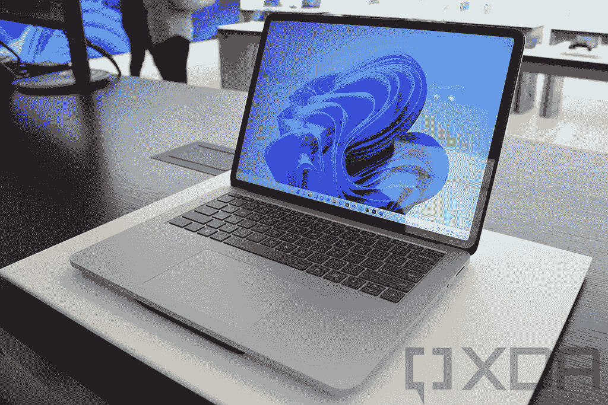
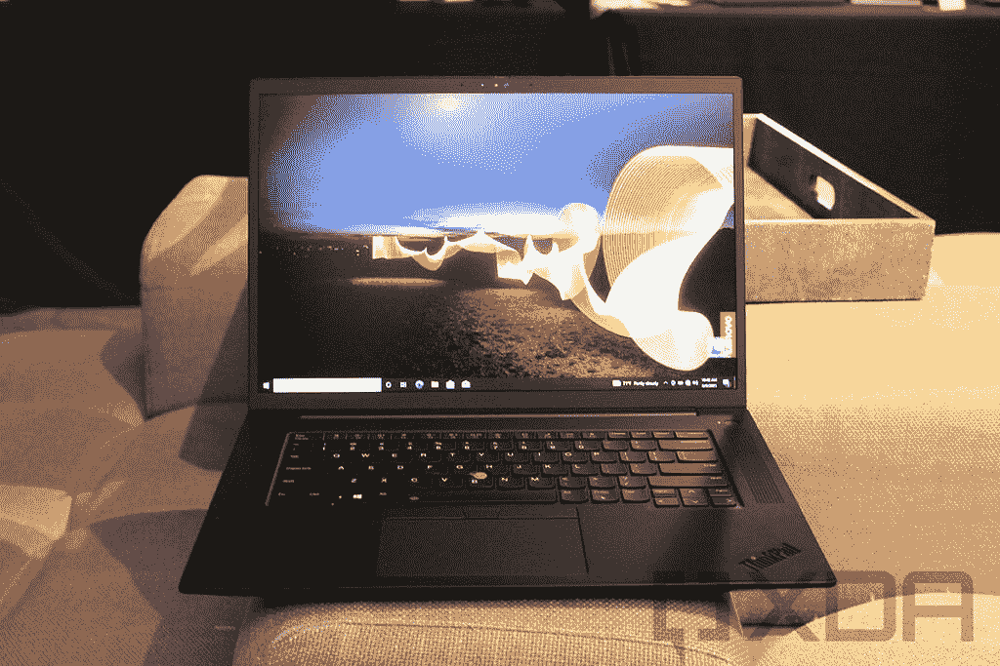

# Surface Laptop Studio vs 联想 ThinkPad X1 Extreme:哪个更好？

> 原文：<https://www.xda-developers.com/surface-laptop-studio-vs-lenovo-thinkpad-x1-extreme/>

微软最近推出了 [Surface Laptop Studio](https://www.xda-developers.com/surface-laptop-studio/) ，称其为有史以来最强大的 Surface。它采用最新的英特尔 H35 系列处理器和 NVIDIA GeForce RTX 3050 Ti，确实是 [Surface 系列](https://www.xda-developers.com/best-microsoft-surface-pcs/)的顶级产品。但是当谈到功能强大的笔记本电脑时，有更多的选择，即使你坚持更多的商务产品。在本文中，我们将对 Surface Laptop Studio 和[联想 ThinkPad X1 Extreme](https://www.xda-developers.com/lenovo-thinkpad-x1-extreme/) 进行比较，找出哪一款更适合你。

这是两款非常不同的笔记本电脑，联想 ThinkPad X1 Extreme 专门面向商业用户。正因为如此，这款笔记本电脑是高度可配置的，虽然 Surface Laptop Studio 也有很多配置，但 ThinkPad X1 Extreme 给了你更多的自由。

## surface Laptop Studio vs ThinkPad X1 Extreme:规格

像往常一样，我们先来看看这些笔记本电脑的规格。正如我们提到的，联想 ThinkPad X1 Extreme 提供了许多配置选项，您将在下表中看到这些选项。

|  | 

Surface Laptop Studio

 | 

联想 ThinkPad X1 至尊版

 |
| --- | --- | --- |
| **处理器** | 

*   英特尔酷睿 H35 i5-11300H(最高 4.4GHz，四核)
*   英特尔酷睿 H35 i7-11370H(最高 4.8GHz，四核)

 | 

*   英特尔酷睿 i7-11800H(最高 4.6GHz，8 核)
*   英特尔酷睿 i7-11850H 博锐处理器(最高 4.8GHz，8 核)
*   英特尔酷睿 i9-11950H 博锐处理器(最高 5GHz，8 核)

 |
| **图形** | 

*   英特尔 Iris Xe 显卡(酷睿 i5 型号)
*   NVIDIA GeForce RTX 3050 Ti 4GB GDDR6(酷睿 i7 型号)

 | 

*   英特尔 UHD 显卡
*   NVIDIA GeForce RTX 3050 Ti 4GB GDDR6
*   英伟达 GeForce RTX 3060 6GB GDDR6
*   英伟达 GeForce RTX 3070 8GB GDDR6
*   英伟达 GeForce RTX 3080 16GB GDDR6

 |
| **闸板** |  | 

*   8GB
*   16GB
*   16GB (2x8GB)
*   32GB
*   32GB(2 个 16GB)
*   64GB

 |
| **存储** |  | 

*   插槽 1 (PCIe 第四代):
    *   256GB (PCIe 第三代)
    *   512GB (PCIe 第三代)
    *   512GB (PCIe 第四代)
    *   1TB(第三代 PCI3)
    *   1TB (PCIe 第四代)
    *   2TB (PCIe 第四代)
*   插槽 2 (PCIe 第三代，可选):
    *   256GB (PCIe 第三代)
    *   512GB (PCIe 第三代)
    *   1TB (PCIe 第三代)
    *   2TB (PCIe 第四代)

 |
| **显示** | 

*   14.4 英寸 PixelSense Flow (2400 x 1600)，Dolby Vision，最高 120Hz 刷新率，触摸，Surface Pen 支持

 | 

*   16 英寸 WQXGA (2560 x 1600) IPS，防眩光，400 尼特
*   16 英寸超高清+ (3840 x 2400) IPS，防眩光，杜比视界，HDR 400，600 尼特
*   16 英寸超高清+ (3840 x 2400) IPS，触摸，防反光，杜比视觉，HDR 400，600 尼特

 |
| **音频** | 

*   配有杜比全景声的四声道全方位扬声器

 | 

*   双立体声扬声器(2 个 2W)

 |
| **网络摄像头** | 

*   1080p 前置网络摄像头

 |  |
| **生物认证** |  | 

*   指纹读取器
*   可选:红外摄像头

 |
| **电池** | 58Wh 电池

*   酷睿 i5:长达 19 小时的典型设备使用时间
*   酷睿 i7:长达 18 小时的典型设备使用时间

 | 4 芯 90 瓦时电池

*   长达 10 小时(MobileMark 18)

 |
| **端口** | 

*   2 个 Thunderbolt 4 端口
*   1 个表面连接端口
*   3.5 毫米耳机插孔

 | 

*   2 个 Thunderbolt 4(USB C 类)端口
*   2 个 USB 3.2 第 1 代 A 类端口
*   HDMI 2.1 (2.0 适用于英特尔 UHD 显卡)
*   SD 读卡器
*   3.5 毫米耳机插孔
*   可选:SIM 卡插槽

 |
| **连通性** | 

*   Wi-Fi 6 +蓝牙 5.1
*   Xbox 无线

 | 

*   英特尔 Wi-Fi 6/6E AX210 (2x2)，蓝牙 5.2
*   可选:5G(高通骁龙 X55，目前不提供)

 |
| **颜色** |  | 

*   黑色
*   黑色，带编织碳纤维罩

 |
| **尺寸(WxDxH)** | 12.72 x 8.98 x 0.746 英寸(323.28 x 228.32 x 18.94 毫米) | 14.13 x 9.99 x 0.7 英寸(359.5 x 253.8 x 17.7 毫米) |
| **重量** | 

*   酷睿 i5: 3.83 磅(1.74 千克)
*   酷睿 i7: 4 磅(1.82 千克)

 | 

*   起始重量为 3.99 磅(1.81 千克)

 |
| **起始价格** | $1,599.99 | 1 639.20 美元(各不相同) |

## 性能:ThinkPad X1 Extreme 遥遥领先

微软可能会吹捧 Surface Laptop Studio 是一款超级强大的笔记本电脑，但有一点可能不会立即显而易见，那就是该公司正在使用英特尔 H35 处理器。这些是英特尔新推出的 35W 处理器，虽然它们肯定比许多笔记本电脑中常见的 15W 处理器要好，但它们无法与 ThinkPad X1 Extreme 中的 45W 处理器相媲美。英特尔的 45W 处理器拥有更多内核和更快的时钟速度。

下面是使用 GeekBench 5 基准测试对这两款笔记本电脑中的英特尔酷睿 i7 型号进行的比较:

|  | 

英特尔酷睿 H35 i7-11370H

 | 

英特尔酷睿 i7-11800H

 |
| --- | --- | --- |
| GeekBench(单核/多核) | 1,448 / 4,811 | 1,488 / 8,058 |

除了整体功耗较低之外，H35 系列处理器的 CPU 速度较慢的一个原因是包含了英特尔 Iris Xe 显卡。如果你坚持使用集成显卡，这是一个合理的优势，但这两款笔记本电脑都配备了专用显卡，这可能是你的选择。

> *联想 ThinkPad X1 Extreme 拥有 45W 处理器和高达 GeForce RTX 3080 GPU。*

在这方面，联想 ThinkPad X1 Extreme 一直到配备 16GB gddr 6 内存的 NVIDIA GeForce RTX 3080，这是 Surface Laptop Studio 中 GeForce RTX 3050 Ti 的一个巨大飞跃。说到动力，这两款笔记本电脑相差相当远。当然，这并不是说 Surface Laptop Studio 的性能会很差——它仍然是一款速度很快的笔记本电脑，几乎可以很好地处理任何东西。ThinkPad X1 Extreme 只是遥遥领先。

 <picture></picture> 

Surface Laptop Studio

RAM 和存储也是如此，联想 ThinkPad X1 Extreme 提供高达 64GB 的 RAM 和 4TB 的 SSD 存储，这两者都是 Surface Laptop Studio 中最大容量的两倍。同样值得注意的是，ThinkPad X1 Extreme 可以单独升级这些组件，而 Surface Laptop Studio 提供了更多限制性的配置选项。

ThinkPad X1 Extreme 还意味着事后可升级，这一点在 Laptop Studio 上可不容易做到。然而，请记住，如果您包括 GeForce RTX 3060 或更高版本，ThinkPad X1 Extreme 的存储容量也将达到 2TB。

最后，电池寿命是 Surface Laptop Studio 似乎脱颖而出的一个方面。尽管电池更小，但使用更高效的处理器和可能的其他优化使 Surface Laptop Studio 的电池寿命高达 18 小时，即使使用专用显卡。这比联想承诺的 ThinkPad X1 Extreme 高出 80%。

值得一提的是，联想和微软使用不同的测量方法，联想使用 MobileMark 2018 进行测试，而微软只是使用“典型设备使用情况”作为测量方法。然而，MobileMark 2018 确实测试了商业用户的典型使用场景，所以结果可能不会太远。

## 显示器:两个奇妙的选择

如果说这两款笔记本电脑有一个亮点的话，那就是显示屏，尽管它们非常不同。Surface Laptop Studio 配备了 14.4 英寸的显示触摸屏，分辨率相当高，为 2400 x 1600。这使得它的长宽比为 3:2，它既锋利又足够大，几乎可以做任何你想做的事情。此外，它还具有 120Hz 的刷新率，可提供极其流畅的视觉效果，并支持杜比视觉 HDR 内容。还有一个事实是，它支持 Surface Slim Pen 2 和它的触觉反馈，让它感觉像你在纸上写字。

> 只有 4K+显示屏，ThinkPad X1 Extreme 才能配备触摸屏。

相比之下，联想 ThinkPad X1 Extreme 的显示屏为 16 英寸，分辨率为 2560 x 1600。这使它的 16:10 宽高比略宽，但整体分辨率更高。然而，你可以更进一步，升级到分辨率为 3840 x 2400 的 4K+显示器，它也支持杜比视觉。然而，你需要进一步升级才能获得触摸屏，这是 Surface Laptop Studio 默认包含的。

关于 4K 屏幕在笔记本电脑上是否有意义还有待讨论，但这是在 ThinkPad X1 Extreme 上获得触摸支持的唯一方式，在某些方面这是一个缺点。

 <picture></picture> 

Lenovo ThinkPad X1 Extreme

至于声音，Surface Laptop Studio 还应该通过其四声道 Omnisonic 扬声器提供更好的体验，该扬声器从键盘下方投射声音。ThinkPad X1 Extreme 的键盘两侧有扬声器格栅，两个 2W 扬声器藏在下面。Surface Laptop Studio 拥有四个扬声器这一事实已经让它拥有了明显的优势。

至于网络摄像头和麦克风，这两款笔记本电脑都配备了 1080p 网络摄像头，这总是很好看，但在这一点上并不常见。Surface Laptop Studio 包括开箱即用的面部识别，但这是联想 ThinkPad X1 Extreme 的可选升级。两者都有两个用于语音拾取的远场麦克风。

## 设计:Surface Laptop Studio 不仅仅是一台笔记本电脑

让 Surface Laptop Studio 成为真正特殊设备的是它的外形。这不是同类产品中的第一个，但拥有一台可以像这样以不同方式使用的笔记本电脑仍然令人难以置信地有趣。当你第一次打开盖子时，它看起来像一台普通的笔记本电脑，但随后你可以将显示屏拉近你的身体，盖住键盘，或者如果你想像平板电脑一样使用它，可以将其平放在整个键盘上。它提供了灵活性，但不一定会降低功耗。

它也没有你想象的那么重，配备专用显卡的酷睿 i5 机型的起始重量为 3.83 磅，酷睿 i7 机型的起始重量为 4 磅。

与此同时，联想 ThinkPad X1 Extreme 只是一台笔记本电脑——除非你专门升级到 4K+触摸屏，否则你不能将其用作平板电脑，甚至不能使用触摸屏。即便如此，不带触摸屏的机型起价为 3.99 磅，如果你想要触摸，起价为 4.1 磅。

然而，ThinkPad X1 Extreme 轻松获胜的地方是端口问题。它有两个 Thunderbolt 端口，两个 USB Type-A 端口，HDMI 2.1 和一个 SD 读卡器。虽然你可以使用 [Thunderbolt docks](https://www.xda-developers.com/best-thunderbolt-docks/) 来添加更多的端口，但很有可能你不需要这样做，因为所有的基本功能都是内置的。

Surface Laptop Studio 确实为你提供了两个 Thunderbolt 4 端口和一个 Surface Connect 端口的扩展选项，但你更有可能需要一个坞站，因为开箱后没有 USB Type-A 或 HDMI。有了 ThinkPad，你可以避免这一额外成本。

另外值得一提的是，ThinkPad X1 Extreme 默认包含指纹识别器，而 Laptop Studio 只有面部识别功能。

## 连接:ThinkPad X1 Extreme 为您提供 5G

最后，我们来谈谈无线连接，ThinkPad X1 Extreme 在这方面也略胜一筹。如果你关心在不在 Wi-Fi 覆盖范围内时连接到互联网，ThinkPad X1 包括通过高通骁龙 X55 调制解调器支持 5G 的选项。或者至少它会，因为在撰写本文时它还不可用。

无论如何，拥有这个选项对于移动办公人员来说非常重要，只有 ThinkPad X1 Extreme 才能提供这个选项。

> *在 5G 支持下，ThinkPad X1 Extreme 可以始终保持与互联网的连接。*

Surface Laptop Studio 没有任何形式的蜂窝连接。除了 Wi-Fi 和蓝牙，唯一可用的无线连接是 Xbox Wireless，它允许您更无缝地连接 Xbox 无线控制器或其他配件。这提供了比蓝牙更低的延迟，所以如果你对用控制器玩游戏感兴趣，这是一个很好的功能。

除此之外，这两款笔记本电脑都支持 Wi-Fi 和蓝牙，尽管 ThinkPad X1 Extreme 支持更新的标准。它支持使用新的 6GHz 频段的 Wi-Fi 6E，以及 Surface Laptop Studio 中支持的蓝牙 5.2 而不是 5.1 版本。

## 结果

正如您所料，这两款笔记本电脑各有利弊，可以帮助您根据自己的需求做出决定。联想 ThinkPad X1 Extreme 将为您提供最大的性能，正如其名称所暗示的那样，它还具有更多功能的连接，具有更多端口和 5G 支持选项。然而，这也有一些缺点，比如电池寿命。此外，它的设计更无聊，触摸屏等功能只有 4K+显示屏才能使用，这大大增加了成本。

Surface Laptop Studio 可能没有那么强大，它肯定可以使用更多的端口，但它确实提供了一个更有趣的设计和一些你可能认为开箱即用更重要的功能。它总是会有一个触摸屏，它还有 120 赫兹的刷新率。它的设计让你可以像使用笔记本电脑一样使用它，也可以像使用平板电脑一样使用它，两者之间还有其他模式。它还承诺更长的电池寿命。

就个人而言，Surface Laptop Studio 是更引人注目的设备，这正是因为它的多功能设计。它为你提供了多种与笔记本电脑交互的方式，正因为如此，它变得更加有趣。当然，这是因为顶级性能对我来说并不重要。

最终，这取决于你的个人需求，如果你已经做出了决定，你可以使用下面的链接购买你喜欢的笔记本电脑。如果您想探索其他选择，请查看今天能买到的[款最佳笔记本电脑](https://www.xda-developers.com/best-laptops/)。

 <picture></picture> 

Surface Laptop Studio

##### 微软 Surface Laptop Studio

Surface Laptop Studio 配备了全新的设计、更强大的内部部件、120Hz 显示屏和 Thunderbolt 支持，使其成为迄今为止功能最丰富的 Surface 设备之一。

 <picture></picture> 

Lenovo ThinkPad X1 Extreme

##### 联想 ThinkPad X1 至尊版

联想 ThinkPad X1 Extreme 是一款功能强大的 16 英寸笔记本电脑，采用高端英特尔 CPU 和 NVIDIA GeForce RTX 显卡。它可以配备高达 64GB 的内存和 4TB 的存储空间，外加超高清+显示屏。