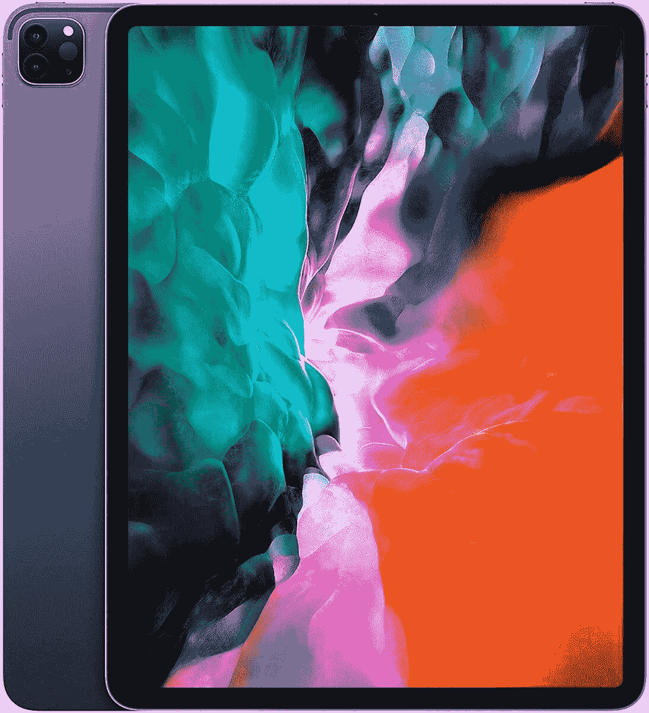

# 像 Surface Pro 7 和 iPad Pro 这样的优秀平板电脑现在已经上市了！

> 原文：<https://www.xda-developers.com/surface-pro-7-galaxy-tab-s7-sales/>

我想我是个平板电脑迷！或者，嗯，一个即将皈依者。我最近被所有的平板电脑交易弄得眼花缭乱，在昨天与我的一些同事交谈后，我认为是时候冒险了。对我来说，一台带键盘盖的好平板电脑可以取代一台外形更纤薄、电池续航时间更长的好笔记本电脑。如果你不是 Chromebooks 和 Chrome OS 的粉丝，从生产力设备的角度来看，一个更熟悉的操作系统的平板电脑是一个完全可行的解决方案。问题是，最好的平板电脑可能很贵！但是，好吧，我的工作是找到交易，这包括让 Surface Pro 7 和 iPad Pro 等高端平板电脑更加实惠的交易！

让我们从 Surface Pro 7 开始吧，因为这是我与同事们对话的开始！目前，微软的平板电脑和键盘盖在百思买仅售 900 美元，比建议零售价低 460 美元。这是 8GB 内存，256GB 固态硬盘的平板电脑，所以它应该能够轻松运行所有的生产力应用程序，即使是最大的生产力资源猪，Photoshop。任何包含键盘套的交易都很棒，因为键盘套似乎总是很贵。那到底是怎么回事？顺便说一句，如果你不介意更少的空间和内存，你可以去微软花 700 美元买一个不同的 Surface Pro 7 捆绑包。

 <picture></picture> 

Surface Pro 7+ ($330 off)

 <picture></picture> 

Surface Pro 7+ ($330 off)

虽然 Surface Pro 7 是一款整体很棒的平板电脑，但 Galaxy Tab S7 似乎是我的同事们最喜欢的。当你阅读这篇热情洋溢的[标签 S7 评论](https://www.xda-developers.com/samsung-galaxy-tab-s7-review/)时，也很容易明白为什么。虽然三星的平板电脑目前没有统一折扣，但你可以在三星商店通过符合条件的以旧换新节省一大笔钱。正确的折价交易将使标准 Tab S7 降至 200 美元，Tab S7 Plus 的价格降至 400 美元！结合超过 48 个月的支付能力，这款平板电脑的准入门槛比大多数其他平板电脑都要低得多。不过，你必须单独购买键盘盖！

 <picture></picture> 

Samsung Galaxy Tab S7

 <picture></picture> 

Samsung Galaxy Tab S7

当然，如果不谈论 iPads，你就不能真正谈论平板电脑。苹果的生态系统可能比 Surface Pro 7 封闭得多，但它只是一款优质设备。因此，我认为 iPad 是我唯一认真考虑过购买的苹果设备，谢天谢地，这些设备经常打折。我们已经多次展示了最新的 [iPad Air](https://www.xda-developers.com/apple-mac-mini-apple-deals/) (而且[仍在销售](https://www.amazon.com/Apple-iPad-Air-10-9-inch-Wi-Fi-64GB/dp/B08J66ZMY7?tag=xda-4e5mk19-20&ascsubtag=UUxdaUeUpU917&asc_refurl=https%3A%2F%2Fwww.xda-developers.com%2Fsurface-pro-7-galaxy-tab-s7-sales%2F&asc_campaign=Short-Term)！)但是今天，我们要讨论的是 iPad Pro。这款高端平板电脑价格不菲，但无疑是你能获得的最佳 iPad 体验。在亚马逊，11 英寸的 iPad Pro 可以节省 50 美元，12.9 英寸的可以节省 69 美元。

 <picture></picture> 

iPad Pro (11-inch, Silver)

##### 苹果 iPad Pro 11 英寸(2020 年)

 <picture></picture> 

iPad Pro (12.9-inch, Space Gray)

##### 苹果 iPad Pro 12.9 英寸(2020 年)

您有平板电脑吗？它是您笔记本电脑的理想替代品吗？有没有一款平板电脑你比 Surface Pro 7 和这里的其他平板电脑更喜欢？请在评论中告诉我们！