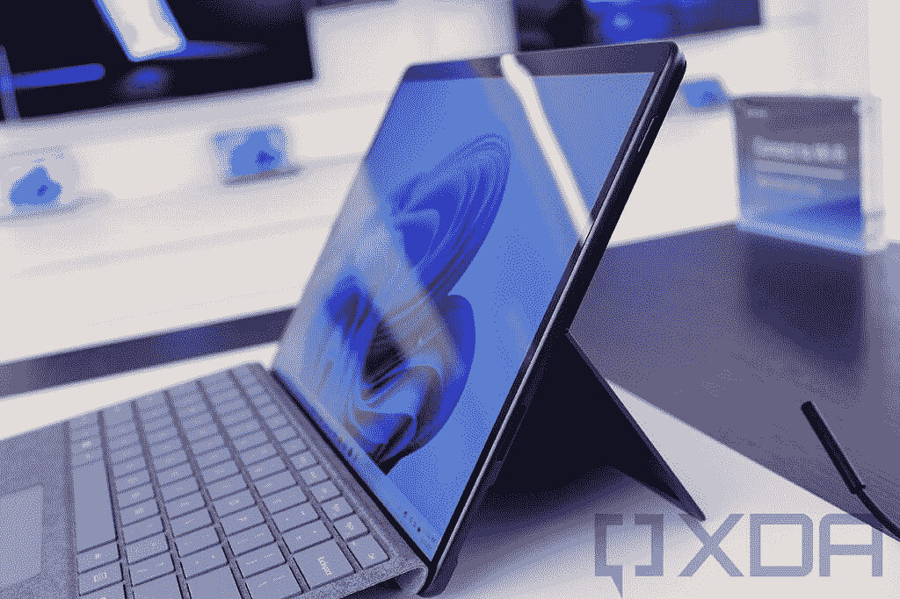
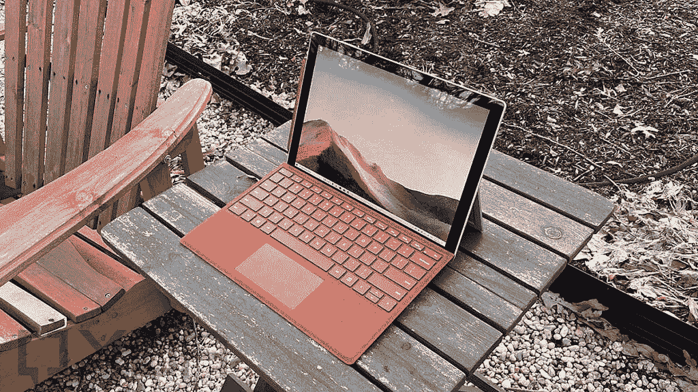
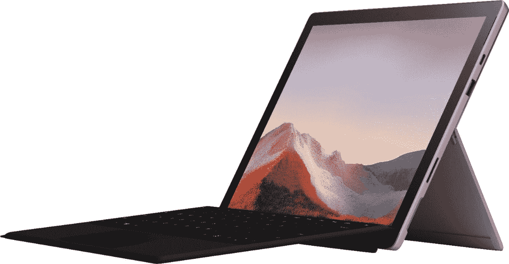

# Surface Pro 8 vs Surface Pro 7:新平板好多少？

> 原文：<https://www.xda-developers.com/surface-pro-8-vs-7/>

在最近的 Surface 活动中，微软推出了 Surface Pro 8 和其他一些产品。如果你一直关注新闻，你就会知道 Surface Pro 8 是 Surface Pro 家族中最大的进步之一。但是到底有多好呢？我们来对比一下 Surface Pro 7 和 Pro 8，了解一下。

总的来说，Surface Pro 8 对面向商业的 Surface Pro 7+进行了一些改进，但也在此基础上增加了一些重大变化。过去，如果你有以前的型号，大多数一代 Surface Pro 更新都不会保证升级，但今年，情况有所不同。

## Surface Pro 8 vs Pro 7:规格

首先，让我们比较一下这两种型号的规格。显然，Surface Pro 8 将拥有更好的整体硬件，但肯定有一些要点值得一提。

|  | 

Surface Pro 8

 | 

Surface Pro 7

 |
| --- | --- | --- |
| **处理器** | 

*   英特尔酷睿 i3-1115G4(最高 4.1GHz，双核)(仅限商业客户)
*   英特尔酷睿 i5-1135G7(最高 4.2GHz，四核)
*   英特尔酷睿 i7-1185G7(最高 4.9GHz，四核)

 | 

*   英特尔酷睿 i3-1005G1(最高 3.4GHz，双核)
*   英特尔酷睿 i5-1035G4(最高 3.7GHz，4 核)
*   英特尔酷睿 i7-1065G7(最高 3.9GHz，四核)

 |
| **图形** |  |  |
| **撞锤** |  |  |
| **存储** |  |  |
| **显示** | 

*   13 英寸 PixelSense Flow (2880 x 1920)显示屏，刷新率高达 120Hz，支持触摸和表面笔

 | 

*   12.3 英寸 PixelSense (2736 x 1824)，触摸屏，表面笔支持

 |
| **音频** | 

*   带杜比全景声的 2W 立体声扬声器

 | 

*   1.6W 立体声扬声器，带杜比音频

 |
| **网络摄像头** | 

*   500 万像素、1080 像素前置网络摄像头
*   10MP 4K/1080 p 后置摄像头

 | 

*   500 万像素、1080 像素前置网络摄像头
*   800 万像素、1080 像素后置摄像头

 |
| **生物认证** |  |  |
| **电池** | 

*   长达 16 小时的电池续航时间

 | 

*   长达 10.5 小时的电池续航时间

 |
| **港口** | 

*   2 个 Thunderbolt 4(USB C 类)端口
*   表面连接端口
*   3.5 毫米耳机插孔

 | 

*   1 个表面连接端口
*   1 个 USB Type-A (3.2 第 2 代/ 10Gbps)
*   1 个 USB Type-C (3.2 第 2 代/ 10Gbps)
*   3.5 毫米耳机插孔
*   microSD 读卡器

 |
| **连通性** | 

*   Wi-Fi 6 +蓝牙 5.1
*   可选:LTE(高通骁龙 X20)

 |  |
| **颜色** |  |  |
| **尺寸(WxDxH)** | 

*   11.3 x 8.2 x 0.37 英寸(287.02 x 208.28 x 9.4 毫米)

 | 

*   11.5 x 7.9 x 0.33 英寸(292 x 201 x 8.5 毫米)

 |
| **重量** |  | 

*   酷睿 i3/i5: 1.7 磅(775 克)
*   酷睿 i7: 1.74 磅(790 克)

 |
| **起始价格** | 1，099.99 美元(搭载英特尔酷睿 i5 处理器的消费者机型) | $749.99 |

## 性能:Tiger Lake 是 Surface Pro 8 的一大进步

Surface Pro 8 相比 Surface Pro 7 的第一个升级是处理器，因为它现在配备了英特尔的第 11 代(Tiger Lake)CPU，而不是第 10 代。Surface Pro 8 实际上并不是第一款使用 Tiger Lake 处理器的 Surface Pro，因为 Surface Pro 7+也有处理器，但这并没有使这次升级变得不那么令人印象深刻。微软声称 CPU 性能比 Surface Pro 7 提高了 40%以上，尽管这也可能是因为基本消费者模型现在配备了酷睿 i5 处理器，而不是酷睿 i3。

还是。与上一代产品相比，英特尔 Tiger Lake 实现了稳定的性能升级。以下是基于 GeekBench 基准测试的高端型号对比。

|  | 

英特尔酷睿 i5-1035G4( [Surface Pro 7](https://browser.geekbench.com/v5/cpu/9869407) )

 | 

英特尔酷睿 i5-1135G7(平均)

 | 

英特尔酷睿 i7-1065G7( [Surface Pro 7](https://browser.geekbench.com/v5/cpu/9743887) )

 | 

英特尔酷睿 i7-1185G7(平均)

 |
| --- | --- | --- | --- | --- |
| GeekBench(单核/多核) | 1,100 / 3,953 | 1,255 / 4,204 | 1,210 / 4,299 | 1,418 / 4,854 |

CPU 的性能也不仅仅是提高了。由于采用了新的 Iris Xe 图形 GPU，英特尔 Tiger Lake 处理器在图形性能方面也有了很大的飞跃。根据 *LaptopMedia* 的[测试，英特尔酷睿 i7 处理器中的 Iris Xe 图形 GPU 在 3DMark Fire Strike 中的得分几乎是两倍，达到 5682 分。相比之下，第十代 CPU 中的 Iris Plus Graphics 得分仅为 3024。](https://laptopmedia.com/comparisons/comparison-intel-iris-xe-graphics-g7-vs-intel-iris-plus-graphics-g7-the-xe-graphics-is-on-fire-being-up-to-twice-better-than-the-iris-plus-graphics/#:~:text=That%20big%20of%20a%20jump%20in%20performance%20from,and%20in%20Unigine%20Superposition%20it%20was%2034%25%20worse.)

> *Surface Pro 8 现在配备了至少 8GB 的内存和带有英特尔 Iris Xe 显卡的英特尔酷睿 i5 处理器。*

不仅如此，新的 Surface Pro 8 最终取消了只有 4GB 内存的机型。可以说，这对于高端设备来说已经不够用了，所以从 8GB 开始更有意义。然而，这两种型号的最大配置是相同的，最高可达 32GB 的 RAM 和 1TB 的 SSD 存储。

Surface Pro 8 的另一大优势是电池寿命，微软承诺充电一次可使用 16 小时。与该公司承诺的 Surface Pro 7 的 10.5 小时相比，这是一个巨大的增长。这很可能是由于 Surface Pro 8 略大、略厚，这意味着它可以容纳更大的电池。

 <picture></picture> 

Surface Pro 8

值得在这里提一下价格，因为当你比较 Pro 8 和 Pro 7 的起价时，差异是明显的。但这部分是因为 Surface Pro 8 的基本配置要好得多，有 8GB 内存和英特尔酷睿 i5 处理器。如果你想在 Surface Pro 7 中使用这种配置，你需要支付 899 美元，所以价格涨幅并不大。

## 显示器:Surface Pro 8 更大更好

Surface Pro 8 价格上涨的另一个因素是新显示屏，这是多年来最大的一次升级。Surface Pro 8 不再是 12.3 英寸的显示屏，而是 13 英寸的显示屏，分辨率也相应提高——从 2736 x 1824 提高到 2880 x 1920——所以它仍然一样清晰。这与 Surface Pro X 系列相匹配，它有助于 Surface Pro 8 感觉更现代。微软表示，这种新的显示器也更亮，并支持杜比视觉 HDR 内容。

> Surface Pro 8 拥有更大更亮的显示屏，支持 HDR，刷新率为 120Hz。

但这还不是升级的全部。Surface Pro 8 还支持 120Hz 的刷新率，这是第一台 [Surface PC](https://www.xda-developers.com/best-microsoft-surface-pcs/) (与 [Surface Laptop Studio](https://www.xda-developers.com/surface-laptop-studio/) 并列)。如果你使用过现代的高端甚至中档手机，你应该已经熟悉高刷新率，它们在游戏电脑中也很常见。然而，Windows 平板电脑直到现在才开始使用它们，所以这使得 Surface Pro 8 成为最好的产品之一。拥有高刷新率意味着动画、过渡、滚动和墨迹都将比以往看起来更流畅，这对于一些游戏来说也很棒。

声音系统也从 Surface Pro 7 到 Pro 8 进行了一点升级。显示屏两侧仍有两个立体声扬声器，但现在每个扬声器都有 1.6 瓦的 Surface Pro 8 还支持杜比全景声(Dolby Atmos surround sound)，这是该系列的另一个新功能。

 <picture></picture> 

Surface Pro 7

转到网络摄像头，两款笔记本电脑都有一个 5MP 1080p 前置网络摄像头，但微软表示，它已经改善了 Surface Pro 8 中摄像头的低光性能。最值得注意的升级是在背面，现在有一个 10 兆像素的摄像头，能够录制 4K 视频，而 Surface Pro 7 使用了一个 8 兆像素的 1080 像素摄像头。这两款笔记本电脑都有双远场麦克风，所以音频录制体验应该都很棒。

## 设计:自 2015 年以来第一次大规模的 Surface Pro 重新设计

Surface Pro 8 的整体设计理念依然和 Surface Pro 7 一样。这是一款带有可调支架的平板电脑，你可以附上键盘盖，将其变成笔记本电脑体验。但也有一些显著的不同，这是 Surface Pro 系列自 Surface Pro 4 以来首次出现重大重新设计。

如上所述，Surface Pro 8 的显示屏更大，但两侧的挡板也更小。因此，它实际上比 Surface Pro 7 略窄(在横向模式下)，但更高、更厚。它也稍微重一些。这在一定程度上影响了可移植性，但是对于大多数用户来说，这种差别并不算大。

但是这种设计带来了一些其他的变化。首先，Surface Pro 8 是第一款重新设计 Surface 键盘连接器的编号 Surface Pro。它现在使用与 Surface Pro X 相同的连接器，这意味着如果你使用以前的 Surface 设备，你需要一个新型的 Cover/Signature 键盘。新的 Surface Pro 签名键盘是另一个重大新闻，因为它包括 Surface Slim Pen 2 的磁性存储和充电。

 <picture></picture> 

Surface Pro Signature Keyboard with Surface Slim Pen 2 attached to a Surface Pro 8

你需要这样的存储空间，因为 Surface Pro 8 不再是为了在侧面安装经典的 Surface Pen 而设计的，这要归功于机箱的弧形边缘。现在 Surface Slim Pen(或 Slim Pen 2)是所有旗舰 Surface 设备的标配，包括 Surface Pro 8。具体来说，由于平板电脑内部的微软 G6 处理器，新的 Surface Slim Pen 2 非常适合 Surface Pro 8。使用这款处理器和 Surface Slim Pen 2 内部的触觉反馈，您现在可以获得用笔在纸上书写的感觉。

> Surface Pro 8 终于增加了两个 Thunderbolt 4 端口，这是 Surface Pro 系列的第一个端口。

这还不是全部。Surface Pro 8 还带来了期待已久的功能——雷电 4。Surface Pro 8 现在有两个支持 Thunderbolt 4 的 USB Type-C 端口，而不是标准的 USB Type-C 和 Type-A 端口。这意味着你可以将 [Thunderbolt docks](https://www.xda-developers.com/best-thunderbolt-docks/) ，外部显示器，甚至外部 GPU 连接到 Surface Pro 8。是的，你可以将 Surface Pro 8 变成一台游戏 PC，并利用 120Hz 的显示屏。

这可能是 Surface Pro 8 价格上涨的另一个因素，因为 Thunderbolt licensing 有相关成本。否则，端口是相同的。你仍然有一个 Surface Connect 端口——所以你可以继续使用 Surface Dock，如果你有一个的话——和一个 3.5 毫米耳机插孔。

## 连接:现在有了 LTE

微软通常会提供一些支持 LTE 的 Surface Pro 产品版本，但 Surface Pro 7 并非如此。如果你想要 LTE，你必须选择 Surface Pro 7+，其中包括一些其他升级。现在你可以在 Surface Pro 8 上使用 LTE 但这些型号还没有上市。微软通常会在晚些时候发布 LTE 版本，所以这并不新鲜。Surface Pro 8 中的 LTE 调制解调器是高通骁龙 X20，它承诺理论下载速度高达 1.2Gbps，上传速度高达 150Mbps。

否则，Surface Pro 7 和 Pro 8 之间的无线连接是相似的。两款机型都支持 Wi-Fi 6，Surface Pro 8 还配有蓝牙 5.1。这是对 Surface Pro 7 中蓝牙 5.0 的升级，但不足以让它明显更好。

## 一句话:值得升级吗？

多年来，如果你已经有了之前的型号，甚至是之前的型号，就很难建议你升级到最新的 Surface Pro 型号。它一直只是一个规格凸起，所以除非你需要性能，没有太多的理由花这笔钱。

这次的情况有点不同，因为这是 Surface Pro 系列多年来最大的一次升级。规格的提升和往常一样，但你也可以得到更大、更亮、更流畅的显示，支持 HDR，改进扬声器，也许最值得一提的是，支持 Thunderbolt。这给了你很多新的扩展选项，而这些选项是你仅仅使用 Surface Dock 所无法获得的。

这次升级的理由不止一个，所以如果你一直在等待一次大变动，现在就是时候了。当然，这是否是必要的升级取决于你。所有这些好处都很大，但你可能需要，也可能不需要。

 <picture></picture> 

Surface Pro 8

当然，如果你还没有 Surface Pro，或者你有一个更老的型号，那么这肯定是最好的时机。要价比以往任何时候都高，但坦率地说，如果你买的是 Surface Pro 7 的基本型号，你不会有优质的体验。价格涨幅没有最初看起来那么大，但肯定仍然存在。不过，在我们看来，你为它付出的额外金钱是值得的。

不管怎样，你仍然可以使用下面的链接选择你喜欢的型号。对于 Surface Pro 8，您可以使用下面的链接购买平板电脑和带有 Slim Pen 2 的 Surface Pro 签名键盘。如果你不想要键盘，也可以自己购买 [Surface Slim Pen 2](https://shop-links.co/1752774949440563873?u1=dadb9ee5-b461-4b73-afc9-d1121690b5b8) 。

 <picture></picture> 

Surface Pro 8

##### 微软 Surface Pro 8

Surface Pro 8 是微软的旗舰平板电脑，它采用了全新的设计，120Hz 的显示屏，Thunderbolt 4 等等。

 <picture></picture> 

Surface Pro Signature Keyboard with Surface Slim Pen 2

##### 微软 Surface Pro 签名键盘

Surface Pro Signature 键盘通过键盘和触控板补充了 Surface Pro 8，使其感觉更像一台笔记本电脑。该套装还包括 Surface Slim Pen 2。

至于 Surface Pro 7，你可以使用下面的链接购买，包括 Type Cover。您还可以添加 Surface Pen 来完善体验。

 <picture></picture> 

Surface Pro 7 with Type Cover

##### 微软 Surface Pro 7

Surface Pro 7 是一款配备高端英特尔处理器的轻量级高级 Windows 平板电脑。该套装包括一个 Surface Pro 类型的外壳，因此您可以轻松地将其转变为类似笔记本电脑的体验。

 <picture></picture> 

Surface Pen

##### 微软 Surface Pen

Surface Pen 可让您在 Surface Pro 设备上轻松绘图和书写。它具有 4，096 级压力和倾斜支持，是数字艺术家的绝佳选择。