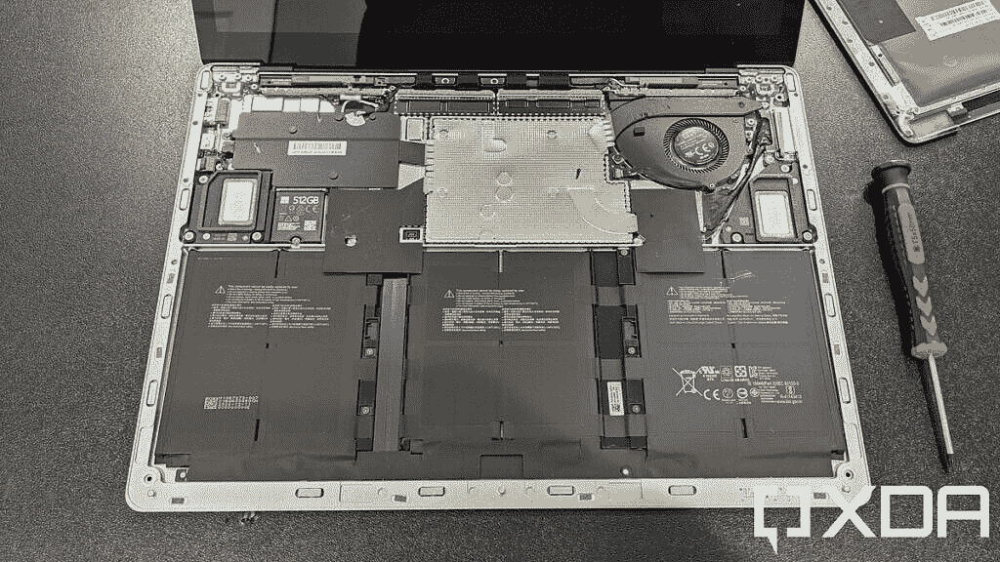
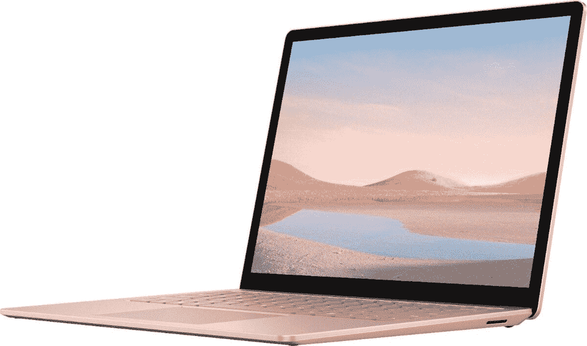
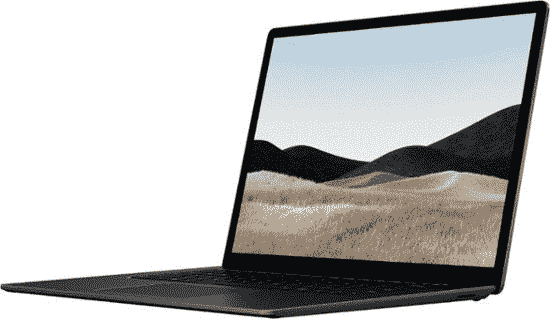

# Surface Pro 8 vs Surface Laptop 4:你该买哪个？

> 原文：<https://www.xda-developers.com/surface-pro-8-vs-laptop-4/>

微软的个人电脑 Surface 家族通常拥有一些你能买到的最好的笔记本电脑。它们中的大多数都具有高端规格和优质设计，这使它们成为引人注目的选择。最重要的是，它们通常被设计成利用不同的 Windows 特性。最近，微软推出了 [Surface Pro 8](https://www.xda-developers.com/surface-pro-8/) ，因此，我们将它与 Surface Laptop 4 进行比较，以帮助您决定购买哪一款。

虽然这两款笔记本电脑的设计截然不同，但它们的内部结构却有很多相同之处。它们都采用英特尔 Tiger Lake 处理器，并且具有相似的配置。然而，有一些显著的差异，它们可能会在选择一个或另一个之间产生差异。

## Surface Pro 8 与 Surface Laptop 4:规格

让我们先来看看这两款器件的规格列表。这将引出两者之间的一些相似之处，但也有一些重要的不同之处。

|  | 

Surface Pro 8

 | 

Surface Laptop 4

 |
| --- | --- | --- |
| **处理器** | 

*   英特尔酷睿 i3-1115G4(最高 4.1GHz，双核)(仅限商业客户)
*   英特尔酷睿 i5-1135G7(最高 4.2GHz，四核)
*   英特尔酷睿 i7-1185G7(最高 4.9GHz，四核)

 | 13.5 英寸:

*   英特尔酷睿 i5-1135G7(最高 4.2GHz，四核)
*   英特尔酷睿 i7-1185G7(最高 4.9GHz，四核)
*   AMD 锐龙 5 4680U 微软 Surface Edition(最高 4GHz，6 核)

15 英寸

*   英特尔酷睿 i7-1185G7(最高 4.9GHz，四核)
*   AMD 锐龙 7 4980U 微软 Surface Edition(最高 4.4GHz，8 核)

 |
| **图形** |  | 

*   英特尔 Iris Xe 显卡
*   AMD 镭龙显卡

 |
| **撞锤** |  |  |
| **存储** |  |  |
| **显示** | 

*   13 英寸 PixelSense Flow (2880 x 1920)显示屏，最高 120Hz 刷新率，触摸

 | 

*   15 英寸 PixelSense (2496 x 1664)，触摸屏

 |
| **音频** | 

*   带杜比全景声的 2W 立体声扬声器

 | 

*   配有杜比全景声的 Omnisonic 立体声扬声器

 |
| **网络摄像头** | 

*   500 万像素、1080 像素前置网络摄像头
*   10MP 4K/1080 p 后置摄像头

 |  |
| **生物认证** |  |  |
| **电池** | 

*   长达 16 小时的电池续航时间(容量不明)

 | 13.5 英寸:

*   英特尔处理器:长达 17 小时的电池续航时间
*   AMD 处理器:长达 19 小时的电池续航时间

15 英寸:

*   英特尔处理器:长达 16.5 小时的使用时间
*   AMD 处理器:长达 17.5 小时的使用时间

 |
| **端口** | 

*   2 个 Thunderbolt 4(USB C 类)端口
*   表面连接端口
*   3.5 毫米耳机插孔

 | 

*   1 个表面连接端口
*   1 个 USB Type-A (3.2 第 2 代/ 10Gbps)
*   1 个 USB Type-C (3.2 第 2 代/ 10Gbps)
*   3.5 毫米耳机插孔

 |
| **连通性** | 

*   Wi-Fi 6 +蓝牙 5.1
*   可选:LTE(高通骁龙 X20)

 |  |
| **颜色** |  | 13.5 英寸:

*   铂金(阿尔坎塔拉)
*   冰蓝色(Alcantara)
*   砂岩(金属
*   哑光黑色(金属)

15 英寸:

*   铂(金属)
*   哑光黑色(金属)

 |
| **尺寸(WxDxH)** | 11.3 x 8.2 x 0.37 英寸(287.02 x 208.28 x 9.4 毫米) | 

*   13.5 英寸:12.1 x 8.8 x 0.57 英寸(308 x 223 x 14.5 毫米)
*   15 英寸:13.4 x 9.6 x 0.58 英寸(339.5 x 244 x 14.7 毫米)

 |
| **重量** |  |  |
| **起拍价** | 1，099.99 美元(搭载英特尔酷睿 i5 处理器的消费者机型) | $1,299.99 |

## 性能:他们有很多共同点

如果上面的规格列表没有显示出来，Surface Pro 8 和 Surface Laptop 4 在内部有很大一部分是相同的。首先，两者都有英特尔 Tiger Lake 处理器，特别是 15W 型号。此外，除了商用版 Pro 8 的酷睿 i3 型号之外，它们都是完全相同的处理器。然而，Surface Laptop 4 确实有基于 AMD 的版本，有些人可能更喜欢这种版本。

 <picture></picture> 

Surface Laptop 4 internals

就单核性能而言，英特尔酷睿处理器更好，但基于 AMD 的型号在多核工作负载中表现更好，因为它们有更多的内核。AMD 处理器还提供了更长的电池寿命，但当设备被拔掉电源时，性能会有很大的损失。

这是一个平衡的行为，取决于你的优先顺序。这两款设备都将为日常任务提供足够的性能，无论是浏览网页，处理文档，还是两者兼而有之。作为参考，以下是所有这些处理器的 GeekBench 分数对比:

|  | 

英特尔酷睿 i5-1135G7(平均)

 | 

AMD 锐龙 5 4680U

 | 

英特尔酷睿 i7-1185G7(平均)

 | 

AMD 锐龙 7 4980U

 |
| --- | --- | --- | --- | --- |
| GeekBench 分数(单核/多核) | 1,256 / 4,205 | 1,015 / 5,428 | 1,418 / 4,854 | 1,124 / 6,572 |

无论采用何种处理器，Surface Laptop 4 都有望获得更长的电池续航时间，这可能要归功于更大的机箱，它可以容纳更大的电池。

除此之外，这两款设备几乎完全相同。它们都可以有高达 1TB 的存储空间和 32GB 的内存，尽管值得注意的是 Surface Laptop 4 的基本配置已经有 256GB 的存储空间，而 Surface Pro 8 则需要额外支付 100 美元。

## 显示器:Surface Pro 8 的刷新率为 120Hz

Surface Pro 8 带来的最大变化之一——也是其最大的优势之一——是显示器的 120Hz 刷新率。与 Surface Laptop Studio 一样，它也是首批包含这一功能的 Surface 设备之一，因为大多数 Surface PCs 仍然有 60Hz 的显示屏。更高的刷新率意味着动画、过渡、滚动和墨迹书写都将比以往更加流畅。当然，如果刷新率总是调到 120Hz，这是以电池寿命为代价的。此外，Surface Pro 8 还支持杜比视界。

> *Surface Pro 8 拥有分辨率更高的 13 英寸显示屏，刷新率为 120Hz，支持杜比视觉。*

除此之外，Surface Pro 8 还拥有更清晰的显示屏，其 13 英寸面板的分辨率为 2880 x 1920。尽管 Surface Laptop 4 的显示屏更大，但分辨率较低，13.5 英寸的屏幕为 2256 x 1504，15 英寸的屏幕为 2496 x 1664。这并不是说它不够锐利——当然，这仍然是一个非常高分辨率的面板。但是如果你有敏锐的眼光，Surface Pro 8 可以更好看。

 <picture></picture> 

Surface Pro 8

至于声音，这两款笔记本电脑都有双立体声扬声器，但它们的实现方式不同。由于是平板电脑，Surface Pro 8 的显示屏两侧各有一个扬声器，直接面对用户。同时，Surface laptop 4 将扬声器隐藏在键盘下，并将键盘孔用作扬声器格栅，将声音对准用户。两者都应该提供很好的音频体验，所以你不能在这里出错。

转移到网络摄像头，Surface Pro 8 也将在这里提供更好的体验。前置网络摄像头是一个 500 万像素的单元，能够录制 1080p 的视频，这已经比 Surface Laptop 4 高了一步。此外，您还可以在背面获得一个 10MP 摄像头，用于拍照或录制 4K 视频。你也可以用它在通话中炫耀一些东西。

最后，这两款设备都有双远场麦克风，因此无论您使用哪一款，在通话过程中都能清晰地听到您的声音。

## 设计:平板还是笔记本？

可以说，决定 Surface Pro 8 和笔记本电脑 4 的最大因素是外形。想要一台平板电脑或笔记本电脑是一件相当简单的事情。Surface Pro 8 可以说更加多功能，因为你可以拆下键盘(或者干脆不买键盘)，把它当作平板电脑来使用。或者你也可以买个键盘盖，用支架当笔记本电脑用。

然而，这也意味着如果你想要一个键盘和触控板，你需要额外花费才能获得完整的体验。另一方面，Surface Laptop 4 只是一款翻盖式笔记本电脑。你不能用它做更多的事情，但它是一个开箱即用的完整的 PC 体验。

这也影响了便携性。Surface Pro 8 几乎在所有维度上都更小，重量几乎是 Surface Laptop 4 的一半。将 Surface Pro 8 放在背包或包里带到任何地方都要容易得多。Surface Laptop 4 本身并不大，但相比之下，Surface Pro 8 要便携得多，即使你给它加上键盘。

> *Surface Pro 8 终于有了 Thunderbolt 4 端口，你可以使用各种坞站和外设。*

然后是端口的问题，这是 Surface Pro 8 的又一大胜利。Surface Laptop 4 确实有更多种类，除了 USB Type-C 之外，还有一个 USB Type-A 端口。但 Surface Pro 8 有两个 Thunderbolt 4/USB Type-C 端口，可以用来连接坞站、外部显示器，甚至外部 GPU。如果你真的想，你可以使用 Surface Pro 8 进行游戏，这要归功于 Thunderbolt 端口。

## 连接性:Surface Pro 8 有可选的 LTE

至于无线连接，这两款笔记本电脑都具有 Wi-Fi 6 和蓝牙功能，因此你的体验在这方面不会有根本的不同。你确实可以在 Pro 8 上获得蓝牙 5.1，而在笔记本 4 上获得蓝牙 5，但这不会在两者之间提供巨大的不同体验。

最大的区别在于移动连接。如果你是一个经常在路上的人，你不想依赖公共 Wi-Fi(你不应该这样)，蜂窝连接就非常重要。你可以在任何有蜂窝连接的地方连接到互联网，Surface Pro 8 为你提供了这一选项，但你必须为此支付额外费用。仍然没有 5G 支持，但 LTE 不会很快消失。

## 结果

看看我们在这里提出的比较点，很明显，尽管有相似的处理器和整体性能，Surface Pro 在许多方面都是更好的设备。它的显示屏刷新率很高，也更清晰。它具有更便携的设计、更强大的端口，以及添加 LTE 的选项。它确实是一款伟大的 Windows 平板电脑和笔记本电脑，也是微软制造的最好的 Surface 设备之一。

但是，和任何事情一样，这些事情对你来说不一定重要。就性能而言，这两款设备几乎相同，Surface Laptop 4 也有自己的优势。你可以使用它获得更大的显示屏，开箱即可获得完整的笔记本电脑体验，电池续航时间更长，尤其是使用 AMD 处理器时。它的功能不是那么多，但我们很多人只需要一台笔记本电脑，Surface Laptop 4 就是一个很好的例子。

如果你已经在两者之间做出了选择，你可以使用下面的链接购买你喜欢的。否则，你可以查看我们的[最佳笔记本电脑列表，看看其他选择。所有这些电脑都为](https://www.xda-developers.com/best-laptops/) [Windows 11](https://www.xda-developers.com/windows-11/) 做好了准备，所以你不必担心被落下。

 <picture></picture> 

Surface Laptop 4

##### 微软 Surface Laptop 4

Surface Laptop 4 是一款高端笔记本电脑，采用全金属设计(键盘面板可选 Alcantara)，最新的英特尔处理器和触摸屏。它还有四种不同的颜色。

 <picture></picture> 

Surface Laptop 4 (15)

##### 微软 Surface Laptop 4

Surface Laptop 4 是一款高端笔记本电脑，采用全金属设计，最新的英特尔处理器和触摸屏。15 英寸的型号有两种不同的颜色。

 <picture></picture> 

Surface Pro 8

##### 微软 Surface Pro 8

Surface Pro 8 是微软的旗舰平板电脑，它采用了全新的设计，120Hz 的显示屏，Thunderbolt 4 等等。