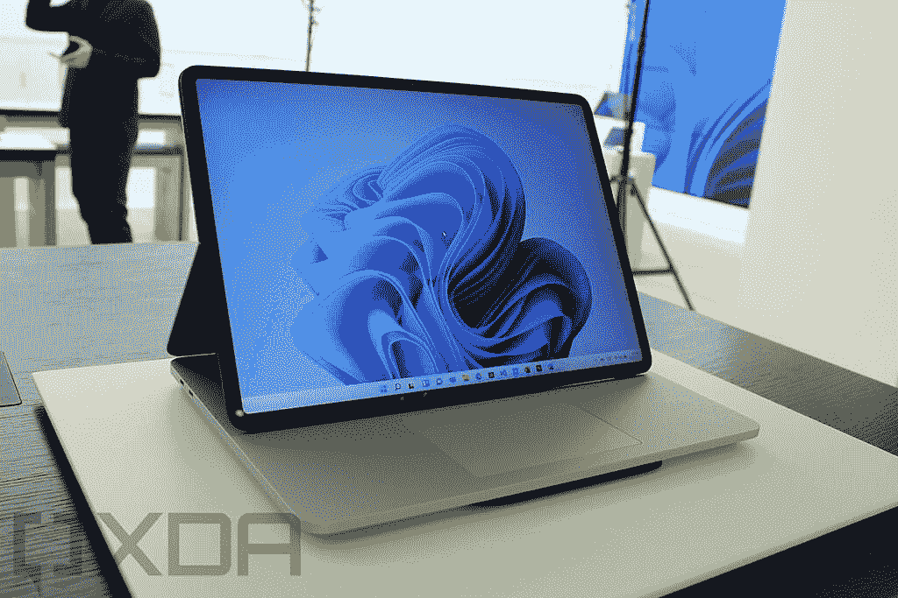
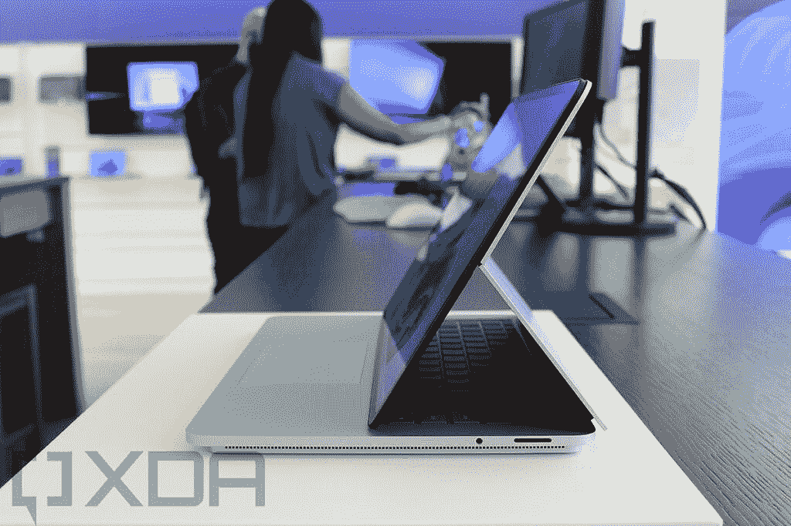

# Surface Pro 8 vs Surface Laptop Studio:哪个适合你？

> 原文：<https://www.xda-developers.com/surface-pro-8-vs-laptop-studio/>

微软最近推出了近年来最有趣的两款 Surface 设备。首先是 [Surface Pro 8](https://www.xda-developers.com/surface-pro-8/) ，这是 Surface Pro 系列自 2015 年以来获得的最大一次刷新。另一个是全新的 [Surface Laptop Studio](https://www.xda-developers.com/surface-laptop-studio/) ，它融合了 Surface Laptop 和 Surface Studio，但也是 Surface Book 系列的替代品。Surface Pro 8 和 Surface Laptop Studio 是两款非常棒的设备，但它们针对的是非常不同的用户。

尽管如此，你可能会发现自己无法在两者之间做出选择，这就是我们在这里的原因。我们将对这两款设备进行比较，并向您展示为什么您可能想要一款而不是另一款。它们都很棒，但是一个可能更适合特定的用例，而另一个可能更适合其他人。

## Surface Pro 8 vs Surface Laptop Studio:规格

让我们先来看看这两款器件的规格。正如你将看到的，Surface Laptop Studio 和 Pro 8 内部的硬件完全不同，这可能已经为你做出了决定。

|  | 

Surface Pro 8

 | 

Surface Laptop Studio

 |
| --- | --- | --- |
| **处理器** | 

*   英特尔酷睿 i3-1115G4(最高 4.1GHz，双核)(仅限商业客户)
*   英特尔酷睿 i5-1135G7(最高 4.2GHz，四核)
*   英特尔酷睿 i7-1185G7(最高 4.9GHz，四核)

 | 

*   英特尔酷睿 H35 i5-11300H(最高 4.4GHz，四核)
*   英特尔酷睿 H35 i7-11370H(最高 4.8GHz，四核)

 |
| **图形** | 

*   英特尔 UHD 显卡(酷睿 i3 型号)
*   英特尔 Iris Xe 显卡

 | 

*   英特尔 Iris Xe 显卡(酷睿 i5 型号)
*   NVIDIA GeForce RTX 3050 Ti(酷睿 i7 型号)

 |
| **闸板** |  |  |
| **存储** |  |  |
| **显示** | 

*   13 英寸 PixelSense Flow (2880 x 1920)显示屏，Dolby Vision，最高 120Hz 刷新率，触摸屏，支持 Surface Pen

 | 

*   14.4 英寸 PixelSense Flow (2400 x 1600)，Dolby Vision，最高 120Hz 刷新率，触摸，Surface Pen 支持

 |
| **音频** | 

*   带杜比全景声的双 2W 立体声扬声器

 | 

*   配有杜比全景声的四声道全方位扬声器

 |
| **网络摄像头** | 

*   500 万像素、1080 像素前置网络摄像头
*   10MP 4K/1080 p 后置摄像头

 | 

*   1080p 前置网络摄像头

 |
| **生物认证** |  |  |
| **电池** | 

*   长达 16 小时的电池续航时间(容量不明)

 | 

*   58Wh
    *   酷睿 i5:长达 19 小时的电池续航时间
    *   酷睿 i7:长达 18 小时的电池续航时间

 |
| **端口** | 

*   2 个 Thunderbolt 4(USB C 类)端口
*   表面连接端口
*   3.5 毫米耳机插孔

 | 

*   2 个 Thunderbolt 4 端口
*   1 个表面连接端口
*   3.5 毫米耳机插孔

 |
| **连通性** | 

*   Wi-Fi 6 +蓝牙 5.1
*   可选:LTE(高通骁龙 X20)

 | 

*   Wi-Fi 6 +蓝牙 5.1
*   Xbox 无线

 |
| **颜色** |  |  |
| **尺寸(WxDxH)** | 

*   11.3 x 8.2 x 0.37 英寸(287.02 x 208.28 x 9.4 毫米)

 | 

*   12.72 x 8.98 x 0.746 英寸(323.28 x 228.32 x 18.94 毫米)

 |
| **重量** |  | 

*   酷睿 i5: 3.83 磅(1.74 千克)
*   酷睿 i7: 4 磅(1.82 千克)

 |
| **起始价格** | 1，099.99 美元(搭载英特尔酷睿 i5 处理器的消费者机型) | $1,599.99 |

## 性能:Surface Laptop Studio 要强大得多

Surface Pro 8 和 Surface Laptop Studio 当然都是高端设备，但这并不意味着它们是一样的。作为一款超轻平板电脑，Surface Pro 8 必须使用英特尔的 15W 处理器，才能拥有可接受的电池续航时间和散热性能。相比之下，Surface Laptop Studio 拥有英特尔 H35 系列 CPU，这是英特尔今年推出的一系列全新产品。这些 35W 处理器采用英特尔 Iris Xe 显卡，内核数量与 15W 型号相似，但 TDP 更高。

在我们继续之前，这里有一个这些 CPU 的平均 GeekBench 分数的比较。

|  | 

英特尔酷睿 i5-1135G7

 | 

英特尔酷睿 i5-11300H

 | 

英特尔酷睿 i7-1185G7

 | 

英特尔酷睿 i7-11370H

 |
| --- | --- | --- | --- | --- |
| GeekBench(单核/多核) | 1,255 / 4,204 | 1,314 / 4,403 | 1,418 / 4,854 | 1,450 / 4,819 |

看到这一点，你可能会认为选择 35W 处理器比选择 15W 处理器没有太大的优势，但如果你曾经尝试过运行 GeekBench 基准测试，你就会知道这不是一个很长的过程。这些都是短期的基准测试，允许处理器提升到他们需要的高度，并且没有很大的热量限制。

然而，与 15W 处理器相比，35W 处理器能够在更长时间内保持这些性能水平。对于视频渲染和游戏等实际任务，您会注意到比这些基准测试显示的大得多的差异。

> *借助 GeForce RTX 3050 Ti，Surface Laptop Studio 可以成为一个合适的游戏平台。*

但是你将看到的最大的不同可能是在 GPU 方面。Surface Laptop Studio 在 Core i7 型号中包含了 NVIDIA GeForce RTX 3050 Ti GPU，这是它最突出的地方。与英特尔 CPU 上的集成显卡相比，RTX 3050 Ti 是一款更强大的显卡，它可以大大提升从视频编辑到游戏的一切性能。这实际上是一台内置 GPU 的可行游戏 PC，这对一些用户来说是一件大事。使用 Surface Pro 8，你只能运行更简单的游戏，云游戏，或者你需要一个外部 GPU。

Surface Laptop Studio 在其他方面也更强大。两款设备的内存都高达 32GB，但 Surface laptop Studio 的最低内存为 16GB，而 Pro 8 的最低内存为 8GB。至于存储，Surface Laptop Studio 最高可达 2TB，是 Surface Pro 8 提供的 1TB 的两倍。Surface Laptop Studio 的基本型号也包括 256GB 的存储空间，而 Pro 8 的最低存储空间为 128GB。

 <picture></picture> 

Surface Laptop Studio

最后，还有电池寿命，Surface Laptop Studio 凭借其更大的尺寸也取得了胜利。微软承诺 Core i5 机型的电池续航时间可达 19 小时，Core i7 机型可达 18 小时。这略高于 Surface Pro 8 的 16 小时，但这也是因为它是一款更大的设备。

## 显示器:一个更大，另一个更锋利

Surface Pro 8 和 Laptop Studio 是首批推出 120Hz 刷新率显示屏的 Surface 设备。在这方面，两个屏幕都很棒，但也有一些不同之处。Surface Pro 8 的屏幕更小，对角线为 13 英寸，但分辨率仍然明显更高，为 2880 x 1920。它仍然是典型的 3:2 宽高比，这意味着它仍然是伟大的生产力。

相反，Surface Studio 拥有更大的 14.4 英寸显示屏，长宽比为 3:2，但分辨率为 2400 x 1600。不可否认，这两款显示器仍然非常清晰，所以你可能不会真正注意到两者之间的清晰度有很大差异。但如果你有敏锐的眼睛，分辨率对你来说极其重要，那么 Surface Pro 8 实际上可能会提供更好的体验。不过，这两个都不会错。它们都支持杜比视觉，并配备了微软 G6 处理器，可以在 Surface Slim Pen 2 中实现触觉反馈。

然而，Surface Laptop Studio 的声音体验会更好。Surface Pro 8 有两个 2W 扬声器用于立体声，但 Surface Laptop Studio 使用四声道 Omnisonic 扬声器，应该更具沉浸感，声音也更大。尽管这两款笔记本电脑仍然支持杜比全景声，所以无论哪种方式，你都将获得可靠的体验。

> 两款笔记本电脑都配有全高清网络摄像头和双麦克风，可进行视频通话。

在摄像头方面，这两款笔记本电脑都有一个全高清前置网络摄像头，谢天谢地，微软是少数几家在其大多数产品中使用 1080p 网络摄像头的公司之一。然而，Surface Laptop Studio 没有后置摄像头，这是你所期望的，因为它是一款翻盖笔记本电脑。Surface Pro 8 是一款你可能想用来拍照的平板电脑，所以背面有一个 100 万像素的摄像头，它也支持 4K 的视频录制。

## 设计:Surface Pro 8 实际上是便携的

不需要很长时间，我们就可以看到这两款设备的本质区别。一个是平板电脑，另一个是笔记本电脑，仅此一项就很了不起。但是 Surface Laptop Studio 也不是轻薄的笔记本电脑，所以在便携性方面它们属于两个完全不同的类别。

Surface Pro 8 在每个维度上都比 Surface Laptop Studio 小，包括厚度不到一半。它的重量还不到 Surface Laptop Studio 的 Core i7 型号的一半(是 Core i5 型号的一半多一点)。Surface Pro 8 是一款真正可以随身携带的设备，即使你添加了键盘盖，它也非常便携。

 <picture></picture> 

Surface Laptop Studio

从技术上讲，Surface Laptop Studio 是一款便携式电脑，但考虑到它的起始重量为 3.83 磅，你不会想把它放在背包里随身携带。它更适合从家里带到办公室，这样你就可以坐下来使用它了。你可以在任何地方使用它——它的电池寿命也很长——但它不是移动的理想设备。

这两种设计都非常通用。Surface Pro 8 是一款可以单独使用的平板电脑，但你也可以添加 Surface Pro 签名键盘，使其成为笔记本电脑的体验。然而，添加键盘确实会显著增加成本，所以这也是需要考虑的事情。Surface Laptop Studio 是一款完整的笔记本电脑，但你可以随时将屏幕拉向自己，盖住键盘，或者将其平放，用作平板电脑。虽然它们非常不同，但它们都不缺少通用性。

> *微软终于为这两款设备添加了 Thunderbolt 4 端口，用于对接和外部 GPU。*

港口也是如此。Surface Pro 8 和 Laptop Studio 都标志着 Thunderbolt 4 在 Surface 设备上的首次亮相，这意味着你终于可以使用 Thunderbolt docks、显示器，甚至外部 GPU。这意味着，尽管 Laptop Studio 是一款开箱即用的游戏笔记本电脑，但你可以通过外部 GPU 使用 Surface Pro 8 进行游戏，并利用 120Hz 的显示屏。

两者都还保留了 Surface Connect 端口，所以如果你已经有了 Surface Dock，它会继续工作。Surface Pro 8 的一个优势是 Thunderbolt 端口位于不同的侧面，因此您在连接外围设备时可以有更多的自由，而不必担心您的 PC 应该在哪里。

## 连接性:Surface Pro 8 有 LTE

如上所述，Surface Pro 8 是一款极其便携的设备，它可以在你可能去的任何地方使用。正因为如此，它还为您提供了添加 LTE 的选项，这是非常合理的。Surface Pro 8 可以配备高通骁龙 X20 调制解调器，下载速度高达 1.2Gbps，上传速度高达 150Mbps。Surface Laptop Studio 没有给你这个选项，考虑到它的预期用途，这并不奇怪。

 <picture></picture> 

Surface Pro 8

另一方面，Surface Laptop Studio 确实内置了 Xbox 无线。对于喜欢使用控制器的游戏玩家来说，Xbox Wireless 非常棒，因为它提供了比使用蓝牙控制器更可靠、无延迟的连接。当然，你必须使用 Xbox 控制器才能运行，但是如果你在 PC 上玩游戏，你应该已经在这么做了。

在 Wi-Fi 和蓝牙支持方面，两款设备完全相同，都采用了 Wi-Fi 6 和蓝牙 5.1。

## 结果

Surface Pro 8 和 Surface Laptop Studio 都是很棒的设备，微软有史以来为 Surface 家族增添了一些最好的产品。它们都具有出色的日常任务性能，120Hz 刷新率的出色显示器，以及经过多年等待的 Thunderbolt 4 支持。

如果你需要一台功能强大的机器来完成大型编码项目、视频渲染和编辑或游戏等任务，Surface Laptop Studio 无疑是最佳选择。它有一个强大的专用 GPU，更强大的处理器，更大的显示屏，如果你喜欢用控制器玩游戏，甚至还有 Xbox Wireless。相比之下，这是一台有点重的机器，但它仍然是便携式的，所以你可以在家里或办公室轻松拥有这种能力。

但如果你想要一个真正的移动体验，Surface Pro 8 是一个更好的选择。对于资源不多的学生、作家和工作流来说，Surface Pro 8 是一台完美的机器。它非常轻薄，因此您可以真正将它带到任何地方，最重要的是，您可以通过 LTE 支持获得它，这样即使没有 Wi-Fi，您也可以保持与互联网的连接。如果你确实想以后玩游戏，并且你有足够的钱，你可以随时添加一个带有 Thunderbolt 4 端口的外部 GPU，并在 Surface Pro 8 上运行要求苛刻的游戏。

如果你已经做出了选择，你可以购买 Surface Pro 8——以及 Surface Pro 签名键盘——或者下面的 Surface Laptop Studio。

 <picture></picture> 

Surface Pro 8

##### 微软 Surface Pro 8

Surface Pro 8 是微软的旗舰平板电脑，它采用了全新的设计，120Hz 的显示屏，Thunderbolt 4 等等。

 <picture></picture> 

Surface Pro Signature Keyboard with Surface Slim Pen 2

##### 微软 Surface Pro 签名键盘

Surface Pro Signature 键盘通过键盘和触控板补充了 Surface Pro 8，使其感觉更像一台笔记本电脑。该套装还包括 Surface Slim Pen 2。

 <picture></picture> 

Surface Laptop Studio

##### 微软 Surface Laptop Studio

Surface Laptop Studio 配备了全新的设计、更强大的内部功能等等。