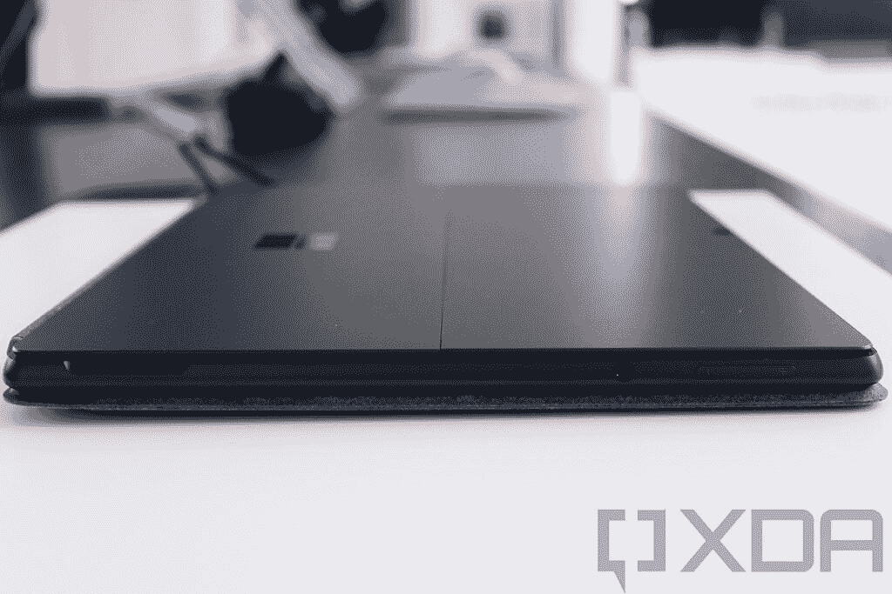
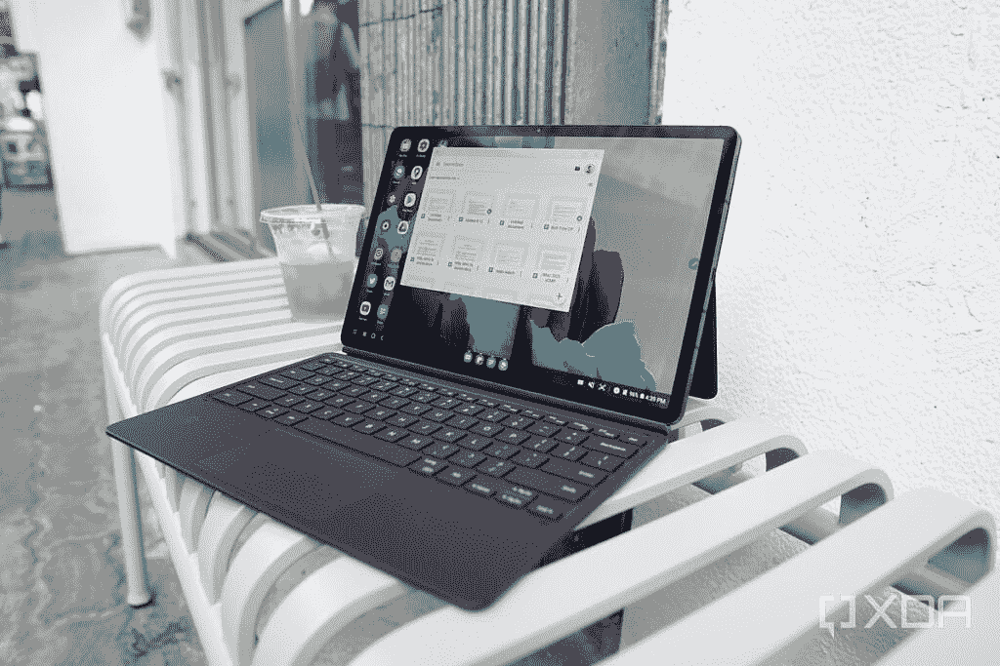
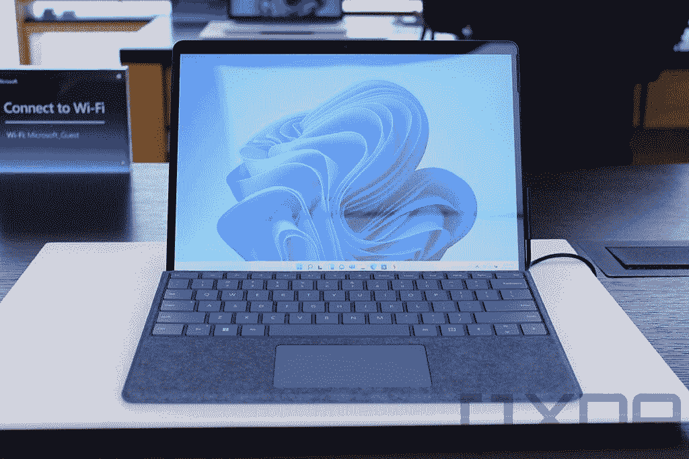
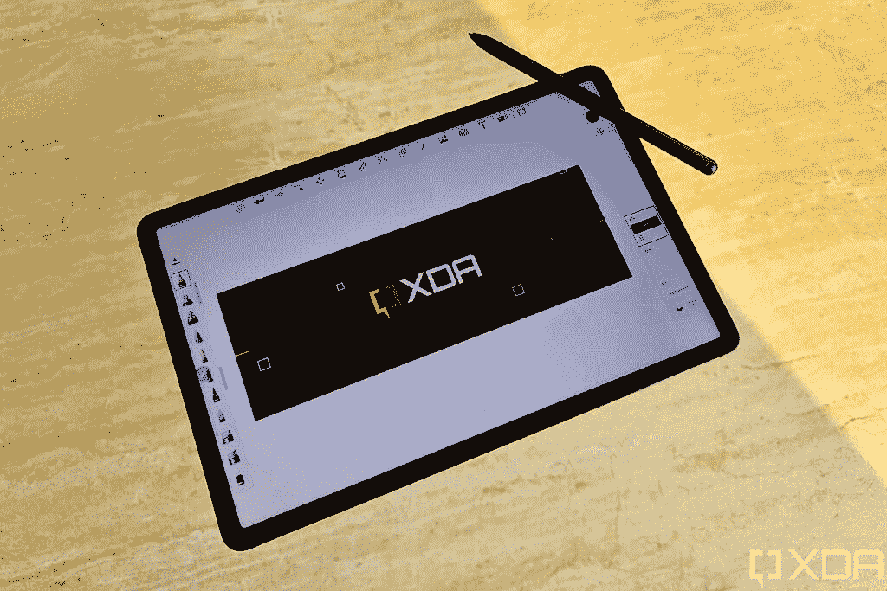
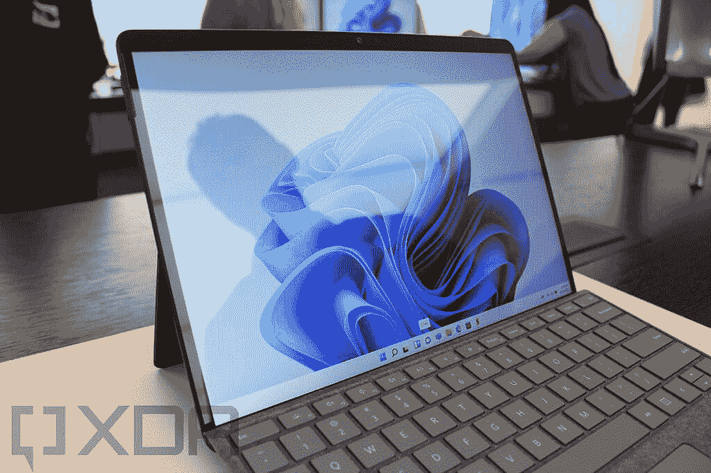
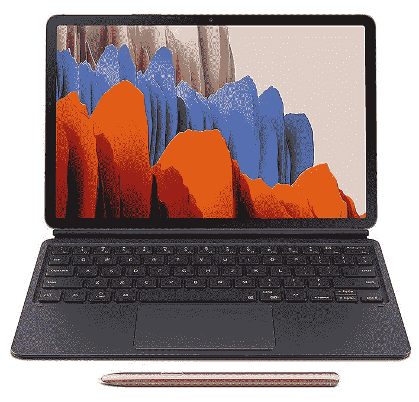
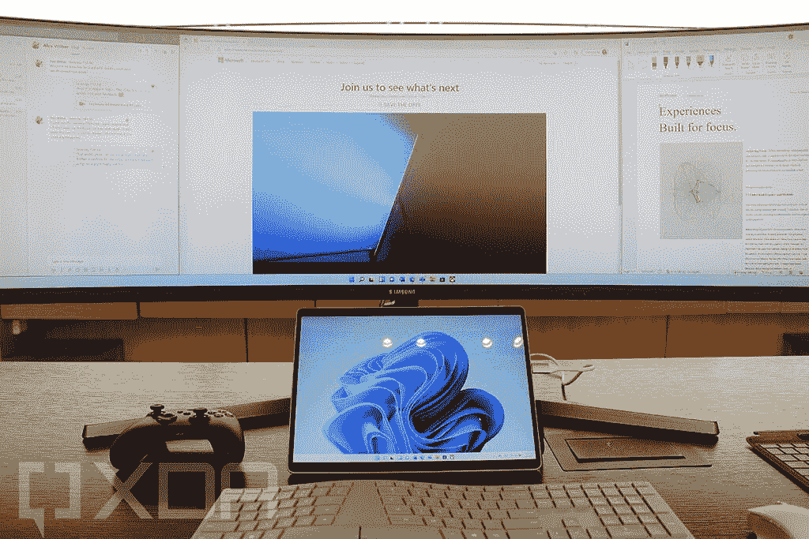

# Surface Pro 8 vs 三星 Galaxy Tab S7+:哪款平板电脑适合你？

> 原文：<https://www.xda-developers.com/surface-pro-8-vs-samsung-galaxy-tab-s7-plus/>

微软粉丝对 Surface Pro 的真正重新设计已经等待了很长时间。在他们的 2021 年秋季活动上，微软终于给了我们想要的东西。新款 Surface Pro 8 是一款设计精美、功能强大的平板电脑。如果你正在寻找真正的多功能性，它绝对是你的候选名单上的一款平板电脑。但也有其他几款平板电脑值得一看。三星 Galaxy Tab S7+是目前你能买到的最好的 Android 平板电脑，它拥有漂亮的屏幕、固态扬声器和轻薄的设计。虽然两款平板电脑在一些关键领域相似，但它们也运行不同的操作系统，面向不同的细分市场。

在这次比较中，我们将了解这些平板电脑的组合情况，并讨论哪一款最适合您的使用情形。这是 Surface Pro 8 vs 三星 Galaxy Tab S7+。

| 规格 | Surface Pro 8 | 三星 Galaxy Tab S7+ |
| --- | --- | --- |
| **尺寸&重量** | 

*   11.3 x 8.2 x 0.28 英寸(287.02 x 208.28 x 7.3 毫米)
*   1.96 磅(900 克)

 | 

*   285.0 毫米(宽)x 185.0 毫米(高)x 5.7mm 毫米(深)
*   1.27 磅(575 克)(Wi-Fi、LTE、5G)

 |
| **显示** | 

*   13 英寸 PixelSense Flow (2880 x 1920)显示屏
*   高达 120Hz 的刷新率、触摸、Surface Pen 支持

 | 

*   12.4 英寸
*   2800×1752 (WQXGA+)
*   超级 AMOLED
*   120 小时

 |
| **处理器** | 

*   英特尔酷睿 i3-1115G4(最高 4.1GHz，双核)(仅限商业客户)
*   英特尔酷睿 i5-1135G7(最高 4.2GHz，四核)
*   英特尔酷睿 i7-1185G7(最高 4.9GHz，四核)

 | 

*   高通骁龙 865 Plus

 |
| **内存&存储** | 

*   8、16 或 32 GB 内存
*   128GB、256 GB、512 GB、1TB 存储

 | 

*   6GB LPDDR5 内存+ 128GB UFS 3.0 存储
*   8GB LPDDR5 内存+ 256GB UFS 3.0 存储
*   可扩展存储(高达 1TB microSD)

 |
| **图形** |  |  |
| **电池和充电** | 

*   长达 16 小时的电池续航时间

 | 

*   10090 毫安时
*   45W 超级快充

 |
| **网络摄像头** | 

*   500 万像素、1080 像素前置网络摄像头
*   10MP 4K/1080 p 后置摄像头

 | 

*   后置摄像头:1300 万 f/2.0 主+500 万 f/2.2 超宽，LED 闪光灯。
*   前置摄像头:800 万像素 f/2.0

 |
| **颜色** |  | 

*   神秘的青铜色，神秘的银色，神秘的黑色，神秘的藏青色。

 |
| **端口** | 

*   2 个 Thunderbolt 4(USB C 类)端口
*   表面连接端口
*   3.5 毫米耳机插孔

 | 

*   USB 类型-C，3.2 第 1 代，DP 输出

 |
| **音频** | 

*   两个配有杜比全景声的 2W 立体声扬声器

 | 

*   四声道扬声器
*   AKG 调音，杜比全景声

 |
| **连通性** | 

*   Wi-Fi 6 +蓝牙 5.1
*   可选:LTE(高通骁龙 X20)

 | 

*   5G、LTE、Wi-Fi 6 (802.11 a/b/g/n/ac/ax)
*   Wi-Fi 直连，蓝牙 5.0

 |
| **软件** | Windows 11 | 安卓 11 |
| **其他特性** | 

*   Microsoft Surface 键盘支持
*   表面笔支持
*   老虎湖处理器在里面

 | 

*   显示不足的指纹扫描仪
*   电源按钮中的指纹扫描仪
*   三星 S-pen 支持
*   三星 DeX 支持。

 |

## Surface Pro 8 vs 三星 Galaxy Tab S7+:设计和制造

随着 Surface Pro 8 的大规模重新设计，它现在的外观和感觉与 Surface Pro X 几乎相同。这两款平板电脑的宽度和长度完全相同，这意味着实际上很难区分 Surface Pro 8 和它的旧版本。这绝对是一件好事，因为 Surface Pro 急需更新设计部门。它现在也由铝制成，与传统的镁底盘有很大的不同。尽管如此，它仍然有白金和黑色两种颜色，而黑色被称为石墨。Surface Pro 8 无论如何都不重——不到 2 磅，准确地说是 1.96 磅。为此，如果你主要关心的是便携性，你可能会更喜欢 Galaxy Tab S7 +-它轻得多，只有 1.27 磅。

Tab S7+要轻得多，但如果你主要将它用作手持设备，你会感觉到它的重量。高 285 毫米，宽 185 毫米，不带外壳使用起来并不舒服。如果你选择 S7+的话，我们强烈建议你购买三星官方的键盘盖。三星对软件做了一些调整，这样键盘可以被拆分或变成浮动键盘，但你会想要一个键盘盖——否则太不舒服了。虽然 Galaxy Tab S7 Plus 的大部分都很时尚，但 S Pen 在背面的位置是有问题的，老实说，非常不雅观。使用相对较强的磁铁，S Pen 会自动附着在背面。连接到一个融入相机外壳的扩展磁化区域，这可能是三星能够做到的最好的事情，但这不是最时尚的事情。[caption align = " align center " width = " 900 "]

更大的 Tab S7+使用了 OLED 面板[/caption]微软在端口部门的胜利，因为 Surface Pro 8 具有两个 Thunderbolt 4 端口和一个 3.5 毫米耳机插孔。三星继续从他们的设备上移除耳机插孔，Tab S7+也不例外。如果你更喜欢用有线耳机听音乐，或者想连接高分辨率的外接显示器，Surface Pro 8 绝对会是你的最佳选择。虽然这两款平板电脑都有令人愉悦的设计美学，但 Surface Pro 8 看起来更现代，边框更薄。Surface Pro 8 上的相机外壳看起来也更加统一——这是一个小细节，但绝对是你在日常使用中会注意到的东西。

## Surface Pro 8 vs 三星 Galaxy Tab S7+:显示器

对于这两款平板电脑来说，显示屏都是一个很强的类别。三星以其惊人的显示质量而闻名，微软在 Surface Pro 8 上真的有所进步。没有其他方式可以表达 Galaxy Tab S7 Plus 令人惊叹，显示器在视觉上令人惊叹。苹果喜欢吹捧像视网膜显示屏这样的营销术语，但 Galaxy Tab S7 Plus 上的 12.4 英寸 Super AMOLED 显示屏自成一派。在 1752 x 2800 像素和 16:10 纵横比的情况下，显示器“仅”提供每英寸 266 像素的密度，但就像百万像素不是相机的唯一决定因素一样，Galaxy Tab S7 Plus 显示器的质量在 Android 平板电脑中首屈一指。该显示器支持 HDR 10+并提供 120 赫兹的刷新率，实现超级平滑的滚动。三星在这款平板电脑上安装了内置指纹扫描仪，尽管由于显示屏尺寸的原因，使用起来可能有点尴尬。当然，你也可以用三星的捆绑 S-Pen 在 Tab S7+上做笔记或者画画。

通过 Surface Pro 8，微软从 Surface Pro X 给编号的 Pro 家族带来了相同的显示屏尺寸、分辨率和整体设计，因此这两款设备是针锋相对的。除了 Surface Pro 8 还包括 120Hz 的刷新率，这使得从滚动到墨迹书写的一切都感觉更加流畅。此外，它支持杜比视觉，所以很明显 Surface Pro 8 现在有更好的显示屏。最重要的是，如果你使用墨水，Surface Pro 8 有一个新的微处理器，可以在 Surface Slim Pen 2 中实现触觉反馈，给你真正的笔在纸上的感觉。一切都变得更好了，这是你今天在平板电脑上能找到的最好的写作体验之一。

两款平板电脑都有令人惊叹的显示屏，但 Surface Pro 8 可能是真正提高工作效率的更好选择。超薄笔 2 的触觉反馈为在平板电脑上记笔记和绘图提供了无与伦比的体验。虽然 S-Pen 方便直观，但它不太适合专业使用。如果您只是对消费媒体、游戏和简单的网络浏览感兴趣，您肯定会对这两种显示器感到满意。

## Surface Pro 8 vs 三星 Galaxy Tab S7+:性能

说到性能，这不是一场真正的公平竞争。Surface Pro 8 是一款平板电脑

[a full Windows PC](https://www.xda-developers.com/best-laptops/)

。微软设计 Surface Pro 8 是为了真正的生产力和内容消费。另一方面，三星 Galaxy Tab S7+是一款 Android 平板电脑，专注于观看视频、玩游戏以及偶尔的轻度生产力任务。牢记这些目标，Surface Pro 8 在原始功率方面是一款更强大的平板电脑。

Surface Pro 8 现在配备了英特尔的 Tiger Lake 处理器，并从英特尔酷睿 i5 开始。在这一点上，这些处理器明显优于 Galaxy Tab S7+和骁龙 865+提供的处理器。事实上，骁龙 865+甚至不是安卓平板电脑的最新高通芯片。Tab S7+已经有一年多的历史了，应该更新换代了，所以它的性能肯定更差。Surface Pro 8 还提供了更多 RAM 和存储选项，分别高达 32GB 和 1TB。这两者都远远超过了三星 Galaxy Tab S7+所能提供的容量，但有一个警告，为 Surface Pro 8 添加 LTE 意味着你只能获得 256GB 的存储空间。尽管如此，TabS7+在任何配置下都只能达到 256GB，但可以通过 microSD 添加高达 1TB 的可扩展存储。你也可以在 Galaxy Tab S7+上获得 5G，如果这是你真正关心的事情。

Surface Pro 8 承诺最长 16 小时的典型使用时间，但像往常一样，这是假设最低亮度和最轻的工作负载。如果您在更高的亮度下使用该设备或有更重的工作负荷，您可以预计平均接近 10-12 小时。根据大多数评论，Tab S7+的平均电池寿命约为 12 小时。要考虑的关键问题是，你可能会使用 Surface Pro 8 进行更严肃的工作，所以它消耗电池的速度可能会比看网飞或 YouTube 快一点。

## Surface Pro 8 vs 三星 Galaxy Tab S7+:摄像头和音频

相机是 Surface Pro 8 赶上时代的另一个领域。后置摄像头已经升级到 100 万像素，带有 4K 视频，就像 Surface Pro X 一样，而以前的型号只有 800 万像素的摄像头。在正面，两款平板电脑都仍然有一个 5MP 全高清摄像头，但微软表示，它已经改善了 Surface Pro 8 的摄像头的低光性能，因此整体来说可能会更好。

Tab S7+上的双摄像头结合了主 1300 万像素广角传感器和 f/2.0 光圈，以及 500 万像素超宽传感器和 f/2.2 光圈。相机乍一看还行，但应该没人会为了它的相机买平板——请不要成为那个人。如今，前置摄像头无疑更加重要，尤其是对于视频通话之类的事情来说，8MP f/2.0 传感器可能也可以，尽管它仅限于全高清每秒 30 帧。如果你真的必须使用一个巨大的平板电脑来拍摄照片或视频，你会很高兴知道后置摄像头支持 4K 视频，也是每秒 30 帧。

在声音方面，Surface Pro 8 采用了 2W 立体声扬声器，所以在硬件层面上，它们应该相当不错。然而，微软宣称 Surface Pro 8 支持杜比 Atmos，因此与 Pro X 相比，你可能会获得更好的环绕声体验，尽管这两款平板电脑的硬件和设计相似。Tab S7+也有出色的音频体验。由 AKG 调音的四声道扬声器声音洪亮、清晰，非常令人愉快。扬声器有更响亮的通知的额外好处，但你会想把它们关小，因为它们可能会压倒。如果你购买 Galaxy Tab S7 Plus 是为了享受媒体或听音乐，你不会失望的。

## 结论

显然，这是两种完全不同的平板电脑，有着截然不同的目标受众。如果你在寻找最好的媒体消费平板电脑，它可能是三星 Galaxy Tab S7+。它更轻，成本更低，并且有稍微好一点的扬声器的额外好处。您还可以享受谷歌 Play 商店上提供的所有游戏，因此 Tab S7+作为一款娱乐平板电脑非常引人注目。另一方面，在

[Surface Pro 8 is a better all-round machine](https://www.xda-developers.com/best-microsoft-surface-pcs/)

。如果你需要一些东西来用作媒体平板电脑和真正的工作 PC，Surface Pro 8 可以处理你扔给它的一切。除了新的 Tiger Lake 处理器的出色性能之外，您还可以通过新的超薄 Pen 2 获得惊人的笔记记录体验。储物选项也更加丰富，您可以存放工作和娱乐所需的一切物品。

### 微软 Surface Pro 8

Surface Pro 8 是微软的旗舰平板电脑，它采用了全新的设计，120Hz 的显示屏，Thunderbolt 4 等等。

**Affiliate Links**

Amazon

[View at Amazon](https://www.amazon.com/Microsoft-Surface-Pro-8-13-Touchscreen/dp/B09DK2JCX1?tag=xda-7h8f5mr-20&ascsubtag=UUxdaUeUpU5400&asc_refurl=https%3A%2F%2Fwww.xda-developers.com%2Fsurface-pro-8-vs-samsung-galaxy-tab-s7-plus%2F&asc_campaign=Short-Term)

Store

[View at Store](https://shop-links.co/1753173569127610360?u1=5f79ef3f-b432-4120-ac1d-5cc916cf8cf1)

### 三星 Galaxy Tab S7 Plus

Galaxy Tab S7+是目前市场上最好的安卓平板电脑。没有多少人能接近 iPad Pro，但这是你能得到的最接近的了。强大的规格、优质的手感和出色的功能构成了一款旗舰平板电脑，让您付出旗舰价格。

**Affiliate Links**

Samsung

[View at Samsung](https://shop-links.co/link/?exclusive=1&publisher_slug=xda&article_name=Surface+Pro+8+vs+Samsung+Galaxy+Tab+S7%2B%3A+Which+tablet+is+right+for+you%3F&article_url=https%3A%2F%2Fwww.xda-developers.com%2Fsurface-pro-8-vs-samsung-galaxy-tab-s7-plus%2F&u1=UUxdaUeUpU5400&url=https%3A%2F%2Fwww.samsung.com%2Fus%2Ftablets%2Ftab-s7%2Fbuy%2F%3FmodelCode%3DSM-T870NZKAXAR)