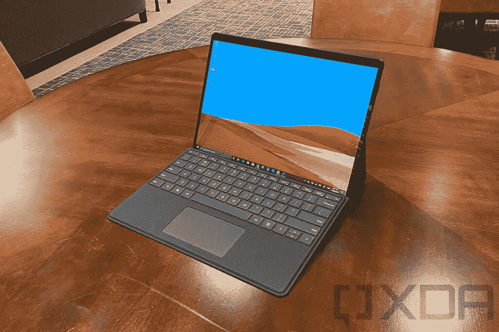
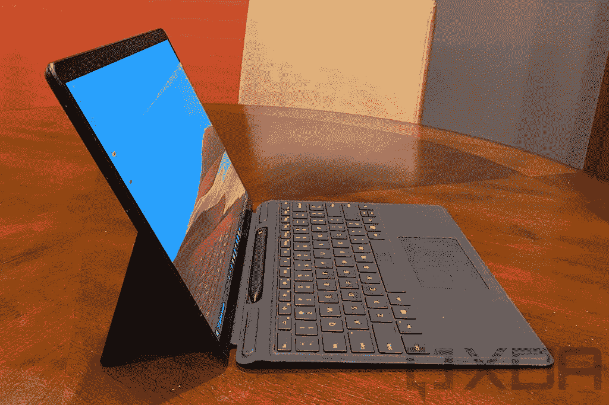

# Surface Pro 8 vs Surface Pro X:最好的优质平板是什么？

> 原文：<https://www.xda-developers.com/surface-pro-8-vs-x/>

微软最近发布了多年来最大的 Surface 平板电脑。在展示的众多产品中，有全新的 [Surface Pro 8](https://www.xda-developers.com/surface-pro-8/) ，以及只有 Wi-Fi 版本的 [Surface Pro X](https://www.xda-developers.com/surface-pro-x/) 。随着 Surface Pro 8 现在采用类似尺寸的显示屏，这两款平板电脑现在比以往任何时候都更接近，但它们在某些方面也更加不同。如果你在这两者之间难以选择，我们会帮助你。

我们将比较这两款高端 Surface 平板电脑，以帮助您确定哪一款适合您。尽管有相似之处，这两个设备也有相当多的差异。虽然选择一个比另一个可能归结为个人偏好，但每一个都有明确的优势。

## Surface Pro 8 vs Surface Pro X:规格

让我们先来看看这两款平板电脑的规格概要。尽管设计非常相似，但这两款设备的内部存在重大差异。

|  | 

Surface Pro 8

 | 

Surface Pro X

 |
| --- | --- | --- |
| **处理器** | 

*   英特尔酷睿 i3-1115G4(最高 4.1GHz，双核)(仅限商业客户)
*   英特尔酷睿 i5-1135G7(最高 4.2GHz，四核)
*   英特尔酷睿 i7-1185G7(最高 4.9GHz，四核)

 | 

*   微软 SQ1(最高 3GHz，8 核)
*   微软 SQ2(最高 3.15GHz，8 核)

 |
| **图形** |  | 

*   肾上腺素 685 (SQ1)
*   安德烈诺 690(平方英尺)

 |
| **撞锤** |  |  |
| **存储** |  |  |
| **显示** | 

*   13 英寸 PixelSense Flow (2880 x 1920)显示屏，最高 120Hz 刷新率，触摸屏，支持 Surface Pen

 | 

*   13 英寸 PixelSense (2880 x 1920)，触摸屏，支持表面笔

 |
| **音频** | 

*   两个配有杜比全景声的 2W 立体声扬声器

 | 

*   两个带杜比音频的 2W 立体声扬声器

 |
| **网络摄像头** | 

*   500 万像素、1080 像素前置网络摄像头
*   10MP 4K/1080 p 后置摄像头

 | 

*   500 万像素全高清前置摄像头
*   100 万像素全高清/4K 后置摄像头，带自动对焦功能

 |
| **生物认证** |  |  |
| **电池** | 

*   长达 16 小时的电池续航时间

 | 

*   长达 15 小时的典型设备使用时间

 |
| **端口** | 

*   2 个 Thunderbolt 4(USB C 类)端口
*   表面连接端口
*   3.5 毫米耳机插孔

 | 

*   2 个 USB 类型-C
*   1 个表面连接端口
*   nano SIM 卡插槽

 |
| **连通性** | 

*   Wi-Fi 6 +蓝牙 5.1
*   可选:LTE(高通骁龙 X20)

 | 

*   Wi-Fi 5 +蓝牙 5.0
*   可选:LTE Advanced Pro(高通骁龙 X24)

 |
| **颜色** |  | 

*   白金卡(仅限 SQ2)
*   哑光黑色

 |
| **尺寸(WxDxH)** | 11.3 x 8.2 x 0.37 英寸(287.02 x 208.28 x 9.4 毫米) | 

*   11.3 x 8.2 x 0.28 英寸(287.02 x 208.28 x 7.3 毫米)

 |
| **重量** |  |  |
| **起始价格** | 1，099.99 美元(搭载英特尔酷睿 i5 处理器的消费者机型) | $899 |

## 性能:Surface Pro X 基本上已经两年了

比较这两款设备的性能几乎是不公平的，因为自 Surface Pro X 于 2019 年首次亮相以来，微软并没有做太多的升级工作。2020 年，它与微软 SQ2 的处理器速度稍快，但差异很小，两种型号仍在同一上市销售。

这意味着这个硬件有点过时了，最重要的是，由于这是一个 ARM 处理器，一些应用程序将通过仿真运行。这意味着性能可能会受到更大的影响，这取决于您使用的应用程序。

> *英特尔的 Tiger Lake 处理器明显优于 Surface Pro X。*

相比之下，Surface Pro 8 现在配备了英特尔的 Tiger Lake 处理器，并从英特尔酷睿 i5 开始。这些处理器在这一点上明显优于 Surface Pro X 提供的处理器。以下是微软 SQ2 与英特尔最新处理器的快速对比:

|  | 

微软 SQ2

 | 

英特尔酷睿 i5-1135G7

 | 

英特尔酷睿 i7-1185G7

 |
| --- | --- | --- | --- |
| Geekbench 分数(单核/多核) | 803 / 3,206 | 1,255 / 4,204 | 1,418 / 4,854 |

Surface Pro 8 还提供了更多 RAM 和存储选项，分别高达 32GB 和 1TB。这两者都是 Surface Pro X 所能提供的两倍，但有一个警告，即给 Surface Pro 8 添加 LTE 意味着你只能获得 256GB 的存储空间。Surface Pro X 没有那样的限制。

 <picture></picture> 

Surface Pro X

谈到电池寿命，这两款平板电脑相差不远。Surface Pro X 的处理器效率更高，但因为太薄，电池本身也更小。Surface Pro 8 承诺最长 16 小时的典型使用时间，而 Pro X 大约为 15 小时。

## 显示屏:Surface Pro 8 高达 120Hz

在过去的几年里，Surface Pro X 的设计比编号 Surface Pro 系列更现代，这使得后者没有那么吸引人。Surface Pro X 有一个 13 英寸的 PixelSense 显示屏，其分辨率为 2880 x 1920，令人难以置信地清晰，周围的挡板也更小。但那只是和之前的 Surface Pro 机型相比。

通过 Surface Pro 8，微软为编号的 Pro 家族带来了相同的显示屏尺寸、分辨率和整体设计，因此这两款设备是针锋相对的。除了 Surface Pro 8 还包括 120Hz 的刷新率，这使得从滚动到墨迹书写的一切都感觉更加流畅。此外，它支持杜比视觉，所以很明显 Surface Pro 8 现在有更好的显示屏。

最重要的是，如果你使用墨水，Surface Pro 8 有一个新的微处理器，可以在 Surface Slim Pen 2 中实现触觉反馈，给你真正的笔在纸上的感觉。一切只是做得好了很多，没有合适的升级机型，Surface Pro X 无法竞争。

 <picture></picture> 

Surface Pro 8

在声音方面，两款平板电脑都有两个 2W 立体声扬声器，所以在硬件层面上，它们非常相似。然而，微软在 Surface Pro 8 上吹捧杜比 Atmos 支持，因此与 Pro X 相比，你可能会获得更好的环绕声体验。

摄像头是 Surface Pro 8 赶上 Pro X 的另一个领域。后置摄像头已经通过 4K 视频升级到 10MP，就像 Surface Pro X 一样，而之前的型号只有 8MP 摄像头。在正面，两款平板电脑都仍然有一个 5MP 全高清摄像头，但微软表示，它已经改善了 Surface Pro 8 的摄像头的低光性能，因此整体来说可能会更好。

## 设计:端口还是便携性？

Surface Pro 8 经过重大重新设计，现在看起来和感觉上与 Surface Pro X 几乎相同。这两款平板电脑的宽度和长度完全相同，但厚度和重量仍有一些差异。Surface Pro 8 的厚度为 9.4 毫米，而 Surface Pro X 的厚度为 7.3 毫米，仍然是微软最薄的 Surface PC。

 <picture></picture> 

Surface Pro X

拥有 ARM 处理器有助于实现更紧凑的设计，并且它也更轻。Surface Pro X 不包括键盘仅重 1.7 磅，尽管 Surface Pro 8 无论如何都不重，但它的重量为 1.89 磅，略高于这个数字。最后，两者都是非常便携的设备，但如果你想要最轻的选择，你可能会更喜欢 Surface Pro X。

然而，Surface Pro 8 反驳了这一点，因为它的端口功能更强。首先，它增加了一个 3.5 毫米的耳机插孔，这是 Surface Pro X 没有的。如果你还在用有线耳机，这是你最好的选择。

> *Surface Pro 8 终于支持 Thunderbolt 4，给你很多扩展选项。*

但最重要的是，尽管这两款平板电脑都有两个 USB Type-C 端口，但这些端口都支持 Surface Pro 8 上的 Thunderbolt 4。这为使用 Thunderbolt 坞站、显示器甚至外部 GPU 带来了巨大的可能性。如果你想的话，你可以将 Surface Pro 8 用作游戏装备，但这不适用于 Pro X。

## 连接:它们都有 LTE 选项

如果你经常在旅途中，并且想在不依赖公共 Wi-Fi 的情况下保持互联网连接，蜂窝连接是一项重要功能。谢天谢地，Surface Pro 8 和 Pro X 都有 LTE 作为可选功能，在这种情况下，Pro X 可能是更好的选择。它有一个高通骁龙 X24 调制解调器，承诺高达 2Gbps 的下载和 316Mbps 的上传。

 <picture></picture> 

Surface Pro 8

相比之下，Surface Pro 8 有一个骁龙 X20 调制解调器，据称最高下载速度为 1.2Gbps，上传速度高达 150Mbps。

另一方面，如果你非常依赖 Wi-Fi，Surface Pro 8 支持较新的 Wi-Fi 6 标准，而 Surface Pro X 只有 Wi-Fi 5。许多路由器和设备仍然是 Wi-Fi 5，所以现在可能不会有什么不同，但 Surface Pro 8 在这方面更经得起未来的考验。

## 结果

通常，我们会说，最终，在两种设备之间进行选择取决于个人偏好。虽然这在某种程度上仍然适用，但 Surface Pro 8 提供了太多不容忽视的优势。它拥有更强大的处理器，更高的 RAM 和存储配置，更流畅的杜比视觉显示，Thunderbolt 端口等等。它有太多的优势，这是一场公平的战斗。

不过，这并不是说 Surface Pro X 没有自己的吸引力。它更薄更轻，而且如果你关心 LTE，你可能会比 Pro 8 获得更快的速度。这仍然是一个很棒的高级体验-性能仍然很稳定，显示屏很清晰，而且它有一个现代的设计。它的起价也较低，所以它可能对你有意义，因为它更容易获得。

无论您的偏好如何，您都可以使用下面的链接购买这两款设备中的任何一款。两者都将提供一个很好的 Windows 11 体验，所以你不会真的出错。否则，你可以看看我们列出的[你现在能买到的最好的笔记本电脑](https://www.xda-developers.com/best-laptops/)。

 <picture></picture> 

Surface Pro 8

##### 微软 Surface Pro 8

Surface Pro 8 是微软的旗舰平板电脑，它采用了全新的设计，120Hz 的显示屏，Thunderbolt 4 等等。

 <picture></picture> 

Surface Pro X

##### 微软 Surface Pro X

Surface Pro X 是一款基于 ARM 的高端平板电脑，在轻薄的设计中提供了出色的性能和电池续航时间。它现在只有 Wi-Fi 模式。