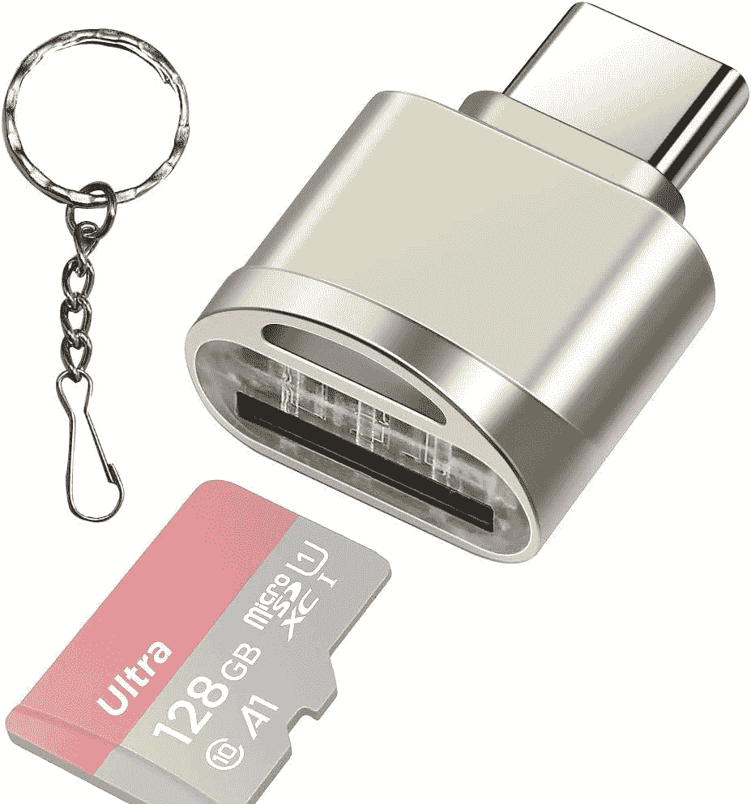

# Surface Pro 9 有 microSD 卡槽吗？

> 原文：<https://www.xda-developers.com/surface-pro-9-micro-sdcard-slot/>

很多流行的平板电脑和二合一设备[都有一个共同的特点就是 microSD 卡扩展。这使您可以随时扩展照片、视频和文档的存储空间，而无需在购买设备时支付额外的存储空间。因此，随着](https://www.xda-developers.com/best-windows-tablets/) [Surface Pro 9](https://www.xda-developers.com/surface-pro-9/) 成为微软家族的最新平板电脑，你可能会想知道它是否有 microSD 卡插槽。不幸的是，答案是否定的。然而，有一种方法可以获得更多的板载存储。它只需要一点技术知识。

## 为什么 Surface Pro 9 没有 microSD 卡槽

微软在去年的 Surface Pro 8 中从[主 Surface Pro 阵容](https://www.xda-developers.com/best-microsoft-surface-pcs/)中移除了 microSD 卡插槽。上一个有 microSD 卡插槽的型号是 2019 年发布的 Surface Pro 7+。

Surface Pro 9 没有 microSD 卡槽有一个很大的原因。它更新、更薄的设计意味着它有一个可移动的固态硬盘(SSD)。你可以买一个更小的固态硬盘，然后升级到一个更大的存储空间。当然，微软建议你通过维修技术人员升级 SSD，但如果你有合适的经验，你实际上可以自己完成。

Surface Pro 9 有一个 M.2 2230 PCIe 固态硬盘，比许多笔记本电脑或台式机中的传统 M.2 2280 固态硬盘小得多。也是可以替换的。支架下面有一个固态硬盘的门，你可以用 SIM 弹出工具释放它。卸下门后，您可以开始卸下驱动器。你拧开旧的驱动器，然后移除原来的散热垫，将垫重新应用到新的驱动器上，然后拧入并放置新的驱动器。然后你要做的就是用恢复介质启动它，重新安装 Windows 11。

所以，这就是 Surface Pro 9 没有 microSD 卡槽的原因。这是因为微软让你更换固态硬盘。不过，如果你真的想在 Surface 上使用 microSD 卡，你可以看看一些适配器，包括我们下面重点介绍的那种。有了它，你可以将你的 microSD 卡插入适配器，然后将适配器插入 Surface Pro 9 的 USB-C 端口之一。当然，这并不理想，但如果你必须使用 microSD 卡插槽，它将不得不这样做。

 <picture></picture> 

Type C MicroSD Card Reader

##### C 型 MicroSD 读卡器

这款 USB Type-C microSD 读卡器将帮助您在 Surface Pro 9 上使用 microSD 卡。只需将其插入 USB-C 端口，您就可以开始工作了。

 <picture></picture> 

Surface Pro 9 (Wi-Fi Model)

##### Surface Pro 9 (Wi-Fi 机型)

Surface Pro 9 是一款采用英特尔或高通处理器的顶级 Windows 平板电脑，它首次拥有多种颜色。

 <picture></picture> 

Surface Pro 9 5G

##### Surface Pro 9 5G

5G 版 Surface Pro 9 由新的微软 SQ3 芯片组提供支持，并具有 120Hz 的显示屏。然而，它没有 Wi-Fi 机型那么多颜色。