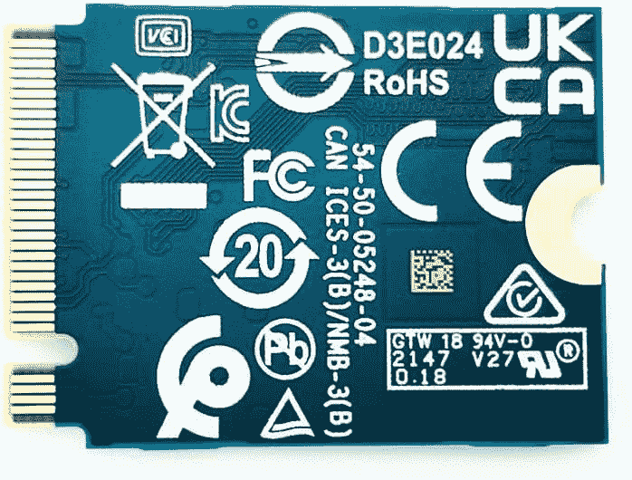

# Surface Pro 9 上的存储和 SSD 如何升级

> 原文：<https://www.xda-developers.com/surface-pro-9-upgrade-storage/>

关于 Surface Pro 9 的一个很酷的事情是，微软让升级存储变得很容易。你不需要很多工具，而且与[其他笔记本电脑](https://www.xda-developers.com/best-windows-tablets/)相比，这个过程相对简单。当然，这样做时你需要小心，你需要备份所有文件并创建一个恢复驱动器来重新安装 Windows。

请注意，微软建议 Surface Pro 9 上的存储只能通过授权的技术人员进行升级。你真的不应该自己做这件事，但是如果你想，你可以。只要确保保留 Surface Pro 9 附带的原始固态硬盘(SSD)，以便在出现保修问题时可以更换它。综上所述，我们是来帮助你完成这个指南的。

## 你需要什么

Surface Pro 9 中更换存储的过程和去年的 Surface Pro 8 差不多。在开始之前，你需要一些东西。我们在下面为你列出了这个。

**M.2 2230 SSD-** 这是一款较小的 SSD 类型。不要购买 M2。2280 SSD，因为这不会与 Surface Pro 9 一起工作，因为它更长更大，不适合 Pro 9。下面我们有一个建议您购买的固态硬盘。

**Torx T3 螺丝刀** -这是一款可以让你从 Surface Pro 9 上卸下硬盘的螺丝刀。你可以用下面的链接在亚马逊上买一套。

**16GB 容量的 USB 驱动器** -在从 Surface Pro 9 中移除原始 SSD 之前，您必须创建一个恢复驱动器并下载恢复介质，以便重新安装 Windows。这个 u 盘你能做到吗？确保其格式为 FAT32 格式。

**SIM 弹出工具-** 该工具将允许您打开 Surface Pro 9 5G 机型上支架下的门，以接触到 SSD 进行拆卸。

*   <picture></picture>

    sn 530m . 2 2230 SSD

*   <picture></picture>

    三星 DUO 加闪存盘

    ##### 三星 DUO 加 USB Type-C 盘

*   <picture></picture>

    梅花螺丝刀套装

    ##### 梅花螺丝刀套装

## 步骤 1:创建恢复驱动器

甚至在从 Surface Pro 9 中移除 SSD 之前，你应该创建一个恢复驱动器。你还应该将 Surface Pro 9 上的文件备份到云端，或者除了你即将创建的恢复和 USB 驱动器之外的其他外部位置。创建恢复驱动器将让你在放入新的 SSD 并重新安装 Windows 后启动 Surface Pro 9。以下是方法。

1.  访问[表面恢复页面](https://support.microsoft.com/en-us/surface-recovery-image)。向下滚动到*选择您的 Surface* 并选择 Surface Pro 9 并输入您的序列号。点击*继续*。
2.  点击列表中 Surface Pro 9 旁边的*下载图片*链接。等待它下载。下载的文件将是一个. ZIP 文件。
3.  将您拥有或购买的 USB 驱动器插入 Surface Pro 9 的 USB 端口或已连接的加密狗上。
4.  在任务栏的搜索框中，键入*恢复驱动器*，然后从结果中选择*创建恢复驱动器*或*恢复驱动器*。
5.  点击*是。*
6.  从列表中选择您的 USB 驱动器，然后选择*下一个*，接着选择*创建。*这个过程需要几分钟，你的 u 盘会被清空。
7.  当恢复驱动器准备好时，选择*完成。*
8.  找到文件，双击。您以前下载的 ZIP 文件来打开它。
9.  点击键盘上的 *CTRL+A* ，选择恢复镜像文件夹中的所有文件。然后，点击 *CTRL + C* 进行复制。
10.  打开新的文件资源管理器窗口。转到侧边栏中的 *This PC* ，双击 USB 驱动器图标，打开您之前创建的 USB 驱动器。
11.  按 CTRL+V 将文件粘贴到您创建的 USB 恢复驱动器中。出现提示时，选择*选择替换目标中的文件。*
12.  当文件复制完毕后，从 Surface Pro 9 中取出固态硬盘，然后关闭系统。

我们建议保留 Surface Pro 9 的原始 SSD，不要擦除或重置 Surface。这是为了让您有一个工作的 Windows 安装，以防出现问题。

## 第二步:更换 Surface Pro 9 上的固态硬盘

现在你已经完成了备份并有了安装介质，你实际上可以替换 Surface Pro 9 本身的 SSD 了。这样做需要一点耐心，并且需要你亲自动手使用工具。虽然很简单，但我们会保护你。跟着下面走。

1.  抬起 Surface Pro 9 上的支架，使其完全朝上或呈 90 度角。
2.  再看 Surface Pro 9 的侧面。你会看到一个看起来像长方形的小门。
3.  打开 SSD 的舱盖。**在普通的 Surface Pro 9 上，**你只需用手指按下并抬起门就可以卸下来。它是磁性的。仅在 **5G Surface Pro 9 型号上，**将 SIM 弹出工具插入您在门上看到的小孔。这将弹出它，让您释放盖子。
4.  使用 Torx 螺丝刀拧下原来的 SSD。
5.  会弹出来的。慢慢拉出以释放它。
6.  (可选)您会看到固态硬盘有一个隔热罩。如果您愿意，可以使用薄垫片工具将屏蔽从 SSD 中拉出。然后，您可以清除导热膏，并将导热膏重新粘贴到新的 SSD 上。这样做将需要热粘贴，但我们不建议更多的人这样做。
7.  将新的固态硬盘与您看到的插槽重新对齐，放入 Surface Pro 9。以 45 度角将其滑入，并确保其完全连接，并与所有针脚接触。
8.  拧回固态硬盘。
9.  重新盖上固态硬盘盖。

## 第三步:更换 SSD 后重新安装 Windows 11

有了 Surface Pro 9 中的新 SSD，您可以通过重新安装 Windows 11 来开始使用它的过程。这将需要您按下不同按钮的组合。这是你需要做的。

1.  将您创建的恢复驱动器插入 Surface Pro 9，或者插入 USB 加密狗(如果您正在使用)。
2.  将您的 Surface Pro 9 插入电源并连接充电器。
3.  按住音量降低按钮，同时按下并松开电源按钮。
4.  当您看到 Surface 徽标时，松开音量降低按钮。
5.  选择键盘的语言和布局。
6.  选择*故障排除。*
7.  选择*从驱动器中恢复。*
8.  选择您的恢复驱动器，并按照屏幕上的说明重新安装 Windows。

完成所有这些步骤后，当 Windows 11 重新启动时，您可以恢复您的文件和应用程序。正如你所看到的，你的新 Surface Pro 9 现在已经准备好了，存储容量有所提高。如果你还没有 Surface Pro 9，请点击下面的链接查看。凭借可更换的存储，它[拥有成为 2022 年英特尔或高通处理器中最好的 Windows 平板电脑之一的一切](https://www.xda-developers.com/best-microsoft-surface-pcs/)，并且它首次有多种颜色。

 <picture></picture> 

Surface Pro 9 (Wi-Fi Model)

##### Surface Pro 9 (Wi-Fi 机型)

Surface Pro 9 是一款采用英特尔或高通处理器的顶级 Windows 平板电脑，它首次拥有多种颜色。

##### Surface Pro 9 5G

配备 5G 的 Surface Pro 9 由新的微软 SQ3 芯片组提供支持，它有一个 120Hz 的显示屏。