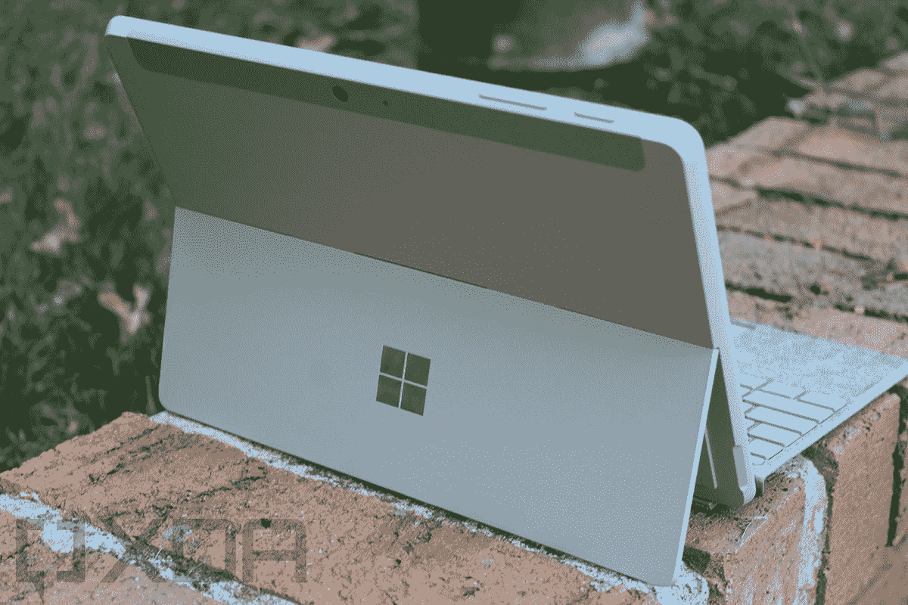

# Surface Pro 9 vs Surface Go 3:所有的区别和需要了解的内容

> 原文：<https://www.xda-developers.com/surface-pro-9-vs-surface-go-3/>

如果你打算在 2022 年购买一款新的搭载 Windows 11 的微软 Surface，你可能会遇到两款设备。有新的 [Surface Pro 9](https://www.xda-developers.com/surface-pro-9/) ，这是微软的旗舰二合一产品，具有最好的规格，还有 [Surface Go 3，](https://www.xda-developers.com/microsoft-surface-go-3-review/)微软最实惠的平板电脑。这些设备适合两种截然不同的受众的需求，但如果你想知道它们之间的比较，我们可以提供帮助。

在本指南中，我们将了解规格和价格、性能、显示屏、设计、网络摄像头、连接性等更多内容。我们会将这两款设备并排放置，帮助您决定哪一款 Surface 最适合您。

**浏览这篇文章:**

## Surface Pro 9 与 Surface Go 3 的规格和价格

|  | 

Surface Pro 9

 | 

Surface Go 3

 |
| --- | --- | --- |
| **处理器** | 

*   Surface Pro 9:消费者:**–**第 12 代英特尔酷睿 i5-1235U 处理器**–**第 12 代英特尔酷睿 i7-1255U 处理器选件，存储容量为 256 GB 及以上，基于英特尔 Evo 平台
*   Surface Pro 9 商用:**–**第 12 代英特尔酷睿 i5-1245U 处理器**–**第 12 代英特尔酷睿 i7-1265U 处理器选件，存储容量为 256 GB 及以上，基于英特尔 Evo 平台
*   Surface Pro 9 配 5G:微软 SQ 3 处理器

 | 

*   双核英特尔奔腾金色 6500Y 处理器
*   双核第十代英特尔酷睿 i3-10100Y 处理器

 |
| **图形** | 

*   在采用英特尔芯片的型号上:英特尔 Iris Xe 显卡
*   论 5G 与微软 SQ3 模式:微软 SQ3 Adreno 8CX Gen 3

 |  |
| **闸板** | 

*   Surface Pro 9: 8GB、16GB、32GB LPDDR5 内存
*   Surface Pro 9 配 5G: 8GB 或 16GB LPDDR4x RAM

 |  |
| **储存** | 

*   Surace Pro 9:可拆卸(SSD)选项:128GB、256GB、512GB、1TB
*   Surface Pro 9 带 5G:可拆卸(SSD)选项:128GB、256GB、512GB

 | 

*   eMMC 硬盘:64GB
*   固态硬盘:128GB

 |
| **显示** | 

*   13 英寸 PixelSense Flow (2880 x 1920)显示屏，最高 120Hz 刷新率，触摸屏，支持 Surface Pen

 | 

*   10.5 英寸 PixelSense 显示屏(1920 x 1280)，支持触控笔

 |
| **音频&麦克风** | 

*   surface Pro 9:**–**双远场录音室话筒 2W 立体声扬声器，支持杜比全景声和 VoiceClarity
*   带 5G 的 surface Pro 9:**–**带语音清晰度的双远场录音室话筒&Windows Studio Effects(Voice focus)
*   2W 立体声扬声器

 | 

*   带杜比音频的 2W 立体声扬声器
*   增强型双远场录音室话筒

 |
| **网络摄像头** | 

*   surface Pro 9:**–**Windows Hello face 认证摄像头(前置)前置摄像头 1080p 全高清视频+1000 万像素后置自动对焦摄像头 1080p 高清 4k 视频
*   Surface Pro 9 带 5G:**–**Windows Hello face 认证摄像头(前置)带 1080p 全高清视频的前置摄像头&Windows Studio Effects(portrait blur、自动取景、眼神交流)+1080 p 高清 4k 视频的 10.0MP 后置自动对焦摄像头

 | 

*   500 万像素前置摄像头，支持 1080p 高清视频
*   800 万像素后置自动对焦摄像头，支持 1080p 高清视频

 |
| **生物认证** |  |  |
| **电池** | 

*   所有型号均配备 47.7 瓦时电池

 | 

*   标称电池容量(WH) 28.0

 |
| **端口** | 

*   Surface Pro 9:**–**2 个 USB-C 带 USB 4.0/Thunderbolt 4**–**1 个 Surface 连接端口**–**1 个 Surface 键盘端口
*   Surface Pro 9 配 5G:**–**1 个 nano SIM**–**2 个 USB-C 3.2**–**1 个 Surface Connect 端口**–**1 个 Surface 键盘端口

 | 

*   1 个 USB-C
*   3.5 毫米耳机插孔
*   1 个表面连接端口
*   表面型盖端口
*   MicroSDXC 读卡器
*   LTE Advanced: Nano SIM 卡托盘

 |
| **连通性** | 

*   surface Pro 9:**–**Wi-Fi 6E:802.11 ax 兼容**–**蓝牙无线 5.1 技术
*   Surface Pro 9 配 5G:**–**Wi-Fi 6E:802.11 ax 兼容**–**蓝牙无线 5.1 技术**–**位置:GPS、Glonass、Galileo、北斗支持**–**NanoSIM、eSIM11 支持 5G

 | 

*   Wi-Fi 6: IEEE 802.11 a/b/g/n/ac/ax 兼容蓝牙
*   无线 5.0 技术
*   LTE Advanced:高通骁龙 X16 LTE 调制解调器
*   LTE Advanced:最高 600 Mbps LTE Advanced3，支持 nanoSIM。支持的频段:1、2、3、4、5、7、8、12、13、14、19、20、25、26、28、29、30、38、39、40、41、66
*   LTE Advanced:辅助 GPS 和 GLONASS 支持
*   LTE Advanced: eSIM 支持

 |
| **颜色** | 

*   颜色:铂金色、石墨色、蓝宝石色、森林色(石墨色、蓝宝石色和森林色仅在 Wi-Fi SKU 上提供)

 |  |
| **尺寸(WxDxH)** | 

*   Surface Pro 9 尺寸:11.3 x 8.2 x 0.37 英寸
*   Surface Pro 9 搭配 5G 尺寸:11.3 x 8.2 x 0.37 英寸

 |  |
| **重量** | 

*   Surface Pro 9 重量:1.94 磅(879 克)
*   5G 重的 surface Pro 9:1.95 磅(883 克)毫米波，或 1.94 磅(878 克)Sub

 | 

*   无线网络:1.2 磅(544 克)
*   LTE 高级版:1.22 磅(553 克)

 |
| **价格** |  |  |

## 性能:Surface Pro 9 胜出

如果你想要一个性能最好的 Surface，你很难不选择 Surface Pro 9。Surface Go 3 是一个用于日常网络浏览的伟大系统，但当你与 Surface Pro 9 相比时，它的动力非常不足。这是因为 Surface Pro 9 配备了英特尔最新、最棒的第 12 代酷睿处理器。Surface Go 3 的双核奔腾或酷睿 i3 处理器要慢得多。Surface Go 3 仍采用较旧的英特尔高清显卡，但 Surface Pro 9 采用了英特尔的 Iris Xe 显卡，使其成为轻度游戏甚至照片编辑的更好机器。

在讨论处理器时，让我们先来看看更好的设备。Surface Pro 9 拥有所谓的英特尔 U 系列芯片。这些芯片的运行功耗为 15 瓦，受益于高性能和高效率内核。事实上，Surface Pro 9 的顶级芯片英特尔酷睿 i7-1255U 处理器共有 10 个内核，其中两个用于提高性能，八个用于提高效率。这有助于您获得良好的电池续航时间，以及在运行大量浏览器标签或执行轻度视频编辑或轻度游戏等操作时的良好性能。这是一台出色的机器，可以完成超出基本生产力的任务。

另一方面，Surface Go 3 拥有更低端的奔腾或酷睿 i3 处理器。该 CPU 是双核的，但没有性能或效率内核。我们建议不要购买英特尔奔腾型号的 Surface Go 3，因为如果你打算超越基本的网络浏览和在网络浏览器中摆弄四个左右的标签，这不是一个好的 CPU。如果你想要一台 Surface Go 3，Core i3 型号是你想要购买的型号，因为它的功能更强大。即便如此，它仍然不如 Surface Pro 9 的酷睿 i7 或酷睿 i5 第 12 代 CPU。

我们还想讨论 RAM 和存储。Surface Pro 9 配备了 8GB、16GB 或 32GB 的内存。与此同时，Surface Go 3 的最大容量只有 8GB。如今，网页变得越来越复杂，应用程序会占用你系统的大量内存。内存越多越好，所以很难建议 Surface Go 3，因为低内存会降低它的速度。仓库呢？Surface Go 3 在基本型号上有较慢的 eMMC 存储，但在高端型号上有传统的固态硬盘。我们从不建议购买带有 eMMC 存储的电脑。更新和启动会很慢。Surface Pro 9 在所有这些方面都在 Surface Go 3 之上。

## 显示屏:Surface Pro 9 的显示屏更大更好

与性能一样，显示器也大不相同。两者都调整到 3:2 的纵横比，并支持 Surface Pen，但 Surface Go 3 的显示屏更多的是为了紧凑和便携。与此同时，Surface Pro 9 更多的是复杂的显示技术。考虑到这一点，Surface Pro 9 的显示屏更好。但是让我们再深入一点，好吗？

Surface Pro 9 的分辨率为 2880 x 1920，分辨率要高得多。它也更大，让您有更多的空间进行多任务处理，并且具有更高的 120Hz 刷新率，这将有助于网页更好地滚动，让 Windows 11 感觉更生动。哦，对艺术家来说，Surface Pro 9 支持触觉，所以当你沿着屏幕摩擦 Surface Pen 2 时，你会有一种笔到纸的感觉。

Surface Go 3 的显示屏要小得多，只有 10.5 英寸，分辨率只有 1920 x 1280。对于艺术家和任何喜欢多任务处理的人来说，即使采用 3:2 的宽高比，显示器也会很快变得拥挤。屏幕也不支持 Surface Pen 的触觉反馈。

显示器旁边的扬声器呢？这两款都是 2W 立体声扬声器，配有杜比音效。然而，Surface Pro 9 增加了杜比 Atmos 语音清晰度，以实现更好的语音通话。

## 设计:Surface Go 3 便携，但 Surface Pro 9 色彩更丰富

对于这些二合一设备的整体设计，有两点需要提前注意。Surface Go 3 是一款更小、更便携的设备。与此同时，Surface Pro 9 更大，有多种颜色。在这一点上，你需要选择什么对你更重要。

总的来说，Surface Go 3 是最小的 Windows 二合一设备之一。它只有 9.6 x 6.9 x 0.33 英寸，重 1.22 磅。如果你将它与 11.3 x 8.2 x 0.37 英寸和 1.94 磅的 Surface Pro 9 进行比较，你就会感觉到差异。

除了这些尺寸，Surface Go 3 在屏幕周围有更厚的边框，但四个角都是平的。它有点类似于更新的 iPad Air。与此同时，Surface Pro 9 的屏幕更具沉浸感，两侧有细长的边框，屏幕顶部和底部有一个小唇。我们会让你决定哪一个对你最重要。

论颜色，嗯，Surface Pro 9 色彩更丰富。它有铂金、石墨、蓝宝石和森林色。(不过，石墨、蓝宝石和森林仅在 Wi-Fi SKU 上提供。)Surface Go 3 稍微平淡一些，因为它只有铂金或石墨两种材质。

## 网络摄像头、端口和连接:Surface Go 3 有一个 microSD 插槽和一个耳机插孔

如果你在购买 Surface Go 3 或 Surface Pro 9 时考虑网络摄像头、端口和连接，那么好消息是这两款机器几乎是平等的。唯一不同的是，Surface Go 3 受益于 microSD 卡插槽和耳机插孔，而 Surface Pro 9 受益于可选的 5G 和 Thunderbolt 4 连接。这两个系统都有很棒的 Windows Hello 前置网络摄像头，尽管 Surface Pro 9 可以用后置网络摄像头录制 4K 视频，而 Surface Go 3 不能。

不过，Surface Pro 9 有两个 USB-C Thunderbolt 4 端口，以及一个 Surface Connect 端口。Thunderbolt 4 非常适合那些想要快速数据传输速度和支持 eGPUs 的人。Surface Go 3 只有一个 USB-C 口，所以不能支持那些东西。不过，它增加了一个耳机插孔和 microSD 插槽，用于存储扩展。如果耳机插孔和存储扩展对你来说很重要，那么 Surface Go 3 更好。

在连接方面，两款设备都很棒。Surface Pro 9 的 Wi-Fi 6E 更快，但 Surface Go 3 的 Wi-Fi 6 更慢。两款 Surface 设备都支持蜂窝数据，Go 3 采用 LTE advanced 型号，Pro 9 采用微软 SQ3 型号，采用基于 Arm 的芯片，支持 5G。根据您所在的地区，您可能无法使用 5G，但 Pro 9 也可以使用 4G LTE。

## 最后的想法

2022 年，我们发现很难建议 Surface Go 3 对抗 Surface Pro 9。Surface Go 3 确实是一款非常棒的设备，适合那些想要一款真正便携的廉价平板电脑来完成基本任务的人，但 Surface Pro 9 在很多方面都要好得多。当然，金钱意味着一切，所以如果你预算有限，你也会喜欢 Surface Go 3，因为它很便宜。但如果你想挥霍一笔买一台[更强大的电脑](https://www.xda-developers.com/best-windows-tablets/)，Surface Pro 9 是最好的。

 <picture></picture> 

Microsoft Surface Go 3

##### 微软 Surface Go 3

Surface Go 3 是微软推出的一款出色的二合一设备，满足基本的计算需求，但除此之外就没什么了。

 <picture></picture> 

Surface Pro 9 (Wi-Fi Model)

##### Surface Pro 9 (Wi-Fi 机型)

Surface Pro 9 是一款采用英特尔或高通处理器的顶级 Windows 平板电脑，它首次拥有多种颜色。

 <picture></picture> 

Surface Pro 9 5G

##### Surface Pro 9 5G

5G 版 Surface Pro 9 由新的微软 SQ3 芯片组提供支持，并具有 120Hz 的显示屏。