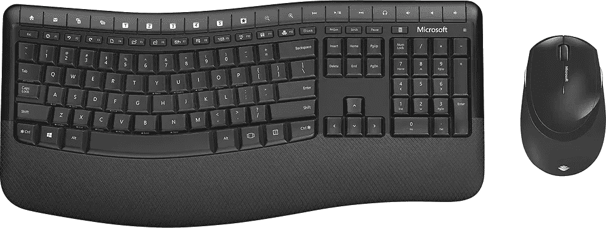

# 2023 年最佳 Surface Pro X 配件

> 原文：<https://www.xda-developers.com/surface-pro-x-accessories/>

# 2023 年最佳 Surface Pro X 配件

在这本购买指南中，我们来看看最好的 Surface Pro X 配件，包括笔、外壳、鼠标等等。

微软选择不完全重新设计 2021 年的 Surface Pro X，而是让 [Surface Pro 8](https://www.xda-developers.com/surface-pro-8-review/) 在设计上更接近它的表亲。但 Surface Pro X 确实做了一些改进，仍然是一款外观很棒的设备。如果你最近买了一台新的 Surface Pro X，你将需要一些配件来充分利用它。微软没有将键盘盖或笔与新的 Surface 设备捆绑在一起，所以你首先要考虑你是否需要这些东西。您可能还需要一个外部鼠标或键盘，以便在旅途中使用，以及一个可以随身携带的袖套或包。在本文中，我们将收集每个类别中最好的微软 Surface Pro X 配件。

我们从快速查看笔选项开始。你当然可以全力以赴，拿起新的微软 Slim Pen 2，它比原来的 Slim Pen 有一些关键的改进。然而，如果你的预算更紧，看看我们从百思买和亚马逊选择的一些第三方选项。有许多笔是专为微软标准设计的，仍然可以与 Surface Pro X 配合使用。

在决定了一支笔之后，我们将深入研究 Surface Pro X 可用的最佳键盘盖、外部键盘、鼠标和袖子/袋子。即使你不想变得超级花哨，当你随身携带这款美丽的设备时，你至少应该拿起一个袋子或袖子进行保护。

## 最佳 Surface Pro X 配件:笔

*   <picture></picture>

    Surface Pen

    ##### Surface Pen

    如果你想要一个更便宜的替代品，并且不需要 Surface Slim Pen 的专用收纳，这是一个很棒的选择。你经常可以找到折扣很大的原装 Surface Pen，它提供了大多数相同的功能。

*   <picture></picture>

    Tesha Surface pen

    ##### Tesha Surface pen

    售价不到 30 美元，Tesha Surface pen 几乎拥有微软版本提供的一切。它有 1，024 个压力点，专为书写、绘图和笔记而设计。即时响应，低延迟，真正准确的笔迹再现。手掌拒绝技术让你在书写时，手自然地搁在屏幕上，无需戴防摩擦手套。对孩子来说超级方便。

*   <picture></picture>

    laza rite M Pen

    ##### laza rite M Pen

    laza rite M Pen 的伟大之处在于它支持微软 Pen 协议——因此它可以在 Surface Pro X 上工作——但也支持 Wacom AES。您可以在几乎任何带笔支持的 Windows 笔记本电脑上使用它，此外，它有 4，096 级压力，并支持倾斜，以获得更自然的绘画体验。

*   <picture></picture>

    戴尔高级有源手写笔

    ##### 戴尔高级有源手写笔

    戴尔高级有源手写笔功能灵活，支持多种协议，可选择戴尔 2 合 1 设备，并配有兼容 Windows Ink 的显示屏。通过单击顶部按钮快速启动 OneNote，并写笔记(即使在锁定的屏幕上)，捕捉屏幕截图或激活 Cortana。使用侧边按钮有效地擦除或启动上下文菜单。安装 Windows Ink Workspace 以根据您的需要自定义按钮。

*   <picture></picture>

    惠普可充电 MPP 2.0 倾斜笔

    ##### 惠普可充电 MPP 2.0 倾斜笔

    惠普可充电 MPP 2.0 倾斜笔是一款支持 Surface Pro X 的圆滑笔，支持 4096 级压力和倾斜。它使用可充电电池，并有一个 LED 环形灯，当电池电量低时会显示，所以你不必担心错过任何一拍。

## 最佳 Surface Pro X 配件:袖子和包包

*   <picture></picture>

    Kinmac 360 笔记本电脑保护套

    ##### Kinmac 360 笔记本电脑保护套

    Kinmac 360 度笔记本电脑保护套提供多层次全方位保护，确保您的设备安全。此外，它有多种不同的款式可供选择，你可以选择自己喜欢的款式。

*   <picture></picture>

    NIDOO 14 英寸笔记本电脑套

    ##### NIDOO 14 英寸笔记本电脑套

    颜色选择在任何配件上都很有趣，但 Chromebook 的外壳往往大多是黑色或灰色的。NIDOO 14 英寸笔记本电脑保护套有多种颜色，因此您可以表达您的个人风格，同时保护您的 Surface Pro X。

*   <picture></picture>

    Case 逻辑便携包

    ##### Case 逻辑便携包 13/14

    如果你需要为你的 Surface Pro X 在随身携带时提供额外的保护，这个套筒上的硬壳正好可以做到这一点。同时，内部柔软，可以吸收笔记本电脑移动时产生的任何冲击。

*   <picture></picture>

    尤尼卡真皮袖套

    ##### 尤尼卡真皮笔记本袖套

    对于那些想要优雅袖套的人来说，Unika 有很好的颜色选择。这款保护套采用超薄设计，可容纳 13-15 英寸的 Chromebooks。

*   <picture></picture>

    城市装甲护具套

    ##### 城市装甲护具套

    需要一点更强硬的保护吗？UAG 笔记本电脑套可能只适合你，它有一个坚硬的防风雨外壳和一些额外的附件空间。无论有没有把手，你都可以得到它。

## 最佳 Surface Pro X 配件:鼠标

*   <picture></picture>

    罗技 Ergo M575

    ##### 罗技 ERGO M575

    罗技的 M570 具有鲜明且可立即辨认的外形。使用鼠标时，很容易发现巨大的蓝绿色轨迹球。如果你在工作中经常滚动屏幕，并且觉得轨迹球很舒服，这是目前最好的选择。这是长时间使用最舒适的鼠标之一。

*   <picture></picture>

    罗技 MX Master 3S

    ##### 罗技 MX Master 3S

    罗技 MX Master 系列是鼠标应有的行业标准。超快 mag 速度滚动，人体工程学设计和应用程序特定的定制使这一超优质的选择。凭借 USB-C 快速充电和在玻璃表面工作的能力，这是一款可以在任何地方使用的鼠标。

*   <picture></picture>

    罗技 M510

    ##### 罗技 M510

    罗技在鼠标方面显然有几种选择。M510 之所以脱颖而出，是因为它一直被评为电池续航时间冠军。用户报告一次充电平均使用一年或更长时间。凭借舒适的设计和低于 25 美元的价格，这是一个很好的选择。

*   <picture></picture>

    诺瑞塔弧形鼠标

    ##### 诺瑞塔弧形鼠标

    微软的弧形鼠标设计有很多粉丝幸运的是，你可以享受所有伟大的设计元素，而不必倾家荡产。如果你喜欢微软鼠标的设计，NORMIA RITA Arc 鼠标是一个很好的替代品，价格不到一半。

*   <picture></picture>

    Anker 立式人体工学鼠标

    ##### Anker 立式人体工学鼠标

    另一种流行的外形是立式鼠标设计。许多用户发现这是长时间使用鼠标最舒适的方式，因为它让您的手腕得到更自然的休息。

## 最佳 Surface Pro X 配件:键盘

*   <picture></picture>

    微软蓝牙键盘黑色

    ##### 微软蓝牙键盘黑色

    超薄、现代设计，超值。当您在 Windows 和 Office 365 中工作时，享受这种精致键盘的坚固耐用感。通过蓝牙无线连接到您的 windows 笔记本电脑。启用 swift Pair 后，开箱即可连接到您的 windows 10 或 11 PC。

*   <picture></picture>

    罗技 MX 机械

    ##### 罗技 MX 机械

    机械键盘受到很多 jeyboard 用户的青睐，主要是因为机械开关提供了更精确的致动和反馈，以获得更舒适的手感。对于生产力，罗技 MX 机械是最好的选择之一，有三种开关类型可供选择。

*   <picture></picture>

    微软舒适桌面 5050

    ##### 微软舒适桌面 5050

    如果您想要一个软件包中的完整桌面设置，本预算可能适合您。它包括一个键盘和一个鼠标，两者都被设计成在更长的时间内保持有机和舒适。键盘也有媒体键，使事情变得更容易。

*   <picture></picture>

    微软雕塑键盘

    ##### 微软雕塑键盘

    分离式按键设计有助于将手腕和前臂置于自然放松的位置。缓冲掌托提供支持，并促进一个中立的手腕位置。你还可以得到一个单独的数字键盘，非常适合电子表格工作。

*   <picture></picture>

    罗技 K380

    ##### 罗技 K380 键盘

    如果你希望你的键盘在桌面上占用更少的空间，可以考虑罗技 K380。这款小巧的无线键盘还提供了同时支持多达三个设备的轻松切换功能。这种键盘几乎可以在任何操作系统上使用，包括 Windows。

这些是我们为你的笔记本电脑挑选的最好的笔、袖子、鼠标和键盘。如果你想在旅途中使用 Surface Pro X，Londo 皮革套是在随身携带时保护它的绝佳方式。对于那些预算紧张的人来说，[逻辑手提箱](https://shop-links.co/1754097099707864076?u1=97a8dd7d-3ecd-4051-839b-32c77b379777)是一个低价的好选择。让我们知道你在你最喜欢的[微软 Surface 设备](https://www.xda-developers.com/best-microsoft-surface-pcs/)上使用了哪些配件。