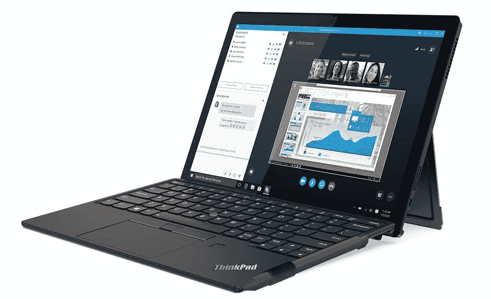
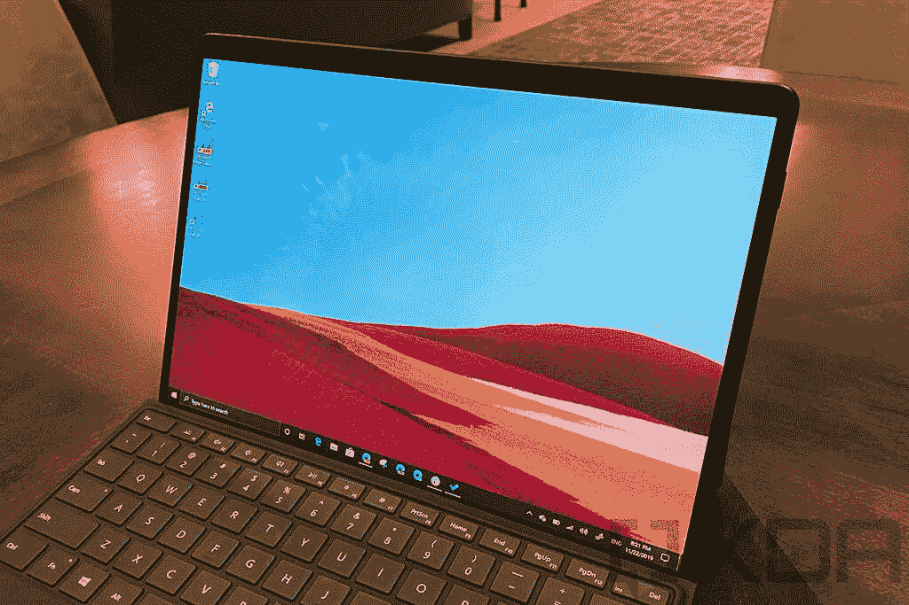
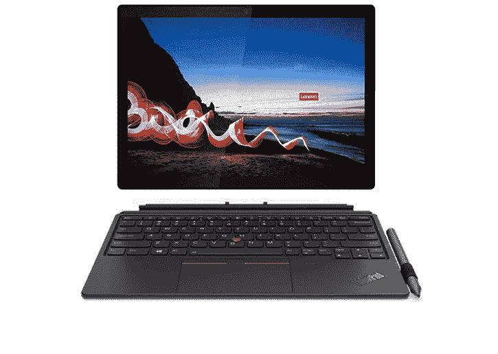

# Surface Pro X vs 联想 ThinkPad X12 可拆卸:哪个更好？

> 原文：<https://www.xda-developers.com/surface-pro-x-vs-lenovo-thinkpad-x12-detachable/>

选择新电脑总是一个艰难的决定。市面上有很多[神奇的笔记本电脑](https://www.xda-developers.com/best-laptops/)，几乎所有的笔记本电脑都有你可能更喜欢它们的理由。在不同设备之间做出选择并不容易，但我们随时准备为您提供帮助。我们将微软的 [Surface Pro X](https://www.xda-developers.com/surface-pro-x/) 与联想 ThinkPad X12 可拆卸平板电脑进行比较，这两款可拆卸平板电脑也可以用作笔记本电脑。

Surface Pro X 最近更新了 Wi-Fi 版本，但它本质上仍然是一款两年前的设备。相比之下，ThinkPad X12 可拆卸是在 2021 年推出的，采用高端组件。您可能已经能够猜到这将走向何方，但是让我们更仔细地看一看。

## Surface Pro X vs ThinkPad X12 可拆卸:规格

|  | 

Surface Pro X

 | 

联想 ThinkPad X12 可拆卸

 |
| --- | --- | --- |
| **处理器** | 

*   微软 SQ1(最高 3GHz，8 核)
*   微软 SQ2(最高 3.15GHz，8 核)

 | 

*   英特尔酷睿 i3-1110G4(最高 3.9GHz，双核)
*   英特尔酷睿 i5-1130G7(最高 4GHz，四核)
*   英特尔酷睿 i5-1140G7 博锐处理器(最高 4.2GHz，四核)
*   英特尔酷睿 i7-1160G7(最高 4.4GHz，四核)
*   英特尔酷睿 i7-1180G7(最高 4.6GHz，四核)

 |
| **图形** | 

*   肾上腺素 685 (SQ1)
*   安德烈诺 690(平方英尺)

 | 

*   英特尔 UHD 显卡(酷睿 i3)
*   英特尔 Iris Xe 显卡(酷睿 i5、i7)

 |
| **撞锤** |  |  |
| **存储** |  |  |
| **显示** | 

*   13 英寸 PixelSense (2880 x 1920)，触摸屏，支持表面笔

 | 

*   12.3 英寸全高清+ (1020 x 1280) IPS，触控，400 尼特，康宁大猩猩玻璃

 |
| **音频** | 

*   两个带杜比音频的 2W 立体声扬声器

 | 

*   两个 1W 立体声扬声器，带杜比音频

 |
| **网络摄像头** | 

*   500 万像素全高清前置摄像头
*   100 万像素全高清/4K 后置摄像头，带自动对焦功能

 | 

*   带隐私快门的 500 万像素前置摄像头
*   800 万像素后置摄像头

 |
| **生物认证** |  | 

*   Windows Hello 红外摄像机
*   可选:指纹识别器(在可选的键盘盖上)

 |
| **电池寿命** | 

*   长达 15 小时的典型设备使用时间

 | 42Wh 电池

*   长达 10.36 小时的电池续航时间(MobileMark 2018)

 |
| **端口** | 

*   2 个 USB 类型-C
*   1 个表面连接端口
*   可选:nano SIM 卡插槽

 | 

*   1 个 USB 类型 C 3.2 Gen 2(带电源传输和 DP 1.4)
*   1 个 Thunderbolt 4/USB 4 (USB Type-C)
*   3.5 毫米耳机插孔
*   弹簧针连接器
*   可选:nano SIM 卡插槽

 |
| **连通性** | 

*   Wi-Fi 5 +蓝牙 5.0
*   可选:LTE Advanced Pro(高通骁龙 X24)

 | 

*   Wi-Fi 6 (2x2) +蓝牙 5.1(英特尔 Wi-Fi 6 AX201)
*   可选:LTE (Fibocom L850-GL，第 9 类)

 |
| **颜色** | 

*   白金卡(仅限 SQ2)
*   哑光黑色

 |  |
| **尺寸(WxDxH)** | 

*   11.3 x 8.2 x 0.28 英寸(287 x 208 x 7.3 毫米)

 | 

*   11.15 x 8.01 x 0.34 英寸(283.3 x 203.5 x 8.8 毫米)

 |
| **重量** | 

*   1.7 磅(774 克)(不包括键盘)

 | 

*   1.67 磅(760 克)(不包括键盘)

 |
| **起始价格** | $899.99 | 1，099.80 美元，包括键盘(各种型号) |

## 性能:Surface Pro X 老化速度很快

将 Surface Pro X 与任何现代设备进行比较注定是一场不公平的战斗，因为自 2019 年首次亮相以来，微软没有做太多更新平板电脑的工作。它在 2020 年发布了一个小更新，今年，它只是剥离了 LTE，使其更实惠。正因为如此，英特尔处理器现在在 Surface Pro X 中轻松击败了微软 SQ1 和 SQ2 处理器。唯一的例外是英特尔酷睿 i3 型号，我们可能不会推荐这两种型号。

以下是基于 GeekBench 测试分数的这些处理器的快速比较:

值得注意的一点是，这些英特尔处理器过去被称为 Y 系列，这意味着它们的功耗更低。这也意味着持续的性能将不如配备 15W 处理器的笔记本电脑，如英特尔酷睿 i5-1135G7。尽管如此，很容易看出这些处理器比高通的竞争对手要快得多。此外，借助英特尔 Iris Xe 显卡，集成显卡在 ThinkPad X12 上的速度也更快。

在内存和存储方面，两款平板电脑相当接近，每款都有 16GB 的最大内存，但需要注意的是，你需要选择英特尔酷睿 i5 处理器或更高的处理器才能在 ThinkPad 上获得该配置。在存储方面，两者的配置几乎相同，只是 ThinkPad X12 disable 最高可达 1TB，而 Surface Pro X 最高可达 512GB。

 <picture></picture> 

Lenovo ThinkPad X12 Detachable

最后，还有电池续航时间，这也是 Surface Pro X 取得第一场胜利的地方。微软承诺在“典型使用”下的电池续航时间可达 15 小时，而联想 ThinkPad X12 可拆卸根据 MobileMark 2018 的评级为 10.36 小时。这些是不同的测量，但 MobileMark 确实测试了典型的办公场景，所以差别应该不会太大。像微软 SQ2 这样基于 ARM 的处理器以其效率而闻名，所以这是有道理的。

## 显示

然而，Surface Pro X 轻松获胜的一个领域是显示屏。Surface Pro X 配备了分辨率为 2880 x 1920 的 13 英寸 PixelSense 显示屏，清晰度令人难以置信。此外，它还有 3:2 的高长宽比，无论是在横向还是纵向模式下，都能为您提供更大的表面积。屏幕自然支持触摸和 Surface Slim Pen，但该笔不包含在平板电脑中。

> Surface Pro X 拥有更清晰、更大的显示屏，以及更响亮的扬声器。

另一方面，联想 ThinkPad X12 disable 有一个 12.3 英寸的全高清+ (1920 x 1280)显示屏，这仍然很好，但远不及 Surface Pro X 的清晰度。它仍然是一个 IPS 面板，并受到康宁大猩猩玻璃的保护，所以它不会给你带来不好的体验，但如果你喜欢超高清屏幕，Surface Pro X 会更好。

另一方面，至少联想 ThinkPad X12 可拆卸包括联想主动笔，因此您可以立即绘制或记下笔记。

 <picture></picture> 

Surface Pro X

同样，Surface Pro X 提供了更好的音频体验，这要归功于双 2W 立体声扬声器和杜比音频。ThinkPad X12 可拆卸也有两个扬声器和杜比音频支持，但那些扬声器只有 1W 的功率，所以它们不会那么大声或身临其境。

至于摄像头，两款笔记本电脑都有 500 万像素的前置摄像头，带红外面部识别功能，但联想有一个隐私优势，因为相机包括一个隐私快门。在背面，Surface Pro X 利用了可以录制 4K 视频的 100 万像素摄像头，而 ThinkPad X12 则拥有 800 万像素的摄像头。这两款笔记本电脑都有双远场麦克风用于拾音，所以无论哪种方式，你都应该听起来很棒。

## 设计:ThinkPad X12 可拆卸有更多的端口

谈到设计，这两款平板电脑非常相似。两者都是平板电脑，你可以很容易地附加一个键盘作为笔记本电脑使用。它们的尺寸也相当接近，但由于屏幕更大，Surface Pro X 略高且更宽。然而，它也更薄，最终，两者都非常轻，Surface Pro X 的重量为 774 克，ThinkPad X12 的重量为 760 克。

这还不包括键盘，因为它是可拆卸的。值得指出的是，ThinkPad X12 disable 默认情况下也包括一个键盘，至少在联想网站上可以找到的配置上是这样。使用 Surface Pro X，需要额外支付键盘和笔的费用。除此之外，ThinkPad X12 的键盘重量为 340 克，厚度为 5.4 毫米。

另一方面，Surface Pro Signature 键盘的重量为 281 克(如果包括 Surface Slim Pen 2，则为 294 克)，厚度为 4.89 毫米。虽然 Surface Pro X 因此更加便携，但由于 ThinkPad X12 的尺寸更大，你可能会得到一个更坚固、更舒适的可拆卸键盘。

> *使用 Thunderbolt，可以轻松地在 ThinkPad X12 可拆卸设备上插入坞站、显示器和外部 GPU。*

然而，最大的区别在于港口。ThinkPad X12 由英特尔处理器提供支持，除了标准的 USB Type-C 端口和耳机插孔外，还支持 Thunderbolt 4。Surface Pro X 只有两个 USB Type-C 端口，外加一个 Surface Connect 端口，没有耳机插孔。

虽然 Surface Connect 提供了一些类似的功能，但它没有 Thunderbolt 那么多带宽，生态系统也小得多。你可以找到很多 Thunderbolt docks，但对于 Surface，你几乎只有 Surface Dock 2。

## 连接性:Surface Pro X 拥有更快的 LTE

对于移动工作人员来说，LTE 连接对于在不依赖 Wi-Fi 的情况下保持互联网连接非常重要。幸运的是，两款平板电脑都在一定程度上支持 LTE，但 Surface Pro X 应该会明显更快。它有一个高通骁龙 X24 调制解调器，支持 LTE Cat 20，下载速度高达 2Gbps，上传速度高达 316Mbps。此外，与只有 Wi-Fi 的版本相比，添加 LTE 通常只会增加 100 美元的平板电脑价格。

另一方面，ThinkPad X12 使用的是 Fibocom L850-GL 型号，支持 LTE Cat 9。这给了你高达 450Mbps 的下载速度，只有 50Mbps 的上传速度，这并不美妙。此外，不包括联想可能提供的任何折扣，它将在价格上增加约 200 美元(在撰写本文时，它实际上似乎只增加了 120 美元)。

除了蜂窝之外，ThinkPad X12 可拆卸式还提供更快的 Wi-Fi，这要归功于 Wi-Fi 6 支持，它还支持蓝牙 5.1。相比之下，Surface Pro X 仍然只有 Wi-Fi 5 和蓝牙 5.0。

## 结果

更仔细地比较 Surface Pro X 和联想 ThinkPad X12 disable，就很容易看出两者的不同之处，而且这些差异实际上非常显著。在我们看到的每个类别中，都有一个明显的赢家，这使得在两者之间进行选择变得更加容易。

如果你想要更好的 CPU 和 GPU 性能，或者如果 Thunderbolt 连接对你来说很重要，ThinkPad X12 disable 显然是合适的选择。性能差异很大，Thunderbolt 确实提供了比 Surface Connect 端口更多的连接选项。此外，ThinkPad X12 disable 已经包含了键盘和笔，购买 Surface Pro X 时需要额外付费。

另一方面，如果你想走这条路，微软的 Surface Pro X 有更清晰、略大的显示屏，更好的音频和更快的 LTE 速度。虽然它略大，但同样便携，当你考虑到附加的键盘和笔时，它实际上比联想的产品更轻。它还宣称电池续航时间更长，后置摄像头质量略高，所以这些也是很大的好处。

最终，您的偏好将决定哪一个选项是最好的，但一种设备相对于另一种设备的优势比许多其他比较更明显，因此选择应该很容易做出。你可以通过下面的链接购买这两款平板电脑。

不找平板？我们也有一份最好的联想 ThinkPads 列表，如果你想买别的，可以看看。

 <picture></picture> 

Surface Pro X

##### 微软 Surface Pro X

Surface Pro X 是一款基于 ARM 的高端平板电脑，在轻薄的设计中提供了出色的性能和电池续航时间。它现在只有 Wi-Fi 模式。

对于 Surface Pro X，还可以购买 [Surface Pro 签名键盘搭配 Surface Slim Pen 2](https://shop-links.co/1753327328260645680?u1=8a4af086-def4-4301-91fe-59bd75044e4e) 完成体验。

 <picture></picture> 

Lenovo ThinkPad X12 Detachable

##### 联想 ThinkPad X12

联想 ThinkPad X12 disable 是一款重量轻、功能强大的英特尔架构平板电脑，带有一个可以随时连接的键盘。