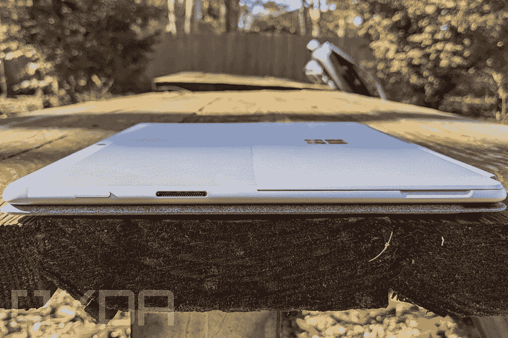

# Surface Pro X vs 三星 Galaxy S7+:哪款平板称雄？

> 原文：<https://www.xda-developers.com/surface-pro-x-vs-samsung-galaxy-s7-plus/>

当然，如果你正在寻找一台平板电脑来取代你的个人电脑，还有其他几个选项值得考虑。三星 Galaxy Tab S7+是目前你能买到的最好的 Android 平板电脑，它拥有漂亮的屏幕、固态扬声器和轻薄的设计。虽然两款平板电脑在一些关键领域相似，但它们也运行不同的操作系统，面向不同的细分市场。

在这次比较中，我们将了解这些平板电脑的组合情况，并讨论哪一款最适合您的使用情形。这是 Surface Pro X vs 三星 Galaxy Tab S7+。

| 规格 | Surface Pro X | 三星 Galaxy Tab S7+ |
| --- | --- | --- |
| **尺寸&重量** | 

*   11.3 x 8.2 x 0.28 英寸(287.02 x 208.28 x 7.3 毫米)
*   1.7 磅(774 克)

 | 

*   285.0 毫米(宽)x 185.0 毫米(高)x 5.7mm 毫米(深)
*   1.27 磅(575 克)(Wi-Fi、LTE、5G)

 |
| **显示** | 

*   13 英寸 PixelSense Flow (2880 x 1920)显示屏
*   高达 120Hz 的刷新率、触摸、Surface Pen 支持

 | 

*   12.4 英寸
*   2800×1752 (WQXGA+)
*   超级 AMOLED
*   120 小时

 |
| **处理器** | 

*   微软 SQ1(最高 3GHz，8 核)
*   微软 SQ2(最高 3.15GHz，8 核)

 | 

*   高通骁龙 865 Plus

 |
| **内存&存储** | 

*   8 或 16GB 内存
*   128GB、256 GB 或 512 GB 存储

 | 

*   6GB LPDDR5 内存+ 128GB UFS 3.0 存储
*   8GB LPDDR5 内存+ 256GB UFS 3.0 存储
*   可扩展存储(高达 1TB microSD)

 |
| **图形** | 

*   肾上腺素 685 (SQ1)
*   安德烈诺 690(平方英尺)

 |  |
| **电池和充电** | 

*   长达 15 小时的典型设备使用时间

 | 

*   10090 毫安时
*   45W 超级快充

 |
| **网络摄像头** | 

*   500 万像素全高清前置摄像头
*   100 万像素全高清/4K 后置摄像头，带自动对焦功能

 | 

*   后置摄像头:1300 万 f/2.0 主+500 万 f/2.2 超宽，LED 闪光灯。
*   前置摄像头:800 万像素 f/2.0

 |
| **颜色** | 

*   白金卡(仅限 SQ2)
*   哑光黑色

 | 

*   神秘的青铜色，神秘的银色，神秘的黑色，神秘的藏青色。

 |
| **端口** | 

*   2 个 USB 类型-C
*   1 个表面连接端口
*   nano SIM 卡插槽

 | 

*   USB 类型-C，3.2 第 1 代，DP 输出

 |
| **音频** | 

*   两个配有杜比全景声的 2W 立体声扬声器

 | 

*   四声道扬声器
*   AKG 调音，杜比全景声

 |
| **连通性** | 

*   Wi-Fi 5 +蓝牙 5.0
*   可选:LTE Advanced Pro(高通骁龙 X24)

 | 

*   5G、LTE、Wi-Fi 6 (802.11 a/b/g/n/ac/ax)
*   Wi-Fi 直连，蓝牙 5.0

 |
| **软件** | Windows 11 | 安卓 11 |
| **其他特性** | 

*   Microsoft Surface 键盘支持
*   Surface 超薄笔 2 支持

 | 

*   显示不足的指纹扫描仪
*   电源按钮中的指纹扫描仪
*   三星 S-pen 支持
*   三星 DeX 支持。

 |

## Surface Pro X vs 三星 Galaxy Tab S7+:设计和制造

Surface Pro X 设计精美，平板电脑正面周围有相对较薄的边框。虽然 Surface Pro X 的重量不算太重，只有 1.7 磅，但作为手持设备长时间使用有点太重了。为此，如果你主要关心的是便携性，你可能会更喜欢 Galaxy Tab S7 +-它轻得多，只有 1.27 磅。Tab S7+的屏幕也略小，这是另一个让它更容易用作真正的平板电脑的东西。

然而，标签 S7+要轻得多。如果你主要将它用作手持设备，你会感觉到它的重量，285 毫米高，185 毫米宽，如果没有外壳，它仍然不是最舒适的东西。如果你选择 S7+的话，我们强烈建议你购买三星官方的键盘盖。三星对软件做了一些调整，这样键盘可以被拆分或变成浮动键盘，但你会想要一个键盘盖——否则太不舒服了。虽然 Galaxy Tab S7 Plus 的大部分都很时尚，但 S Pen 在背面的位置是有问题的，老实说，非常不雅观。使用相对较强的磁铁，S Pen 会自动附着在背面。连接到一个融入相机外壳的扩展磁化区域，这可能是三星能做的最好的事情，但它不是最时尚的事情。

Surface Pro X 在端口部门胜出，因为 Surface Pro X 具有两个 USB-C 端口。不幸的是，这两款平板电脑都选择移除 3.5 毫米耳机插孔。如果你更喜欢用有线耳机听音乐，你必须去别处看看或处理 USB-C 耳机，这使得在听音乐的同时给设备充电更加困难。虽然这两款平板电脑都有令人愉悦的设计美学，但 Surface Pro X 看起来更现代，边框更薄。Surface Pro X 上的相机外壳看起来也更加统一，这是一个小细节，但绝对是你在日常使用中会注意到的东西。

## Surface Pro X vs 三星 Galaxy Tab S7+:显示

三星以其惊人的显示质量而闻名，他们似乎在这场战斗中占据优势。没有其他方式可以表达 Galaxy Tab S7 Plus 令人惊叹，显示器在视觉上令人惊叹。苹果喜欢吹捧像视网膜显示屏这样的营销术语，但 Galaxy Tab S7 Plus 上的 12.4 英寸 Super AMOLED 显示屏自成一派。在 1752 x 2800 像素和 16:10 纵横比的情况下，显示器“仅”提供每英寸 266 像素的密度，但就像百万像素不是相机的唯一决定因素一样，Galaxy Tab S7 Plus 显示器的质量在 Android 平板电脑中首屈一指。该显示器支持 HDR 10+并提供 120 赫兹的刷新率，实现超级平滑的滚动。三星在这款平板电脑上安装了内置指纹扫描仪，尽管由于显示屏尺寸的原因，使用起来可能有点尴尬。当然，你也可以用三星的捆绑 S-Pen 在 Tab S7+上做笔记或者画画。

使用 Surface Pro X，你可以获得采用 PixelSense 技术的高分辨率屏幕，但它没有 Galaxy Tab S7+和新 Surface Pro 8 上的更高的 120Hz 刷新率。如果你使用平板电脑阅读或浏览网站和社交媒体，更高的刷新率实际上是一个相当重要的因素。屏幕看起来仍然很棒，对于户外观看来说足够亮，但这些东西在三星平板电脑上也很棒。值得庆幸的是，如果你使用的是墨迹，Surface Pro X 可以使用新的 Surface Slim Pen 2。在 S7+上记笔记很好，但有了一个笔记和这个新的笔功能，Surface Pro X 是记笔记的更好选择。

两款平板电脑都有令人惊叹的显示屏，但 Surface Pro X 可能是真正提高工作效率的更好选择。新的超薄笔 2 为在平板电脑上记笔记和绘图提供了无与伦比的体验。虽然 S-Pen 方便直观，但它不太适合专业使用。如果您只是对消费媒体、游戏和简单的网络浏览感兴趣，您肯定会对这两种显示器感到满意。

## Surface Pro X vs 三星 Galaxy Tab S7+:性能

说到性能，这些机器有许多关键的不同之处。Surface Pro X 是一款 Windows 平板电脑，专为媒体消费和生产力而设计。然而，值得注意的是，使用 Surface Pro X，你是在与 ARM 处理器打交道，许多 Windows 应用程序仍然是为 x86 处理器设计的。这意味着您有时会通过仿真运行应用程序，这会对性能造成影响。不过总的来说，Surface Pro X 的性能应该总是更好。此外，值得一提的是，Windows 11 还通过仿真支持 64 位 x86 应用，所以你再也不用担心应用不兼容了。Surface Pro X 中的集成显卡也普遍比三星 Galaxy Tab S7+中的更强大。另一方面，三星 Galaxy Tab S7+是一款 Android 平板电脑，专注于观看视频、玩游戏以及偶尔的轻度生产力任务。牢记这些目标，Surface Pro X 在原始功率方面是一款更强大的平板电脑。

Tab S7+内部的骁龙 865+仍然能够令人难以置信地完成基本的平板电脑功能，可以处理任何你想玩的 Android 游戏。尽管如此，即使与其他 Android 平板电脑相比，Tab S7+也越来越老，感觉有点过时。事实上，骁龙 865+甚至不是安卓平板电脑的最新高通芯片。S7+标签已经有一年多的历史了，应该更新了，所以由于这个问题，它的性能肯定会更差。Surface Pro X 还提供了更多 RAM 和存储选项，分别高达 16GB 和 512GB。这两者都远远超过了三星 Galaxy Tab S7+所能提供的。TabS7+在任何配置下最高只能达到 256GB，但可以通过 microSD 添加最高 1TB 的可扩展存储空间。你也可以在 Galaxy Tab S7+上获得 5G，如果这是你真正关心的事情。

Surface Pro X 承诺最长 15 小时的典型使用时间，但像往常一样，这可能是考虑到最小的亮度和最轻的工作负载。如果您在更高的亮度下使用该设备或有更重的工作负荷，您可以预计平均接近 10-12 小时。根据大多数评论，Tab S7+的平均电池寿命约为 12 小时。要考虑的关键问题是，你可能会使用 Surface Pro X 来处理更严肃的工作，使用所有捆绑的微软功能，因此它消耗电池的速度可能会比看网飞或 YouTube 快一点。

## Surface Pro X vs 三星 Galaxy Tab S7+:摄像头和音频

相机是微软真正闪光的另一个领域。后置摄像头采用 10MP 传感器，支持 4K 视频。在正面，Surface Pro X 有一个 5MP 全高清摄像头。虽然以智能手机的标准来看，这听起来不算多，但以笔记本电脑和平板电脑的基准来看，这已经非常可观了。

Tab S7+上的双摄像头结合了主 1300 万像素广角传感器和 f/2.0 光圈，以及 500 万像素超宽传感器和 f/2.2 光圈。相机乍一看还行，但应该没人会为了它的相机买平板——请不要成为那个人。如今，前置摄像头无疑更加重要，尤其是对于视频通话之类的事情来说，8MP f/2.0 传感器可能也可以，尽管它仅限于全高清每秒 30 帧。如果你真的必须使用一个巨大的平板电脑来拍摄照片或视频，你会很高兴知道后置摄像头支持 4K 视频，也是每秒 30 帧。

在声音方面，Surface Pro X 采用了 2W 立体声扬声器，所以在硬件层面上，它们应该相当不错。Tab S7+也有出色的音频体验。由 AKG 调音的四声道扬声器声音洪亮、清晰，非常令人愉快。扬声器有更响亮的通知的额外好处，但你会想把它们关小，因为它们可能会压倒。如果你购买 Galaxy Tab S7 Plus 是为了享受媒体或听音乐，你不会失望的。

## 结论

这两款平板电脑比 Surface Pro 8 和 Tab S7+要接近得多，这并不是一场真正的公平竞争。尽管如此，如果你在寻找最好的媒体消费平板电脑，它可能是三星 Galaxy Tab S7+。它更轻，成本更低，并且有稍微好一点的扬声器的额外好处。您还可以享受谷歌 Play 商店上提供的所有游戏，因此 Tab S7+作为一款娱乐平板电脑非常引人注目。另一方面，在

[Surface Pro X is a better all-round machine](https://www.xda-developers.com/best-windows-tablets/)

。如果你需要一些东西来用作媒体平板电脑和真正的工作 PC，Surface Pro X 可以处理你扔给它的一切。除了性能稍好之外，尽管失去了 Surface Pro 8 和 Surface Laptop Studio 上的触觉反馈，但新的 Slim Pen 2 也让你获得了惊人的笔记体验。储物选项也更加丰富，您可以存放工作和娱乐所需的一切物品。如果你需要一台更强大的工作电脑，一定要试试

[Microsoft's other new Surface devices](https://www.xda-developers.com/best-microsoft-surface-pcs/)

.

### 三星 Galaxy Tab S7+

Galaxy Tab S7+是目前市场上最好的安卓平板电脑。没有多少人能接近 iPad Pro，但这是你能得到的最接近的了。强大的规格、优质的手感和出色的功能构成了一款旗舰平板电脑，让您付出旗舰价格。

**Affiliate Links**

Samsung

[View at Samsung](https://shop-links.co/link/?exclusive=1&publisher_slug=xda&article_name=Surface+Pro+X+vs+Samsung+Galaxy+S7%2B%3A+Which+tablet+reigns+supreme%3F&article_url=https%3A%2F%2Fwww.xda-developers.com%2Fsurface-pro-x-vs-samsung-galaxy-s7-plus%2F&u1=UUxdaUeUpU5375&url=https%3A%2F%2Fwww.samsung.com%2Fus%2Ftablets%2Ftab-s7%2Fbuy%2F%3FmodelCode%3DSM-T870NZKAXAR)

### 微软 Surface Pro X

Surface Pro X 是一款基于 ARM 的高端平板电脑，在轻薄的设计中提供了出色的性能和电池续航时间。它现在只有 Wi-Fi 模式。

**Affiliate Links**

Best Buy

[View at Bestbuy](https://shop-links.co/link/?exclusive=1&publisher_slug=xda&article_name=Surface+Pro+X+vs+Samsung+Galaxy+S7%2B%3A+Which+tablet+reigns+supreme%3F&article_url=https%3A%2F%2Fwww.xda-developers.com%2Fsurface-pro-x-vs-samsung-galaxy-s7-plus%2F&u1=UUxdaUeUpU5375&url=https%3A%2F%2Fwww.bestbuy.com%2Fsite%2Fsurface-pro-x-13-touch-screen-microsoft-sq1-8gb-memory-128gb-ssd-wifi-4g-lte-device-only-matte-black%2F6375623.p)