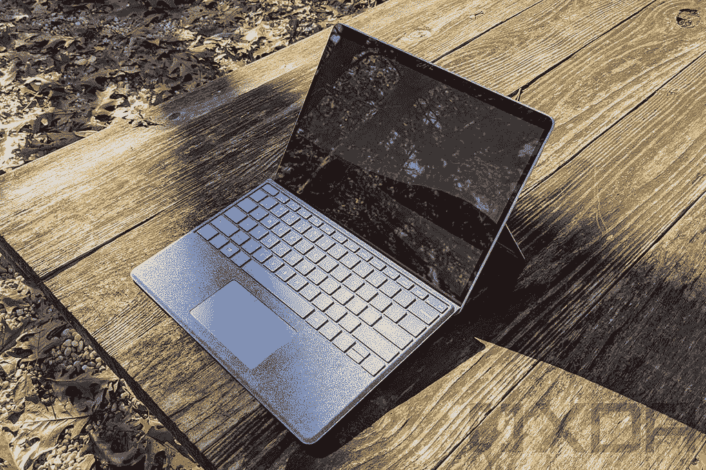
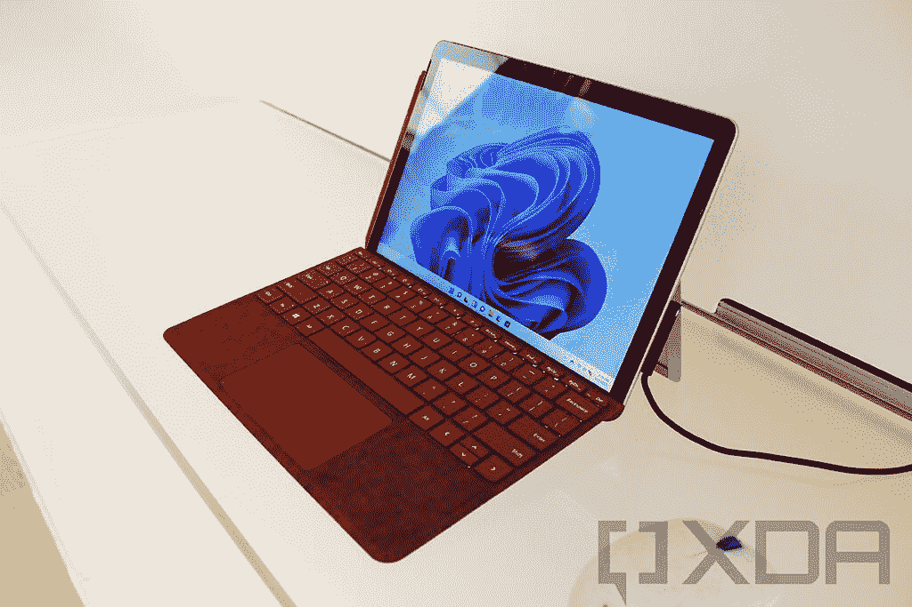
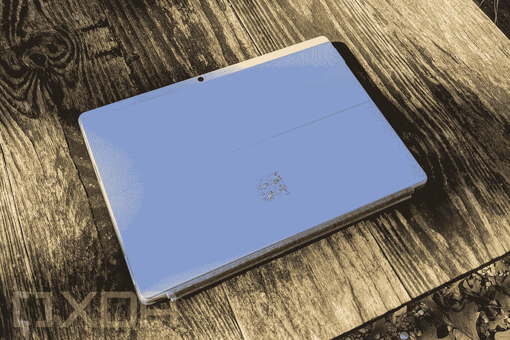
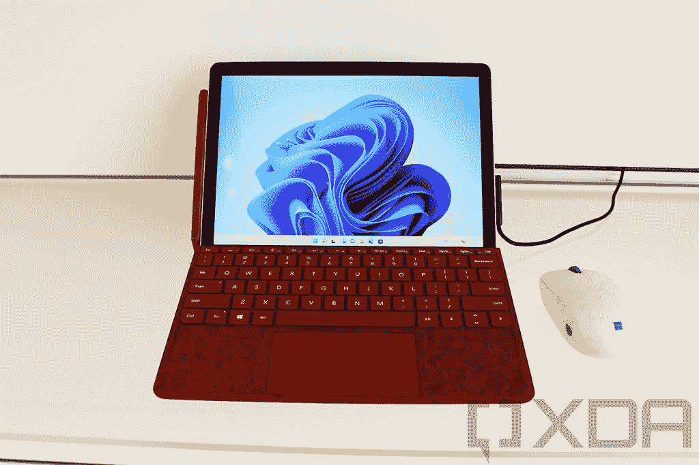

# Surface Pro X vs Surface Go 3:哪款平板电脑适合你？

> 原文：<https://www.xda-developers.com/surface-pro-x-vs-surface-go-3/>

微软的 [Surface 系列](https://www.xda-developers.com/best-microsoft-surface-pcs/)由一些很棒的设备组成，选择其中一个可能很难。不过，大多数 Surface 设备都有非常独特的外形，它们都是针对特定的细分市场。然而，当涉及到类似的外形因素时，比如新推出的 [Surface Go 3](https://www.xda-developers.com/surface-go-3/) 和 [Surface Pro X](https://www.xda-developers.com/surface-pro-x-2/) ，可能会有点困难。

然而，仅仅因为这两个都是可拆卸键盘的平板电脑，并不意味着它们没有不同。Surface Go 3 和 Surface Pro X 仍然面向不同类型的用户，你必须弄清楚哪一个最适合你。为了帮助您，我们将对这两款设备进行比较，这样您可以更容易地判断出您应该购买哪一款。

## Surface Go 3 vs Surface Pro X:规格

让我们先来看一下这两款器件的规格。这应该已经带来了一些显著的差异，但我们将在之后进行更仔细的研究。

|  | 

Surface Go 3

 | 

Surface Pro X

 |
| --- | --- | --- |
| **处理器** | 

*   英特尔奔腾金色 6500Y(最高 3.4GHz，双核)
*   英特尔酷睿 i3-10100Y(最高 3.9GHz，双核)

 | 

*   微软 SQ1(最高 3GHz，8 核)
*   微软 SQ2(最高 3.15GHz，8 核)

 |
| **图形** |  | 

*   肾上腺素 685 (SQ1)
*   安德烈诺 690(平方英尺)

 |
| **闸板** |  |  |
| **存储** |  | 

*   128GB 固态硬盘
*   256GB 固态硬盘
*   512GB 固态硬盘

 |
| **显示** | 

*   10.5 英寸 PixelSense (1920 x 1280)，触摸屏，支持表面笔

 | 

*   13 英寸 PixelSense (2880 x 1920)，触摸屏，支持表面笔

 |
| **音频** | 

*   两个带杜比音频的 2W 立体声扬声器

 | 

*   两个带杜比音频的 2W 扬声器

 |
| **网络摄像头** | 

*   500 万像素全高清前置摄像头
*   800 万像素全高清后置摄像头，带自动对焦功能

 | 

*   500 万像素全高清前置摄像头
*   100 万像素全高清/4K 后置摄像头，带自动对焦功能

 |
| **生物认证** |  |  |
| **电池寿命** | 

*   长达 10 小时的典型设备使用时间

 | 

*   长达 15 小时的典型设备使用时间

 |
| **端口** | 

*   1 个 USB 类型-C
*   1 个表面连接端口
*   3.5 毫米耳机插孔
*   microSD 读卡器
*   可选:nano SIM 托盘

 | 

*   2 个 USB 类型-C
*   1 个表面连接端口
*   nano SIM 卡插槽

 |
| **连通性** | 

*   Wi-Fi 6 +蓝牙 5.0
*   可选:LTE 高级版(高通骁龙 X16)

 | 

*   Wi-Fi 5 +蓝牙 5.0
*   可选:LTE Advanced Pro(高通骁龙 X24)

 |
| **颜色** |  | 

*   白金卡(仅限 SQ2)
*   哑光黑色

 |
| **尺寸(WxDxH)** | 9.65 x 6.9 x 0.33 英寸(245 x 175 x 8.3 毫米) | 

*   11.3 x 8.2 x 0.28 英寸(287 x 208 x 7.3 毫米)

 |
| **重量** | 

*   1.2 磅(544 克)(不包括键盘)

 | 

*   1.7 磅(774 克)(不包括键盘)

 |
| **起始价格** | $399.99 | $899.99 |

光是这些规格就应该告诉你，这些产品不适合同一类型的用户。仅起步价就显示出这些设备的受众存在明显差异，即使是最贵的 Surface Go 3 型号也比基础版 Surface Pro X 便宜。

## 性能:Surface Pro X 有一个 ARM 处理器

正如你根据价格差异所预期的那样，Surface Go 3 和 Surface Pro X 之间的性能有一些很大的差异。Surface Go 3 的两个型号都只有双核处理器，并且都有 7W 的最大 TDP(默认为 5W)。Surface Pro X 有一个八核处理器，其中四个是用于更高要求任务的性能核心，四个是用于较小后台任务的高效核心。

> 许多应用程序仍然没有被设计成在 Surface Pro X 内部的 ARM 处理器上运行，但它仍然更快。

然而，值得注意的是，使用 Surface Pro X，你是在与 ARM 处理器打交道，许多 Windows 应用程序仍然是为 x86 处理器设计的。这意味着您有时会通过仿真运行应用程序，这会对性能造成影响。不过总的来说，Surface Pro X 的性能应该总是更好。此外，值得一提的是，Windows 11 还通过仿真支持 64 位 x86 应用，所以你再也不用担心应用不兼容了。Surface Pro X 中的集成显卡也普遍比 Surface Go 3 中的更强大。

 <picture></picture> 

Surface Pro X

当我们看这些设备提供的 RAM 和存储量时，这一趋势仍在继续。Surface Go 3 开始只有 4GB 的内存，只够基本使用，没有太多的多任务处理。你可以升级到 8GB，这是 Surface Pro X 的基本配置。在 Pro X 上，你可以升级到 16GB，这已经给你带来了很好的体验。

至于存储，Surface Go 3 起步时只有 64GB 的空间，刚好能满足 Windows 11 的要求。此外，这是 eMMC 存储，比你的典型固态硬盘慢。你可以升级到 128GB 的固态硬盘，同样，这是 Surface Pro X 的基本配置。在该型号中，你可以一直升级到 512GB，使其更适合长期使用，特别是如果你想保存大量的学校项目或其他文件。

 <picture></picture> 

Surface Go 3

最后，还有电池寿命的问题，Surface Pro X 在这方面再次更好。微软宣称这款平板电脑的电池续航时间长达 15 小时，而 Surface Go 3 的电池续航时间为 10 小时。这是基于典型的设备使用情况，所以你的里程数可能会有所不同，但无论如何，Surface Pro X 显然在充电后的续航时间更长。这要归功于微软 SQ2 处理器，因为基于 ARM 的设备通常比 x86 设备更高效。

总而言之，Surface Go 3 便宜这么多的原因很明显，但这并不意味着它是一款糟糕的设备。如果你正在寻找这个预算范围内的东西，它仍然是一个很好的平板电脑，尽管如果可以的话，我们肯定会建议升级 RAM 和 SSD。Surface Pro X 提供了更高端的体验，这一点在接下来的几节中会变得更加明显。

## 显示:相似的形状，不同的尺寸

Surface Go 3 值得称赞的一点是它的显示屏长宽比为 3:2。Surface Pro X 和其他所有 Surface PC 也是如此，但这在 Surface Go 3 的价格范围内非常罕见。事实上，在 Surface Go 家族之外，你很可能在这个价位的任何其他 Windows PC 上都找不到这个。

这种高长宽比给你更多的工作空间，无论是横向还是纵向，都能带来更好的体验。此外，Surface Go 3 也不会为了价格而牺牲分辨率。这仍然是一个清晰的 10.5 英寸全高清+ (1920 x 1280)显示屏，对于这个价格的设备来说，这是非常棒的。

 <picture></picture> 

Surface Pro X

当然，Surface Pro X 大大增加了赌注，提供了真正的优质显示屏。它有一个更大的 13 英寸面板，分辨率更高，为 2880 x 1920，所以看起来自然会更好。更大的屏幕和更高的像素密度意味着您可以为打开的应用程序和文档获得更多空间，一切都将看起来更加清晰明了。当然，这两款笔记本电脑都支持触摸和 Surface Pen，因此在这方面你不会错。

在声音方面，这两款平板电脑相似。它们都有双立体声扬声器，都是 2W 单元。如果你在家里安静的环境中，这应该会给你足够可靠的听觉体验。

> 两款平板电脑都配有全高清网络摄像头，是所有 Windows 电脑中最好的。

谈到网络摄像头，这两款平板电脑都得益于全高清前置摄像头。这对于 Surface Go 3 来说尤其令人印象深刻，因为全高清网络摄像头在这个价格点上尤其罕见。然而，Surface Pro X 在后置摄像头方面确实有优势，与 Surface Go 3 的 800 万像素摄像头相比，后置摄像头为 10 万像素。这也意味着它可以录制高达 4K 分辨率的视频，而 Surface Go 3 则是全高清视频。这两款平板电脑都有双远场麦克风，应该可以为您提供出色的通话音频质量。

## 设计和端口:Surface Pro X 没有耳机插孔

这两款平板电脑都是轻薄设备，您可以随身携带。两者都在这方面做得很好，尽管 Surface Go 3 是两者中较小的一个。得益于更小的显示屏，它的宽度和高度都没有那么大，重量也更轻，只有 1.2 磅。然而，它比 Pro X 更厚。虽然 Surface Pro X 因为更大的显示屏而更大，但它的侧面挡板也更小，所以差异并没有想象中那么大。

你可能可以将 Surface Go 3 放在一个更小的包里，更小的屏幕也使它更适合作为一个独立的平板电脑，而 Surface Pro X 可能会有点难以管理，如果你把它拿在手中的话。当然，你不必这样做，因为两款平板电脑都有一个完全可调节的支架，并支持 Type Cover 附件(但 Type Cover 型号因设备而异)。同样值得注意的是，Surface Pro X 有两种颜色可供选择，而 Go 3 只有铂金色。

再来看看端口，两款平板电脑都没有给人留下深刻印象，但你可能会更喜欢这里的 Surface Go 3。它有一个 USB Type-C 端口、一个 Surface Connect 端口、一个 microSD 读卡器和一个 3.5 毫米耳机插孔。Surface Pro X 类似，除了不是耳机插孔，而是第二个 USB Type-C 端口。如果你有仍然使用 3.5 毫米连接器的耳机，在没有适配器的情况下，你不能与 Surface Pro X 一起使用它们。虽然这两款笔记本电脑在端口方面都有所限制，但 Surface Connect 端口确实允许您连接大量外围设备。

## 连通性

如果你希望在旅途中保持联系，Surface Go 3 和 Surface Pro X 都可以做到这一点，但需要通过可选的升级。Surface Pro X 过去只有 LTE 型号，但现在如果你想节省一些钱，你可以获得 Wi-Fi 版本。然而，你将获得的体验会有所不同。

> Surface Pro X 拥有更快的 LTE 调制解调器，但 Surface Go 3 支持更新的 Wi-Fi 标准。

如果你选择 LTE 型号，Surface Go 3 配有高通骁龙 X16 调制解调器，它承诺下载速度高达 1Gbps，上传速度高达 150Mbps。Surface Pro X 包括一个骁龙 X24，理论上可以达到 2Gbps 的下载速度和 316Mbps 的上传速度。两者都应该足以让你在旅途中保持连接，但如果你需要额外的速度，Pro X 更好一些。

相反，Surface Go 3 支持更新的 Wi-Fi 标准，特别是 Wi-Fi 6。Surface Pro X 仍然只兼容 Wi-Fi 5。对于许多用户来说，这可能不是什么大事，但对于这样一款高端设备来说，这是一个奇怪的牺牲。这两款设备都支持蓝牙 5.0。

 <picture></picture> 

Surface Pro X

## 结果

很明显，甚至在阅读所有这些之前，Surface Pro X 在规格方面是更好的设备。它的起价确实是 Surface Go 3 的两倍多，所以它不可能是任何其他方式。但这并不能抹杀 Surface Go 3 的价格仍然令人印象深刻的事实。

Surface Go 3 售价 399 美元，为日常使用提供了不错的性能，在这个价格上非常罕见的清晰的 3:2 显示屏，以及高质量的网络摄像头。它是浏览网页以及与朋友和家人保持联系的完美设备。您还可以升级以获得全面的可靠体验，包括在旅途中的 LTE 支持。所有这些都包含在一个小巧轻便的包中，您可以轻松携带到任何地方。那一点也不差。

 <picture></picture> 

Surface Go 3

当然，Surface Pro X 是一款真正的优质设备。它有更好的性能，更大的更清晰的显示屏，甚至比 Surface Go 3 更薄。同时还能提供更长的电池寿命。此外，它还有更好的摄像头——至少在设备的背面。你必须为它支付额外的费用，但如果你需要一台机器来提高工作效率，它会提供更好的体验。你可以更轻松地处理多项任务，如果你的工作围绕着一台电脑，这一点很重要。

最终，这个决定取决于你的预算和需求。如果你每天用一次电脑来查看新闻或在线聊天，你可能对 Surface Go 3 没什么问题。但如果你需要同时写长文档和做研究，或者甚至你打算做照片编辑之类的事情，Surface Pro X 的额外功能肯定会有所帮助。您可以使用下面的链接订购您喜欢的设备。

 <picture></picture> 

Surface Pro X

##### 微软 Surface Pro X

Surface Pro X 是一款基于 ARM 的高端平板电脑，在轻薄的设计中提供了出色的性能和电池续航时间。它现在只有 Wi-Fi 模式。

 <picture></picture> 

Surface Go 3

##### 微软 Surface Go 3

Surface Go 3 用新的第 10 代处理器刷新了其前身。