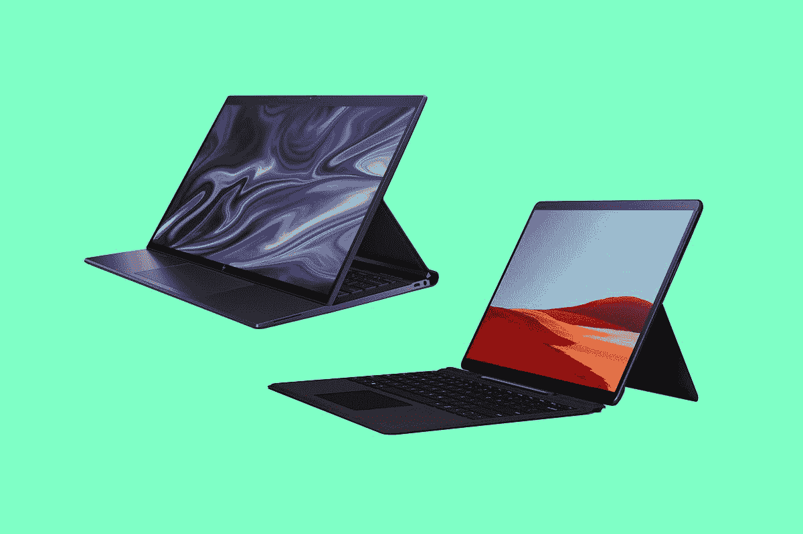

# Surface Pro X:发布日期、价格，以及你需要知道的一切

> 原文：<https://www.xda-developers.com/surface-pro-x/>

微软最近发布了其 Surface Pro X 平板电脑的新 Wi-Fi 配置。这将价格降低了 100 美元，因为 Surface Pro X 实际上是一款相当昂贵的设备。虽然你可以以大约 700 美元的价格购买一台基于英特尔技术的 Surface Pro，但 Surface Pro X 的起价为 999 美元。当然，随着 [Surface Pro 8](https://www.xda-developers.com/surface-pro-8/) 的推出，基于英特尔技术的型号要贵得多。

该产品本身原本打算成为下一代 [Surface 设备](https://www.xda-developers.com/best-microsoft-surface-pcs/)，拥有更大的屏幕、更薄的机箱和 4G LTE。虽然它在某些方面仍然有效，但它已经很久没有得到适当的更新了。

## 规范

| 

处理器

 |  |
|  | 微软 SQ 1 微软 SQ 2 |
| 

身体

 | 11.3 英寸 x 8.2 英寸 x 0.28 英寸(287 毫米 x 208 毫米 x 7.3 毫米)，1.7 磅(774 克) |
| 

显示

 | 屏幕:13 英寸 PixelSense 显示屏分辨率:2880x1920 (267 PPI)宽高比:3:2 触控:10 点多点触控 |
| 

记忆

 | 8GB 或 16GB LPDDR4x 内存 |
| 

制图法

 | 微软 SQ 1 Adreno 685 GPU 微软 SQ 2 Adreno 690 GPU |
| 

储存；储备

 | 可拆卸固态硬盘(SSD)选项:128、256 或 512GB |
| 

港口

 | 2 个 USB-c11 个 Surface Connect 端口 Surface 键盘端口 1 个 nano SIM 兼容 Surface Dial 离屏交互 |
| 

安全性

 | 用于企业安全的固件 TPM 芯片和 BitLocker 支持通过 Windows Hello face 登录提供企业级保护 |
| 

相机、视频和音频

 | Windows Hello face 认证摄像头(前置)500 万像素前置摄像头，支持 1080p 全高清视频 100 万像素后置自动对焦摄像头，支持 1080p 高清和 4k 视频双远场录音室麦克风 2W 立体声扬声器，支持杜比音效 |
| 

操作系统（Operating System）

 | ARM 上的 Windows 11 Home |
| 

连通性

 | Wi-Fi 5: 802.11ac 兼容蓝牙无线 5.0 技术高通骁龙 X24 LTE 调制解调器，最高支持千兆位 LTE Advanced Pro，支持 nanoSIM 和 eSIM。支持的 LTE 频段:1、2、3、4、5、7、8、12、13、14、19、20、25、26、28、29、30、38、39、40、41、46、66 辅助 GPS 和 GLONASS 支持 |
| 

外部

 | 外壳:标志性阳极氧化铝和碳复合材料无风扇散热颜色:哑光黑、铂金物理按钮:音量、功率 |

## Surface Pro X 发布日期是什么时候？

Surface Pro X 本来是 2019 年 10 月 2 日出来的，所以已经有一段时间了。第二年，微软通过在更高端的 SKU 中加入新的 SQ2 处理器来更新它。然而，新的处理器只是第一个处理器的超频版本。

现在，我们看到了第二次刷新，也是较小的一次。这和我们以前的型号一样，但是只有无线网络，所以比较便宜。这款游戏于 10 月 5 日发布，与 [Windows 11](https://www.xda-developers.com/windows-11/) 同时发布。

## Surface Pro X 的价格是多少？

该系列的新成员 Surface Pro X 起价为 899.99 美元。旧款机型的价格和以前一样，所以你仍然可以以 999.99 美元的价格获得 8GB 内存、128GB 固态硬盘和 SQ1 处理器的 4G LTE。它可以以 1299.99 美元的价格升级到 256GB 的固态硬盘。

然后是拥有 SQ2 处理器的 SKU。16GB 内存和 256GB 固态硬盘的价格为 1499.99 美元，升级到 512GB 固态硬盘的价格为 1799.99 美元。

## Surface Pro X 有什么新功能？

### 只有 Wi-Fi 的型号

确实如此。一年前，Surface Pro X 的规格略有提高，现在它又推出了一款没有 4G LTE 连接的机型。

这使得价格点下降了 100 美元。事实上，两年前，当 Surface Pro X 华而不实、焕然一新时，999.99 美元作为起点似乎还不错。如今，当产品急需适当更新时，这个价格似乎有点高。

## 哪里可以买到 Surface Pro X？

在美国，你可以从微软商店、亚马逊、百思买等网站购买 Surface Pro X。

 <picture></picture> 

Surface Pro X

##### 微软 Surface Pro X

Surface Pro X 是微软的 Windows on ARM 平板电脑。它很薄，很轻，有一个 13 英寸的 PixelSense 显示屏。

## Surface Pro X 常见问题

**Surface Pro X 有迅雷 4 吗？**

不。目前，Thunderbolt 仍然是英特尔个人电脑的主流。唯一搭载 ARM 处理器的个人电脑是苹果硅 MacBooks。你很快就会看到在 ARM 上安装 Windows 的 USB 4，但你可能需要等待 [Surface Pro X 2](https://www.xda-developers.com/surface-pro-x-2/) 才能得到它。

Thunderbolt 4 提供了某些好处，如连接外部 GPU 的能力。可惜的是，外置 GPU 反正和 ARM 不兼容；司机不在那里。双 4K 显示器很好，但你可以使用一对 USB Type-C 端口。

**Surface Pro X 在哪些地区有售？**

Surface Pro X 在以下国家有售:

**Surface Pro X 有 5G 还是 4G LTE？**

虽然市场的其他部分已经转向 5G，但微软仍然坚持在 Surface Pro X 中使用 4G LTE。这可能只是因为该产品尽管有一些小的更新，但已经有两年了。想必 Surface Pro X 2 会有 5G 支持。

集成蜂窝连接一直是 ARM 上的 Windows 的价值主张。Surface Pro X 是有史以来第一款 Surface 设备，每个 SKU 都提供 4G LTE，尽管现在有了仅支持 Wi-Fi 的型号，这种情况有所改变。

如果你得到了 4G LTE 版本，它支持以下频段:1，2，3，4，5，7，8，12，13，14，19，20，25，26，28，29，30，38，39，40，41，46，66

**Surface Pro X 自带 Windows 11 吗？**

新的 Wi-Fi only 配置将与 Windows 11 一起发布，因为它在技术上是 Windows 11 的发布设备。已经存在一两年的 SKU 最终会随 Windows 11 一起发货。Windows 10 发布时，Surface Pro 3 也发生了同样的事情。

下面是它的工作原理。微软将开始在其生产的新机器上安装 Windows 11。然而，它有一大堆已经生产的 Windows 10 机器。最重要的是，它仍然必须迎合那些还不想迁移到 Windows 11 的企业。

**Surface Pro X 自带笔和键盘吗？**

不会。微软从来不在 Surface 产品上附带笔和键盘。然而，你有选择，并且总是有微软、亚马逊、百思买、好市多等等出售的捆绑包。

微软销售 Surface Pro X Essentials 套装，该套装配有平板电脑、键盘、微软 365 和微软 Complete。不过，那本书里好像没有笔。还有售价 269.99 美元的 Surface Pro X Signature 键盘，配有纤细的笔束。

也可以分开买笔和键盘，抢键盘 139.99 美元，抢笔 144.99 美元。但是，如果不把笔和键盘一起买的话，键盘不附送笔库。

**Surface Pro X 配有充电器吗？**

微软 Surface Pro X 自带 65W 充电器，通过 Surface Connect 端口连接。你可以使用 Surface Pro 附带的一个旧的 45W 充电器，但你不会获得快速充电。

此外，您显然可以使用两个 USB Type-C 端口中的一个进行充电。任何标准的 45W 或 65W 笔记本电脑充电器都可以。

**Surface Pro X 有哪些配置？**

Surface Pro X 现在有八种配置可供选择:

| 

处理器

 | 

随机存取存储

 | 

储存；储备

 | 

颜色

 | 

长期演进

 |
| --- | --- | --- | --- | --- |
| SQ1 | 8GB | 128GB | 铂 | 不 |
| SQ1 | 8GB | 128GB | 黑色 | 是 |
| SQ1 | 8GB | 128GB | 铂 | 不 |
| SQ1 | 8GB | 128GB | 黑色 | 是 |
| SQ2 | 16GB | 128GB | 铂 | 不 |
| SQ2 | 16GB | 256GB | 铂金/黑色 | 是 |
| SQ2 | 16GB | 256GB | 铂 | 不 |
| SQ2 | 16GB | 512GB | 铂金/黑色 | 是 |

**Surface Pro X 有哪些颜色？**

这款平板电脑有黑色和铂金两种颜色。它仍然与英特尔驱动的 Surface Pro 有所不同，因为 Pro X 是由铝而不是镁制成的。

如果微软选择走这条路，这实际上为更多的颜色打开了大门。事实上，Surface 笔记本电脑已经有了很多漂亮的颜色，如酒红色、钴蓝色、冰蓝色和砂岩色，这都要归功于阳极氧化铝。

当然，你也可以用不同颜色的键盘定制你的 Surface Pro X 的外观。这是 SQ2 更新的另一个新特性，在此之前，键盘只有黑色。

**Surface Pro X 的网络摄像头好吗？**

是的。除了 Surface Laptop，微软多年来一直在其产品中使用出色的网络摄像头。前置摄像头为 5MP，支持 1080p 视频，后置摄像头为 10MP，支持录制 4K 视频。

除此之外，ARM 处理器的优势之一是人工智能特性。比如相机支持凝视矫正。使用人工智能，它可以让你看起来像是在看着摄像机。如果你曾经在打电话的时候阅读屏幕上的内容，这可能会有所帮助。

**Surface Pro X 有 Windows Hello 吗？**

是的。它有一个用于 Windows Hello 面部识别的红外摄像头，但没有指纹传感器。事实上，自 Windows 10 发布以来，每一款上市的 Surface 都配备了红外摄像头，Surface Laptop Go 除外。该设备有一个指纹识别器，微软称较小的顶部边框是无法安装红外摄像头的原因。

**Surface Pro X 运行安卓应用吗？**

发布时没有。当微软在 6 月 24 日宣布 Windows 11 时，它确实说新操作系统将支持 Android 应用程序。不幸的是，它被延迟了。

如果你参加了 Windows Insider 计划，你将能够在今年晚些时候在 Windows 11 上测试 Android 应用程序。微软尚未提供该功能何时面向非业内人士的更新。

**Surface Pro X 支持哪些应用？**

如果你用的是 Windows 11，Surface Pro X 应该支持你习惯的所有应用。Windows 11 增加的是 x64 仿真。以前，这种模拟仅限于 32 位应用程序。

当然，模拟应用程序会对性能产生影响，因此您可能希望运行本地应用程序。对于网络浏览器来说，这可能是微软 Edge 或 Mozilla Firefox，也有其他本地应用程序。Adobe Photoshop 现在是原生的，Zoom 和 Teams 也是。大多数 UWP 应用程序也很好用。

**Surface Pro X 什么时候才能真正刷新？**

虽然微软喜欢吹捧其定制的 SQ 处理器，但它们实际上只是超频的骁龙 8cx 芯片组。需要说明的是，微软并没有像苹果那样推出自己的 ARM 设计，甚至没有像高通和联发科那样采用现成的 ARM Cortex 设计并进行调整。这实际上是与高通合作，通过最小的调整重塑现有处理器的品牌。

所以，当我们问一个像平板电脑什么时候会真正刷新的问题时，这个问题更多的是关于什么时候会有新的处理器可以使用。我们必须等待骁龙 8cx Gen 3，它将于今年晚些时候公布。即便如此，这也不能告诉我们硅片何时开始发货。

我最大的猜测是 2022 年春天，但那只是猜测。2022 整体很有可能，但下跌也有可能。