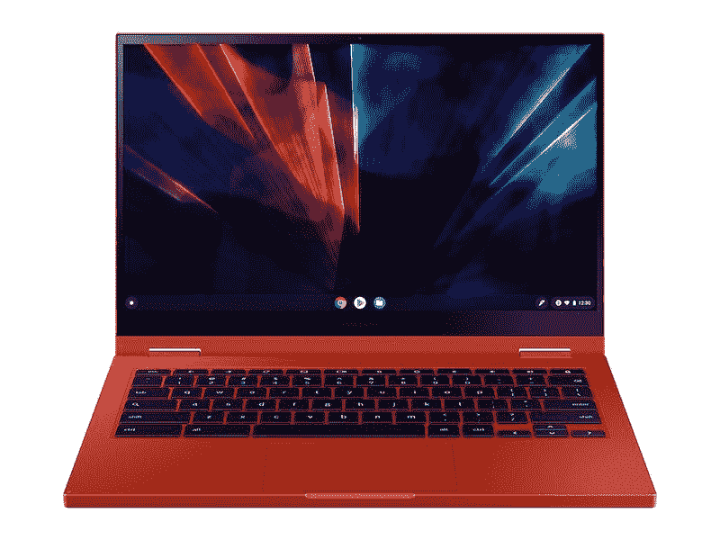
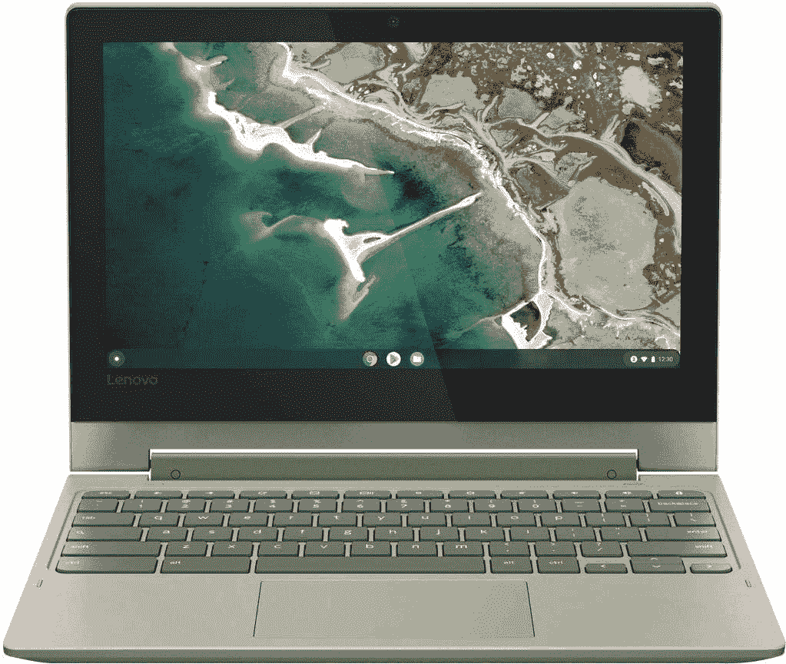

# 该不该买 Chromebook？当然，这就是你应该换工作的原因！

> 原文：<https://www.xda-developers.com/switch-chrome-os/>

操作系统是我们日常生活的重要组成部分。如果你多年来一直使用 Mac 或 Windows PC，你可能会问自己，我应该买 Chromebook 吗？另一方面，新事物的吸引力是令人兴奋的。你对低成本硬件和 5 秒启动时间的想法感兴趣吗？如果是这样，Chrome 操作系统和一款新的闪亮的 Chromebook 可能适合你。

一般来说，Chromebooks 和 Chromeboxes 比 Mac 或 PC 机器的性价比高得多。如果你可以迁移到云，你也不需要顶级的 Chrome 操作系统体验。不过，价格并不是唯一的考虑因素——你还可以获得惊人的电池续航时间，并访问数百万个 Android 应用程序。让我们来看看你今天应该转向 Chromebook 的主要原因。

## 购买 Chromebook 以降低硬件成本

当我们说 Chromebooks 更具性价比时，我们指的是大幅提高。你可以花 300 美元左右买到一台高质量的 Chromebook，而且价格上也不会牺牲体验。这是可能的，因为 Chrome OS 不需要与 Windows 或 macOS 相同的规格。你不需要 Core i7 和 16GB 或 RAM 来运行应用程序或打开大量 Chrome 浏览器标签，也能获得不错的体验。

此外，Chrome 操作系统不需要大型固态硬盘。这确实需要对基于云的存储做出一些承诺，但是一旦你习惯了，这是相当容易的。像 Google Drive 和 Dropbox 这样的服务使得云中的存储成为一个跨所有设备的优雅而统一的解决方案。

当然，如果你想要一台高端机，你也可以用 Chromebook 来实现。在高端市场，Chromebooks 的价格仍然低于 PC 和 Mac 电脑。出色的三星 Galaxy Chromebook 2 偶尔会以低于 400 美元的价格出售。这款机器提供了酷睿 i3 处理器、8GB 内存和 128 GB 固态硬盘用于存储。以 Chrome 操作系统的标准来看，这些规格相当强大，而且价格惊人。其他顶级配置在 500 美元左右的优秀 Chromebook 包括[宏碁 Spin 514](https://www.anrdoezrs.net/links/100122946/type/dlg/sid/UUxdaUeUpU3492/https://store.acer.com/en-us/acer-chromebook-spin-513-cp513-1h-s60f) 和[联想 Yoga Chromebook](https://www.amazon.com/Lenovo-2-1-Touch-Screen-Chromebook/dp/B07KKLBVVN/?tag=xda-10nouqo-20&ascsubtag=UUxdaUeUpU3492&asc_refurl=https%3A%2F%2Fwww.xda-developers.com%2Fswitch-chrome-os%2F&asc_campaign=Short-Term) 。

 <picture></picture> 

Galaxy Chromebook 2

##### 三星 Galaxy Chromebook 2

通过 Galaxy Chromebook 2，三星取消了一些高端功能，但也大幅降低了价格。作为第一款采用 QLED 显示屏的 Chromebook，该机仍然为大多数用户提供了充足的动力和时尚。

##### 联想 Yoga Chromebook

这款 Chromebook 拥有引人注目的铝合金设计、15.6 英寸触摸屏和英特尔 UHD 620 显卡，可带来真正的高端体验。如果你正在寻找在规格和设计方面整体最好的联想 Chromebook，这就是它。

 <picture></picture> 

Acer Chromebook Spin 513

##### 宏碁 Chromebook Spin 514

如果你想要一台 2 合 1 Chromebook，但价格不高，Spin 514 是一个很好的选择。您仍然可以获得明亮生动的高清显示屏，以及出色的电池续航时间。如果您需要在旅途中工作，Spin 514 具有可选的 4G LTE 功能。

## 为轻便快速的操作系统购买 Chromebook

Chrome OS 是目前最轻的操作系统之一。由于其基于云的特性，Chrome OS 设备上几乎不存在延迟。即使是低端设备，你也不会注意到一般用户界面的缓慢或口吃。

Chromebook 的启动时间也几乎是瞬间的。我们测试过的大多数 Chromebooks 都在 5 秒钟内启动到登录屏幕，有些甚至更快。使用 web 应用程序也非常方便。有了云存储，如果你的 Chromebook 在本地损坏，你不会丢失任何重要文件。

如果你关心安全性，谷歌也有 Chrome OS，它可以将恶意代码锁定在沙箱中。沙箱将一个进程锁定在一个隔离的环境中，不与任何其他进程共享资源。与 Windows 甚至 macOS 相比，Chrome OS 上可利用的漏洞要少得多。考虑到 Chromebooks 主要在浏览器中运行，令人难以置信的安全性让许多人感到惊讶。快速、高效、安全—您还想要什么？

## 购买 Chromebook 以获得更长的电池续航时间

电池寿命是所有用户关心的主要问题。整天用笔记本电脑工作和娱乐会很快耗尽你的电池。在 Mac 或 PC 上，通常一天的电池续航时间在 5-8 小时之间。随着使用量的减少，你可以从 MacBook Air 这样的超极本中挤出大约 10 小时的使用时间。

对于 Chromebook，10 小时的电池续航时间基本上是正常的。你可以预计几乎所有的 Chromebooks 都可以正常使用 10 小时左右(处理文档、听音乐、看媒体)。一些 Chromebook，如[联想 Chromebook Flex 3，](https://www.amazon.com/Lenovo-Chromebook-Touch-Screen-MT8173/dp/B08L733KPP?tag=xda-10nouqo-20&ascsubtag=UUxdaUeUpU3492&asc_refurl=https%3A%2F%2Fwww.xda-developers.com%2Fswitch-chrome-os%2F&asc_campaign=Short-Term)一次充电的电池寿命可达 16 小时。

 <picture></picture> 

Lenovo Chromebook Flex 3

##### 联想 Chromebook Flex 3

您需要一台可以持续工作两整天的笔记本电脑吗？Chromebook Flex 3 在典型使用情况下的电池续航时间为 16 小时。无论您是出差还是在课堂上使用，这种电池续航时间总能派上用场。

## 购买 Chromebook 以访问 Android 和 Linux 应用程序

如果你每天都在使用安卓手机，你应该已经知道如何从 Play Store 安装应用了。另一方面，对于那些将 iPhone 作为日常设备的人来说，这个过程可能有点新。从 Play Store 安装应用程序的过程与苹果 iOS 或 macOS 应用程序商店的过程非常相似。

### **如何在 Chromebook 上下载安卓应用**

*   打开 Chromebook 并登录。
*   打开应用抽屉。点击*启动器*图标，或者从底部向上滑动。
*   找到*谷歌 Play 商店*应用并打开。
*   搜索或浏览您选择的应用程序。如果你正在寻找选择，请看这篇文章中的最佳 Android 应用列表。
*   点击*安装。*
*   等待应用程序安装，不久后它将出现在您的应用程序抽屉中。

我们建议下载 Microsoft Office、网飞和 Twitter 来开始。查看我们的[Chrome OS 上 Android 应用的完整指南](https://www.xda-developers.com/android-apps-chrome-os)以获得更多应用建议。

### Chromebook 上的 Linux 应用

运行 Linux 应用程序到底能完成什么？默认情况下，Chrome OS 是一个云计算平台，它省略了一些你可能在 Mac 或 PC 上看到的桌面级应用程序。例如，如果你需要运行 Photoshop，这在你的 Chromebook 上是不可能的。视频编辑在 Chrome OS 上默认也是相当困难的。Linux 应用程序在一定程度上解决了这两个问题。GIMP 是一个优秀的照片编辑器，Kdenlive 可以处理基本的视频编辑任务。

此外，如果你是一名开发人员，你无疑需要 Linux 作为编码工具。虽然不是所有的 chrome book 都支持 Linux 应用程序(有一些基本的系统要求)，但大多数现代 chrome book 都有这个选项。您还可以抓住一个[坞站](https://www.xda-developers.com/best-docking-stations-chromebooks/)并连接外部显示器，以最大限度地提高工作效率。

### **如何在 Chrome OS 上启用 Linux 应用**

如前所述，你需要先检查你的 Chromebook 是否真的支持 Linux 应用。为此:

*   打开 Chrome OS 设置(通过点击桌面右下角的时间区域，然后点击齿轮状的设置图标)。
*   点击*高级*标签，选择*开发者*。
*   打开下面菜单中的 *Linux (Beta)* 选项。目前 Linux 正在 Chrome 操作系统上进行 beta 测试(过去三年一直如此)，但谷歌表示将很快退出测试。

*   按照屏幕上的提示在 Chromebook 上安装 Linux。在设置过程中，您将为 Linux 环境选择一个用户名。用户名可以是任何东西，所以不要太担心这个。您还需要决定将多少可用存储空间用于 Linux，但这可以在以后修改。安装需要几分钟，所以在这一步需要一点耐心。
*   当安装结束时，你会看到一个终端窗口，如下所示。现在，您终于可以下载并安装一些 Linux 应用程序了。

下载和安装 Linux 应用程序的过程有点技术性，但你可以查看我们的[Chrome OS 上 Linux 应用程序的完整指南](https://www.xda-developers.com/linux-apps-chrome-os)以获得完整的分步概述。

Chrome OS 功能强大，用途广泛，可以在多种硬件上运行。几乎任何人都可以选择 Chromebook。如果你在市场上购买新的 Chromebook，请查看我们关于最好的[宏基 chrome book](https://www.xda-developers.com/best-acer-chromebooks)、[三星 chrome book](https://www.xda-developers.com/best-samsung-chromebooks)和[联想 chrome book](https://www.xda-developers.com/best-lenovo-chromebooks)的指南。此外，如果你想要一个 Chromebox 来获得桌面体验，我们也有一个关于选择 Chromebox 的极好的入门指南。

在下面的评论中让我们知道你最喜欢切换到 Chrome 操作系统的部分。