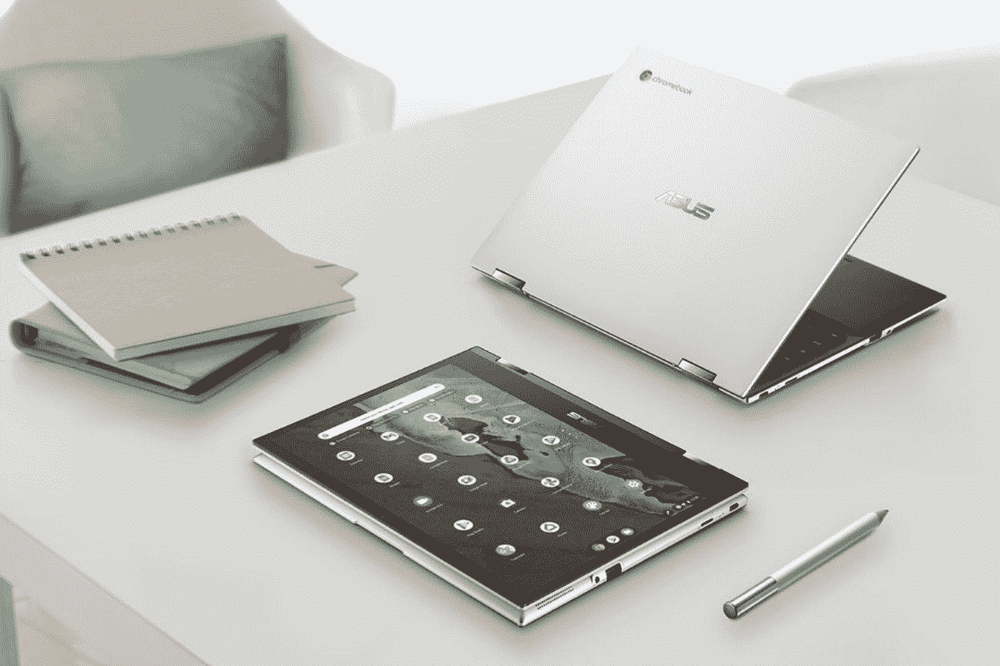

# 如何切换到 ChromeOS:存储，设置，等等！

> 原文：<https://www.xda-developers.com/switch-to-chrome-os/>

你是否在寻求向 ChromeOS 的飞跃？在做出改变之前，你需要知道一些事情。最有可能的是，你将从 Mac 或 Windows PC 上使用 ChromeOS。虽然 ChromeOS 有很多可能是熟悉的，但它主要是基于云的操作系统，所以像所需硬件规格这样的想法已经过时了。此外，您不需要像在云中存储大多数文件那样多的内置存储。一些键盘快捷键和应用程序也可能有所不同。好消息是，一旦你设置好了，ChromeOS 使用起来既简单又有趣。

让我们来看看你需要知道的一切，以切换到一个新的 Chromebook。

## 了解 ChromeOS 所需的规格

 <picture></picture> 

HP Elite Dragonfly Chromebook

Chromebooks 可以使用相当低功率的 CPU，因为 ChromeOS 经过优化，与 Windows 相比更轻便。对于 300 美元以下的 Chromebooks，目标是英特尔赛扬处理器，最好是较新的 N5000，尽管 N4020 或 N4010 也是可靠的选择。联发科也有出色的 ARM 处理器选项，如联发科 Kompanio1000 系列、800 系列和 500 系列。就连高通也凭借骁龙 7C 打入了 Chromebook 市场。虽然这个低价位的 CPU 不是高性能的，但它们的电池效率非常高。

如果你在 Chromebook 上的花费超过 600 美元，只需关注英特尔酷睿 i3、英特尔酷睿 i5 或酷睿 i7 处理器。寻找第 12 代、第 11 代或第 10 代处理器。你可能仍然会找到采用这些处理器的 Chromebooks，但如果折扣很大，请考虑第八代或第九代英特尔处理器。

大多数现代 Chromebooks 至少配备 4GB 内存。一些较旧的型号仍然具有 2GB 的内存，但我们不推荐内存小于 4GB 的设备。如果你买了一个 2GB 内存的 Chromebook，你会注意到打开几个浏览器标签会导致你的设备变得迟钝。当然，你也可以找到内存明显超过 4GB 的 Chromebooks。确定你需要多少内存取决于你将如何使用你的 chrome book——你是希望它用于基本的网络浏览还是一般的生产力。

需要注意的是，随着 RAM 容量的增加，价格通常会上升。大多数低于 300 美元的 Chromebooks 将配备 4GB，偶尔会有 8GB 的特殊交易。如果你买的 Chromebook 价格超过 300 美元，尽可能找一款 8GB 以上的。

许多廉价的 Chromebooks 也是从 32GB 的 eMMc 存储开始。归根结底，32GB 的存储空间对于 2022 年的 Chromebook 来说是不够的，除非你只使用云存储。否则，您应该考虑至少 64GB 的存储空间。300 美元以下有不少出色的选择，采用 64GB 固态硬盘存储。那些希望使用 Chromebook 作为主要计算设备的人应该选择最低 128GB 的存储空间。这些可能要花费 400 多美元。三星 Galaxy Chromebook 2 是 Chromebook 的一个很好的例子，它具有所有这些理想的规格，而且没有超出预算。

##### 三星 Galaxy Chromebook 2

三星 Galaxy Chromebook 2 是一款出色的首款 Chromebook，这要归功于 QLED 显示屏和内部的英特尔酷睿 i3 CPU。

## 选择云存储解决方案

转向 ChromeOS 意味着在某种程度上致力于云存储。如果可以的话，你会想把几乎所有东西都搬到云上。那些觉得完全迁移到云听起来很可怕的人应该在选择 Chromebook 时选择更多内置存储。有几个优秀的云存储服务，但 Google Drive 最有意义。当然，如果你已经锁定了 Dropbox、box 或微软 OneDrive，这些都可以在 Chromebook 上使用。Microsoft OneDrive 是一个很好的选择，因为您可以通过 Microsoft 365 订阅获得 1TB 的存储空间。

在转移到 Chromebook 之前，请将所有文件备份到您选择的云服务。如果您有很多文件要存储，这可能需要少量的订阅费，但最终，简单易用使其物有所值。使用云服务还允许在所有设备上访问您的文件，而不仅仅是 Chromebook。

## 了解 ChromeOS 设置和菜单

任何 Chromebook 新用户都应该了解一些基本知识。截屏、管理文件或改变滚动方向等基本任务对所有用户来说都很重要。

*   **截屏:**如果你想在 Chromebook 上截屏你的整个屏幕，按 **Ctrl +显示 windows 按钮**(Windows 键盘上的 Ctrl + F5)。要捕获部分屏幕截图，请按 **Shift + Ctrl + Show windows** (在 windows 键盘上按 Shift + Ctrl + F5)，然后单击并拖动光标到您想要捕获的区域。
*   **大写锁定键更换:**你可能已经注意到 Chromebooks 没有大写锁定键。您可以像往常一样使用 Shift 键大写字母，但您也可以按下 **Launcher+Alt** 来启用 Caps Lock。
*   **改变滚动方向**:在你的 Chromebook 上改变滚动方向很容易。为此，单击右下角的时间，并单击**设置**图标。向下滚动并选择**触摸板**。在滚动选项下，选择**启用反向滚动**。
*   **查找系统规格:**要访问系统页面，在 Chromebook 上打开 Chrome 浏览器，在浏览器栏中输入 **chrome://system** 。按回车键将显示一长串所有系统规格。
*   **定位和管理文件:**chrome book 是为云设计的，所以本地存储的工作方式有点不同。您的信息会存储在“文件”应用程序中，而不是桌面或“文档”文件夹中。您可以使用启动器快速访问该应用程序，然后搜索您需要的内容。所有下载的内容都将出现在“下载”文件夹中，但您也可以添加子文件夹以便于存储。
*   **定制您的 dock:** 您可以将应用程序固定到您的 dock(位于屏幕底部)以便于访问。最起码，你会想把 Chrome、Gmail、文件，可能还有 YouTube 放在那里。如果你在工作中使用 Chromebook，你可能还需要一些生产力应用程序，如文档和幻灯片。

如果您通过[扩展坞](https://www.xda-developers.com/best-docking-stations-chromebooks/)连接到外部显示器，整理扩展坞尤为重要。

## 了解 ChromeOS 键盘快捷键

 <picture></picture> 

ASUS Chromebook Flip CM3

我们有关于 ChromeOS 键盘快捷键的完整指南，但是有一些基本的需要立即掌握:

1.  **截图:**按 Ctrl +显示窗口。
2.  **局部截图:**按下 **Shift + Ctrl + Show windows** ，然后点击拖动。
3.  **在平板电脑上截图**:按下**电源键+音量调低键**。
4.  **访问更多截图功能**:按 **Shift + Ctrl +显示窗口**，然后从工具栏中选择一个截图功能。
5.  **打开或关闭大写锁定:**按**搜索+ Alt。**或者按 **Launcher + Alt。**
6.  **锁定屏幕:**按**搜索+ L.** 或按**启动器+ L.**
7.  **注销你的谷歌账户**:按 **Shift + Ctrl + q** (两次)。
8.  **查看所有键盘快捷键** : **按 Ctrl + Alt + /** (正斜杠)。

你也可以在 ChromeOS 中重新映射按键，这是找回丢失的 Caps Lock 键的绝佳方式。重新映射和其他高级选项将在上面链接的完整指南中进一步介绍。

## 使用 Android 应用程序扩展您的应用程序选择

如果你每天都使用安卓手机，你应该已经知道如何从 Play Store 安装应用了。另一方面，对于来自 iOS 的人来说，这个过程可能有点新。从 Play Store 安装应用程序的过程与苹果 iOS 或 macOS 应用程序商店的过程非常相似，但以防万一你需要复习一下，下面是如何做的。

1.  打开 Chromebook 并登录。
2.  点击**启动器图标**打开应用抽屉。
3.  找到**谷歌 Play 商店** app 并打开。
4.  搜索或浏览您选择的应用程序。
5.  点击**安装。**
6.  等待应用程序安装，不久后它将出现在您的应用程序抽屉中。

我们建议下载网飞和推特来开始。查看我们的[ChromeOS 上 Android 应用的完整指南](https://www.xda-developers.com/android-apps-chrome-os/)以获得更多应用建议。

## ChromeOS 上的 Linux 应用

运行 Linux 应用程序到底能完成什么？默认情况下，ChromeOS 是一个云计算平台，它省略了一些你可能在 Mac 或 PC 上看到的桌面级应用程序。例如，在 Chromebook 上运行 Photoshop 是不可能的。视频剪辑在 ChromeOS 上也相当困难。这两个问题都可以通过 Linux 应用程序来解决。

此外，如果你是一名开发人员，你无疑需要 Linux 作为编码工具。虽然不是所有的 chrome book 都支持 Linux 应用程序(有一些基本的系统要求)，但大多数现代 chrome book 都有这个选项。

1.  如前所述，你需要先检查你的 Chromebook 是否真的支持 Linux 应用。
2.  打开 ChromeOS 设置(通过点击桌面右下角的时间区域，然后点击齿轮状的设置图标)。
3.  点击**高级**选项卡，选择**开发者。**
4.  打开 **Linux 选项。**
5.  下载和安装 Linux 应用程序的其余过程有点技术性，但在我们的 ChromeOS 上的 Linux 应用程序指南[中有所涉及。](https://www.xda-developers.com/linux-apps-chrome-os)

这就是你需要知道的一切，以便转向[多功能的 ChromeOS](https://www.xda-developers.com/install-chrome-os-non-chromebook-pc-tablet/) 。这一边的草确实更绿，你只需简单的几步就能做出改变。确保选择最适合你的云存储解决方案，并在购买新的 Chromebook 之前备份所有文件。

当你准备好开始购物时，请查看我们列出的[最佳三星 chrome book](https://www.xda-developers.com/best-samsung-chromebooks)、[最佳宏碁 chrome book](https://www.xda-developers.com/best-acer-chromebooks)和[最佳惠普 chrome book](https://www.xda-developers.com/best-hp-chromebooks)。如果您对迁移到 ChromeOS 有任何其他问题，请在评论中提出，我们会与您联系。