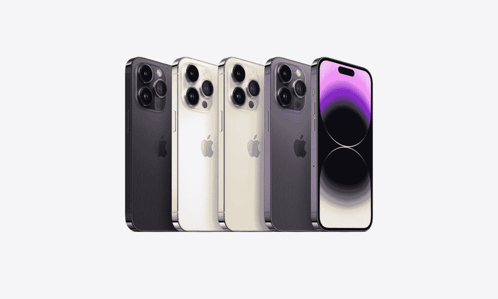

# T-Mobile 为一部 iPhone 14 提供高达 1000 美元的折价积分

> 原文：<https://www.xda-developers.com/t-mobile-iphone-14-trade-in/>

# T-Mobile 为一部 iPhone 14 提供高达 1000 美元的折价积分

T-Mobile 宣布了即将推出的 iPhone 14 的预购计划。无线运营商将提供高达 1000 美元的折价积分。

当天早些时候，苹果举行了“远离”活动，首次亮相 2022 年的最新 iPhone 机型。随着 [iPhone 14 Plus](https://www.xda-developers.com/apple-iphone-14/) 的推出，阵容得到了扩大，顶级机型 [iPhone 14 Pro 和 iPhone 14 Pro Max](https://www.xda-developers.com/apple-iphone-14-pro/) 获得了一些出色的更新，与前代产品拉开了距离。虽然你可能还在考虑买哪部 iPhone 14，但不幸的是，你没有太多时间去考虑，因为苹果已经将设备的预购日期定在了 9 月 9 日。这意味着从本周五开始，全球无线运营商将开始接受这款智能手机的预购。

T-Mobile 将在 9 月 9 日提供各种各样的优惠，届时它将开放该设备的预购。也许最有吸引力的交易是以旧换新促销，无线运营商将提供任何 iPhone 14 智能手机高达 1000 美元的折扣。促销将以 24 个月账单积分的形式进行。促销活动的唯一要求是新用户或当前用户必须拥有 Magenta Max、Business Unlimited Advanced、Ultimate 或 Ultimate Plus 帐户。对于以前的 Sprint 客户，同样的计划也可以获得折价促销的资格。

T-Mobile 还将推出一项促销活动，购买 iPhone 14 Pro 将享受 50%的折扣，购买 iPhone 14 将享受 500 美元的折扣。同样，这一促销活动将以 24 个账单积分的形式进行，并且需要在符合条件的设备上进行交易，并且是任何 T-Mobile 无线计划的新客户或现有客户，才有资格参加。在向现有计划中添加一系列服务时，客户还将有资格获得“买一送一”的促销活动。

如果你对任何一款 iPhones 感兴趣，你很可能希望在第一天就拿到预购订单，因为之后的任何订单都很可能会延迟。iPhone 14、iPhone 14 Pro 和 iPhone 14 Pro Max 将于 9 月 16 日上市。而 iPhone 14 Plus 将于 10 月 7 日上市。

 <picture></picture> 

Apple iPhones at Best Buy

苹果 iPhone 14 系列将于 9 月 9 日开始接受预购

* * *

**来源** : [T-Mobile](https://www.t-mobile.com/news/devices/t-mobile-to-offer-apple-iphone-14-lineup-offers)