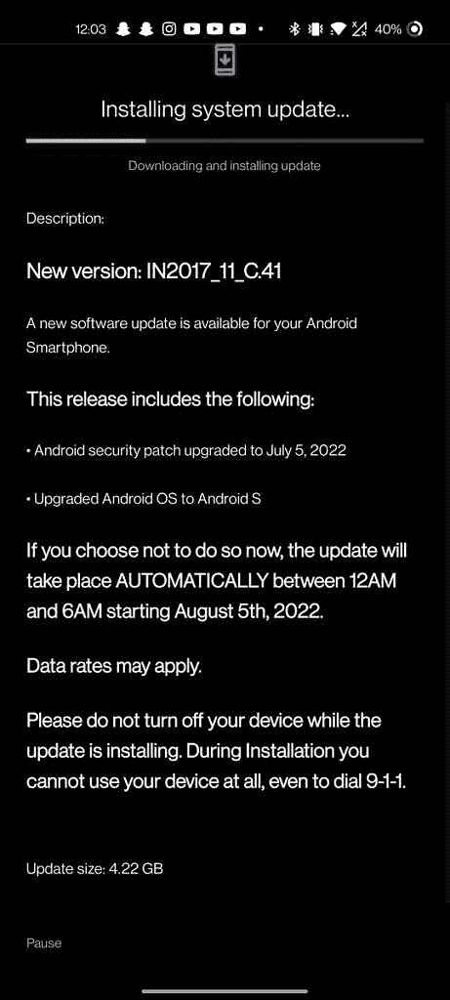

# T-Mobile 一加 8 和 8T 终于更新到 OxygenOS 12

> 原文：<https://www.xda-developers.com/t-mobile-oneplus-8-and-oneplus-8t-oxygenos-12-update/>

三月份，一加发布了针对一加 8 和一加 8T 的第一个稳定的 OxygenOS 12 更新。此次更新非常重要，将 Android 12 带到了两款手机上。虽然有些人对新的更新感到高兴，但其他人，如美国人，想知道他们的手机何时会更新。几个月后，T-Mobile 终于发布了更新，可以通过空中下载(OTA)下载。

**XDA 论坛:[一加 8](https://forum.xda-developers.com/c/oneplus-8.10349/) | [一加 8T](https://forum.xda-developers.com/c/oneplus-8t.11579/)**

更新的说明相对较少，只是说更新会将操作系统从当前状态升级到 Android 12。此外，它还包含了【2022 年 7 月 Android 安全更新。一加 8 版本的 build 号是 IN2017_11_C.41，而一加 8T 更新的 build 号是 KB2007_11_C.41

Android 12 是一个重要的产品，它不仅在外观上，而且在内部都带来了许多变化。也许用户首先会注意到的是改进的用户界面。Android 12 利用了 Google 的 Material You，带来了动态颜色主题化。动态主题化将使定制变得轻而易举，自动从你的壁纸中取样颜色，并将它们注入图标和系统菜单中。

 <picture></picture> 

Image credit: OnePlus Reddit member [u/CityKid2100](https://www.reddit.com/r/oneplus/comments/wefljo/android_12_for_oneplus_8_on_tmobile/)

新的隐私仪表板让用户能够更好地控制他们的个人信息。您甚至可以拒绝特定应用程序的摄像头和麦克风访问。还有改进的辅助工具，其中一个允许你把屏幕调得比以前低。虽然这一切听起来令人印象深刻，但这只是冰山一角，操作系统的每个角落都有许多额外的改进。

更新应该会通过 OTA 推出，但有可能需要更长时间才能到达您的手机。如果您想现在更新，您可以使用下面的下载链接下载更新。

下载:

*   **一加 8 T 移动** (IN2017_11_C.41)

*   一加 8T T-Mobile (KB2007_11_C.41)

*感谢 XDA 公认开发者*[*mlgmxyysd*](https://forum.xda-developers.com/m/mlgmxyysd.8430637/)*和 XDA 资深会员*[*Some _ Random _ Username*](https://forum.xda-developers.com/m/some_random_username.8234677/)*提供下载链接！*

* * *

来源: [Reddit](https://www.reddit.com/r/oneplus/comments/wefljo/android_12_for_oneplus_8_on_tmobile/) (一加)[一加社区论坛](https://community.oneplus.com/thread?id=1124693416681668610)