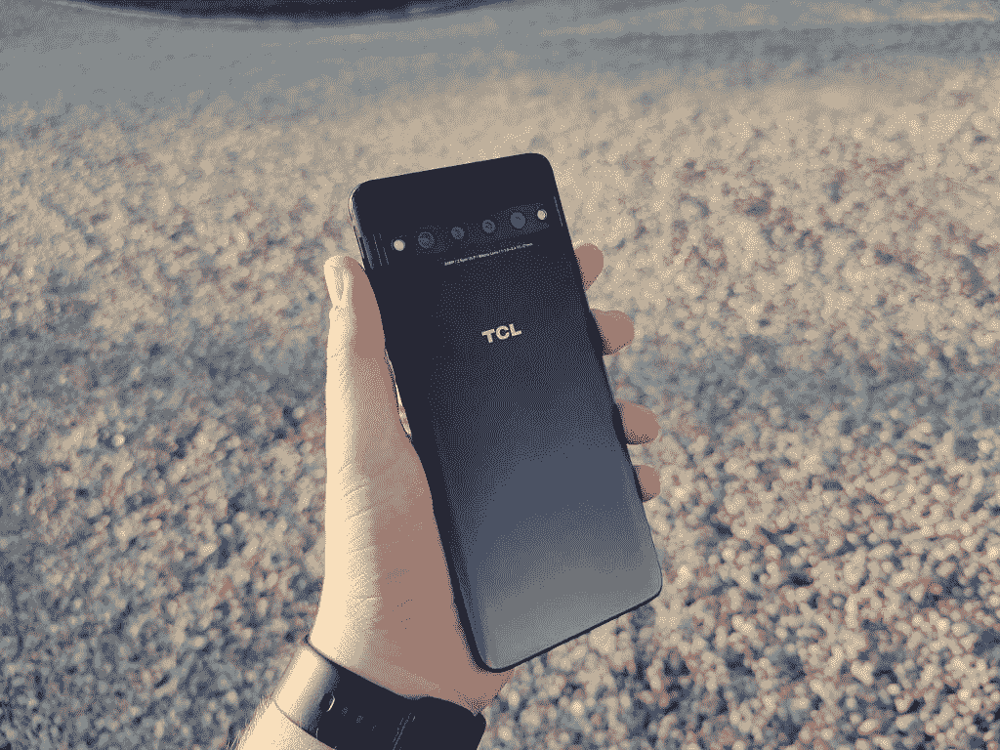
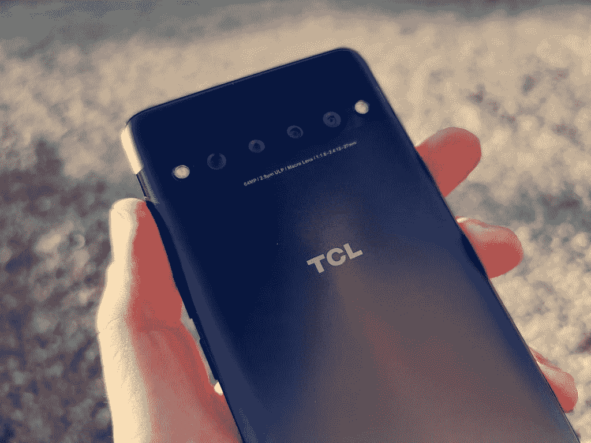
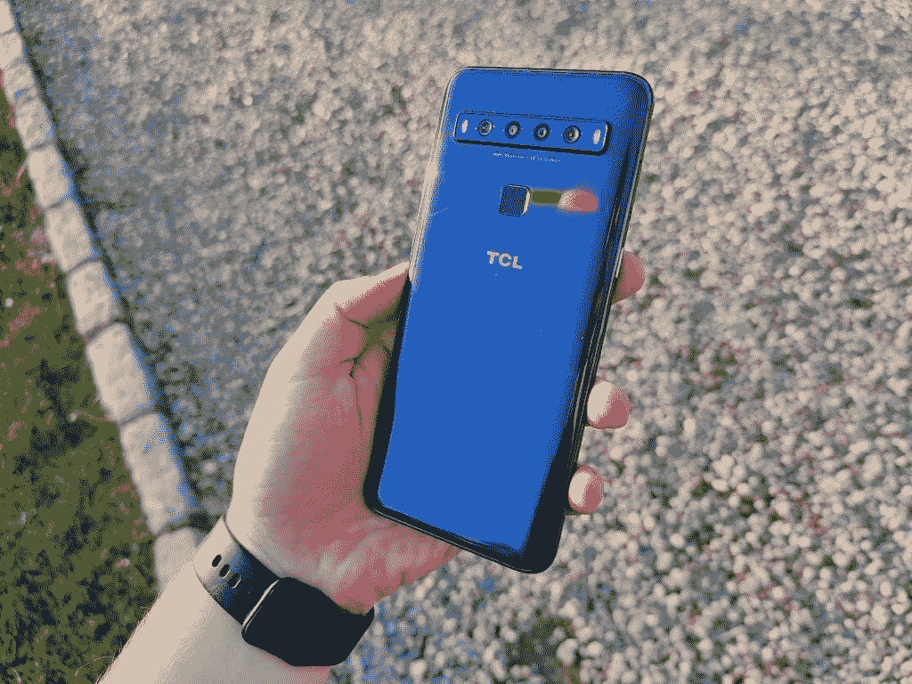
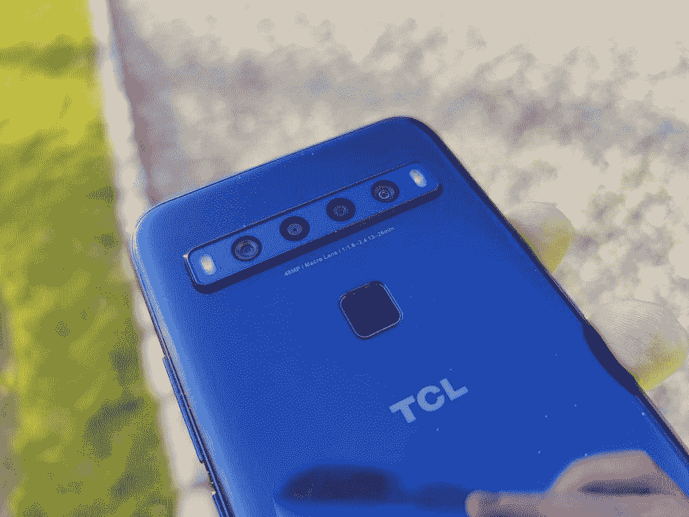

# TCL 10L 和 10 Pro 评测:超值中端 Android 智能手机

> 原文：<https://www.xda-developers.com/tcl-10l-tcl-10-pro-review/>

TCL 10L 和 TCL 10 Pro 是 TCL 进军美国、欧洲和澳大利亚的第一批手机。TCL 10 Pro 是一款 450 美元的中档手机，显示屏和相机设置都很好。TCL 10L 是一款 250 美元的手机，配有出色的摄像头和显示屏。这两款手机都很不错，物超所值。

## TCL 10L 和 TCL 10 Pro 规格

| 规范 | TCL 10L | TCL 10 Pro |
| --- | --- | --- |
| **尺寸&重量** |  |  |
| **显示** |  |  |
| **SoC** | 高通骁龙 665:肾上腺素 610 肾上腺素 610 肾上腺素 610

*   4x Kryo 260 金@ 2.0GHz
*   4x Kryo 260 银@ 1.8GHz

Adreno 610 | 高通骁龙 675:肾上腺素 612 肾上腺素 612 肾上腺素 612

*   2x Kryo 460 金@ 2.0 GHz
*   6x Kryo 460 银@ 1.7 GHz

Adreno 612 |
| **RAM &存储** | Micro SD 卡，最高 256GB Micro SD 卡，最高 256GB Micro SD 卡，最高 256GB

*   6GB 内存+ 64GB EMMC
*   6GB 内存+ 128GB UFS

Micro SD card, up to 256GB | Micro SD 卡，最高 256GB |
| **电池&充电** |  |  |
| **后置摄像头** | 照片:视频:视频:视频:

*   **主要:** 48MP S5KGM1，f/1.8，1/2.25”传感器，0.8 m 像素
*   **次要:**800 万像素 GC8034，超广角，f/2.2，1/4”传感器，1.12 m 像素
*   **第三:**200 万像素 GC2385，微距，f/2.4，1/5 英寸传感器，1.65 百万像素
*   **四进制:** 2MP GC2385，深度，f/2.4，1/5”传感器，1.65 m 像素

Video:

*   4K @ 30fps
*   1080 @ 120fps
*   720p @ 240fps

 | 照片:视频:视频:视频:

*   **主要:**6400 万像素 GW1，f/1.8，1/1.7 英寸传感器，0.8 百万像素，LDAF CDAF PDAF
*   **次要:** 16MP 3P9，超广角，f/2.4，1/3”，1.0 m 像素
*   **第三级:**500 万像素 GC5035，微距，f/2.2，1/5 英寸传感器，1.12 百万像素
*   **四进制:** 2MP OV02K10，深度，f/1.8，1/2.8”传感器，290 万像素

Video:

*   4K/1080p/720p @ 30 fps
*   1080p/720p @ 120fps
*   720p @ 24ofps
*   720p @ 960fps

 |
| **前置摄像头** | 16MP S5K3P9SP04，f/2.2，单孔打孔机 | 24MP OV24B，f/2.0，泪珠形凹口 |
| **其他特性** |  |  |
| **音频** |  |  |
| **安卓版本** | 基于 Android 10 的 TCL UI | 基于 Android 10 的 TCL UI，FOTA 计划为 Android 11 升级 |
| **价格&** **供货** | 亚马逊 5 月 19 日，沃尔玛和百思买本月晚些时候 | 亚马逊 5 月 19 日，沃尔玛和百思买本月晚些时候 |

*TCL 提供了这两台设备以供审查。然而，他们没有对这次审查的内容提出任何意见。*

**[TCL 10L 论坛](https://forum.xda-developers.com/tcl-10l)**| |**|[TCL 10 Pro 论坛](https://forum.xda-developers.com/tcl-10-pro)**

* * *

## 五金器具

TCL 10 Pro 上的硬件其实真的很有趣。手机的外壳真的很好握。它也有一个非常好的构建质量。它是通常的铝体玻璃夹层。正面采用 6.47 英寸 FHD+ AMOLED 显示屏。还有一个小小的泪珠状缺口。显示屏下面是一个内置指纹扫描仪。它既不太快也不太准确。它感觉非常类似于一加 6T 中的传感器，这意味着在我的体验中它并没有那么好。

 <picture></picture> 

TCL 10 Pro

手机背面相当独特。背面有一个哑光灰色渐变，一个条形穿过手机的上四分之一。这个酒吧里有四摄像头和双闪光灯。这是 TCL 目前阵容的一个非常独特的外观，使他们从最近的“L”形四摄像头布局中脱颖而出。

 <picture></picture> 

TCL 10 Pro

在内部，我们有高通骁龙 675，Adreno 612，128GB 的 UFS 2.1 存储，6GB 的 LPDDR4x 内存，4500 毫安时电池和耳机插孔。对于 450 美元的价格来说，这些规格似乎很棒，我在某种程度上同意这一点。我想看看骁龙 730 或 730G。现在可能没有帮助，但众所周知，随着时间的推移和软件更新，廉价的 Android 手机会变得越来越慢，所以有更多的速度空间会很好，但对于价格，我不能抱怨。即使是骁龙 675，感觉也很快。令人担忧的是这种情况会持续多久。

那个 4500 毫安的电池可以用 18W 快充 3.0 充电。以今天的标准来看，这种充电速度不算太快，但也不算太慢。一小时多一点就加满了。至于电池寿命，这款手机的电池并不令人难以置信或可怕。我从早上 8 点坚持到凌晨 2 点，还剩 15%左右。在这段时间里，根据不同的日子，我有大约 3 或 4 个小时的屏幕时间。总的来说，我不会说这是世界上最好的或最差的。不过，对于一部 450 美元的手机来说，这绝对是个好主意。

 <picture></picture> 

TCL 10L

TCL 10 L 也真的很有意思。构建质量不如 TCL 10 Pro。显示屏由玻璃制成，背面由塑料制成。它有一个 6.53 英寸的 FHD+液晶显示屏，带打孔摄像头。这款手机没有显示指纹扫描仪，而是在背面有一个电容扫描仪。背面的顶部也有一个四摄像头和双闪光灯。

 <picture></picture> 

TCL 10L

TCL 10L 的内部实际上非常好，因为它的价格标签是 250 美元。它有一个骁龙 665，Adreno 610，64GB 的 eMMC 存储，6GB 的 LPDDR4x 内存，4000 毫安时电池和一个耳机插孔。所有这些实际上都非常好，价格也相当可观。它太棒了，事实上，我很难在美国找到一部 250 美元的类似手机。从纯规格的角度来看，这是美国最好的价值之一。当然，有更多的理由证明这款手机绝对物有所值，我稍后会谈到这些。

TCL 10L 拥有出色的电池。这比 TCL 10 Pro 好多了。没有快速充电功能的 4000 毫安时电池很适合充电，因为你可能不会在白天充满电。我相信这种出色的电池是由于液晶面板和骁龙 665。不管是哪种情况，我都是从早上 8 点到凌晨 2 点，电池还剩下 30%左右。这真的很好，大约是我在大多数旗舰手机上得到的。250 美元，我印象深刻。

总的来说，我认为这两款手机都非常漂亮和快速。在过去的两周里，我一直在这两种设备之间切换，感觉完全没有问题或变慢。久而久之，我甚至忘记了这些旗舰没有骁龙芯片。你将要得到的表现是好的。听着，你在这些手机上的花费不会超过 500 美元。如果你期待旗舰级处理器和一加 8 Pro 一样快的速度，那你找错了手机。对你要做的任何事情来说都足够快了。它可以玩一些休闲游戏，编辑照片，基本上可以处理任何日常任务。如果你正在寻找一个性能野兽，这不是你的手机。你可能也没有看到 250 美元和 450 美元的手机。

* * *

## 显示

TCL 10L 的显示屏可能是我很久以来见过的最好的液晶面板之一。太好了，事实上，我不得不再次检查规格表，以确保我没有犯错误。好就是**。色彩看起来丰富而充满活力，却没有令人难以置信的过度饱和。周围看起来都很棒。各个角度不会有太多变色，在阳光直射下会变亮。它不会变得超级亮，但对于 250 美元的价格来说也没问题。**

有一个打孔相机，它相当大。它不太大，像 P40 Pro 或 S10 5G，但它是一个体面的尺寸。它不会打扰你的观看体验，看起来也不会太糟糕。LCD 面板上的穿孔有一个问题就是阴影。该显示器的穿孔和角落周围有点阴影。这只是液晶面板的性质，这很好，因为这是一部 250 美元的手机。

*TCL 10L*

TCL 10 Pro 好一点。这是一个 FHD+ AMOLED 面板。展示最终看起来相当不错。它比我用过的大多数同等价位的手机都要好。我真正发现的唯一问题是颜色。这是一个非常奇怪的色调。一切都笼罩着一层淡淡的绿色薄雾。这没什么大不了的，因为久而久之你就习惯了，但还是有点讨厌。否则，颜色会显得强烈而不饱和。

*TCL 10 Pro*

TCL 10L 和 TCL 10 Pro 显示器的一个问题是自动亮度。真的很糟糕。它跳来跳去，忽略了任何平滑过渡的尝试。它不是逐渐平稳地上升或下降，而是以瞬间从 5%跃升至 50%告终。当亮度下降时，同样的事情也会发生。只是超级神经质。这很烦人，也不是很好的体验。

TCL 10L 和 TCL 10 Pro 都有 SDR 到 HDR 的实时转换。这是真的 HDR 吗？不。它最终只是像大多数其他视频增强模式一样增强亮度和颜色。我最后把它关掉了，因为这真的不是我喜欢的手机。我知道很多人都喜欢这样，所以至少有这个选择是很好的。同样好的是为 TCL 的 NXTVISION 提供动力的 [Pixelworks 芯片](https://www.xda-developers.com/tcl-10-pixelworks-display/)，该芯片可以实现这种升级。

综合来看，TCL 10L 和 TCL 10 Pro 的显示效果都不错。我对他们没有真正的抱怨。

* * *

## 照相机

TCL 10L 相机其实性价比真的不错，但是 TCL 10 Pro 在相机部门还有很多不尽如人意的地方。一般来说，这些图片非常适合社交媒体。所有的颜色都充满活力和饱和度。HDR 并不是一直都很棒，因此很多照片都没有拍好。我有一些非常棒的照片，但也有一些非常糟糕的。这真的取决于场景和灯光。由于价格的原因，这些缺点在更便宜的手机上更容易被忽略。

两者中较便宜的 TCL 10L 有一个主 48MP 拍摄器，光圈为 f/1.8，像素大小为 0.8μm，而未装箱。旁边是 8MP 超宽摄像头。它的光圈为 f/2.2，像素大小为 1.12μm。该手机还有两个 2MP 传感器，一个用于微距，一个用于深度。两者光圈均为 f/2.4，像素尺寸为 1.65μm，前置摄像头为 16MP 传感器，像素尺寸为 1.0μm，光圈为 f/2.2。前置摄像头是定焦摄像头，所以没有自动对焦。这款手机可以以高达 30fps 的速度录制 4K，以高达 120fps 的速度录制 1080p，以高达 240fps 的速度录制 720p。

TCL 10 Pro 的设置略有不同。主拍是 64MP 摄像头，光圈 f/1.79，像素大小 0.8μm，无边框。旁边是 16MP 超宽摄像头。它的光圈为 f/2.4，像素大小为 1.0μm，接下来是 5MP 微距相机。它的光圈为 f/2.2，像素大小为 1.12μm。最后一个后置摄像头设置是一个 2MP 摄像头，光圈为 f/1.8，像素大小为 2.9μm。前置摄像头是一个 24MP 传感器，像素大小为 0.9 m，光圈为 f/2.0。关于相机的其他事情是低光视频。TCL 是少数几家拥有专用弱光视频模式的电话公司之一。

**[TCL 10 Pro & TCL 10L 全分辨率照片样张](https://photos.app.goo.gl/QKpTEre9bL6wQ3YV8)**

当你不放大的时候，这些相机能拍出非常好的照片。在手机或 Instagram 或 Twitter 或 Snapchat 上看它们时，它们看起来很好。他们看起来很棒。当你放大任何类型的照片编辑时，你很快就会发现有很大的改进空间。这在 250 美元的 TCL 10L 上很好，因为这是一款便宜的手机，在这个价格上很容易原谅很多这样的东西。不幸的是，在像 TCL 10 Pro 这样的手机上，当有像 iPhone SE 这样更好的替代品时，这并不容易原谅。

TCL 10L 上的自拍其实还不错。它们看起来很脆，没有美容模式或皮肤光滑。这里没有 HDR，所以在远离太阳的地方拍照确实会产生一个非常大的天空。颜色看起来也很自然，不太怪异。我想我其实更喜欢 TCL 10L 的图片，而不是 TCL 10 Pro 的，因为这些颜色。TCL 10 Pro 的照片同样很脆，没有皮肤平滑或美颜模式，但颜色看起来更柔和一些。这不是一个大问题，但这不是我喜欢从手机摄像头看到的。

TCL 10 Pro 有而 TCL 10L 没有的就是夜间模式。然而，仅仅拥有夜间模式并不总是意味着它是一件好事。如果一部手机的夜间模式非常糟糕，那还不如干脆不要。TCL 10 Pro 还不如没有。TCL 所做的似乎只是提高饱和度、HDR 和清晰度。它并没有让任何东西变亮。令人失望的是，特别是 64MP 传感器。我把下面的照片发给了《XDA》的主编米沙·拉赫曼，他的回复是“那太可怕了”这很好地概括了夜间模式。

值得一提的是，TCL 10 系列确实默认启用了摄像头水印。这在某些地区可能是好的，但在美国，这是一个真正的拖累。幸运的是，TCL 决定在手机发布后不久推出一个更新，默认关闭水印。如果你不喜欢，你仍然可以在设置中打开它。

我知道这些样本并不多，但由于个人原因，我的时间有限。我将继续在我的 Twitter 上发布相机和视频样本， [@MaxWinebach](https://twitter.com/MaxWinebach) ，请随时关注更多 TCL 10 系列相机样本。

* * *

## 软件

我对基于 Android 10 的 TCL UI 皮肤的第一印象其实还不错。感觉很轻，全面接近库存 Android 10。我没有抱怨...一开始。随着时间的推移，你开始注意到软件是如何做一些不必要的奇怪事情的。

快速设置磁贴很容易让人想起安卓奥利奥。它缺少了在 One UI、Oxygen OS 和 stock Android 等皮肤中流行的圆形样式。这不是一个问题，而是一个设计选择。我不爱也不恨，这只是他们的选择。不过，我真希望他们能有更现代的设计。

取代谷歌应用的存量 TCL 应用并不多。在大多数情况下，这些应用程序是谷歌应用程序。默认的信使和电话应用程序来自谷歌，浏览器的 Chrome 也是如此。不过，也有一些没用的应用程序。TCL 包括一个名为“文件共享”的文件共享应用，虽然这可能对一些拥有所有 TCL 手机的家庭有用，但对大多数人来说并不适用。理想情况下，这个应用程序应该可以通过 Play Store 安装，而不是预先加载。TCL 还包括、NXTVISION、Smart Manager 和 Smart Key 的应用程序图标，但这些图标很容易被隐藏，因为在设置中有这两个选项。我知道这很吹毛求疵，但它会让手机整体感觉不那么臃肿。

TCL 还包括一个红外遥控应用程序，因为 TCL 10L 和 TCL 10 Pro 是少数几款包含红外增强器的手机。这实际上是非常好的。它有一堆预编程的电视、空调等等。红外发射器被低估了，它既可以控制你家里的电器，也可以控制人。它的周围都很好，我很欣赏这是预装的，并提请注意它有这个 blaster 的事实。

在 TCL 10 Pro 上，TCL 还有一个边条。这与三星的 edge 面板在功能上类似。不像 edge panel，做的不多。它有三个选项:标尺、通讯录和应用程序。它只是方便快捷地访问这些快捷方式。它的无用性并不严重，因为它很容易被禁用。我对它被包含在内很满意，因为它很容易被禁用。

总的来说，我认为这个软件最好。TCL UI 不是好皮肤，像 Pixel UI，OneUI，或者 Oxygen OS，或者是坏皮肤，像 Funtouch OS。就好了。没关系，TCL 是 Android 手机的新用户，希望他们会改进。我认为，如果这些设备主要是库存，并在这里和那里进行一些改进，就像一加和 Essential 所做的那样，它们会做得更好。这将允许他们更快地推送更新，并创造更愉快的用户体验。

软件更新也值得一提。TCL 已经证实，他们将为 TCL 10L 和 TCL 10 Pro 发布 Android 11，并且还证实将每月发布安全补丁。不幸的是，对于 ROM 开发者来说，软件开发并不多。引导程序是不可解锁的，所以你不能安装任何基于 AOSP 的只读存储器。幸运的是，该软件非常支持 GCam。我在我的 TCL 10L 上使用我的好友 UltraM8 的 UltraCVM GCam 端口,并能够获得一些很好的结果。它大大改善了主摄像头。不是所有的软件开发都是 rom，幸运的是，这款手机对一些应用程序级别的开发非常开放。

* * *

## 关于 TCL 10L 和 TCL 10 Pro 的最终想法

这是一些有趣的手机。我是 TCL 10L 的忠实粉丝。这是美国最好的价值观之一。我做了大量的搜索，我真的找不到一部手机有这么好的价值。这是最好的之一。这是我向预算极其紧张的人推荐的仅有的几款手机之一。从好的规格到好的显示器再到好的相机，它在需要的地方妥协，在需要的地方有好的规格。这是全方位的伟大。

**[TCL 10L 论坛](https://forum.xda-developers.com/tcl-10l)** ||| **[TCL 10 Pro 论坛](https://forum.xda-developers.com/tcl-10-pro)**

它将于 5 月 19 日在亚马逊以 250 美元的价格上市，并将于本月晚些时候在百思买和沃尔玛上市。

TCL 10 Pro 有点难卖。它的售价为 450 美元，竞争对手包括 iPhone SE、三星 Galaxy A51 以及即将推出的 Pixel 4a。与这些相比，销售要困难得多。虽然 TCL 10 Pro 具有多摄像头优势，但它在许多其他方面都有所不足。感觉这款手机 TCL 妥协的地方不对。不要误会我的意思，它仍然是一个伟大的设备，它只是在有更好的选择时不那么引人注目。

它将于 5 月 19 日在亚马逊上以 450 美元的价格上市，并将于本月晚些时候在百思买和沃尔玛上市。

**[【购买 TCL 10L(产品页面)](https://www.tcl.com/us/en/products/mobile/10-series/tcl-10l-grey)| |[购买 TCL 10 Pro(产品页面)](https://www.tcl.com/us/en/products/mobile/10-series/tcl-10-pro-grey)**