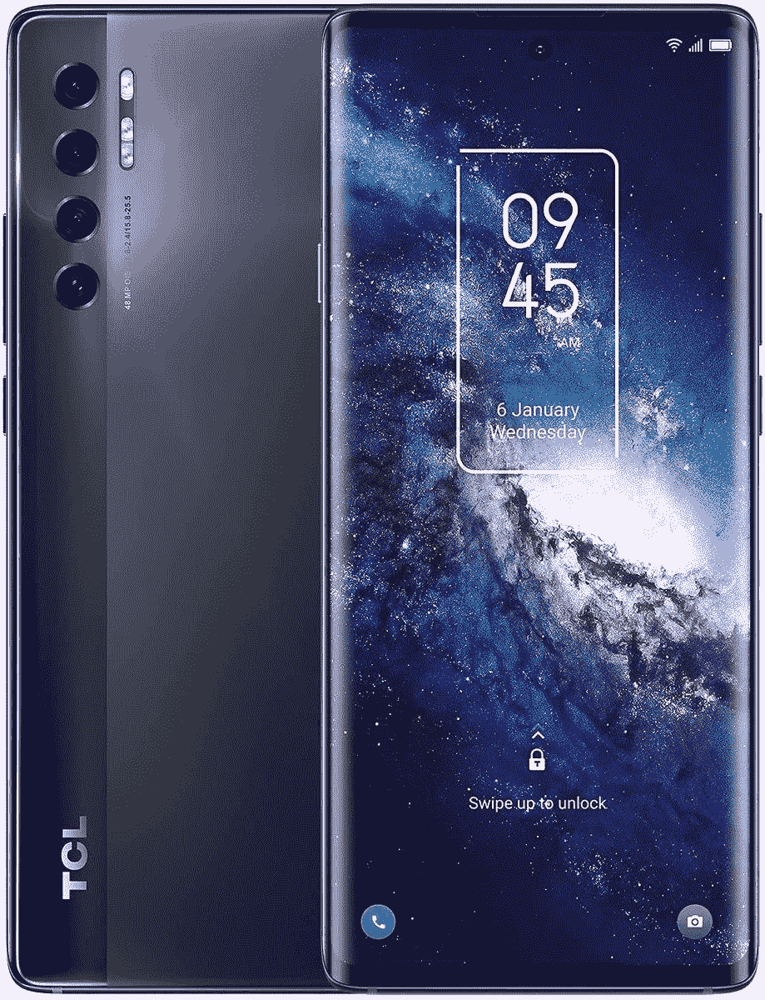
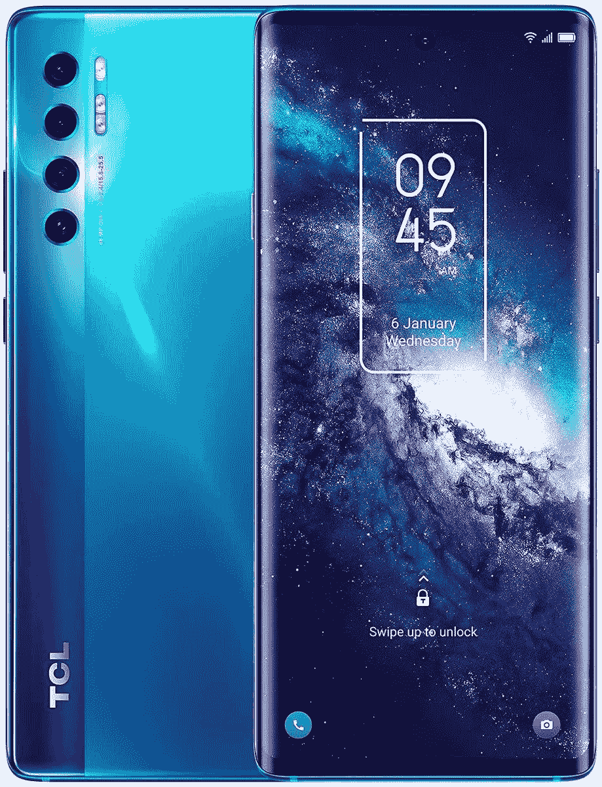

# TCL 20 Pro 颜色:这里是你能买到这款手机的所有颜色！

> 原文：<https://www.xda-developers.com/tcl-20-pro-5g-colors/>

TCL 最近在 TCL 20 系列下推出了一系列新手机。这包括顶级的 TCL 20 Pro 5G、TCL 20 5G、TCL 20L、TCL 20L+、TCL 20S，最后还有 TCL 20 SE。所有这些手机都在不同的地区以不同的价位推出。TCL 20 Pro 5G、TCL 20S 和 TCL 20 SE 已经进入美国市场，而除了 TCL 20S 之外的所有产品都已经在欧洲市场推出。

虽然 TCL 20 系列涵盖了各种价位，但如果你的钱包允许，你会希望得到一款功能最多、规格最好的手机。这样的话就是 TCL 20 Pro 5G 了。

**[TCL 20 Pro 5G 评测:美国稳固的中端选择](https://www.xda-developers.com/tcl-20-pro-5g-review/)**

这款手机配备了价格合理的规格，如骁龙 750G 5G 芯片组，6.67 英寸全高清+分辨率的曲面 AMOLED 显示屏，6GB 内存，256GB 内部存储，以及带有 48MP 主摄像头和 16MP 广角镜头的四摄像头设置。

如果你打算购买 TCL 20 Pro 5G，你可能会想知道它有什么颜色，因为外观和设计也是购买新手机的重要因素。不幸的是，在这方面你没有太多选择。TCL 20 Pro 5G 只有两种颜色——月尘灰和海洋蓝。

 <picture></picture> 

TCL 20 Pro 5G Moondust Gray

##### TCL 20 Pro 5G

月尘灰的颜色看起来简单而优雅，将适合任何人寻找一个适合所有环境和隐形的严肃配色方案。

 <picture></picture> 

TCL 20 Pro 5G Marine Blue

##### TCL 20 Pro 5G

海洋蓝是为那些想要一个闪亮的，有渐变外观的彩色背面。如果你喜欢炫耀你的手机，这种颜色肯定会比其他一些普通和常规的颜色更显眼。

如果你想要更简单、看起来更专业的款式，我们建议你选择月尘灰色款。如果你想要更有趣和闪亮的东西，如果你想让你的手机看起来与众不同，海洋蓝也是一个不错的颜色。如果你要使用外壳，这两种颜色都可以，除非你选择透明的外壳来展示手机的背面。

一旦你决定了颜色，你应该看看我们关于[最佳 TCL 20 Pro 5G 屏幕保护套](https://www.xda-developers.com/best-tcl-20-pro-5g-screen-protector/)和[最佳 TCL 20 Pro 5G 保护套](https://www.xda-developers.com/best-tcl-20-pro-5g-cases/)的指南。