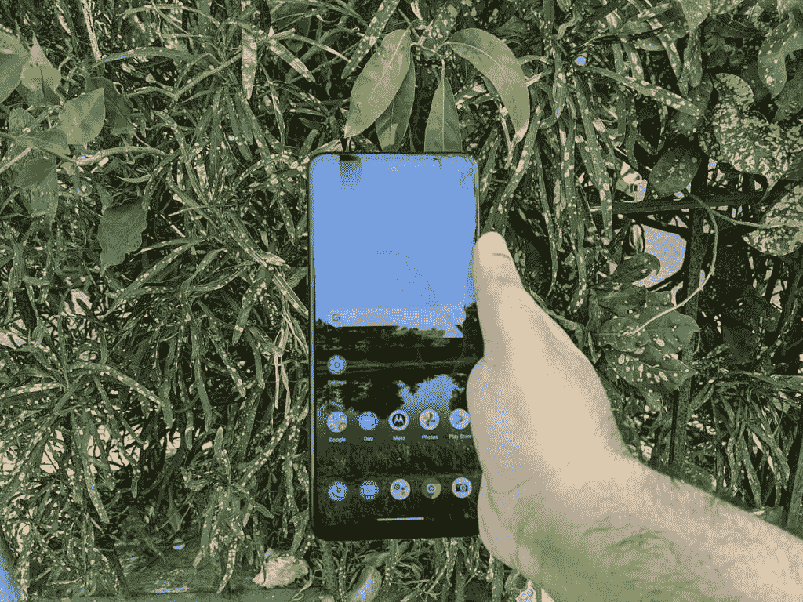
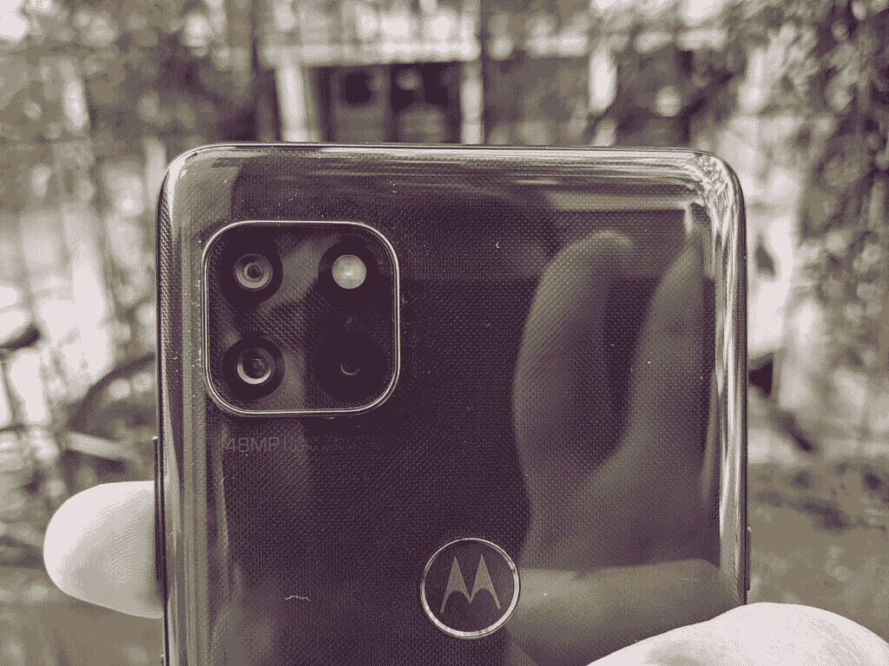

# TCL 20 Pro 5G vs 摩托罗拉 One 5G 王牌:该买哪款手机？

> 原文：<https://www.xda-developers.com/tcl-20-pro-5g-vs-motorola-one-5g-ace/>

TCL 20 Pro 5G 是该公司最新的旗舰智能手机。它不会与[的 iPhone 12](https://www.xda-developers.com/apple-iphone-12-series/) 或[的 Galaxy S21](https://www.xda-developers.com/samsung-galaxy-s21/) 竞争，但会在中端市场竞争。如果你想买一部新的中端 Android 手机，并且不知道是选择 TCL 20 Pro 5G 还是摩托罗拉 One 5G Ace，我们可以帮助你。在本文中，我们将对比 TCL 20 Pro 5G 和摩托罗拉 One 5G Ace，看看这两款 Android 手机如何相互抗衡。

在我们开始之前，您可能还想看看我们的 [TCL 20 Pro 5G 与三星 Galaxy A52 5G](https://www.xda-developers.com/tcl-20-pro-5g-vs-samsung-galaxy-a52-5g/) 的比较，三星是这一领域的领导者之一。

**浏览本指南:**

## TCL 20 Pro 5G vs 摩托罗拉 One 5G Ace:规格

| 

规范

 | 

TCL 20 Pro 5G

 | 

摩托罗拉一个 5G 王牌

 |
| --- | --- | --- |
| **尺寸和重量** | 

*   164.2 x 73.8 x 9.07mm 毫米
*   190 克

 | 

*   166.1 x 76.1 x 9.9mm 毫米
*   212 克

 |
| **显示** | 

*   6.67 英寸弧形 AMOLED
*   全高清+ (2400 x 1080)分辨率
*   60Hz 刷新率
*   700 尼特峰值亮度
*   100% DCI-P3
*   PixelWorks i6 处理器

 | 

*   6.7 英寸液晶显示器
*   全高清+ (2400 x 1080)分辨率
*   60Hz 刷新率

 |
| **SoC** | 

*   高通骁龙 750 克
    *   2x ARM Cortex-A77 @ 2.2GHz
    *   6x ARM Cortex-A55 @ 1.8GHz
*   Adreno 619 GPU
*   8 纳米工艺

 | 

*   高通骁龙 750 克
    *   2x ARM Cortex-A77 @ 2.2GHz
    *   6x ARM Cortex-A55 @ 1.8GHz
*   Adreno 619 GPU
*   8 纳米工艺

 |
| **RAM 和存储器** | 

*   6GB 内存
*   256GB 存储空间
*   MicroSD 卡支持

 | 

*   6GB 内存
*   128GB 存储
*   MicroSD 卡支持

 |
| **后置摄像头** | 

*   **主:** 48MP 索尼 IMX582 主，f/1.8，0.8μm，OIS
*   **次要:** 16MP 超广角，123 FoV，f/2.4，1.0μm
*   第三级: 5MP 宏，f/2.2
*   第四系:2MP 深度，f/2.4
*   **视频**:高达 4K@30

 | 

*   **主:** 48MP 主，f/1.7，0.8μm
*   **二级:** 8MP 广角，f/2.2，1.12μm
*   **第三级:** 2MP 微距，f/2.4，1.75μm
*   **视频**:高达 4K@30

 |
| **前置摄像头** | 

*   32MP，f/2.45，定焦，80.4 FoV
*   视频:高达 4K@30

 | 

*   1600 万像素，f/2.2，定焦
*   视频:高达 1080@30

 |
| **电池** | 

*   4，500 毫安时电池
*   高达 18W 有线充电功率(包装盒内)
*   高达 15W 的无线充电

 | 

*   5000 毫安时电池
*   高达 15W 有线充电

 |
| **连通性** | 

*   乐队(北美):
    *   2G 频段:GSM 850/900/1800/1900
    *   3G 频段:UMTS B1/2/4/5/8
    *   4G LTE 频段:1/2/3/4/5/7/8/12(MFBI)/13/14/17/20/25/26/28/29/30/38/40/41/48/66/71
    *   5G 频段:n2/5/7/41/66/71/78
    *   4×4 MIMO(下行链路)B2/1966 年 4 月 7 日/30 日
*   国家足球联盟
*   WiFi 802.11 . b/g/n/AC(2.4 GHz+5 GHz)
*   蓝牙 5.1
*   USB 型

 | 

*   乐队:
    *   2G 频段:GSM 850/900/1800/1900
    *   3G 频段:UMTS B1/2/4/5/8
    *   4G LTE 频段:1/2/3/4/5/7/8/12/13/14/17/18/19/20/25/26/29/30/38/39/40/41/66/71
    *   5G 频段:n2/5/25/41/66/71
*   国家足球联盟
*   WiFi 802.11 . b/g/n/AC(2.4 GHz+5 GHz)
*   蓝牙 5.1
*   USB 型

 |
| **其他特征** | 

*   显示指纹扫描仪

 | 

*   后置指纹扫描仪
*   IP52 防水等级

 |
| **软件** |  |  |

* * *

## 设计和展示

TCL 20 Pro 5G 和摩托罗拉 One 5G Ace 在正面看起来非常相似，两者都有一个用于自拍相机的居中打孔切口，并且只有最小的边框。但 TCL 手机的背面采用了双色设计，左边是玻璃条纹，其余部分为哑光表面。相比之下，摩托罗拉选择在 One 5G Ace 上保留全塑料背板。这并不是两款手机设计上的唯一区别。摩托罗拉手机还配备了后置指纹传感器和方形摄像头模块，而 TCL 20 Pro 5G 配备了内置指纹传感器和垂直摄像头设置。

在显示屏方面，TCL 手机采用了 6.67 英寸的全高清+(1080 x 2400 像素)AMOLED 显示屏。另一方面，Moto One 5G Ace 配备了 6.7 英寸全高清+(1080 x 2400 像素)液晶屏幕。

虽然设计是主观的，很多人更喜欢塑料而不是玻璃，以获得更高的耐用性，但 TCL 手机的显示屏正面确实得分，其 AMOLED 面板将比摩托罗拉 One 5G Ace 提供更多的活力和对比度。

## SoC、RAM 和存储

 <picture></picture> 

Motorola One 5G Ace

摩托罗拉 One 5G Ace 和 TCL 20 Pro 5G 在处理器和内存方面的规格相同。两款智能手机都采用高通骁龙 750G SoC 和 6GB 内存。然而，摩托罗拉手机只能获得 128GB 的板载存储空间，而 TCL 手机有 256GB 的存储空间。

两款手机都有一个 microSD 卡插槽，支持高达 1TB 的卡。但是每个人都喜欢有更多的内部存储空间。因此，尽管 TCL 20 Pro 5G 可能更适合购买更多内置存储，但你总是可以花 20-30 美元为摩托罗拉手机购买 128GB 或 256GB 的 microSD 卡。此外，即使是 128GB 的存储对大多数人来说也足够了。

## TCL 20 Pro 5G vs 摩托罗拉 One 5G 王牌:相机

在 raw 规格方面，TCL 20 Pro 5G 采用了四后置摄像头设置，主摄像头为 48MP。此外，你将获得一个 1600 万像素的广角摄像头，一个 500 万像素的微距拍摄器和一个 200 万像素的深度传感器。船上还有一个 32MP 自拍相机。

另一方面，摩托罗拉 One 5G Ace 背面装有一个三摄像头，一个 4800 万像素的摄像头。还有一个 800 万像素的广角摄像头和一个 200 万像素的微距摄像头。你还会得到一个 1600 万像素的前置摄像头。

 <picture></picture> 

Motorola One 5G Ace cameras

尽管与摩托罗拉手机相比，TCL 手机配备了更高分辨率的广角摄像头和额外的深度传感器，但这两款手机的真实相机性能相当平庸，你可以在我们对 [TCL 20 Pro 5G](https://www.xda-developers.com/tcl-20-pro-5g-review/) 和[摩托罗拉 One 5G One(又名 Moto G 5G)](https://www.xda-developers.com/moto-g-5g-review-a-5g-phone-goes-back-to-the-basics/) 的评论中看到。

话虽如此，TCL 手机似乎确实能够拍摄更好的照片，希望未来的软件更新将进一步提高其相机输出。TCL 手机的另一个积极方面是支持光学图像稳定(OIS)，这将有助于您拍摄稳定的照片和视频。

## 电池和连接

这是摩托罗拉 One 5G 王牌几乎摧毁 TCL 20 Pro 5G 的一个部门。尽管摩托罗拉手机的 5000 毫安时电池仅比 TCL 20 Pro 5G 的[电池大 500 毫安时，One 5G Ace 的屏幕时间和总使用时间是其两倍。](https://www.xda-developers.com/tcl-20-pro-5g-specifications/)

在我们对 TCL 20 Pro 5G 的测试中，我们看到 TCL 手机一次充电的屏幕时间约为 5 - 5.5 小时，而摩托罗拉手机一次充电的屏幕时间为 11.5 小时。

 <picture></picture> 

TCL 20 Pro 5G back

两款手机都支持快速充电，TCL 提供 18W 支持，摩托罗拉提供 15W 支持。TCL 还在包装盒中捆绑了一个兼容的 18W 快速充电器，但你只能在摩托罗拉 One 5G Ace 的包装盒中获得 10W 充电器。此外，20 Pro 5G 还支持无线充电。

如果电池寿命对你来说很重要，摩托罗拉 One 5G Ace 比 TCL 手机有明显的优势，除非你真的想要无线充电。

在连接方面，从它们的名字可以清楚地看出，摩托罗拉 One 5G Ace 和 [TCL 20 Pro 5G pack 5G 都支持](https://www.xda-developers.com/tcl-20-pro-5g-bands/)。然而，你只能在两部手机上使用低于 6GHz 的频段。而且这两款手机目前都只支持 T-Mobile 的 5G 网络。尽管摩托罗拉手机预计将在未来几周内获得对 AT & T 5G 和威瑞森 5G 的支持，但 TCL 20 Pro 5G 将在未来几天内仅获得威瑞森 5G 的支持。因此，如果你打算在 T 上使用你的下一部手机，购买摩托罗拉 One 5G Ace 更有意义。

## 操作系统和 Android 更新

 <picture></picture> 

Motorola One 5G Ace

TCL 20 Pro 5G 开箱运行 Android 11，自带 TCL UI。不过，摩托罗拉手机在我的 UX 上使用的是旧的 Android 10 系统。此外，摩托罗拉只打算将一个主要的 Android 更新推送到 One 5G Ace，所以它不会在 Android 11 之后得到任何东西。

在安全更新方面，也只承诺两年的更新。相比之下，TCL 表示将为 20 Pro 5G 提供两个主要的 Android 更新，安全更新将持续到 2024 年 4 月。

## 价格和颜色选项

TCL 销售的 20 Pro 5G 只有一种存储版本，价格为 500 美元。然而，这款手机将有两种颜色可供选择——月尘灰和海洋蓝。摩托罗拉 One 5G Ace 也只有一种型号，售价为 400 美元。此外，它只有一种颜色可供选择——磨砂银。

TCL 20 Pro 5G 和 One 5G Ace 的价格相差 100 美元，这让摩托罗拉手机比 TCL 设备更有优势。

## 结论

摩托罗拉 One 5G Ace 和 TCL 20 Pro 5G 有许多类似的规格，但摩托罗拉手机在一些领域占据主导地位，而 TCL 手机在其他领域具有优势。如果你想要 AMOLED 显示屏，更新的 Android 版本，稍微好一点的摄像头，更多的内部存储，你应该考虑 TCL 20 Pro 5G。然而，如果你希望节省一些钱，需要更长的电池寿命，并访问美国电话电报公司 5G 网络，摩托罗拉 One 5G Ace 将更有意义。

这两款手机你打算买哪一款？请在评论区告诉我们。

 <picture></picture> 

TCL 20 Pro 5G

##### TCL 20 Pro 5G

TCL 20 Pro 5G 是该公司 20 系列中的顶级手机。它封装了骁龙 750G SoC，运行在 Android 11 上。

 <picture></picture> 

Motorola One 5G Ace

##### 摩托罗拉一个 5G 王牌

摩托罗拉 One 5G Ace 是一款中档 5G 手机，运行 Android 10，采用高通骁龙 750G SoC。

如果您已经购买了手机，请查看我们关于配件、外壳、屏幕保护套等的建议: