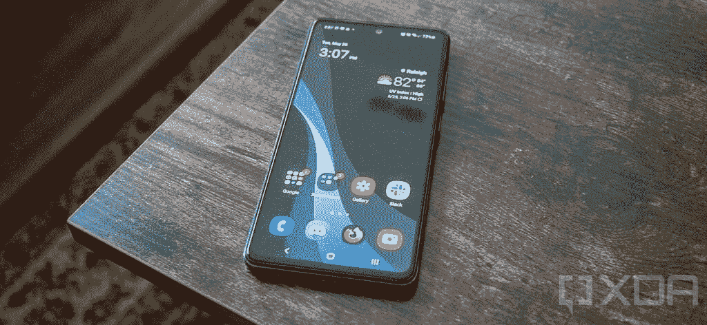
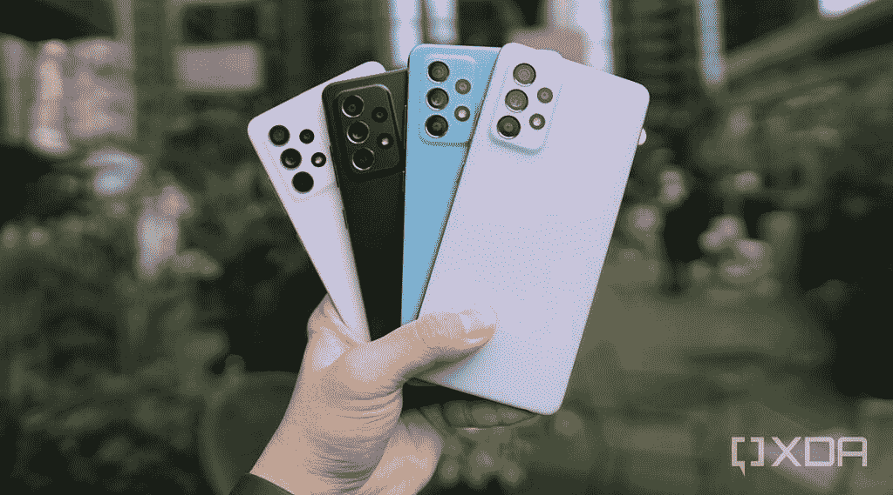
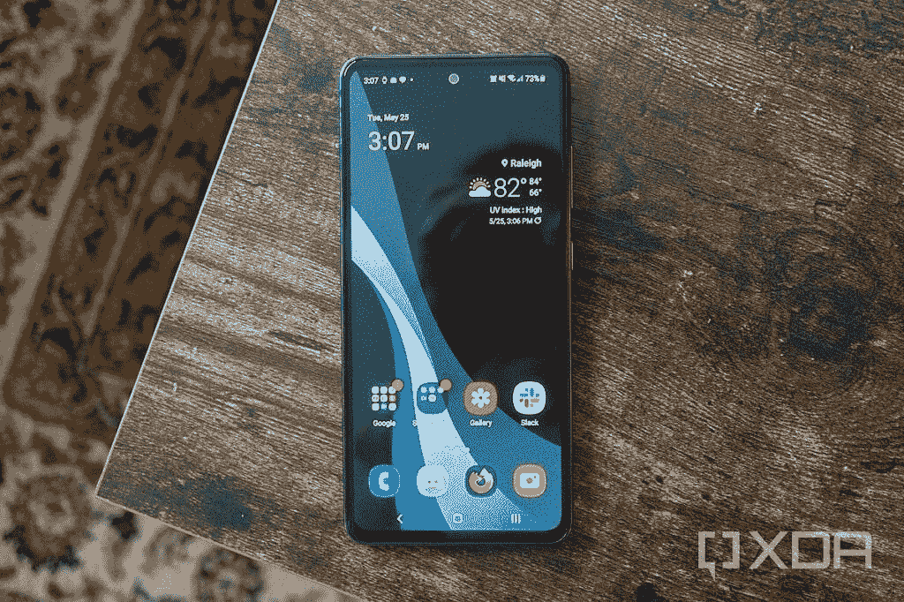
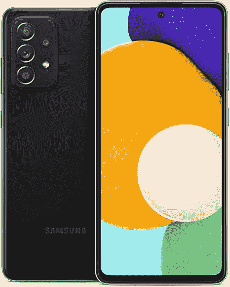

# TCL 20 Pro 5G vs 三星 Galaxy A52 5G:该买哪个？

> 原文：<https://www.xda-developers.com/tcl-20-pro-5g-vs-samsung-galaxy-a52-5g/>

TCL 20 Pro 5G 已经登陆美国。这是该公司 2021 年的旗舰产品，具有相当不错的功能和规格。然而，中端市场已经包括了许多有能力的设备，包括[三星 Galaxy A52 5G](https://www.xda-developers.com/samsung-galaxy-a52/) 。如果你想知道这两款手机买哪一款更有意义，我们可以帮助你。在本文中，我们将 TCL 20 Pro 5G 与三星 Galaxy A52 5G 进行对比，看看这两款手机如何相互抗衡。

**浏览本指南:**

## TCL 20 Pro 5G vs 三星 Galaxy A52 5G:规格

| 

规范

 | 

TCL 20 Pro 5G

 | 

三星 Galaxy A52 5G

 |
| --- | --- | --- |
| **尺寸和重量** | 

*   164.2 x 73.8 x 9.07mm 毫米
*   190 克

 | 

*   159.9 x 75.1 x 8.4mm 毫米
*   189 克

 |
| **显示** | 

*   6.67 英寸弧形 AMOLED
*   全高清+ (2400 x 1080)分辨率
*   60Hz 刷新率
*   700 尼特峰值亮度
*   100% DCI-P3
*   PixelWorks i6 处理器

 | 

*   6.5 英寸 Super AMOLED
*   全高清+ (2400 x 1080)分辨率
*   120 赫兹刷新率

 |
| **SoC** | 

*   高通骁龙 750 克
    *   2x ARM Cortex-A77 @ 2.2GHz
    *   6x ARM Cortex-A55 @ 1.8GHz
*   Adreno 619 GPU
*   8 纳米工艺

 | 

*   高通骁龙 750 克
    *   2x ARM Cortex-A77 @ 2.2GHz
    *   6x ARM Cortex-A55 @ 1.8GHz
*   Adreno 619 GPU
*   8 纳米工艺

 |
| **RAM 和存储器** | 

*   6GB 内存
*   256GB 存储空间
*   MicroSD 卡支持

 | 

*   6GB 内存
*   128GB 存储
*   MicroSD 卡支持

 |
| **后置摄像头** | 

*   **主:** 48MP 索尼 IMX582 主，f/1.8，0.8μm，OIS
*   **次要:** 16MP 超广角，123 FoV，f/2.4，1.0μm
*   第三级: 5MP 宏，f/2.2
*   第四系: 2MP 深度，f/2.4
*   **视频**:高达 4K@30

 | 

*   **主:** 64MP 主，f/1.8，0.8μm
*   **二级:** 12MP 广角，f/2.2，1.12μm
*   **第三级:** 5MP 微距，f/2.4，1.12μm
*   **第四系:** 5MP 深度，f/2.4，1.12μm
*   **视频**:高达 4K@30

 |
| **前置摄像头** | 

*   32MP，f/2.45，定焦，80.4 FoV
*   视频:高达 4K@30

 |  |
| **电池** | 

*   4，500 毫安时电池
*   高达 18W 有线充电功率(包装盒内)
*   高达 15W 的无线充电

 | 

*   4，500 毫安时电池
*   高达 25W 有线充电

 |
| **连通性** | 

*   乐队(北美):
    *   2G 频段:GSM 850/900/1800/1900
    *   3G 频段:UMTS B1/2/4/5/8
    *   4G LTE 频段:1/2/3/4/5/7/8/12(MFBI)/13/14/17/20/25/26/28/29/30/38/40/41/48/66/71
    *   5G 频段:n2/5/7/41/66/71/78
    *   4×4 MIMO(下行链路)B2/1966 年 4 月 7 日/30 日
*   国家足球联盟
*   WiFi 802.11 . b/g/n/AC(2.4 GHz+5 GHz)
*   蓝牙 5.1
*   USB 型

 | 

*   乐队:
    *   2G 频段:GSM 850/900/1800/1900
    *   3G 频段:UMTS B1/2/4/5/8
    *   4G LTE 频段:1/2/3/4/5/7/12/14/20/29/30/38/39/40/41/46/66
    *   5G 频段:n1/3/5/7/8/20/28/38/40/41/66/78
*   国家足球联盟
*   WiFi 802.11 . b/g/n/AC(2.4 GHz+5 GHz)
*   蓝牙 5.0
*   USB 型

 |
| **其他特征** | 

*   显示指纹扫描仪

 | 

*   显示指纹扫描仪
*   IP67 防水等级

 |
| **软件** |  |  |

## 设计和展示

 <picture></picture> 

TCL 20 Pro 5G

除了居中的打孔切口、最小的边框和背面的哑光处理，TCL 20 Pro 5G 和三星 Galaxy A52 5G 看起来非常不同。TCL 的正面和背面都有弯曲的边缘，而 A52 的显示屏和背面都是平面的。此外，TCL 手机的背板采用了双色设计，左边缘有一条玻璃条纹。

在显示屏方面，TCL 配备了 6.67 英寸全高清+(1080 x 2400 像素)AMOLED 显示屏，刷新率为 60 赫兹，而 A52 5G 配备了 6.5 英寸全高清+(1080 x 2400 像素)Super AMOLED 显示屏，刷新率为 120 赫兹。

A52 更快的刷新率使这款手机比 TCL 20 Pro 5G 更具优势。此外，尽管 20 Pro 5G 上的 AMOLED 面板很好，但三星在其手机中使用了非常棒的超级 AMOLED 面板。

## SoC、RAM 和存储

 <picture></picture> 

Samsung Galaxy A52 5G

三星 Galaxy A52 5G 和 TCL 20 Pro 5G 在 SoC、RAM 和存储方面几乎处于同一水平。两款手机都使用高通骁龙 750G SoC，搭配 6GB 内存。TCL 手机配备了 256GB 的内部存储，而 Galaxy A52 5G 则配备了 128GB 的板载存储。两款手机上都有一个 microSD 卡插槽。

尽管 TCL 手机的存储空间更大，但 128GB 对大多数人来说还是绰绰有余的。因此，您可以期待两款智能手机的性能不相上下。

## TCL 20 Pro 5G vs 三星 Galaxy A52 5G:相机

 <picture></picture> 

TCL 20 Pro 5G back

TCL 20 Pro 5G 和三星 A52 5G 都包括四后置摄像头设置，但单个拍摄者不同。TCL 配备了 4800 万像素的主摄像头、1600 万像素的广角摄像头、500 万像素的微距摄像头和 200 万像素的深度传感器。在三星 Galaxy A52 5G 上，你将获得 64MP 主拍摄器，12MP 广角相机，5MP 微距相机和 5MP 深度传感器。这两款手机都能够以 30 帧/秒的速度捕捉 4K 视频。

在我们的 [TCL 20 Pro 5G 评测](https://www.xda-developers.com/tcl-20-pro-5g-review/)和 [Galaxy A52 5G 评测](https://www.xda-developers.com/samsung-galaxy-a52-5g-review/)中，我们发现 TCL 手机的相机性能令人失望，而三星手机拍摄的照片令人印象深刻，尽管有时过于饱和。为了自拍的需要，这两款手机都在前面装了一个 32MP 的摄像头。

总的来说，如果相机性能是你的优先选择，三星 Galaxy A52 5G 是一个更好的选择。

## 电池和连接

 <picture></picture> 

Samsung Galaxy A52 5G - Only Black color is sold in the US

三星 Galaxy A52 5G 和 TCL 20 Pro 5G 都装有 4,500mAh 电池。虽然 TCL 手机支持高达 18W 的快充，但 A52 5G 支持高达 25W 的快充。TCL 还在盒子里捆绑了 18W 的快速充电器，而 A52 盒子里只有 15W 的充电器。

尽管两款手机的电池尺寸相同，但在我们的评测中，它们的电池性能却大相径庭。虽然 TCL 20 Pro 5G 难以坚持一整天，但三星手机可以轻松坚持两天。因此，很明显，三星在软件优化方面做了一些正确的事情，特别是考虑到三星手机包的刷新率更快。

谈到连接选项，这两款手机再次拥有几乎相同的规格。你将获得 5G 支持，Wi-Fi 802.11ac，NFC，以及 USB Type-C 端口。而且 TCL 20 Pro 5G 包蓝牙 5.1，而 A52 5G 自带蓝牙 5.0。

在 5G 运营商支持方面，三星 Galaxy A52 5G 可以在美国所有三大网络的 6GHz 以下频段上工作。另一方面，TCL 20 Pro 5G 目前只支持 T-Mobile 的 sub-6GHz 5G 频段。据说威瑞森 5G 支持即将到来。

## 操作系统和软件更新

Android 11 在 TCL 20 Pro 5G 和三星 Galaxy A52 5G 中都有。此外，虽然 TCL 手机使用 TCL UI，但 A52 5G 只有一个 UI。两款手机上都有大量膨胀软件。

在软件更新方面，如果 [TCL 加拿大网站](https://www.tcl.com/ca/en/products/mobile/tcl-20-series/tcl-20-pro-5g)是任何迹象，20 Pro 5G 将获得两个主要的 Android 更新和安全更新，直到 2024 年 4 月。另一方面，三星 Galaxy A52 5G 据说将获得三年的操作系统更新，四年的安全更新。

三星的更新承诺表明软件支持期很长，这让它在更新方面占据了优势。如果你不打算把你的新手机保留那么久，TCL 的更新承诺也不差。

## TCL 20 Pro 5G 与三星 Galaxy A52 5G:定价和颜色

 <picture></picture> 

Samsung Galaxy A52 5G

TCL 20 Pro 5G 在美国以单一存储版本销售，售价 500 美元。这款手机有海洋蓝和月尘灰两种颜色。甚至三星 Galaxy A52 5G 的 6GB + 128GB 型号也以 500 美元的价格推出，但此后一直打折，目前零售价仅为 425 美元。该公司只在美国销售这款手机的黑色变种。

明显较低的定价使三星手机比 TCL 20 Pro 5G 更具吸引力。

## 结论

尽管 TCL 20 Pro 5G 和三星 Galaxy A52 5G 在很多方面都很相似，但三星手机显然在几乎所有方面都超过了 20 Pro 5G。此外，你可以买到比 TCL 20 Pro 5G 便宜得多的 Galaxy A52 5G，这使得两款手机之间的竞争相当一边倒。如果 TCL 20 Pro 5G 在未来几个月大幅打折，那么它可能值得考虑。但就目前而言，购买三星 Galaxy A52 5G 更有意义。

 <picture></picture> 

Samsung Galaxy A52 5G

##### 三星 Galaxy A52 5G

三星 Galaxy A52 5G 是目前你可以买到的最便宜的安卓手机之一，拥有 120Hz 的屏幕，5G 连接和安卓 11。

 <picture></picture> 

TCL 20 Pro 5G

##### TCL 20 Pro 5G

TCL 20 Pro 5G 是该公司 2021 年的旗舰产品。它采用骁龙 750G SoC 和 4,500mAh 电池。

如果您已经购买了手机，请查看我们关于配件、外壳、屏幕保护套等的建议:

*   TCL 20 Pro 5G:
*   三星 Galaxy A52: