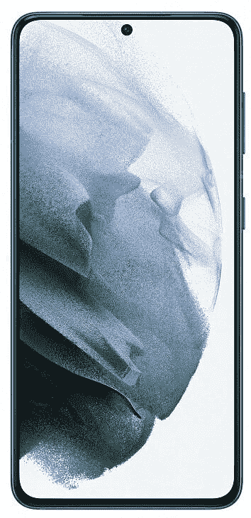
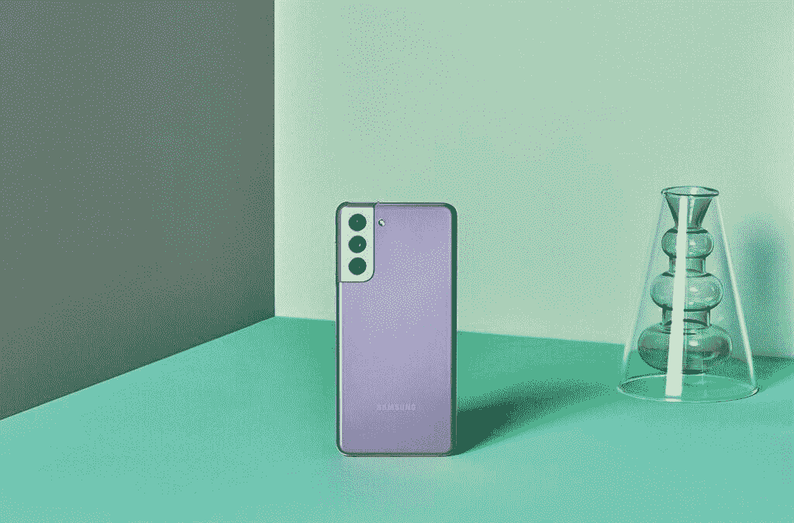
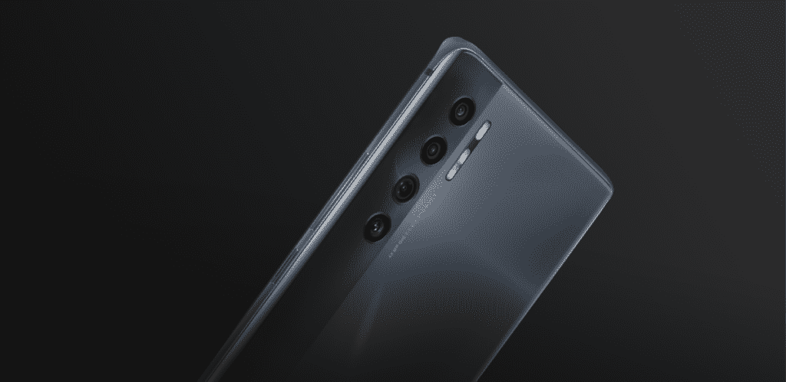
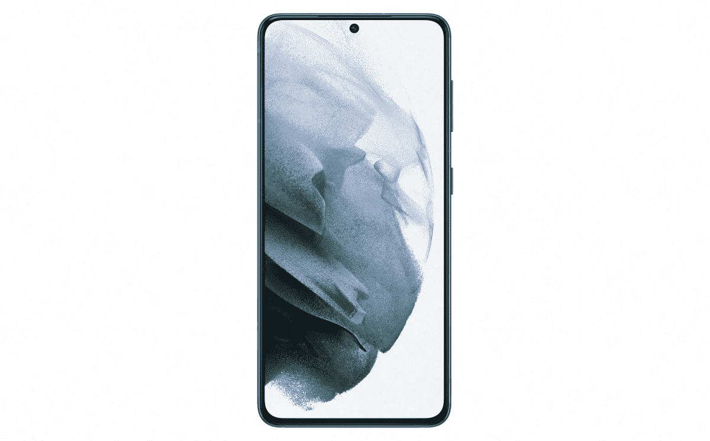

# TCL 20 Pro 5G vs 三星 Galaxy S21 5G:该买哪个？

> 原文：<https://www.xda-developers.com/tcl-20-pro-5g-vs-samsung-galaxy-s21-5g/>

6 月，TCL 在美国推出了新的 TCL 20 系列。这一阵容以该公司的 [TCL 20 Pro 5G](https://www.xda-developers.com/tcl-20-pro-5g-review/) 为标题，这是一款功能强大的中档规格智能手机。如果你在市场上购买一部新的 Android 手机，并想知道购买 20 Pro 5G 并节省一些钱是否有意义，或者购买[三星 Galaxy S21](https://www.xda-developers.com/samsung-galaxy-s21/) 以获得顶级性能，我们可以帮助你。

在本文中，我们将比较 TCL 旗舰版和 Galaxy S21 5G，看看这两款手机哪一款更适合您。

**浏览本指南:**

## TCL 20 Pro 5G vs 三星 Galaxy S21 5G:规格

| 

规范

 | 

TCL 20 Pro 5G

 | 

三星 Galaxy S21 5G

 |
| --- | --- | --- |
| **尺寸和重量** | 

*   164.2 x 73.8 x 9.07mm 毫米
*   190 克

 | 

*   151.7 x 71.2 x 7.9mm 毫米
*   169 克

 |
| **显示** | 

*   6.67 英寸弧形 AMOLED
*   全高清+ (2400 x 1080)分辨率
*   60Hz 刷新率

 | 

*   6.2 英寸动态 AMOLED
*   全高清+ (2400 x 1080)分辨率
*   120 赫兹刷新率

 |
| **SoC** | 

*   高通骁龙 750 克
    *   2x ARM Cortex-A77 @ 2.2GHz
    *   6x ARM Cortex-A55 @ 1.8GHz
*   Adreno 619 GPU
*   8 纳米工艺

 | 

*   高通骁龙 888
    *   1 个 Kryo 680(Cortex-X1)2.84 GHz
    *   3 个 Kryo 680(Cortex-A78)2.42 GHz
    *   4x Kryo 680(Cortex-A55)1.80 GHz
*   肾上腺素 660
*   5 纳米工艺

 |
| **RAM 和存储器** | 

*   6GB 内存
*   256GB 存储空间
*   MicroSD 卡支持

 | 

*   8GB 内存
*   128/ 256GB 存储空间

 |
| **后置摄像头** | 

*   **主:** 48MP 索尼 IMX582 主，f/1.8，0.8μm，OIS
*   **二级:** 16MP 超广角，123 FoV，f/2.4，1.0μm
*   第三级: 5MP 宏，f/2.2
*   第四系: 2MP 深度，f/2.4
*   **视频**:高达 4K@30

 | 

*   **初级:** 12MP 广角，f/1.8，1.8μm，OIS
*   **次要:** 12MP 超广角，f/2.2，1.4μm，120
*   **第三:** 64MP 长焦，f/2.0，0.8μm
*   **视频**:最高 8K@24

 |
| **前置摄像头** | 

*   32MP，f/2.45，定焦，80.4 FoV

 |  |
| **电池** | 

*   4，500 毫安时电池
*   高达 18W 有线充电功率(包装盒内)
*   高达 15W 的无线充电

 | 

*   4000 毫安时电池
*   高达 25W 有线充电
*   10W+无线充电

 |
| **连通性** | 

*   乐队(北美):
    *   2G 频段:GSM 850/900/1800/1900
    *   3G 频段:UMTS B1/2/4/5/8
    *   4G LTE 频段:1/2/3/4/5/7/8/12(MFBI)/13/14/17/20/25/26/28/29/30/38/40/41/48/66/71
    *   5G 频段:n2/5/7/41/66/71/78
    *   4×4 MIMO(下行链路)B2/1966 年 4 月 7 日/30 日
*   国家足球联盟
*   WiFi 802.11 . b/g/n/AC(2.4 GHz+5 GHz)
*   蓝牙 5.1
*   USB 型

 | 

*   2G、3G、4G、5G
*   国家足球联盟
*   WiFi 802.11ax (2.4GHz + 5GHz)
*   蓝牙 5.0
*   USB 型

 |
| **其他特征** | 

*   显示指纹扫描仪

 | 

*   显示指纹扫描仪
*   IP68 防水等级

 |
| **软件** |  |  |

## 设计和展示

 <picture></picture> 

TCL 20 Pro 5G

三星 Galaxy S21 5G 和 TCL 20 Pro 5G 在设计上有不少相似之处。这两款手机都带有一个居中的自拍摄像头打孔切口，背面采用哑光处理，以及垂直的后置摄像头布局。值得注意的是，TCL 20 Pro 5G 背面的哑光涂层并没有延伸到整个背板，因为这款手机有一条细长的玻璃条纹，形成了双色外观。TCL 手机的正面也有一个 3D 玻璃盖，而 Galaxy S21 5G 的正面是平的。

虽然 [20 Pro 5G](https://www.xda-developers.com/tcl-20-pro-5g-specifications/) 采用 6.67 英寸全高清+ AMOLED 显示屏，刷新率为 60Hz，支持 HDR10，但 Galaxy S21 5G 采用 6.2 英寸全高清+ AMOLED 屏幕，刷新率为 120Hz，支持 HDR10。这两款智能手机还配备了内置指纹传感器。

虽然这两款手机的设计都没有任何特别的缺点，但三星在显示屏方面的得分更高，刷新率更快。TCL 手机的显示屏无论从哪方面来看都不差，对大多数消费者来说都绰绰有余。

## SoC、RAM 和存储

 <picture></picture> 

Samsung Galaxy S21 5G

随着三星在其 Galaxy 21 5G 手机中选择了旗舰骁龙 888 (S888) SoC，事情变得有点一边倒。8GB 内存和高达 256GB 的板载存储加入了三星手机中的 S888 芯片。

在 TCL 20 Pro 5G 中，存在中端骁龙 750G (S750G) SoC，仅加入 6 GB RAM 和 256GB 内部存储。这款手机还包括一个 microSD 卡插槽，用于进一步扩展存储空间。

三星 Galaxy S21 5G 显然是一款更强大的手机，可以轻松应对任何扔向它的东西。TCL 20 Pro 5G 可能不如 Galaxy S21 强大，但其 S750G SoC 的能力相当不错，所以除非你打算在顶级设置下玩图形密集型游戏，否则它就足够了。

## TCL 20 Pro 5G vs 三星 Galaxy S21 5G:相机

 <picture></picture> 

TCL 20 Pro 5G

在原始相机规格方面，TCL 20 Pro 5G 上有一个四后置摄像头设置，包括一个 48MP 主摄像头，16MP 超广角摄像头，5MP 微距摄像头和一个 2MP 深度传感器。你还可以在主摄像头和 32MP 自拍相机上获得光学图像稳定(OIS)支持。三星 Galaxy S21 5G 背面只有三个摄像头——一个 12MP 广角主摄像头，一个 12MP 超广角摄像头和一个 64MP 长焦摄像头。主相机和长焦相机都支持 OIS，你还可以获得一个 10MP 的自拍相机。

正如我们所知，原始规格并没有揭示任何手机的全部相机功能。因此，即使 Galaxy S21 5G 采用了分辨率较低的主摄像头，其性能也比 TCL 手机要好。在[我们的评论](https://www.xda-developers.com/tcl-20-pro-5g-review/)中，20 Pro 5G 主射手并不特别令人印象深刻。有些人还会欣赏 S21 5G 中的长焦拍摄器，这是 20 Pro 5G 所缺少的。

## 电池和连接

 <picture></picture> 

Samsung Galaxy S21

TCL 在 20 Pro 5G 中打包了支持 18W 有线快速充电和 15W 无线充电的 4500 mah 电池，而 Galaxy S21 5G 则配备了支持 25W 有线快速充电和 10W+无线充电的 4,000mAh 电池。

虽然这两款手机的电池大小有 500 毫安时的差异，但两者都可以在一次充电的情况下维持一整天的正常使用。

关于连接，Galaxy S21 5G 和 20 Pro 5G 有一套非常相似的选项，三星手机不支持毫米波 5G。此外，Galaxy S21 5G 支持美国的所有 5G 网络。相比之下， [TCL 手机目前只支持](https://www.xda-developers.com/tcl-20-pro-5g-carrier-support/)T-Mobile 5G，威瑞森认证将在未来推出。

## 操作系统和 Android 更新

TCL 20 Pro 5G 和 Galaxy S21 5G 使用其制造商皮肤运行在 Android 11 操作系统上。但是三星已经承诺为 Galaxy S21 5G 提供三年的 Android 更新和四年的安全更新。然而，根据 [TCL Canada 网站](https://www.tcl.com/ca/en/products/mobile/tcl-20-series/tcl-20-pro-5g)的消息，TCL 20 Pro 5G 手机直到 2023 年 4 月才会获得两个主要的 Android 更新和安全更新。

因此，如果软件支持是你主要关心的问题之一，Galaxy S21 5G 比 TCL 手机更有意义。

## TCL 20 Pro 5G 与三星 Galaxy S21 5G:定价和颜色选项

 <picture></picture> 

Rear cameras on TCL 20 Pro 5G

TCL 提供了 20 Pro 5G 的单一存储版本，售价为 499.99 美元。它有海洋蓝和月尘灰两种颜色。三星手机有两种存储版本——128 GB 和 256 GB——售价分别为 699.99 美元和 749.99 美元。您可以购买幻影紫、幻影灰、幻影白和幻影粉。

尽管三星 Galaxy S21 5G 比 TCL 旗舰产品贵 200 美元，但它有几项改进，因此物有所值。

## 结论

现在很明显，三星 Galaxy S21 5G 是一款优于 TCL 20 Pro 5G 的手机。它将提供一流的性能、出色的摄像头和扩展的软件支持。但如果你不需要所有顶级的东西，你可以省下 200 美元，买一部性能不错的 TCL 手机。如果你现在想在 T-Mobile 以外的任何其他网络上使用 5G，Galaxy S21 5G 也更有意义。

 <picture></picture> 

TCL 20 Pro 5G

##### TCL 20 Pro 5G

TCL 20 Pro 5G 是该公司 20 系列中的顶级手机。它装有一个骁龙 750G 的 SoC，运行在 Android 11 上。

 <picture></picture> 

Samsung Galaxy S21 5G

Galaxy S21 是三星 2021 年旗舰产品阵容的起点，包含顶级 SoC、出色的显示屏和 4000 毫安时电池。

如果您已经购买了手机，请查看我们关于配件、外壳、屏幕保护套等的建议: