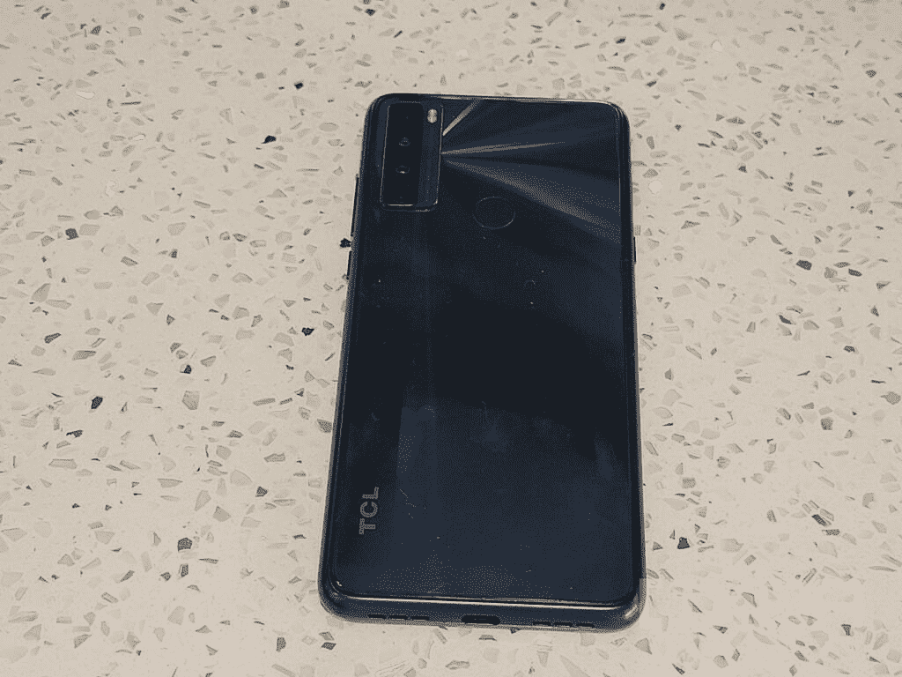
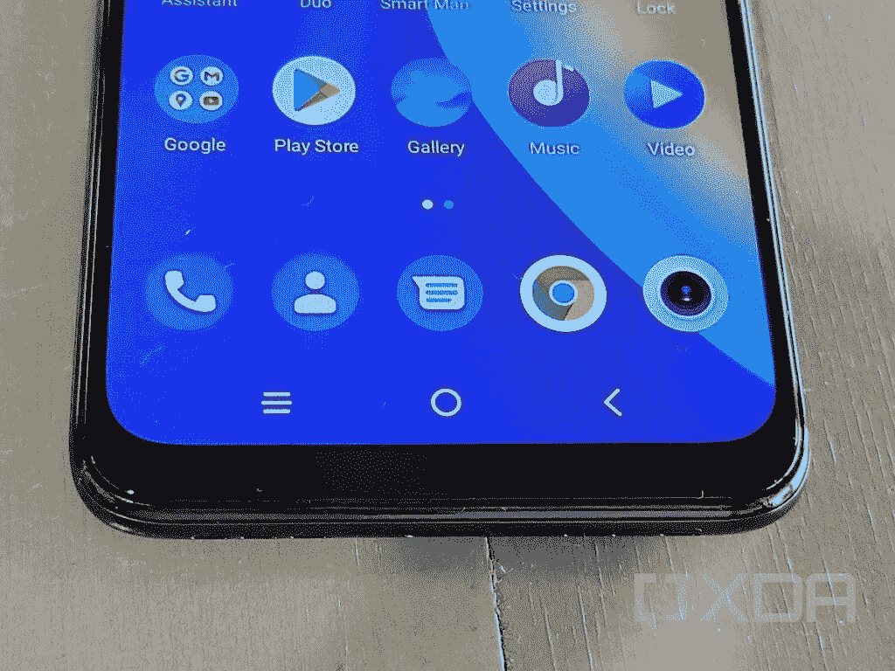
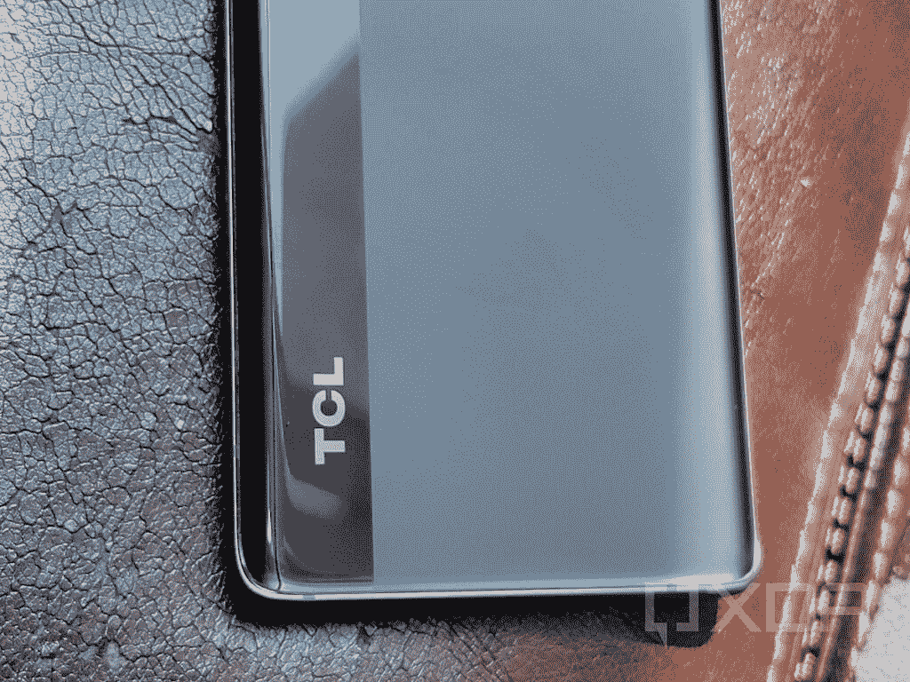
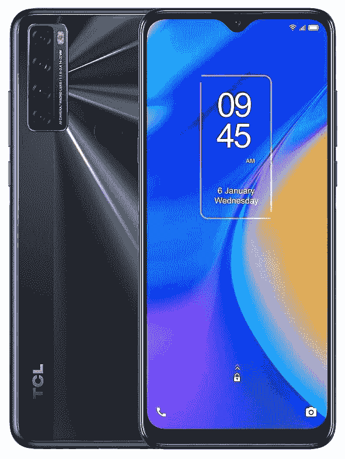

# TCL 20 Pro 5G vs TCL 20 SE:该买哪款手机？

> 原文：<https://www.xda-developers.com/tcl-20-pro-5g-vs-tcl-20-se/>

TCL 在美国扩大了其产品组合，推出了三款新的智能手机，分别是 [TCL 20 系列](https://www.xda-developers.com/tcl-20/)—[TCL 20 Pro 5G](https://www.xda-developers.com/tcl-20-pro-5g-review/)、 [TCL 20S](https://www.xda-developers.com/tcl-20s-review/) 和 [TCL 20 SE](https://www.xda-developers.com/tcl-20-se-review/) 。我们已经[比较了 20 Pro 5G 和 20S](https://www.xda-developers.com/tcl-20-pro-5g-vs-tcl-20s/) ，看看这两款手机你应该买哪一款。在本文中，我们将 TCL 20 Pro 5G 与 TCL 20 SE 进行对比，以检查这两款手机哪一款适合您。

**浏览本指南:**

## TCL 20 Pro 5G 与 TCL 20 SE:规格

| 

规范

 | 

TCL 20 Pro 5G

 | 

TCL 20 SE

 |
| --- | --- | --- |
| **尺寸和重量** | 

*   164.2 x 73.8 x 9.07mm 毫米
*   190 克

 | 

*   172.08 x 77.14 x 9.1mm 毫米
*   206 克

 |
| **显示** | 

*   6.67 英寸 AMOLED
*   全高清+ (1080 x 2400 像素)分辨率
*   60Hz 刷新率
*   700 尼特峰值亮度
*   100% DCI-P3
*   PixelWorks i6 处理器

 | 

*   6.82 英寸液晶显示器
*   高清+ (720 x 1640 像素)分辨率
*   20.5:9 宽高比
*   水滴凹口
*   60Hz 刷新率

 |
| **SoC** | 

*   高通骁龙 750 克
    *   2 个 Kryo 570(Cortex-A77)2.2 GHz
    *   6x Kryo 570(Cortex-A55)1.8 GHz
*   Adreno 619 GPU
*   8 纳米工艺

 | 

*   高通骁龙 460
    *   4x Kryo 240(Cortex-A73)1.6 GHz
    *   4x Kryo 240(Cortex-A53)1.8 GHz
*   肾上腺素 610
*   11 纳米工艺

 |
| **RAM 和存储器** | 

*   6GB 内存
*   256GB 存储空间
*   MicroSD 卡支持

 | 

*   4GB
*   128GB 闪存存储 UFS 2.1
*   MicroSD 卡插槽

 |
| **后置摄像头** | 

*   **主:** 48MP 索尼 IMX582 主，f/1.8，0.8μm，OIS
*   **次要:** 16MP 超广角，123 FoV，f/2.4，1.0μm
*   第三级: 5MP 宏，f/2.2
*   第四系:2MP 深度，f/2.4
*   **视频**:高达 4K@30

 | 

*   **主要:** 48MP，f/2.0，1/2”传感器，79°视场
*   **次要:** 5MP，广角，f/2.2，115 FoV
*   **第三级:** 2MP，微距相机，f/2.4
*   第四纪: 2MP，深度，f/2.4

 |
| **前置摄像头** | 

*   32MP，f/2.45，定焦，80.4 FoV
*   视频:高达 4K@30

 | 

*   1300 万像素定焦
*   视频:高达 1080p@30

 |
| **电池** | 

*   4，500 毫安时电池
*   高达 18W 有线充电功率(包装盒内)
*   高达 15W 的无线充电

 |  |
| **连通性** | 

*   乐队(北美):
    *   2G 频段:GSM 850/900/1800/1900
    *   3G 频段:UMTS B1/2/4/5/8
    *   4G LTE 频段:1/2/3/4/5/7/8/12(MFBI)/13/14/17/20/25/26/28/29/30/38/40/41/48/66/71
    *   5G 频段:n2/5/7/41/66/71/78
    *   4×4 MIMO(下行链路)B2/1966 年 4 月 7 日/30 日
*   国家足球联盟
*   WiFi 802.11 . b/g/n/AC(2.4 GHz+5 GHz)
*   蓝牙 5.1
*   USB 型

 | 

*   乐队(北美):
    *   GSM: 850/900/1800/1900MHz
    *   UMTS: 1/2/4/5/8
    *   LTE:1/2/3/4/5/7/8/12/13/17/28/66
*   无线宽带/宽带/无线
*   蓝牙 5.0
*   USB 型

 |
| **其他特征** |  | 

*   后置指纹扫描仪

 |
| **软件** |  |  |

## 设计和展示

 <picture></picture> 

TCL 20 Pro 5G

TCL 20 Pro 5G 和 20 SE 都针对不同的消费者群体。虽然 TCL 20 Pro 是为中端高端消费者设计的，但 20 SE 是为中端低端或经济型消费者设计的。所以他们的价格标签反映在他们的设计中。

20 Pro 5G 在前面配备了一个带有打孔切口的 3D 玻璃，而 20 SE 则配备了一个带有水滴式凹槽的 2.5D 玻璃。在背面，TCL 在 20 Pro 5G 上采用了双色设计，左侧是一条玻璃条纹，覆盖了垂直的摄像头设置，右侧是哑光表面。另一方面，20 SE 的特点是光滑的背面和垂直的摄像头设置。20 SE 的背板也会随着光线的反射而闪烁。

你还可以在 TCL 20 Pro 5G 上获得 6.67 英寸的全高清+ AMOLED 屏幕，在 TCL 20 SE 上获得 6.82 英寸的高清+ LCD 屏幕。

## SoC、RAM 和存储

 <picture></picture> 

TCL 20 SE

20 Pro 5G 和 20 SE 的价格差异在 TCL 做出的 SoC 选择上也是可见一斑。更贵的 20 Pro 5G 使用高通的骁龙 750G SoC，而 20 SE 配有骁龙 460。如果你不了解这些芯片，骁龙 750G 是一个比骁龙 460 更快更强大的处理器。

此外，20 SE 上只有 4GB 内存和 128GB 内部存储空间。另一方面，20 Pro 5G 配备了 6GB 的内存和 256GB 的板载存储。这两款手机还配备了 microSD 卡插槽，以进一步扩展存储空间。

## TCL 20 Pro 5G vs TCL 20 SE:相机

 <picture></picture> 

TCL 20 Pro 5G

在成像方面，TCL 在两款手机上都包含了四后置摄像头。20 Pro 5G 有一个带光学图像稳定(OIS)的 48MP 主拍摄器，16MP 广角相机，5MP 微距拍摄器和 2MP 深度传感器。有了 20 SE，你还会得到一个 4800 万像素的主摄像头，但没有 OIS。此外，手机上还有一个 500 万像素的广角摄像头，200 万像素的微距摄像头和 200 万像素的深度传感器。

在[我们对 20 Pro 5G](https://www.xda-developers.com/tcl-20-pro-5g-review/) 的评测中，我们发现手机背面的摄像头相当普通。虽然主拍摄者确实在明亮的自然光下拍摄了一些不错的照片，但它在室内和弱光场景下的表现令人印象深刻。

另一方面，[20se 即使在明亮的光线下也偶尔会出现问题，照片缺乏细节，有时颜色会褪色。话虽如此，如果你付出一点努力，你至少可以得到相当不错的 20 SE 的风景照片。](https://www.xda-developers.com/tcl-20-se-review/)

为了您的自拍需求，TCL 在 20 Pro 5G 上增加了 32MP 前置摄像头，在 20 SE 上增加了 13MP 拍摄器。

## 电池和连接

 <picture></picture> 

TCL 20 SE

电池是廉价的 TCL 20 SE 比 20 Pro 5G 得分高的一个部门。这款手机配备了 5000 毫安时的电池，在我们的评测中，一次充电可以轻松提供 8.5 - 9 小时的屏幕时间。另一方面，TCL 20 Pro 5G 配备了 4500 毫安时的电池，在我们的评估中，一次充电的屏幕时间刚刚超过 5 小时。

而 TCL 20 Pro 5G 支持 18W 快速有线充电和无线充电，这两种功能是 20 SE 所没有的，后者更长的续航时间会得到大家的赞赏。

TCL 20 SE 或许能够在电池方面胜过 20 Pro 5G，但在连接方面情况完全不同。20 Pro 5G 不仅包括 [5G 支持](https://www.xda-developers.com/tcl-20-pro-5g-bands/)，还配备了更快的 Wi-Fi、更新的蓝牙版本和 NFC。

## 操作系统和 Android 更新

 <picture></picture> 

TCL 20 SE

TCL 20 Pro 5G 和 TCL 20 SE 都运行在 Android 11 上，TCL UI 开箱即用。但是根据 [TCL Canada 网站](https://www.tcl.com/ca/en/products/mobile/tcl-20-series/tcl-20-pro-5g)的说法，20 Pro 5G 应该会有两个主要的 Android 更新，而 20 SE 的 Android 更新的未来现在还不清楚。20 Pro 5G 也将在 2024 年 4 月之前获得安全更新。但 20 SE 只会在 2023 年 1 月之前收到安全补丁。

## TCL 20 Pro 5G 与 TCL 20 SE:定价和颜色选择

 <picture></picture> 

TCL 20 Pro 5G

该公司正在为 20 Pro 5G 和 20 SE 销售一种存储变体和两种颜色选项。20 Pro 5G 的售价为 500 美元，并提供[海洋蓝和月尘灰颜色](https://www.xda-developers.com/tcl-20-pro-5g-colors/)，而你可以只花 190 美元购买极光绿和纽特黑颜色的 20 SE。这两款手机价格之间的巨大差距确实让人们对它们的规格有了正确的认识。

## 结论

虽然 TCL 20 Pro 5G 显然是一款更好的手机，具有 AMOLED 屏幕、全高清+分辨率、更快的处理器、5G 支持和其他一些东西，但如果你预算紧张，但需要一部像样的手机，20 SE 可能对你有意义。如果除了打电话、聊天或使用一些应用程序，你在手机上不做太多事情，20 SE 及其出色的电池可以帮你节省 200 多美元。但如果你喜欢游戏，喜欢一切爽快的东西，并且真的想要 5G，20 Pro 5G 是更好的选择。

 <picture></picture> 

TCL 20 Pro 5G

##### TCL 20 Pro 5G

TCL 20 Pro 5G 是该公司 20 系列中的顶级手机。它装有一个骁龙 750G 的 SoC，运行在 Android 11 上。

 <picture></picture> 

TCL 20 SE

##### TCL 20 SE

TCL 20 SE 是该公司最新的廉价手机。它运行在 Android 11 上，装有骁龙 460 SoC 和 5000 毫安时大电池。

如果您已经购买了手机，请查看我们关于配件、外壳、屏幕保护套等的建议: