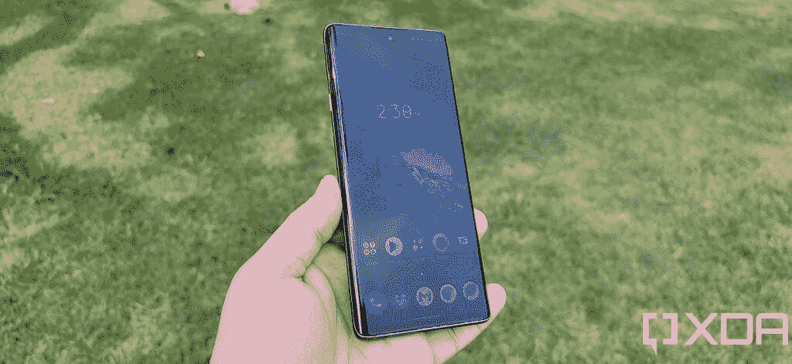
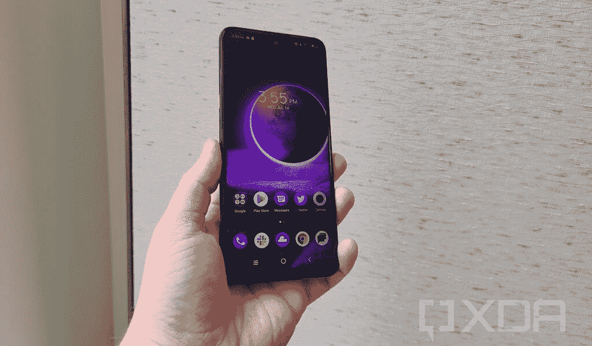
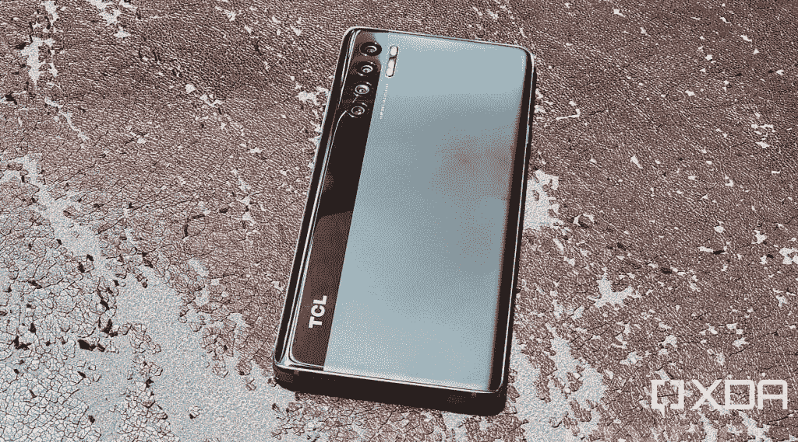
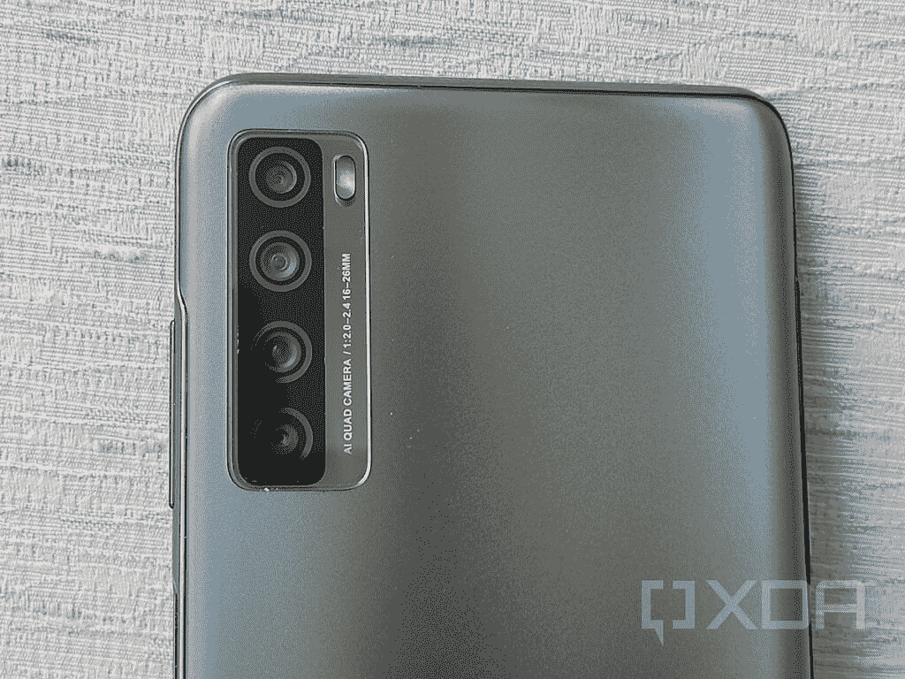
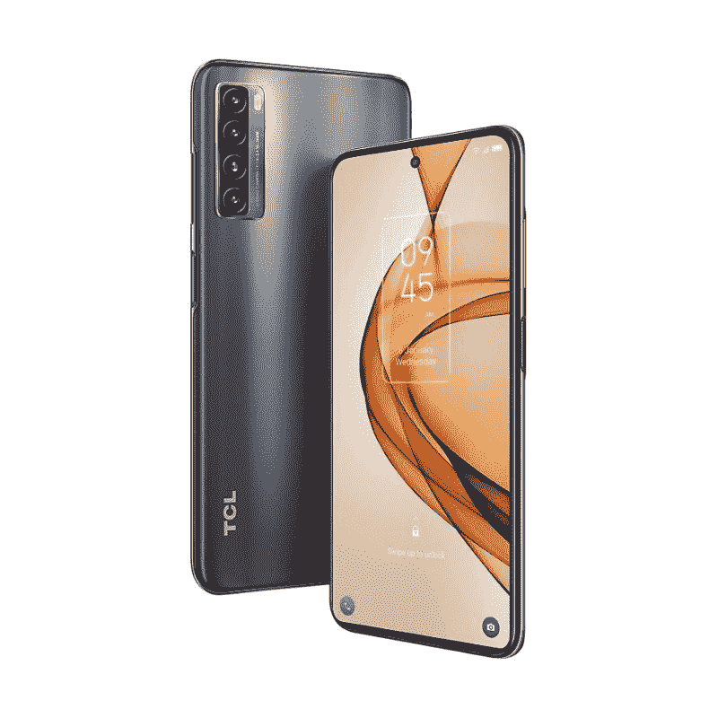

# TCL 20 Pro 5G vs TCL 20S:该买哪款手机？

> 原文：<https://www.xda-developers.com/tcl-20-pro-5g-vs-tcl-20s/>

TCL 在美国发布了三款新智能手机，作为 TCL 20 系列的一部分。该系列中的两款手机——[TCL 20 Pro 5G](https://www.xda-developers.com/tcl-20-pro-5g-review/)和[TCL 20s](https://www.xda-developers.com/tcl-20s-review/)——迎合了中档市场的需求。如果你想买一部新的智能手机，并且不知道应该买 TCL 两款中档手机中的哪一款，我们可以帮助你。在本文中，我们将 TCL 20 Pro 与 TCL 20S 进行对比，看看哪款手机对您更有意义。

**浏览本指南:**

## TCL 20 Pro 5G 与 TCL 20S:规格

| 

规范

 | 

TCL 20 Pro 5G

 | 

TCL 20S

 |
| --- | --- | --- |
| **尺寸和重量** | 

*   164.2 x 73.8 x 9.07mm 毫米
*   190 克

 | 

*   166.2 x 76.9 x 9.1 毫米
*   199g

 |
| **显示** | 

*   6.67 英寸弧形 AMOLED
*   全高清+ (2400 x 1080)分辨率
*   60Hz 刷新率
*   700 尼特峰值亮度
*   100% DCI-P3
*   PixelWorks i6 处理器

 | 

*   6.67 英寸液晶显示器
*   全高清+电视
*   20:9 宽高比
*   穿孔显示器
*   60Hz 刷新率

 |
| **SoC** | 

*   高通骁龙 750 克
    *   2 个 Kryo 570 (Cortex-A77)内核，2.2GHz
    *   6 个 Kryo 570 (Cortex-A55)内核，1.8GHz
*   Adreno 619 GPU
*   8 纳米工艺

 | 

*   高通骁龙 665:
    *   2 个 Kryo 260 (Cortex-A73)内核@ 2.0GHz
    *   4 个 Kryo 260 (Cortex-A53)内核，1.8GHz
*   Adreno 610 GPU
*   11 纳米工艺

 |
| **RAM 和存储器** | 

*   6GB 内存
*   256GB 存储空间
*   MicroSD 卡支持

 | 

*   4GB 内存
*   128GB 闪存存储
*   MicroSD 卡支持

 |
| **后置摄像头** | 

*   **主:** 48MP 索尼 IMX582 主，f/1.8，0.8μm，OIS
*   **二级:** 16MP 超广角，123 FoV，f/2.4，1.0μm
*   第三级: 5MP 宏，f/2.2
*   第四系: 2MP 深度，f/2.4
*   **视频**:高达 4K@30

 | 

*   **初级** : 64MP 初级
*   **二级** : 8MP 超宽
*   **第三级** : 2MP 宏
*   第四系: 2MP 深度

 |
| **前置摄像头** | 

*   32MP，f/2.45，定焦，80.4 FoV
*   视频:高达 4K@30

 |  |
| **电池** | 

*   4，500 毫安时电池
*   高达 18W 有线充电功率(包装盒内)
*   高达 15W 的无线充电

 | 

*   5000 毫安时
*   高达 18W 的快速充电

 |
| **连通性** | 

*   乐队(北美):
    *   2G 频段:GSM 850/900/1800/1900
    *   3G 频段:UMTS B1/2/4/5/8
    *   4G LTE 频段:1/2/3/4/5/7/8/12(MFBI)/13/14/17/20/25/26/28/29/30/38/40/41/48/66/71
    *   5G 频段:n2/5/7/41/66/71/78
    *   4×4 MIMO(下行链路)B2/1966 年 4 月 7 日/30 日
*   国家足球联盟
*   WiFi 802.11 . b/g/n/AC(2.4 GHz+5 GHz)
*   蓝牙 5.1
*   USB 型

 | 

*   乐队(北美):
    *   GSM:850/900/1800/1900MHz
    *   UMTS:1/2/4/5/8
    *   LTE:1/2/3/4/5/7/8/12/13/17/20/25/26/28/29/38/40/41/66/71
*   国家足球联盟
*   WiFi 802.11 . b/g/n/AC(2.4 GHz+5 GHz)
*   蓝牙 5.0
*   USB 型

 |
| **其他特征** |  | 

*   侧装式指纹读取器

 |
| **软件** |  |  |

## 设计和展示

 <picture></picture> 

TCL 20 Pro 5G

由于 TCL 20 Pro 5G 是该公司 2021 年的旗舰手机，TCL 似乎在设计上下了很大功夫。这款手机有 3D 玻璃，正面和背面都有弯曲的边缘。然而，3D 玻璃并没有覆盖整个背板，相反，该公司采用了双色设计。具有光泽外观的玻璃出现在左侧的一小部分上，面板的其余部分具有哑光饰面。

TCL 20S 抛弃了 3D 玻璃和 20 Pro 5G 的双色设计，正面是 2D 玻璃，背面是完整的哑光面板。背板还包括微米大小的棱镜晶体，让它有些光泽。

在显示屏方面，两款 TCL 手机都采用了全高清面板。20 Pro 5G 配备 6.67 英寸 AMOLED 屏幕，20S 配备 6.67 英寸 LCD 屏幕。这两款手机还为自拍相机提供了居中的打孔切口。

由于 AMOLED 面板更加鲜艳，对比度更好，所以在两款 TCL 手机中，20 Pro 5G 是更好的选择。

## SoC、RAM 和存储

 <picture></picture> 

TCL 20S

作为两款智能手机中更昂贵的一款，TCL 20 Pro 5G 采用了更强大、更新的高通骁龙 750G SoC。另一方面，TCL 20S 由骁龙 665 SoC 驱动。此外，20 Pro 5G 有 6GB 的内存和 256GB 的板载存储，而 20 年代你只能获得 4GB 的内存和 128GB 的内置存储。

更多的 RAM 和更好的处理器将有助于 TCL 20 Pro 5G 提供比 20S 更出色的性能。这两款手机都配有 microSD 卡插槽，所以内部存储不是什么大问题，如果你想的话，你可以随时扩展它。

## TCL 20 Pro 5G vs TCL 20S:相机

 <picture></picture> 

TCL 20 Pro 5G back

在摄像头方面，TCL 在支持光学防抖的 20 Pro 5G 上使用了 48MP 主拍摄器。作为四后置摄像头设置的一部分，您还将获得一个 1600 万像素的广角摄像头、500 万像素的微距摄像头和 200 万像素的深度传感器。32MP 自拍相机也在场。正如我们在 [TCL 20 Pro 5G 评测](https://www.xda-developers.com/tcl-20-pro-5g-review/)中提到的，手机背面的摄像头相当普通。虽然主拍摄者确实在明亮的自然光下拍摄了一些不错的照片，但它在室内和弱光场景下的表现令人印象深刻。

TCL 20S 配备了 64MP 主摄像头、8MP 广角摄像头、2MP 微距摄像头和 2MP 深度传感器。船上还有一个 16MP 自拍相机。与 20 Pro 5G 相机的性能一样， [TCL 20S 相机](https://www.xda-developers.com/tcl-20s-review/)也提供了混合的结果。在良好的光线下，你可以从主摄像头获得不错的手机，但低光照片有噪音，细节也少。

总的来说，在摄像头方面，你可能会在两款智能手机上获得类似的摄像头性能。

## 电池和连接

 <picture></picture> 

TCL 20S

电池和连接部门的事情变得有趣起来。虽然 TCL 20 Pro 5G 配备了 4500 毫安时的电池，但在我们的评估中，这款手机一次充电只能坚持一天，屏幕时间约为 5 - 5.5 小时。然而，尽管 TCL 20S 的 5000 毫安时电池仅比 20 Pro 5G 大 500 毫安时，但一次充电 9 小时的屏幕时间几乎是两倍。在一般使用情况下，手机充电后的正常运行时间将超过一天。两款手机都支持 18W 快速充电，并在包装盒中提供兼容的快速充电器。而且 TCL 20 Pro 5G 支持无线充电。

虽然 TCL 20S 在电池方面取得了胜利，但 [5G](https://www.xda-developers.com/5g/) 支持的存在使连接部门的情况有利于 TCL 20 Pro 5G。然而，20 Pro 5G 目前只有[支持 T-Mobile 5G](https://www.xda-developers.com/tcl-20-pro-5g-bands/) ，威瑞森认证很快将同时支持 4G 和 5G。另一方面， [20S 在三大运营商上都支持 4G LTE](https://www.xda-developers.com/tcl-20s-carrier-support/) 。

此外，这两款智能手机都支持 Wi-Fi 802.11ac、NFC 和 USB Type-C。TCL 20 Pro 5G 还包括蓝牙 5.1，而你将在 20S 上获得蓝牙 5.0。

## TCL 20 Pro 5G vs TCL 20S: OS 和 Android 更新

说到软件，TCL 20 Pro 5G 和 20S 都可以在 Android 11 上运行，TCL UI 开箱即用。根据 TCL 加拿大网站的消息，20 Pro 5G 将获得两个主要的 Android 更新，以及安全更新，直到 2024 年 4 月。另一方面，20 多岁的人在 2024 年 4 月之前只会得到一个主要的 Android 更新和安全更新。

因此，很明显，TCL 20 Pro 5G 凭借其两个主要的 Android 更新在软件方面取得了成绩。

## 价格和颜色

 <picture></picture> 

TCL 20S

两部手机的价格标签显示出它们之间的巨大差距。TCL 20 Pro 5G 的零售价为 500 美元，而 TCL 20S 的售价仅为 250 美元。显然，你必须为这 150 美元的节省做出牺牲，但对一些人来说，较低的价格标签比获得 5G 或更好的处理器更有吸引力。

颜色方面，TCL 20 Pro 5G 有[海洋蓝和月尘灰](https://www.xda-developers.com/tcl-20-pro-5g-colors/)，20S 有银河灰和北极星蓝出售。

## 结论

在选择 TCL 20 Pro 5G 和 TCL 20S 时，这取决于您的优先选择。虽然 TCL 20 Pro 5G 获得了更好的屏幕、更好的处理器、更多的 Android 更新和 5G 支持，但它的价格比 20 年代高出 150 美元。有了 TCL 20S，你就有了更好的电池、可比的相机、体面的屏幕和体面的性能。5G 在美国仍然不是一件大事，因为运营商至少需要几年时间才能将 5G 网络可用性提高到 4G 的水平。

 <picture></picture> 

TCL 20 Pro 5G

##### TCL 20 Pro 5G

TCL 20 Pro 5G 是该公司 20 系列中的顶级手机。它装有一个骁龙 750G 的 SoC，运行在 Android 11 上。

 <picture></picture> 

TCL 20S

##### TCL 20S

TCL 20S 采用 6.67 英寸全高清+显示屏，骁龙 665 SoC，Android 11。

这两个你打算买哪一个？请在评论区告诉我们。

如果您已经购买了手机，请查看我们关于配件、外壳、屏幕保护套等的建议: