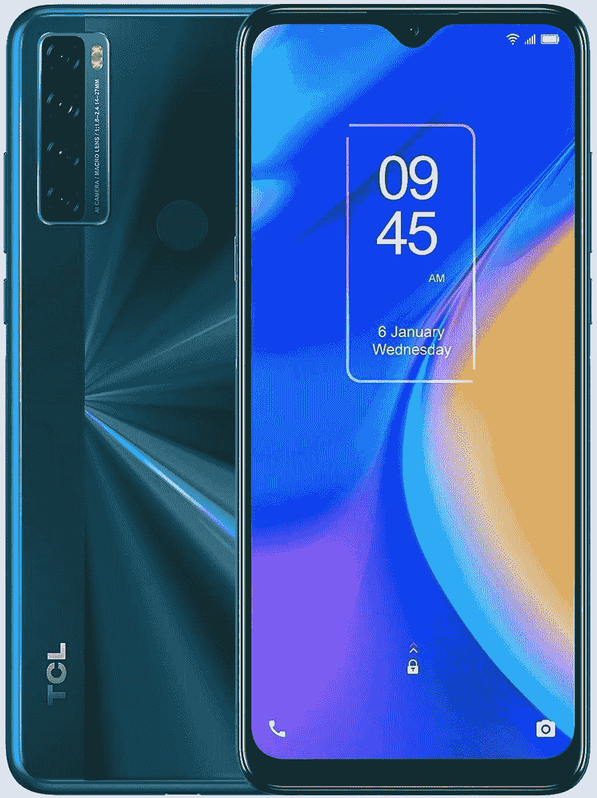
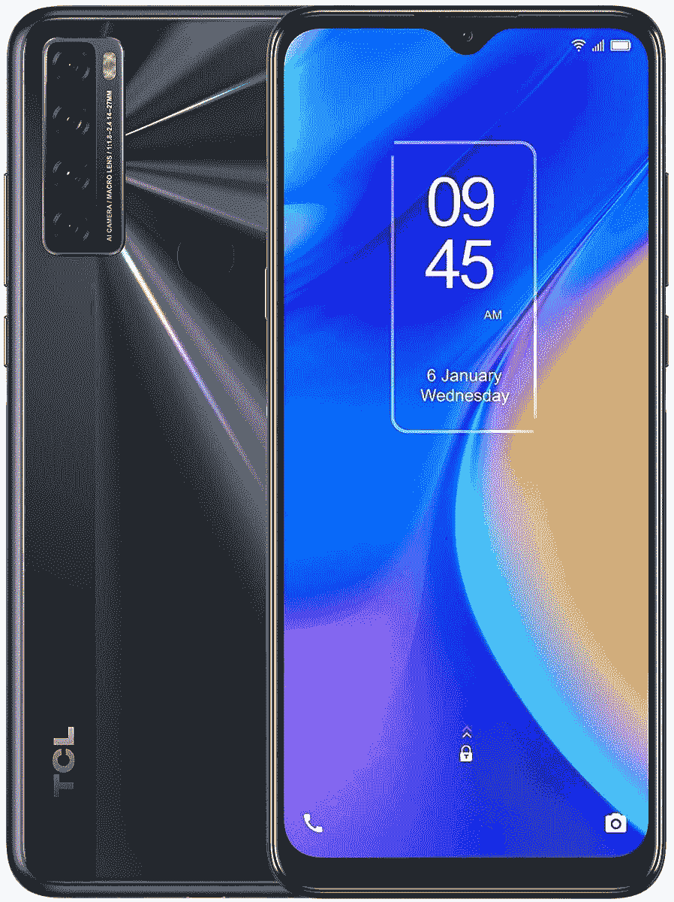

# TCL 20 SE 有哪些颜色？

> 原文：<https://www.xda-developers.com/tcl-20-se-colors/>

TCL 20 SE 是该公司在美国最新的廉价智能手机。这款手机最初是在今年 1 月的 CES 上宣布的，但它刚刚到达中国，通过亚马逊提供。它配有高清液晶显示屏、骁龙 460 SoC 和 5000 毫安时大电池。如果你打算购买 TCL 20 SE，你可能想知道这款手机的颜色选择。TCL 销售的 20 SE 有两种令人兴奋的颜色——极光绿和纽特黑。这两种颜色在美国都有售。

**TCL 20S 回顾 **

虽然这款手机的正面有两种颜色的黑色挡板，但 TCL 20 SE 的背面有一种光滑的塑料，具有双重纳米光刻技术。这种光刻反射光线，使手机产生闪闪发光的效果。

## TCL 20 色

 <picture></picture> 

Aurora Green

##### TCL 20 SE

TCL 20 SE 的极光绿选项有一个带有一丝蓝色的深绿色阴影。它看起来像午夜绿色。虽然它可能不会吸引所有人，但很可能会有一群人喜欢它。

 <picture></picture> 

TCL 20 SE

##### 薄层色谱 20 硒

TCL 20 SE 的 Nuit Black 选项更深灰色而非黑色。这种颜色可能是许多 TCL 20 SE 买家的首选。

## TCL 20 SE 规格

TCL 20 SE 配备了 6.82 英寸高清+(720 x 1640 像素)显示屏，宽高比为 20.5:9，水滴式凹槽。它由高通的骁龙 460 SoC 驱动，外加 4GB 内存和 128GB 板载存储。还有一个 microSD 卡插槽，用于存储扩展。

摄像头正面，背面有四个拍摄器，包括一个 48MP 主摄像头和一个 5MP 广角拍照器。你还可以获得一个 200 万像素的深度传感器，200 万像素的微距相机和双 LED 闪光灯。而且 TCL 在正面增加了 13MP 自拍摄像头。

TCL 20 SE 运行在 Android 11 上，开箱即用，配有 TCL UI。该公司还没有说任何关于未来 Android 更新的事情，包括它是否会得到 Android 12。然而，它将在 2023 年 1 月之前接收安全更新。所以基本上，大约 18 个月的安全更新。

**[TCL 20S XDA 论坛](https://forum.xda-developers.com/f/tcl-20s.12405/)**

在其他规格中，有一个后置指纹传感器，一个专用的谷歌助理按钮，双扬声器，一个 3.5 毫米音频插孔，USB Type-C 端口，以及手机上的一个 SIM 卡插槽。它还装有一个 5000 毫安时的大电池，但在美国版本中没有快速充电支持。

没有 5G 的支持。20 SE 配备了 4G LTE、Wi-Fi 802.11n、蓝牙 5.0 和 NFC。

* * *

这就是你需要了解的 TCL 20 SE 颜色。你打算买哪种 TCL 20 SE 变型？请在评论区告诉我们。如果你也在寻找手机的外壳和屏幕保护器，我们已经选出了目前市场上的[最佳 TCL 20 SE 外壳](https://www.xda-developers.com/best-tcl-20-se-case/)和[最佳手机屏幕保护器](https://www.xda-developers.com/best-tcl-20-se-screen-protector/)。