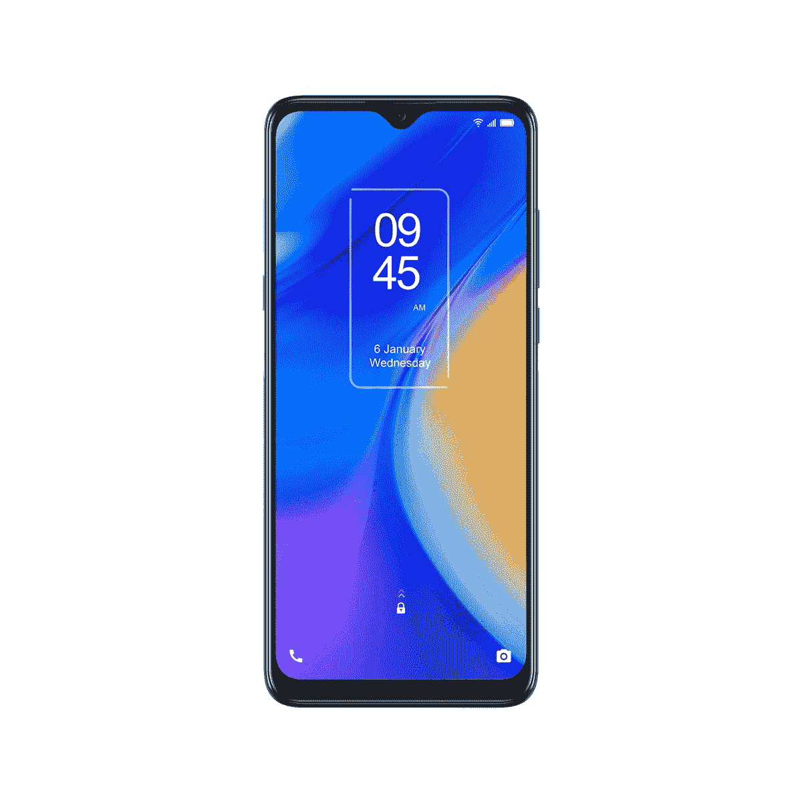

# TCL 20 SE 规格:处理器，显示器，其他一切！

> 原文：<https://www.xda-developers.com/tcl-20-se-specifications/>

# TCL 20 SE 规格:处理器，显示器，摄像头，其他一切！

TCL 20 SE 是 TCL 20 系列中最实惠的手机，配有大显示屏和电池。这是完整的规格。

TCL 在美国市场推出了三款手机，作为其新的 [TCL 20 系列](https://www.xda-developers.com/tcl-brings-three-affordable-smartphones-to-the-us/)的一部分 TCL 20 Pro 5G、TCL 20S 和 TCL 20 SE。虽然 [TCL 20 Pro 5G 是所有手机中最好的](https://www.xda-developers.com/tcl-20-pro-5g-review/)也是最贵的，但 TCL 20 SE 却在价格谱的另一端。这是 TCL 20 系列中最实惠的手机，面向入门级市场。如果你刚刚换了一部智能手机，或者想给你的孩子买一部简单的手机带到学校，TCL 20S SE 可能是一个不错的选择。

虽然我们有该设备的[详细评论](https://www.xda-developers.com/tcl-20-se-review/)来帮助您决定是否应该购买一台，但这里有一个 TCL 20 SE 规格的快速回顾，以便您对预期有一个公平的想法。

| 

规格

 | 

TCL 20 SE

 |
| --- | --- |
| **尺寸&重量** | 

*   172.08 x 77.14 x 9.1mm 毫米
*   206 克

 |
| **显示** | 

*   6.82 英寸高清+ IPS 液晶屏
*   20.5:9 宽高比
*   60Hz 刷新率

 |
| **SoC** | 

*   高通骁龙 460
    *   基于 Cortex-A73 的 4x Kryo 240 @ 1.6 GHz
    *   基于 Cortex-A53 的 4x Kryo 240 @ 1.8 GHz
*   Adreno 610 GPU

 |
| **闸板&存放** | 

*   4GB
*   128GB UFS 2.1 存储

 |
| **电池&充电** | 

*   5000 毫安时
*   没有快速充电

 |
| **安全** | 后置指纹扫描仪 |
| **后置摄像头** | 

*   主: 48MP，f/2.0，79 FoV
*   **二级:** 5MP 超宽，f/2.2，115 FoV
*   **第三级:** 2MP 宏，f/2.4
*   第四纪: 2MP 深度，f/2.4

 |
| **前置摄像头** | 1300 万 |
| **连通性** | 

*   乐队(北美):
    *   GSM: 850/900/1800/1900MHz
    *   UMTS: 1/2/4/5/8
    *   LTE:1/2/3/4/5/7/8/12/13/17/28/66
*   无线宽带/宽带/无线
*   蓝牙 5.0

 |
| **软件** | 安卓 11 带 TCL UI |

TCL 20 SE 是 TCL 20 系列中最实惠的手机，正如您所期望的那样，它具有入门级规格。骁龙 460 是手机的核心，考虑到手机的售价，它应该足够了。有一个大的 6.82 英寸高清+ IPS 液晶显示器，应该会让那些在旅途中消耗大量内容的人感到满意。显示器的尺寸很大，但分辨率是 HD+，所以整体体验受到了影响。

就像所有现代智能手机一样，后置四个摄像头——一个 48MP 主摄像头，一个 5MP 超宽摄像头，一个 2MP 微距摄像头，最后一个 2MP 深度传感器用于人像拍摄。前置 1300 万摄像头。除了大显示屏，TCL 20 SE 的电池也很大，达到 5000 毫安时。当与 720p 显示屏配合使用时，这将带来良好的电池续航时间。然而，没有快速充电。

 <picture></picture> 

TCL 20 SE

##### TCL 20 SE

TCL 20 SE 是一款不错的经济型手机，拥有大显示屏和电池。如果你在手机上观看大量内容，这可能是一个不错的选择。

如果你预算紧张，你可以考虑购买这款手机，但在这个价格范围内，你也可以考虑其他选择。如果你已经买了手机，一定要看看 TCL 20 Pro 5G 的 [Best Cases](https://www.xda-developers.com/best-tcl-20-se-cases/) 和[屏幕保护器。](https://www.xda-developers.com/best-tcl-20-se-screen-protector/)