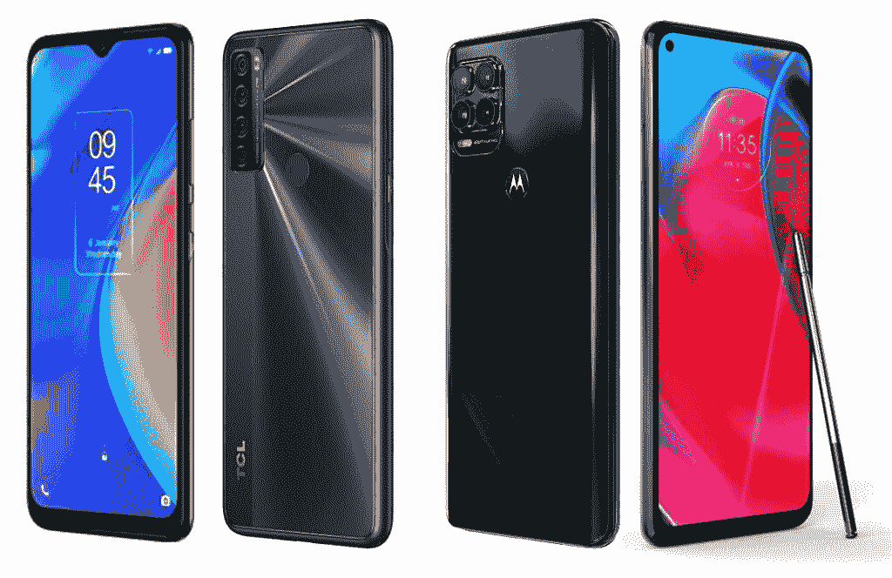
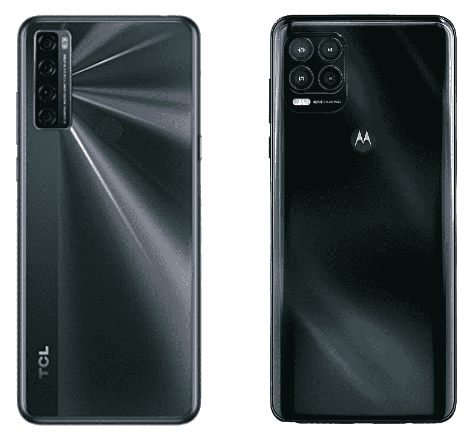
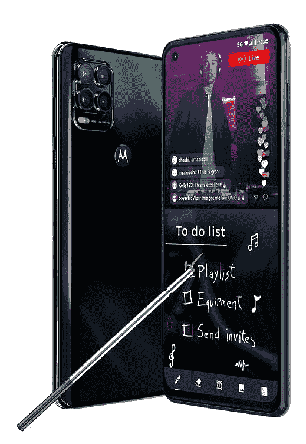
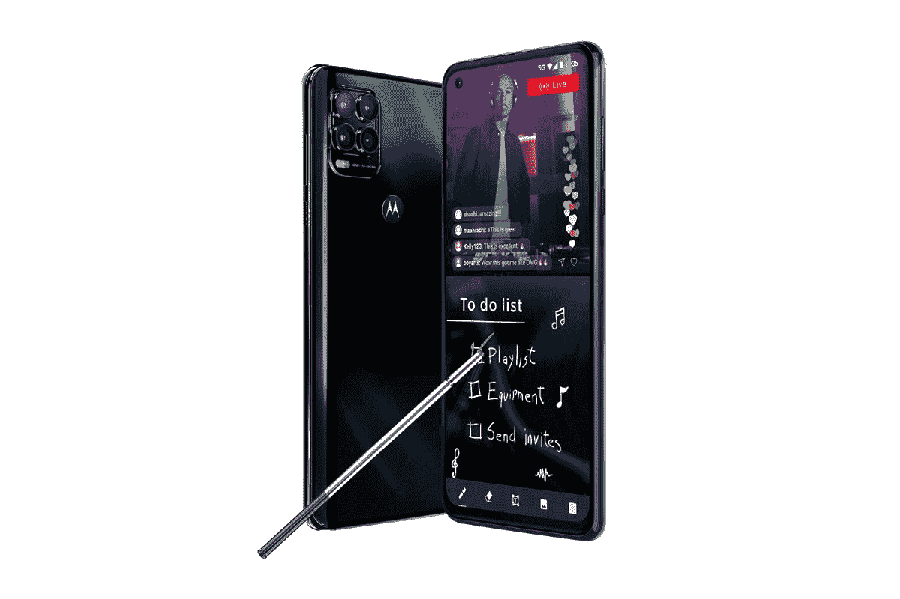

# TCL 20 SE vs Moto G 手写笔 5G:该买哪款手机？

> 原文：<https://www.xda-developers.com/tcl-20-se-vs-moto-g-stylus-5g/>

TCL 20 SE 是 TCL 最新的廉价智能手机。这是该公司 2021 阵容的一部分，最近在美国首次亮相。如果你想买一部新手机，并且想知道是省钱买 20 SE 还是花更多钱买 Moto G Stylus 5G，我们可以为你提供帮助。在这次对比中，我们将 [TCL 20 SE](https://www.xda-developers.com/tcl-20-se-review/) 与 Moto G Style 5G 进行对比，看看这两款手机的实力如何。

**浏览本指南:**

## TCL 20 SE vs Moto G 手写笔 5G:规格

| 

规范

 | 

TCL 20 SE

 | 

摩托罗拉 Moto G 手写笔 5G

 |
| --- | --- | --- |
| **尺寸和重量** | 

*   172.08 x 77.14 x 9.1mm 毫米
*   206

 | 

*   169.54 x 77.48 x 9.35mm 毫米
*   217.5 克

 |
| **显示** | 

*   6.82 英寸液晶显示器
*   高清+
*   20.5:9 宽高比
*   水滴凹口
*   60Hz 刷新率

 | 

*   6.8 英寸液晶显示器
*   全高清+
*   20:9 宽高比
*   打孔设计

 |
| **SoC** | 

*   高通骁龙 460
    *   基于 Cortex-A73 的 4x Kryo 240 @ 1.6 GHz
    *   基于 Cortex-A53 的 4x Kryo 240 @ 1.8 GHz
*   Adreno 610 GPU

 | 

*   高通骁龙 480
    *   4x Kryo 260 基于 Cortex-A76 @ 2GHz
    *   基于 Cortex-A55 的 4x Kryo 260 @ 1.8 GHz
*   Adreno 619 GPU

 |
| **RAM 和存储器** | 

*   4GB 内存
*   128GB 闪存存储 UFS 2.1
*   MicroSD 卡支持

 | 

*   6GB 内存
*   256GB 存储空间
*   MicroSD 卡支持

 |
| **后置摄像头** | 

*   **主要:** 48MP，f/2.0，1/2”传感器，79 FoV
*   **二级:** 5MP，广角，f/2.2，115 FoV
*   第三代:200 万像素，微距相机，f/2.4
*   第四纪: 2MP，深度，f/2.4

 | 

*   **初级:** 48MP，f/1.7，0.8 m
*   **二级:** 8MP，广角，f/2.2，118 FoV
*   第三代: 5MP，微距相机，f/2.2
*   第四纪: 2MP，深度，f/2.4

 |
| **前置摄像头** |  |  |
| **电池** |  |  |
| **连通性** | 

*   乐队(北美):
    *   GSM: 850/900/1800/1900MHz
    *   UMTS: 1/2/4/5/8
    *   LTE:1/2/3/4/5/7/8/12/13/17/28/66
*   无线宽带/宽带/无线
*   蓝牙 5.0
*   USB 型

 | 

*   乐队(北美):
    *   GSM: 850/900/1800/1900MHz
    *   UMTS: 1/2/4/5/8
    *   LTE:1/2/3/4/5/7/8/12/13/14/17/18/19/20/25/26/29/30/38/39/40/41/48/66/71
    *   5G: 2/5/25/26/41/66/71/77/78
*   Wi-Fi 交流电
*   蓝牙 5.0
*   USB 型

 |
| **其他特性** | 

*   后置指纹扫描仪

 | 

*   后置指纹扫描仪

 |
| **软件** |  |  |

* * *

## 设计和展示

 <picture></picture> 

TCL 20 SE and Moto G Stylus 5G (right)

TCL 20 SE 的设计略显过时，水滴式凹槽和背板采用双纳米光刻技术，闪闪发光。此外，手机正面还具有厚下巴的特点。相比之下，摩托罗拉已经走了一个相当实用的外观，有光泽的完成，具有反射光泽，但不要指望像 TCL 20 SE 一样闪闪发光。Moto G Stylus 5G 也有一个厚下巴，但其他方面都有小边框。此外，你可以在摩托罗拉手机的正面安装一个打孔式自拍相机。

在显示器方面，20 SE 拥有 6.82 英寸高清+(720 x 1640 像素)液晶屏幕，263 PPI。另一方面，Moto G Stylus 5G 配备了 6.8 英寸全高清+ (1，080 x 2，400 像素)液晶屏，分辨率为 386 PPI。

在 TCL 和摩托罗拉的手机中，没有一款在设计上有突出表现。由你来决定哪个更吸引你。然而，由于其全高清分辨率，Moto G Stylus 5G 在显示屏方面显然是赢家。

## SoC、RAM 和存储

Moto G 手写笔中的骁龙 480 不仅是一款较新的 SoC，它在各方面也超过了 TCL 20 SE 的 S460。与 S460 中的 Cortex-A73 和 Cortex-A53 内核相比，S480 中的 Cortex-A76 和 Cortex-A55 内核速度更快。摩托罗拉手机的 SoC 还包含更新的 GPU、更快的内存、更新的图像信号处理器(ISP)和 5G 调制解调器。

Moto G Stylus 5G 手机还拥有更多内存和存储空间，分别为 6GB 和 256GB，而 TCL 20 SE 只有 4GB 内存和 128GB 内置存储空间。两款手机都包括一个 microSD 卡插槽。

如果你想要更快的性能，并愿意为此付费，Moto G Stylus 5G 更有意义。TCL 20 SE 在性能方面并不是真正的懒鬼，但它落后于摩托罗拉的竞争对手。

## TCL 20 SE vs Moto G 手写笔 5G:相机

 <picture></picture> 

TCL 20 SE and Moto G Stylus 5G (right)

Moto G Stylus 5G 和 TCL 20 SE 的四摄像头设置没有太大区别，但摩托罗拉手机在某些方面确实有所得分。Moto G Stylus 5G 配备了一个 48MP 的主摄像头，与 TCL 手机相同，但 shooter 中包含的镜头在 f/1.7 处的光圈比 TCL 的 f/2.0 更宽。还有，Moto G Stylus 5G 包括一个 8MP 广角摄像头和 5MP 微距摄像头，而 TCL 20 SE 有一个 5MP 广角摄像头和一个 2MP 微距摄像头。这两款手机都配有一个 2MP 深度传感器。摩托罗拉手机的主摄像头也可以以 60fps 的速度拍摄 1080p 视频，而 TCL 仅限于 30fps。

为了自拍的需要，摩托罗拉增加了一个 1600 万像素的摄像头，而 20 SE 只有 1300 万像素。

总的来说，如果你喜欢移动摄影，Moto G Stylus 5G 提供的边际改进使其成为比 TCL 20 SE 更好的拍照手机。

## 电池、连接和手写笔

Moto G Stylus 5G 和 TCL 20 SE 都配有 5,000mAh 电池以及 10W 充电器。就连接选项而言，顾名思义，摩托罗拉 Moto G Stylus 5G 配有 [5G](https://www.xda-developers.com/5g/) 支持。但目前，它只能与 T-Mobile 和威瑞森低于 6GHz 的 5G 网络配合使用。在& T 5G 支持据说即将到来。而 TCL 20 SE 则只支持 4G LTE，仅限于 AT & T 和 T-Mobile 网络。

TCL 手机还配备了蓝牙 5.0、Wi-Fi 802.11n (Wi-Fi 4)、NFC 和 USB Type-C，而摩托罗拉手机则包括 Wi-Fi 802.11ac (Wi-Fi 5)、USB Type-C 和蓝牙 5.0。

手写笔是摩托罗拉手机的一个方面，而这是 TCL 手机所没有的。

尽管 5G 支持似乎是 Moto G Stylus 5G 的一大优势，但 5G 网络仍远未普及。因此，除非你明确寻求一款支持手写笔的 5G 手机，否则支持 4G 的 TCL 是一个不错的选择。

## TCL 20 SE vs Moto G 手写笔 5G:安卓版本和更新

 <picture></picture> 

Moto G Stylus 2021

TCL 20 SE 和 Moto G Stylus 5G 运行在 Android 11 上。虽然 TCL 在 Android 上包含了自己的 TCL 用户界面，但摩托罗拉的界面更接近于传统的 Android。摩托罗拉还承诺为 Moto G Stylus 5G 进行一次重大的 Android 更新和两年的安全更新(直到 2023 年 6 月)。另一方面，TCL 还没有在 Android 更新方面说什么，但它将在 2023 年 1 月之前为 20 SE 提供安全更新。

凭借其干净的软件和至少一个主要 Android 更新的承诺，Moto G Stylus 5G 在软件方面具有明显的优势。

## 价格和颜色

价格标签是两款手机之间巨大差距的一个明显体现。但是这个差距是有利于 TCL 20 SE 的。TCL 手机在美国的单个 4GB + 128GB 型号仅售 190 美元。另一方面，摩托罗拉 Moto G Stylus 5G 的单个 6GB + 256GB 型号的价格为 400 美元。

TCL 提供两种颜色的 20se——极光绿和纽特黑，而摩托罗拉手机只有一种颜色——宇宙绿。

## 结论

毫无疑问，TCL 20 SE 和 Moto G Stylus 5G 是非常不同的手机。Moto G Stylus 5G 在很多方面都有明显的优势，包括性能和显示。因此，如果你有预算，并且愿意花钱购买更好的性能、更好的屏幕、更好的摄像头和 5G 支持，Moto G Stylus 5G 就是你的选择。

但是，如果你想节省一些钱，并愿意牺牲一点几乎所有的东西，TCL 20 SE 是一个不错的选择。你可能现在就可以购买 TCL 20 SE，并在下一代网络更广泛可用时投资购买更好的 5G 手机。

 <picture></picture> 

TCL 20 SE

##### TCL 20 SE

TCL 20 SE 是该公司最新的廉价手机。它运行 Android 11，并装有骁龙 460 SoC 和一个 5000 毫安时的大电池。

 <picture></picture> 

Motorola Moto G Stylus 5G

##### 摩托罗拉 Moto G 手写笔 5G

Moto G Stylus 5G 是一款中档智能手机，配备 6.8 英寸全高清+屏幕和高通骁龙 480 SoC。

如果您已经购买了手机，请查看我们关于配件、外壳、屏幕保护套等的建议: