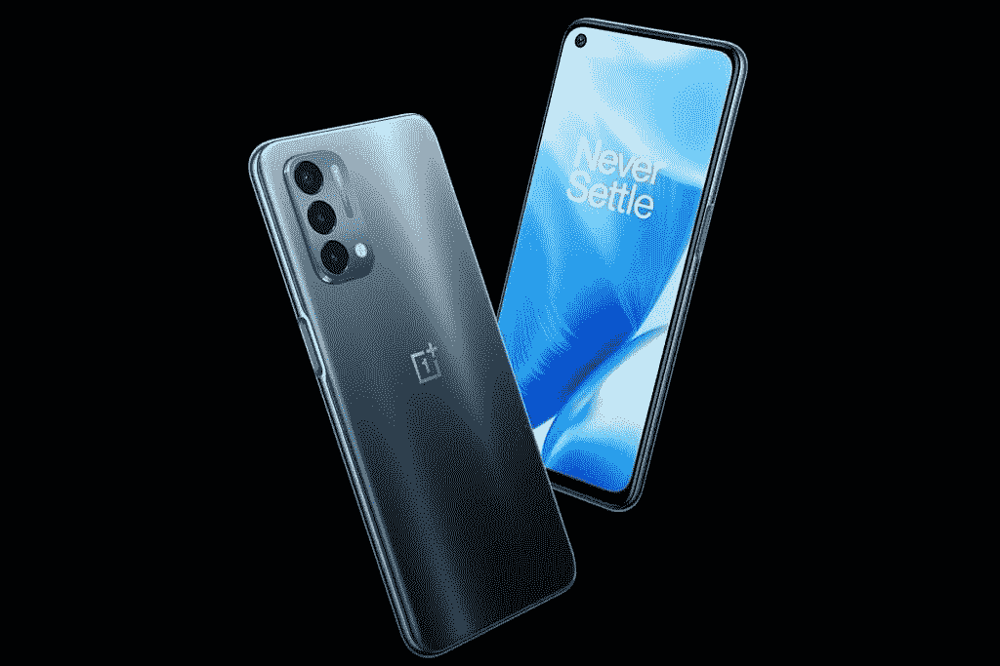
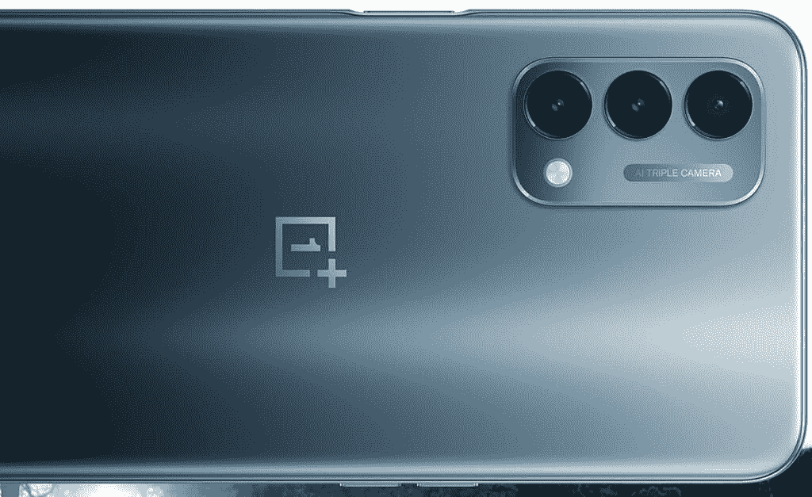

# TCL 20 SE vs 一加诺德 N200 5G:该买哪款手机？

> 原文：<https://www.xda-developers.com/tcl-20-se-vs-oneplus-nord-n200-5g/>

今年早些时候，TCL 在美国推出了一款新的廉价智能手机。作为该公司 [20 系列](https://www.xda-developers.com/tcl-20/)的一部分， [TCL 20 SE](https://www.xda-developers.com/tcl-20-se-review/) 面向那些不想花太多钱但仍需要一部像样智能手机的消费者。它与一加的新 Nord N200 5G 在价格段和其他手机竞争。如果你对这两者感到困惑，我们可以帮助你。在本文中，我们将比较 TCL 20 SE 和一加诺德 N200 5G，看看哪款手机对你更有意义。

**浏览本指南:**

## TCL 20 SE vs 一加诺德 N200 5G:规格

| 

规范

 | 

TCL 20 SE

 | 

一加诺德 N200 5G

 |
| --- | --- | --- |
| **尺寸和重量** | 

*   172.08 x 77.14 x 9.1mm 毫米
*   206

 | 

*   163.1 x 74.9 x 8.3mm 毫米
*   189 克

 |
| **显示** | 

*   6.82 英寸液晶显示器
*   高清+
*   20.5:9 宽高比
*   水滴凹口
*   60Hz 刷新率

 | 

*   6.49 英寸液晶显示器
*   全高清+
*   20:9 宽高比
*   打孔设计
*   90Hz 刷新率

 |
| **SoC** | 

*   高通骁龙 460
    *   基于 Cortex-A73 的 4x Kryo 240 @ 1.6 GHz
    *   基于 Cortex-A53 的 4x Kryo 240 @ 1.8 GHz
*   Adreno 610 GPU

 | 

*   高通骁龙 480
    *   4x Kryo 260 基于 Cortex-A76 @ 2GHz
    *   基于 Cortex-A55 的 4x Kryo 260 @ 1.8 GHz
*   Adreno 619 GPU

 |
| **RAM 和存储器** | 

*   4GB 内存
*   128GB 闪存存储 UFS 2.1
*   MicroSD 卡支持

 | 

*   4GB 内存
*   64GB 存储
*   MicroSD 卡支持

 |
| **后置摄像头** | 

*   **主要:** 48MP，f/2.0，1/2”传感器，79 FoV
*   **二级:** 5MP，广角，f/2.2，115 FoV
*   第三代:200 万像素，微距相机，f/2.4
*   第四纪: 2MP，深度，f/2.4

 | 

*   **初级:** 13MP，f/2.2
*   **二级:** 2MP，微距，f/2.4
*   **第三级:** 2MP，单色，f/2.4

 |
| **前置摄像头** |  |  |
| **电池** |  | 

*   5000 毫安时
*   18W 快速充电

 |
| **连通性** | 

*   乐队(北美):
    *   GSM: 850/900/1800/1900MHz
    *   UMTS: 1/2/4/5/8
    *   LTE:1/2/3/4/5/7/8/12/13/17/28/66
*   无线网络 802.11b/g/n
*   蓝牙 5.0
*   USB 型

 | 

*   乐队(北美):
    *   GSM: 850/900/1800/1900MHz
    *   UMTS: 1/2/4/5/8
    *   LTE:1/2/3/4/5/7/8/12/13/17/20/25/26/28/39/40/41/66/71
    *   5G:71 年 2 月 25 日至 41 年 6 月 6 日
*   无线网络 802.11ac
*   蓝牙 5.1
*   USB 型
*   国家足球联盟

 |
| **其他特性** | 

*   后置指纹扫描仪

 | 

*   侧装式指纹扫描仪

 |
| **软件** |  |  |

## 设计和展示

大多数廉价手机都采用实用的设计，TCL 20 SE 和 Nord N200 5G 也是如此。两款手机都有塑料机身，背板可以吸引指纹污迹。虽然一加选择了打孔的切口来放置自拍相机，但 TCL 手机使用的是水滴式切口。谈论这两款手机的设计没有什么特别令人兴奋或有问题的。

显示器方面的事情变得有点有趣，因为一加诺德 N200 5G 配备了 6.49 英寸全高清+液晶屏幕，刷新率为 90 赫兹。相比之下，你在 TCL 手机上只能获得 6.82 英寸的高清+液晶面板，刷新率为 60Hz。

鉴于全高清面板在预算空间中并不常见，购买 Nord N200 5G 比 TCL 手机更有意义。一加手机更快的刷新率是它的另一个优势。

## SoC、RAM 和存储

 <picture></picture> 

OnePlus Nord N200 5G

一加诺德 N200 5G 也凭借其更新的骁龙 480 芯片在 SoC 方面取得了成绩。它比 TCL 手机中的骁龙 460 SoC 快得多。根据高通的说法，即使是 Nord N200 5G 中的 Adreno 619 GPU 也比 TCL 20 SE 的 Adreno 610 GPU 快 100%。

两款手机都配有 4GB 内存；然而，20 SE 有 128GB 的板载存储，而 Nord N200 有 64GB 的内部存储。不过，这两款设备上都有一个 microSD 卡插槽。

## TCL 20 SE vs 一加诺德 N200 5G:相机

[TCL 20 SE](https://www.xda-developers.com/tcl-20-se-review/) 采用四后置摄像头设置，48MP 主拍摄标题。该设置中的其他相机包括一个 5MP 广角相机，一个 2MP 微距相机和一个 2MP 深度传感器。船上还有一个 1300 万像素的自拍相机。在一加手机中，有一个三后置摄像头设置，一个 1300 万像素的主摄像头，200 万像素的微距摄像头和一个 200 万像素的单色摄像头。诺德 N200 还包括一个 16MP 自拍相机。

TCL 手机包括更多的相机选择，尤其是广角拍摄，可能会受到一些消费者的青睐。但在主摄像头性能方面，两款手机都提供了类似的性能水平。在光线充足的情况下，你会得到不错的效果，而在光线不足的情况下，你会得到平淡无奇的照片。

## 电池和连接

 <picture></picture> 

OnePlus Nord N200 5G

TCL 20 SE 和一加诺德 N200 5G 在 5,000mAh 的电池尺寸方面不相上下。但一加在诺德 N200 中加入了对 18W 快速充电的支持，这是 TCL 手机所缺乏的。如果你经常在最后一刻给手机充电，TCL 手机缺乏快速充电功能可能会给你带来麻烦。

Nord N200 5G 也支持 5G，这从它的名字就可以看出。然而，在美国你只能在 T-Mobile 的网络上使用 5G。不支持威瑞森和美国电话电报公司的 5G。而 TCL 手机则完全不支持 5G。此外，目前它只适用于美国电话电报公司和 T-Mobile 的 4G 网络。因此，如果你想使用 T-Mobile 5G 或威瑞森的网络，Nord N200 5G 是你的唯一选择。

在其他连接选项中，一加手机还具有更快的 Wi-Fi、NFC 和更新的蓝牙版本。

## 操作系统和 Android 更新

Android 11 在一加诺德 N200 5G 和 TCL 20 SE 上都有。虽然 TCL 手机的 Android 更新前景尚不明朗，但它将获得长达两年的安全更新。另一方面，一加诺德 N200 5G 将获得一次主要的 Android 更新和三年的安全更新。因此，如果你打算在未来三到四年或更长时间内使用你的手机，Nord N200 是一个更好的选择，因为它的支持期更长。

## TCL 20 SE vs 一加诺德 N200 5G:定价和颜色选择

TCL 只销售 20 SE 的一种存储版本，售价 189.99 美元。可以买极光绿和 Nuit 黑两种颜色。一加诺德 N200 5G 也有单一存储版本，售价 239.99 美元。它只有一种颜色可供选择——蓝色量子。

虽然一加手机比 TCL 产品贵 50 美元，但更强大的处理器、5G 支持和更高分辨率的显示屏证明了更高的价格是合理的。

## 结论

如果你有预算购买一加诺德 N200 5G，这款手机在几个方面都远远优于 TCL 20 SE。如前所述，你会获得更高分辨率和更快刷新率的显示器，更新更强大的 SoC，快速充电支持和 5G。但如果你想省钱，TCL 20 SE 也是一款不错的经济型手机。

这两款手机你打算买哪一款？请在评论区告诉我们。如果你最终决定购买 TCL 20 SE，请确保从我们推荐的[最佳 TCL 20 SE 保护套](https://www.xda-developers.com/best-tcl-20-se-cases/)中挑选一个来保护你的手机。

 <picture></picture> 

TCL 20 SE

##### TCL 20 SE

TCL 20 SE 是该公司最新的廉价手机。它运行 Android 11，并装有骁龙 460 SoC 和一个 5000 毫安时的大电池。

 <picture></picture> 

OnePlus website

##### 一加诺德 N200 5G

一加诺德 N200 是该公司的新预算 5G 手机。它由高通骁龙 480 SoC 驱动，运行在 Android 11 上。

如果您已经购买了手机，请查看我们关于配件、外壳、屏幕保护套等的建议: