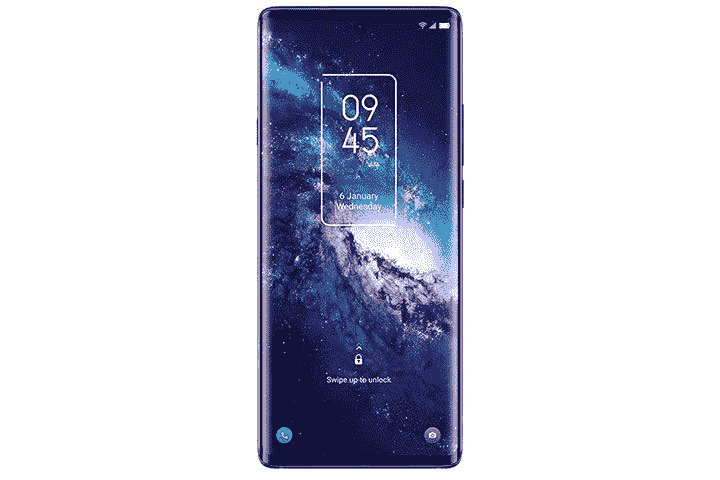
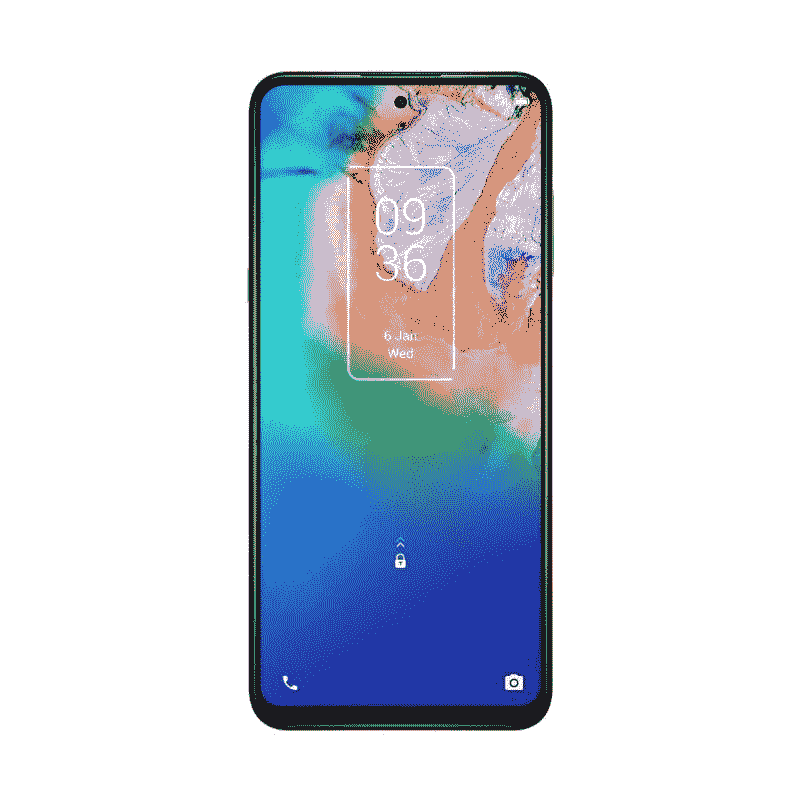
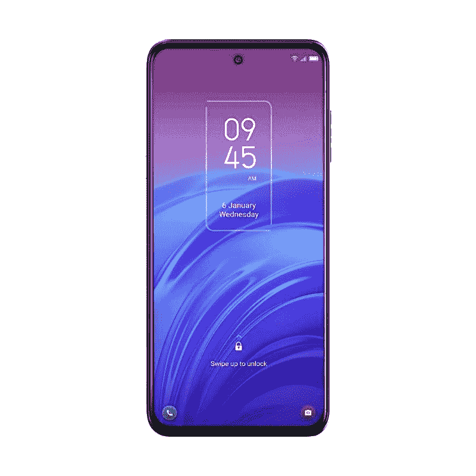

# TCL 20 系列:规格、定价、可用性、销售、新闻等

> 原文：<https://www.xda-developers.com/tcl-20/>

在广受欢迎的 TCL 10 系列之后，该公司在 CES 2021 上展示了其 TCL 20 系列，现在可以在美国和欧盟购买。新的产品线包括多种智能手机，针对不同的价格段。TCL 正专注于自己的优势，并开始涉足中端和经济型市场，因为高端市场由苹果和三星等公司主导。TCL 20 系列共有六款手机——TCL 20 Pro 5G、TCL 20 5G、TCL 20L、TCL 20L+、TCL 20S、TCL 20 SE 跨地区推出。这是你需要知道的关于阵容的一切。

**浏览本指南:**

**TCL XDA 论坛:[20 Pro 5G](https://forum.xda-developers.com/f/tcl-20-pro-5g.12221/)| |[20 5G](https://forum.xda-developers.com/f/tcl-20-5g.12083/)| |[20L 和 20L+](https://forum.xda-developers.com/f/tcl-20l-20l.12223/)| |[20S](https://forum.xda-developers.com/f/tcl-20s.12405/)| |[20se](https://forum.xda-developers.com/f/tcl-20-se.12085/)**

## TCL 20 系列:规格

| 

规范

 | 

TCL 20 Pro 5G

 | 

TCL 20 5G

 | 

TCL 20L

 | 

TCL 20L+

 | 

TCL 20S

 | 

TCL 20 SE

 |
| --- | --- | --- | --- | --- | --- | --- |
| **尺寸和重量** | 

*   164.2 x 73.8 x 9.07mm 毫米
*   190 克

 | 

*   166.2 x 76.8 x ~ 9.1mm 毫米
*   206 克

 | 

*   166.2 x 76.9 x 9.1mm 毫米
*   199g

 | 

*   166.2 x 76.9 x 9.1mm 毫米
*   199g

 | 

*   166.2 x 76.9 x 9.1 毫米
*   199g

 | 

*   172.08 x 77.14 x 9.1mm 毫米
*   206

 |
| **显示** | 

*   6.67 英寸弧形 AMOLED
*   全高清+ (2400 x 1080)分辨率
*   60Hz 刷新率
*   700 尼特峰值亮度
*   100% DCI-P3
*   PixelWorks i6 处理器

 | 

*   6.67 英寸曲面液晶显示器
*   全高清+ (2400 x 1080)分辨率
*   450 尼特峰值亮度

 | 

*   6.67 英寸曲面液晶显示器
*   全高清+ (2400 x 1080)分辨率
*   500 尼特峰值亮度

 | 

*   6.67 英寸曲面液晶显示器
*   全高清+ (2400 x 1080)分辨率
*   500 尼特峰值亮度

 | 

*   6.67 英寸液晶显示器
*   全高清+电视
*   20:9 宽高比
*   穿孔显示器
*   60Hz 刷新率

 | 

*   6.82 英寸高清+液晶显示屏
*   20.5:9 宽高比
*   水滴凹口
*   60Hz 刷新率

 |
| **SoC** | 

*   高通骁龙 750 克
    *   2x ARM Cortex-A77 @ 2.2GHz
    *   6x ARM Cortex-A55 @ 1.8GHz
*   Adreno 619 GPU
*   8 纳米工艺

 | 

*   高通骁龙 690
    *   2 个 Kryo 560 (Cortex A77) @2GHz
    *   6x Kryo 560(Cortex A55)1.7 GHz
*   Adreno 619L GPU
*   8 纳米工艺

 | 

*   高通骁龙 662
    *   4x Kryo 260 (Cortex A77) @2GHz
    *   4x Kryo 260 (Cortex A55) @ 1.8GHz
*   Adreno 610 GPU
*   8 纳米工艺

 | 

*   高通骁龙 662
    *   4x Kryo 260 (Cortex A77) @2GHz
    *   4x Kryo 260 (Cortex A55) @ 1.8GHz
*   Adreno 610 GPU
*   8 纳米工艺

 | 

*   高通骁龙 665:
    *   4 倍性能 4 倍效率 Kryo 260 CPU 内核(最高 2.0GHz)
    *   11 纳米
*   Adreno 610 GPU

 | 

*   高通骁龙 460
    *   基于 Cortex-A73 的 4x Kryo 240 @ 1.6 GHz
    *   基于 Cortex-A53 的 4x Kryo 240 @ 1.8 GHz
*   肾上腺素 610

 |
| **RAM 和存储器** | 

*   6GB 内存
*   256GB 存储空间
*   MicroSD 卡支持

 | 

*   6GB 内存
*   128GB 或 256GB 存储空间
*   MicroSD 卡支持

 | 

*   4GB 或 6GB 内存
*   128GB 存储
*   MicroSD 卡支持

 | 

*   6GB 内存
*   256GB 存储空间
*   MicroSD 卡支持

 | 

*   4GB 内存
*   128GB 闪存存储
*   MicroSD 卡支持

 | 

*   4GB
*   128GB 闪存存储 UFS 2.1

 |
| **后置摄像头** | 

*   **主:** 48MP 索尼 IMX582 主，f/1.8，0.8μm，OIS
*   **次要:** 16MP 超广角，123 FoV，f/2.4，1.0μm
*   第三级: 5MP 宏，f/2.2
*   **第四纪:** 2MP 深度，f/2.4
*   **视频**:高达 4K@30

 | 

*   **初级:** 48MP 超广角，f/1.8，0.8μm
*   **二级:** 8MP 深度，118 FoV，f/2.2，1.12μm
*   **第三级:** 2MP 宏，f/2.4
*   **视频**:高达 4K@30

 | 

*   **主:** 48MP 主，f/2.0，0.8μm
*   **二级:** 8MP 广角，118 FoV，f/2.2，1.12μm
*   **第三级:** 2MP 宏，f/2.4
*   第四系:2MP 深度，f/2.4
*   **视频**:高达 1080p@60

 | 

*   **主:** 64MP 主，f/1.79，0.8μm
*   **次要:** 8MP 广角，118 FoV，f/2.2，1.12μm
*   **三级:** 2MP 宏，f/2.4
*   第四系: 2MP 深度，f/2.4
*   **视频**:高达 1080p@60

 | 

*   **初级** : 64MP 初级
*   **二级** : 8MP 超宽
*   **第三级** : 2MP 宏
*   **第四纪:** 2MP 深度

 | 

*   **主要:** 48MP，f/2.0，1/2”传感器，79 FoV 或 16MP，f/1.8，1/2.77”传感器，77 FoV
*   **二级:** 5MP，广角，f/2.2，115 FoV
*   **三级:** 2MP，微距相机，f/2.4
*   第四纪: 2MP，深度，f/2.4

 |
| **前置摄像头** | 

*   32MP，f/2.45，定焦，80.4 FoV
*   视频:高达 4K@30

 | 

*   800 万像素，f/2.0，定焦，78°视野
*   视频:高达 1080p@30

 | 

*   1600 万像素，f/2.2，定焦，76.3 FoV
*   视频:高达 1080p@30

 | 

*   1600 万像素，f/2.2，定焦，76.3 FoV
*   视频:高达 1080p@60

 |  | 

*   1300 万像素定焦或 800 万像素定焦

 |
| **电池** | 

*   4，500 毫安时电池
*   高达 18W 有线充电功率(包装盒内)
*   高达 15W 的无线充电

 | 

*   4，500 毫安时电池
*   高达 18W 有线充电

 | 

*   5000 毫安时电池
*   高达 18W 有线充电

 | 

*   5000 毫安时电池
*   高达 18W 有线充电

 | 

*   5000 毫安时
*   高达 18W 的快速充电

 | 

*   5000 毫安时
*   高达 18W 的快速充电功率(在部分市场)

 |
| **连通性** | 

*   乐队(北美):
    *   2G 频段:GSM 850/900/1800/1900
    *   3G 频段:UMTS B1/2/4/5/8
    *   4G LTE 频段:1/2/3/4/5/7/8/12(MFBI)/13/14/17/20/25/26/28/29/30/38/40/41/48/66/71
    *   5G 频段:n2/5/7/41/66/71/78
    *   4×4 MIMO(下行链路)B2/1966 年 4 月 7 日/30 日
*   国家足球联盟
*   WiFi 802.11 . b/g/n/AC(2.4 GHz+5 GHz)
*   蓝牙 5.1
*   USB 型

 | 

*   乐队:
    *   2G 频段:GSM 850/900/1800/1900
    *   3G 频段:UMTS B1/2/5/8
    *   4G LTE 频段:1/3/5/7/8/20/26/28/30/38/40/41
    *   5G 频段:n1/3/5/28/41/78
    *   4×4 MIMO(下行链路)B1/3/7，n78
*   国家足球联盟
*   WiFi 802.11 . b/g/n/AC(2.4 GHz+5 GHz)
*   蓝牙 5.1
*   USB 型

 | 

*   波段(欧盟/多边环境协定/APAC:
    *   2G 频段:GSM 2/3/5/8
    *   3G 频段:UMTS B1/2/5/8
    *   4G LTE 频段:1/3/5/7/8/20/28/38/40/41
*   国家足球联盟
*   WiFi 802.11 . b/g/n/AC(2.4 GHz+5 GHz)
*   蓝牙 5.0
*   USB 型

 | 

*   乐队(北美:
    *   2G 频段:GSM 800/900/1800/1900
    *   3G 频段:UMTS B1/2/4/5/8
    *   4G LTE 频段:1/2/3/4/5/7/8/12/13/17/20/25/26/28/29/38/40/41
*   国家足球联盟
*   WiFi 802.11 . b/g/n/AC(2.4 GHz+5 GHz)
*   蓝牙 5.0
*   USB 型

 | 

*   乐队(北美):
    *   GSM:850/900/1800/1900MHz
    *   UMTS:1/2/4/5/8
    *   LTE:1/2/3/4/5/7/8/12/13/17/20/25/26/28/29/38/40/41/66/71
*   国家足球联盟
*   WiFi 802.11 . b/g/n/AC(2.4 GHz+5 GHz)
*   蓝牙 5.0
*   USB 型

 | 

*   乐队(北美):
    *   GSM: 850/900/1800/1900MHz
    *   UMTS: 1/2/4/5/8
    *   LTE:1/2/3/4/5/7/8/12/13/17/28/66
*   无线宽带/宽带/无线
*   蓝牙 5.0
*   USB 型
*   NFC(在特定市场)

 |
| **其他特征** |  | 

*   侧装式指纹传感器

 | 

*   侧装式指纹传感器

 | 

*   侧装式指纹传感器

 | 

*   侧装式指纹读取器

 | 

*   后置指纹扫描仪

 |
| **软件** |  |  |  |  |  |  |

## 展示与设计

 <picture></picture> 

TCL 20 Pro 5G

TCL 为 20 系列的所有手机选择了相同的显示屏尺寸和分辨率，除了 TCL 20 SE。TCL 20 Pro 5G、20 5G、20L、20L+和 20S 都配备了 6.67 英寸屏幕，具有全高清+ (1080 x 2400 像素)分辨率和打孔设计。TCL 20 SE 包括一个 6.82 英寸的 LCD 屏幕，分辨率为 HD+ (720 x 1640 像素)，具有水滴风格的凹槽。

在其他显示规格方面，TCL 20 Pro 5G 采用了支持 HDR10 的 AMOLED 面板，而其他手机则采用了支持 HDR10 的 LCD 屏幕。20 系列手机的最高亮度水平也不同 20 Pro 5G 的最高亮度为 700 尼特，而 20L 和 20L+的最高亮度为 500 尼特。其他三款手机的典型亮度为 450 尼特。

虽然所有 TCL 20 系列手机中垂直摄像头模块的存在使该系列手机具有某种设计一致性，但这些手机中有相当多的设计差异，使它们彼此分开。

TCL 20 Pro 5G 融合了哑光和光泽饰面与玻璃夹层设计，提供了一种高级外观。另一方面，TCL 20 5G 去掉了背面玻璃，但保留了哑光和光泽的表面。

TCL 20L+和 20S 采用背面设计，嵌入棱镜晶体，反射光线，提供微光。而 TCL 20L 和 20 SE 的背面采用纳米图案，闪闪发光。总的来说，所有六款 TCL 20 系列手机都有足够多的设计元素，让它们看起来很有趣。

**[TCL 20 Pro 5G 回顾:美国稳健的中端选择](https://www.xda-developers.com/tcl-20-pro-5g-review/)**

 <picture></picture> 

TCL 20 Pro 5G

##### TCL 20 Pro 5G

TCL 20 Pro 5G 是该公司 20 系列中的顶级手机。它封装了骁龙 750G SoC，运行在 Android 11 上。

## 摄像机

在成像方面，TCL 20 系列手机彼此略有不同。TCL 20 Pro 5G 配备了一个四后置摄像头设置，其标题是一个 48MP 的 snapper，具有光学图像稳定功能。其他三个摄像头包括一个 16MP 超宽拍摄器，一个 5MP 微距摄像头和一个 2MP 深度传感器。主摄像头能够以每秒 30 帧的速度拍摄 4K 视频。TCL 20 Pro 5G 还包括一个 32MP 自拍相机，可以捕捉 4K 30fps 的视频。

另一方面，TCL 20 5G 配备了一个三后置摄像头，包括一个 48MP 超广角主摄像头，一个 8MP 深度传感器和一个 2MP 微距拍摄器。20 5G 上的主射手也可以拍摄 4K 30 fps 的视频。为了自拍的需要，前面有一个 800 万像素的摄像头，只能拍摄 1080p 30fps 的视频。

在其他手机中，TCL 20L 和 20L+包括四摄像头设置。虽然 20L 的主摄像头是 48MP 摄像头，但 20L+装有 64MP 摄像头。在其他三个摄像头中，两款手机上都有一个 800 万像素的广角摄像头，一个 200 万像素的微距摄像头和一个 200 万像素的深度传感器。这两款手机也仅限于 1080p 视频。此外，船上还有一个 16MP 自拍相机，支持 1080p 30 fps 视频。

20S 上的摄像头与 TCL 20L+相同，但 20S 主拍摄者可以拍摄高达 4K 30fps 的视频。其余的设置完全相同，包括自拍相机。

最后，根据地区的不同，TCL 20 SE 配备了两种不同的相机设置。在包括美国在内的特定市场，您将获得一个 48MP snapper 标题的四摄像头设置，而其他地区将获得一个 16MP 主拍摄的四摄像头设置。其余的相机设置在任何地方都是一样的，包括一个 5MP 超广角相机，一个 2MP 微距相机和一个 2MP 深度传感器。根据地区不同，自拍相机也会有所不同。美国和部分地区将获得 1300 万像素的 shooter，而其他地方将包括 800 万像素的 snapper。

 <picture></picture> 

TCL 20 5G

##### TCL 20 5G

TCL 20 5G 是一款中档手机。它由骁龙 690 SoC 驱动，运行在 Android 11 上。

## TCL 20 系列:SoC、RAM 和存储

谈到新 TCL 手机的处理器、内存和存储，20 Pro 5G 是该系列的旗舰产品，内置高通的骁龙 750G SoC，搭配 6GB 内存和 256GB 板载存储。这款手机还包括一个 microSD 卡插槽，支持高达 1TB 的卡。

另一方面，TCL 20 5G 配备了骁龙 690 SoC，外加 6GB 内存和 128GB 板载存储(部分地区为 256GB)。这款手机还有一个 microSD 卡插槽，支持高达 256GB 的卡。

TCL 20L 和 20L+都装有骁龙 662 SoC 和一个支持 1TB 卡的 microSD 卡插槽。虽然 20L 将在特定市场销售 4GB 内存，但其他国家将获得 6GB 内存。所有地区的板载存储将保持不变，为 128GB。然而，TCL 20L+将获得 6GB 内存和 256GB 的内部存储空间。

来到 TCL 20S，它采用高通骁龙 665，搭配 4GB 内存和 128GB 内置存储。您还可以在 20S 上获得支持 1TB 卡的 microSD 卡插槽。

TCL 20 SE 采用了该系列中功能最弱的处理器骁龙 460，外加 4GB 内存和一个 microSD 卡插槽(最高 256GB)。手机的内置存储将是 64GB 或 128GB，这取决于地区。

 <picture></picture> 

TCL 20L

##### TCL 20L

TCL 20 5G 采用 6.67 英寸全高清+显示屏，骁龙 662 SoC，Android 10。

## 电池

TCL 增加了 20 Pro 5G 和 20 5G 的 4,500mAh 电池，支持高达 18W 的快充。该公司还将根据地区的不同，在两款手机的包装盒中包括一个 18W 的快速充电器。

TCL 20L、20L+和 20S 配有 5,000mAh 电池，也支持最高 18W 的快充。令人惊讶的是，TCL 20 SE 在部分市场支持 18W 快充，在其他市场(包括美国)则不支持。

与 TCL 20 Pro 5G 和 20 5G 相同，其他 TCL 20 系列手机也将在包装盒中获得 18W 快速充电器，具体取决于地区。

## 连接和指纹传感器

顾名思义，TCL 20 Pro 5G 和 20 5G 都包含对 5G 连接的支持。然而，该系列中的其他手机只支持 4G。TCL 20 系列还包括 USB Type-C 端口、NFC 和双 SIM 卡支持(取决于地区)。双卡型号将配备混合插槽，这意味着您可以使用两张 SIM 卡或一张 SIM 卡和一张 microSD 卡。

在其他连接选项中，TCL 20 Pro 5G 和 20 5G 具有 Wi-Fi 802.11ac 和蓝牙 5.1，而 TCL 20L、20L+和 20S 包括 Wi-Fi 802.11ac 和蓝牙 5.0。另一方面，Vivo 20 SE 配备了 Wi-Fi 802.11 b/g/n 和蓝牙 5.0 连接。

指纹传感器存在于所有 20 系列手机中；但是，它的位置是不同的。20 Pro 5G 配有内置指纹传感器，而 20 5G、20L、20L+和 20S 配有侧装式指纹传感器。20 SE 是该系列中唯一一款后置指纹传感器的手机。

**[TCL 20S 回顾](https://www.xda-developers.com/tcl-20s-review/)**

 <picture></picture> 

TCL 20S

##### TCL 20S

TCL 20S 采用 6.67 英寸全高清+显示屏，骁龙 665 SoC，Android 11。

## Android 和软件更新

 <picture></picture> 

TCL 20 SE

TCL 20 系列手机，除了 20 5G，全部开箱运行 Android 11。20 5G 带有 Android 10，但将接收 Android 11 更新。TCL 还承诺为 20 Pro 5G 提供两个主要的 Android 更新，这款手机[已经获得了 Android 12 beta](https://www.xda-developers.com/tcl-20-pro-5g-android-12-beta/) 。20S 也设置为获得 [Android 12 更新](https://www.xda-developers.com/android-12/)，但 20L、20L+和 20 SE 的更新情况尚不清楚。

在安全更新方面，TCL 将在 2024 年 4 月前推送 20 Pro 5G 和 20S 的安全更新，而 20L 和 20L+将在 2023 年 4 月前获得安全更新。TCL 20 5G 安卓安全更新将持续到 2023 年 11 月；然而，20 SE 安全更新将于 2023 年 1 月结束。

注意以前的 TCL 手机不能 bootloader 解锁。因此，如果你关心改装你的智能手机和频繁更换 rom，TCL 是一个你跳过的品牌。

## 第三方外壳和配件

如果你已经从 TCL 20 系列中挑选了一款手机，并正在寻找一些不错的配件来搭配这款手机，我们为你提供了最佳保护套、屏幕保护器，甚至充电器，你可以为所有手机购买。

适用于整个 TCL 20 系列，即 TCL 20 Pro 5G、TCL 20 5G、TCL 20L、TCL 20L+、TCL 20S 和 TCL 20 SE -

[标签]

[tab title ="TCL 20S 箱包和配件"]

所有这些选项都适用于 TCL 20S:

[/tab]

[tab title ="TCL 20 SE 外壳和配件"]

所有这些选项都适用于 TCL 20 SE:

[/tab]

[tab title ="TCL 20 Pro 5G 手机套和配件"]

所有这些选项都适用于高端中档手机 Galaxy S21 Ultra:

[/tab]

[/tabs]

## TCL 20 系列:定价和供货情况

TCL 已经在全球慢慢推出了各种各样的 20 系列手机。部分欧洲市场，如英国、意大利和葡萄牙，已经有了大量的 20 系列手机。该公司还在美国推出了 TCL 20 Pro 5G、20S 和 20 SE。未来几个月，部分 APAC 和拉美市场也将推出这款手机。

以下是我们所知道的 TCL 新款手机在欧洲和美国的起步价和颜色选择:

| 

没有。

 | 

设备

 | 

颜色；色彩；色调

 | 

欧盟

 | 

美国

 |
| --- | --- | --- | --- | --- |
| 1. | TCL 20 Pro 5G | 月尘灰色 | €549 | [$500](https://www.amazon.com/TCL-Unlocked-Smartphone-Wireless-Cellphone/dp/B09728VTDK?tag=xda-6elne1b-20&ascsubtag=UUxdaUeUpU4605&asc_refurl=https%3A%2F%2Fwww.xda-developers.com%2Ftcl-20%2F&asc_campaign=Short-Term) |
| 2. | TCL 20 5G | 平静的蓝色，薄雾般的灰色 | €299 | - |
| 3. | TCL 20L | 月食黑，月神蓝 | €229 | - |
| 4. | TCL 20L+ | 银河灰，北极星蓝 | €269 | - |
| 5. | TCL 20S | 银河灰 | - | [250 美元](https://www.amazon.com/TCL-Unlocked-Android-Smartphone-Charging/dp/B095PGG2NB?tag=xda-6elne1b-20&ascsubtag=UUxdaUeUpU4605&asc_refurl=https%3A%2F%2Fwww.xda-developers.com%2Ftcl-20%2F&asc_campaign=Short-Term) |
| 6. | TCL 20 SE | 极光绿、纽特黑 | €149 | [190 美元](https://www.amazon.com/TCL-Cellphone-Smartphone-Quad-Camera-Octa-Core/dp/B09495Q1H7?tag=xda-6elne1b-20&ascsubtag=UUxdaUeUpU4605&asc_refurl=https%3A%2F%2Fwww.xda-developers.com%2Ftcl-20%2F&asc_campaign=Short-Term) |

这就是新 TCL 20 系列的一切。当有任何关于 TCL 手机的新信息出现时，我们将更新此页面。

**[TCL 20 SE 回顾](https://www.xda-developers.com/tcl-20-se-review/)**

 <picture></picture> 

TCL 20 SE

##### TCL 20 SE

TCL 20 SE 是该公司最新的廉价手机。它运行 Android 11，并装有骁龙 460 SoC 和一个 5000 毫安时的大电池。