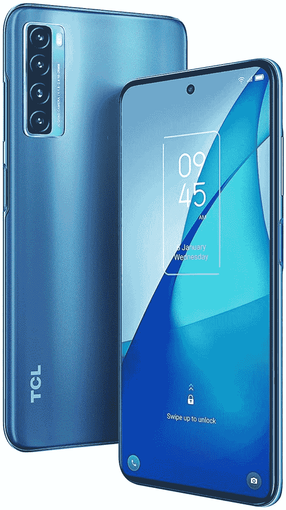

# TCL 20S 有哪些颜色？

> 原文：<https://www.xda-developers.com/tcl-20s-colors/>

今年 6 月，TCL 在美国的产品组合中增加了三款新智能手机。这些新手机中的一款是 TCL 20S T1，这是一款低端的 Android 手机，具有诱人的设计和 T2 体面的规格 T3。如果你打算购买 TCL 20S，你可能想知道这款手机有哪些颜色可供选择。TCL 提供 20S 两种颜色——银河灰和北极星蓝。在该公司的一些营销材料中，银河灰的颜色变体也被称为银河黑。这两种颜色都有相同的规格，在美国有售。

## TCL 20S 颜色

[TCL 20S](https://www.xda-developers.com/tcl-20s-review/) 采用玻璃正面、黑色边框、光滑侧面和磨砂背面。在这两种颜色的变体上，你能看到不同颜色的地方只有背板和侧面。手机的其余部分在银河灰和北极星蓝两种变体中看起来都差不多。

 <picture></picture> 

Milky Way Gray

##### TCL 20S

TCL 20S 的银河灰色款将受到喜欢低调外观的人的青睐。由于微米级棱镜晶体的存在，手机的背面仍然会闪闪发光，但这种变体的整体外观将比北极星蓝更微妙。

 <picture></picture> 

North Star Blue

##### TCL 20S

如果你想让手机有点色彩，TCL 20S 的北极星蓝色更有意义。看起来清爽好看。即使你把手机放在捆绑的透明外壳中，它仍然会很显眼。

如前所述，20S 是一款较低端的中端智能手机。它配备了 6.67 英寸全高清+ (1，080 x 2，400 像素)液晶屏幕，带有一个用于自拍相机的打孔切口。这款手机由高通骁龙 665 SoC 驱动，配有 4GB 内存和 128GB 板载存储。此外，您将获得 5000 毫安时电池，支持 18W 快速充电。

在其他规格中，这款手机配备了一个四后置摄像头，由一个 64MP 主摄像头主导。20S 还配备了 800 万像素的广角摄像头、200 万像素的微距摄像头和 200 万像素的深度传感器。

此外，你将获得带 TCL UI 的 Android 11，侧装指纹传感器，microSD 卡插槽，以及常用的连接选项。20S 上没有[5G 支持](https://www.xda-developers.com/tcl-20s-carrier-support/)。

* * *

关于 TCL 20S 颜色选择，这就是你需要知道的全部。这两种颜色你打算买哪一种？请在评论区告诉我们。与此同时，不要忘记查看我们的购买指南，关于[最佳 TCL 20S 保护套](https://www.xda-developers.com/best-tcl-20s-cases/)和[最佳 TCL 20S 屏幕保护套](https://www.xda-developers.com/best-tcl-20s-screen-protector/)以保护您的手机。