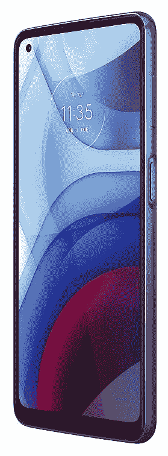
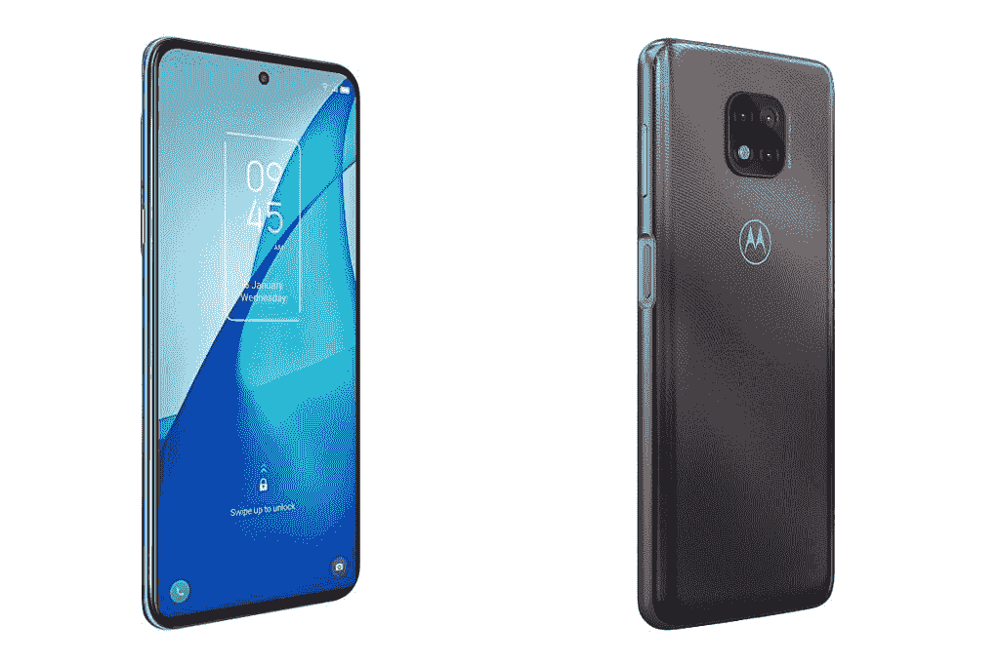

# TCL 20S vs Moto G Power (2021):应该买哪款手机？

> 原文：<https://www.xda-developers.com/tcl-20s-vs-moto-g-power-2021/>

TCL 月在美国推出了三款 20 系列手机。其中一款手机是 [TCL 20S](https://www.xda-developers.com/tcl-20s-review/) ，这是一款中档安卓手机，外观漂亮，规格也不错。如果你在市场上购买一部新的 Android 手机，并且不知道是否应该购买 TCL 20S，或者攒点钱买一部摩托罗拉 Moto G Power (2021)，我们可以帮助你。在本文中，我们将 TCL 20S 与 Moto G Power (2021)进行对比，看看这两款手机的实力如何。

**浏览本指南:**

## TCL 20S vs Moto G Power (2021):规格

| 

规范

 | 

TCL 20S

 | 

摩托罗拉摩托 G 动力(2021)

 |
| --- | --- | --- |
| **尺寸和重量** | 

*   166.2 x 76.9 x 9.1 毫米
*   199g

 | 

*   165.28 x 75.9 x 9.49 毫米
*   206.5 克

 |
| **显示** | 

*   6.67 英寸液晶显示器
*   全高清+电视
*   20:9 宽高比
*   打孔设计
*   60Hz 刷新率

 | 

*   6.6 英寸液晶显示器
*   高清+
*   20:9 宽高比
*   打孔设计
*   60Hz 刷新率

 |
| **SoC** | 

*   高通骁龙 665:
    *   4x Kryo 260 基于 Cortex-A73 @ 2GHz
    *   基于 Cortex-A53 的 4x Kryo 260 @ 1.8 GHz
    *   11 纳米
*   Adreno 610 GPU

 | 

*   高通骁龙 662
    *   4x Kryo 260 基于 Cortex-A73 @ 2GHz
    *   基于 Cortex-A53 的 4x Kryo 260 @ 1.8 GHz
    *   11 纳米
*   Adreno 610 GPU

 |
| **RAM 和存储器** | 

*   4GB 内存
*   128GB 闪存存储
*   MicroSD 卡支持

 | 

*   3GB/ 4GB
*   32GB/ 64GB
*   MicroSD 卡支持

 |
| **后置摄像头** | 

*   **主** : 64MP
*   **二级** : 8MP，超宽
*   **三级** : 2MP，宏
*   **第四纪:** 2MP，深度

 | 

*   **初级:** 48MP，f/1.7
*   **二级:** 2MP，微距，f/2.4
*   第三级:2MP，深度，f/2.4

 |
| **前置摄像头** |  |  |
| **电池** | 

*   5000 毫安时
*   高达 18W 的快速充电

 | 

*   5000 毫安时
*   高达 15W 的快速充电

 |
| **连通性** | 

*   乐队(北美):
    *   GSM:850/900/1800/1900MHz
    *   UMTS:1/2/4/5/8
    *   LTE:1/2/3/4/5/7/8/12/13/17/20/25/26/28/29/38/40/41/66/71
*   国家足球联盟
*   WiFi 802.11ac
*   蓝牙 5.0
*   USB 型

 | 

*   乐队(北美):
    *   GSM: 850/900/1800/1900MHz
    *   CDMA BC0/1/10
    *   UMTS: 1/2/4/5/8
    *   LTE:1/2/3/4/5/7/8/12/13/14/17/25/26/29/30/38/41/66/71
*   无线网络 802.11ac
*   蓝牙 5.0
*   USB 型

 |
| **其他特性** | 

*   侧装式指纹读取器

 | 

*   侧装式指纹扫描仪

 |
| **软件** |  |  |

* * *

## 设计和展示

TCL 20S 和 Moto G Power 分享了许多设计元素，如自拍相机的打孔切口、闪亮的背部和电源按钮上的指纹传感器。但这两款手机看起来还是有所不同，主要是因为它们的背部设计。虽然 20 年代的背板嵌有微米大小的棱镜晶体，发出微光，但摩托罗拉已经有了一个巨大的指纹状图案。此外，20 年代几乎没有任何挡板，而 Moto G Power 的下巴更厚，挡板也明显更大。

TCL 手机因其 6.67 英寸的全高清+ (1，080 x 2，400 像素)显示屏而在显示屏方面得分，而 Moto G Power 则配备了 6.6 英寸的高清+ (720 x 1，600 像素)显示屏。这两款手机都使用液晶显示器，并配有 20:9 的宽高比。

如果显示器对你来说很重要，你希望东西看起来清晰明了，TCL 20S 无疑是更好的选择。

## SoC、RAM 和存储

 <picture></picture> 

Moto G Power (2021)

这两款手机的 SOC 并没有太大的区别。TCL 20S 搭载的是骁龙 665，而摩托罗拉手机搭载的是骁龙 662。两个 SOC 都有 Cortex-A73 和 Cortex-A53 CPU 内核，主频分别为 2GHz 和 1.8GHz。它们还共享 GPU、RAM 类型和制造工艺。但 S665 有一个更新的 LTE 调制解调器，并支持 4K 视频捕捉。总体而言，就 SoC 而言，20S 仅略好于 Moto G Power。

虽然 TCL 手机拥有 4GB 内存和 128GB 的板载存储，但 Moto G Power 有两种版本——3GB 内存+ 32GB 存储和 4GB 内存+ 64GB 存储。虽然这两款手机都包含 microSD 卡插槽，但如果你想要更多的内部存储，TCL 有优势，但摩托罗拉的 64GB 型号应该足以满足大多数人的需求。

## TCL 20S vs Moto G Power (2021):相机

TCL 在 20 年代的背面配备了四摄像头，标题是一个 6400 万像素的摄像头。另一方面，摩托罗拉 Moto G Power 配备了一个三后置摄像头，其中包括一个 48MP 主摄像头。两款手机都有一个 200 万像素的深度传感器和一个 200 万像素的微距摄像头，但摩托罗拉手机没有广角摄像头。TCL 放了一个 8MP 的广角摄像头，对大多数消费者来说可能不是什么大事，但有不少人喜欢用广角相机拍照。

此外，主后置摄像头能够在 TCL 20S 上捕捉 4K 30fps 视频。Moto G Power 最多只能拍摄 1080p 60fps 的视频。对于您的自拍需求，您可以在 20S 上获得 1600 万像素的相机，在摩托罗拉手机上获得 800 万像素的相机。

总的来说，如果广角相机和 4K 视频对你很重要，TCL 20S 就是你的好伙伴。但如果你真的不在乎这两样东西，Moto G Power 也是一个不错的选择。

## 电池和连接

 <picture></picture> 

TCL 20s (left) and Moto G Power (2021)

电池和连接是 TCL 20S 和 Moto G 动力几乎处于同一水平的两个领域。两款手机都配有 5000 毫安时电池。而 TCL 手机最大支持 18W 快充，Moto G 功率最大可快充 15W。

这些手机还配备了一个 USB Type-C 端口，并具有相同的连接选项，包括 4G LTE、Wi-Fi 802.11ac 和蓝牙 5.0。TCL 20S 还包括 NFC 连接，这是摩托罗拉手机所没有的。在运营商支持方面，20S 和 Moto G Power 都可以在美国电话电报公司、T-Mobile 和威瑞森上使用。

## 操作系统版本和更新

TCL 20S 运行 Android 11，采用 TCL UI，而 Moto G Power (2021)则采用 Android 10 和我的 UX。如果 TCL 的加拿大网站有任何暗示的话，这款手机将在 2024 年 4 月前获得 Android 12 更新和安全更新。Moto G Power (2021)预计将获得 Android 11 更新，但除此之外什么都不知道。摩托罗拉没有说什么，直到什么时候 Moto G Power 将继续获得安全更新。

TCL 在操作系统方面显然有优势，因为它自带更新的软件，并将在近三年内获得安全更新。所以如果你在意 Android 版本，得到 TCL 20S 更有意义。

## 价格和颜色

 <picture></picture> 

TCL 20S (left two) and Moto G Power (2021)

TCL 在美国只销售 20S 的一种存储版本，售价 250 美元。Moto G Power 有两种存储版本——3GB+32GB 和 4GB + 64GB。虽然摩托罗拉 Moto G Power 的起价为 200 美元，但后来打了折扣，其 3GB RAM 型号现在售价为 190 美元，4GB RAM 型号售价为 230 美元。因此，如果你想省钱，你可以买到比 TCL 20S 更便宜的 Moto G 动力版。

在颜色方面，TCL 20S 有北极星蓝和银河黑两种颜色，而 Moto G Power 有极地银和闪光灰两种颜色。

## 结论

现在你一定很清楚，虽然 TCL 20S 和 Moto G Power (2021)有很多相似之处，但 TCL 手机在两个关键部门——显示屏和软件——超过了摩托罗拉手机。Moto G Power 缺少的还有一点就是广角射手。

所以如果这三样东西对你很重要——而且对很多人都很重要 TCL 20S 是一款更好的手机。但是，如果你可以在没有全高清屏幕和旧版本 Android 的情况下生活，Moto G Power 可以帮你节省一些钱。

 <picture></picture> 

TCL 20S

##### TCL 20S

TCL 20S 是一款中端手机。它采用 6.67 英寸全高清+显示屏，骁龙 665 SoC 和 Android 11。

 <picture></picture> 

Motorola Moto G Power (2021)

##### 摩托罗拉摩托 G 动力(2021)

Moto G Power (2021)是摩托罗拉专注于电池的智能手机。它装有一个 5000 毫安时的大电池，支持 15W 快速充电。

如果您已经购买了这款手机，请查看我们对配件、外壳、屏幕保护套等的推荐:

这两款手机你打算买哪一款？请在评论区告诉我们。