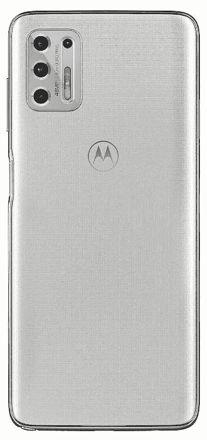
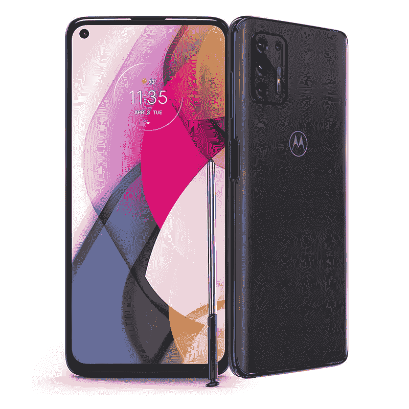

# TCL 20S vs Moto G 手写笔(2021):该买哪款手机？

> 原文：<https://www.xda-developers.com/tcl-20s-vs-moto-g-stylus/>

尽管由于中国智能手机制造商，中端智能手机市场在国际上相当成功，但在美国，这一市场的利润通常很低。TCL 现在正试图通过其新的 [20 系列](https://www.xda-developers.com/tcl-20/)增加该细分市场的可用选项数量。 [TCL 20S](https://www.xda-developers.com/tcl-20s-review/) 是产品线中的一款手机，它是你下一部智能手机的一个相当不错的选择。

然而，如果你对 TCL 20S 和摩托罗拉 Moto G Stylus (2021)感到困惑，我们可以帮助你。在本文中，我们将对比 TCL 20S 和 Moto G 手写笔，看看这两款 Android 手机如何相互抗衡。

**浏览本指南:**

## TCL 20S vs Moto G 手写笔:规格

| 

规范

 | 

TCL 20S

 | 

摩托罗拉 Moto G 手写笔(2021)

 |
| --- | --- | --- |
| **尺寸和重量** | 

*   166.2 x 76.9 x 9.1 毫米
*   199g

 | 

*   169.8 x 77.9 x 9 毫米
*   206.5 克

 |
| **显示** | 

*   6.67 英寸液晶显示器
*   全高清+电视
*   20:9 宽高比
*   打孔设计
*   60Hz 刷新率

 | 

*   6.8 英寸液晶显示器
*   全高清+电视
*   20:9 宽高比
*   打孔设计
*   60Hz 刷新率

 |
| **SoC** | 

*   高通骁龙 665:
    *   4x Kryo 260 基于 Cortex-A73 @ 2GHz
    *   基于 Cortex-A53 的 4x Kryo 260 @ 1.8 GHz
    *   11 纳米
*   Adreno 610 GPU

 | 

*   高通骁龙 678
    *   基于 Cortex-A76 的 4x Kryo 460 @ 2.2 GHz
    *   基于 Cortex-A55 的 4x Kryo 460 @ 1.8 GHz
    *   11 纳米
*   Adreno 612 GPU

 |
| **RAM 和存储器** | 

*   4GB 内存
*   128GB 闪存存储
*   MicroSD 卡支持

 | 

*   4GB
*   128GB
*   MicroSD 卡支持

 |
| **后置摄像头** | 

*   **主** : 64MP
*   **二级** : 8MP，超宽
*   **三级** : 2MP，宏
*   **第四纪:** 2MP，深度

 | 

*   **初级:** 48MP，f/1.7
*   **二级:** 8MP，广角，f/2.2
*   第三级: 2MP，微距，f/2.2
*   **第四纪:** 2MP，深度

 |
| **前置摄像头** |  |  |
| **电池** | 

*   5000 毫安时
*   高达 18W 的快速充电

 | 

*   4000 毫安时
*   高达 10W 的快速充电

 |
| **连通性** | 

*   乐队(北美):
    *   GSM:850/900/1800/1900MHz
    *   UMTS:1/2/4/5/8
    *   LTE:1/2/3/4/5/7/8/12/13/17/20/25/26/28/29/38/40/41/66/71
*   国家足球联盟
*   WiFi 802.11ac
*   蓝牙 5.0
*   USB 型

 | 

*   乐队(北美):
    *   GSM: 850/900/1800/1900MHz
    *   CDMA BC0/1/10
    *   UMTS: 1/2/4/5/8
    *   LTE:1/2/3/4/5/7/8/12/13/14/17/20/25/26/29/38/40/41/66/71
*   无线网络 802.11ac
*   蓝牙 5.0
*   USB 型

 |
| **其他特性** | 

*   侧装式指纹读取器

 | 

*   侧装式指纹扫描仪

 |
| **软件** |  |  |

## 设计和展示

 <picture></picture> 

TCL 20S

TCL 20S 和 Moto G 触控笔的设计截然不同。虽然 TCL 手机为自拍相机配备了居中的打孔切口，但摩托罗拉选择将打孔切口放在屏幕的左上角。在背面，你会发现 20S 上有一个垂直摄像头模块和哑光表面，而 Moto G 手写笔则有一个矩形摄像头模块和光滑表面。两款手机都有塑料背板。

在显示屏方面， [TCL 20S 配备了 6.67 英寸的全高清+液晶屏](https://www.xda-developers.com/tcl-20s-specifications/)，摩托罗拉配备了 6.8 英寸的全高清+液晶屏。除了尺寸上的微小差异，这两款手机的显示屏非常相似。

总的来说，在设计和显示屏方面，除非你不喜欢摩托罗拉手机的光滑表面或 TCL 手机的哑光表面，否则你可以选择任何一款手机，这不会有太大的区别。

## TCL 20S 与 Moto G 手写笔:SoC、RAM 和存储

 <picture></picture> 

Moto G Stylus (2021)

在 SoC 方面，事情变得有点有趣，因为 Moto G Stylus (2021)由更新的骁龙 678 (S678) SoC 驱动，这是骁龙 675 的后续产品。您将获得两个 Kryo 460 (Cortex-A76)内核和六个 Kryo 460 (Cortex-A55)内核。TCL 手机使用骁龙 665 (S665) SoC，包括四个 Kryo 260 (Cortex-A73)内核和四个 Kryo 260 (Cortex-A53)内核。S678 中的 Adreno 612 GPU 也比 S665 中的 Adreno 610 GPU 更新。此外，两款智能手机都将获得 4GB 内存、128GB 板载存储空间和一个 microSD 卡插槽。

如果手机的日常性能对你来说很重要，摩托罗拉手机可能会提供比 TCL 手机稍好的体验。

## 摄像机

 <picture></picture> 

TCL 20S

在成像方面，除了 TCL 手机上分辨率更高的主摄像头外，TCL 20S 和 Moto G 手写笔几乎处于同一水平。但是众所周知，更高的百万像素并不重要。TCL 20S 上有一个 6400 万像素的主摄像头，一个 800 万像素的广角摄像头，一个 200 万像素的微距摄像头和一个 200 万像素的深度传感器。Moto G Stylus 装有 48MP 主摄像头、8MP 广角摄像头、2MP 微距摄像头和 2MP 深度传感器。这两款手机还配备了 1600 万像素的自拍相机。

总的来说，如果相机是你的优先选择，你可以选择这两款手机中的任何一款，你将获得类似的性能水平。

## 电池和连接

在电池方面，TCL 20S 显然是赢家，因为它有 5000 毫安时的电池。相比之下，摩托罗拉手机只有 4000 毫安时的电池。TCL 手机还支持 18W 快速充电，而在 Moto G 手写笔上，你只能获得 10W 的充电支持，这在当今是非常基本的。

谈到连接选项，两款智能手机都缺乏对 5G 的支持。但你会在这两款手机上获得 4G LTE、Wi-Fi 802.11ac、蓝牙 5.0 和 USB Type-C。此外，TCL 20S 还包括 NFC 支持，这是摩托罗拉手机所缺乏的。

## TCL 20S vs Moto G 手写笔:操作系统和 Android 更新

 <picture></picture> 

Moto G Stylus 2021

TCL 20S 在软件方面也大放异彩，因为这款手机开箱即可运行 Android 11，而 Moto G 手写笔则采用了 Android 10。你将分别在 20S 和 Moto G 手写笔上获得制造商皮肤方面的 TCL UI 和我的 UX。

在更新方面， [TCL Canada 网站](https://www.tcl.com/ca/en/products/mobile/tcl-20-series/tcl-20s)暗示 TCL 20S 将获得 Android 12 更新，安全更新到 2024 年 4 月。另一方面，Moto G 触控笔将获得 Android 11 更新，安全更新将持续到 2023 年。

### 价格和颜色

TCL 20S 的唯一存储版本定价为 250 美元；然而，它有两种颜色出售——银河灰和北极星蓝。另一方面，Moto G 手写笔的价格为 300 美元。它也有两种颜色出售——极光白和极光黑。

## 结论

现在已经很明显，与 Moto G 手写笔相比，TCL 20S 有很多优势。但是有一个东西我们到现在都没有讲过——手写笔。摩托罗拉手机配有手写笔，你可以用它做很多事情。因此，如果你正在寻找一款带手写笔的手机，这两款手机之间的竞争是非常一边倒的。

然而，如果你想要一部普通的手机，而手写笔不是考虑因素，20S 将为你提供更大的电池、更新的软件和更低的价格，而 Moto G 手写笔包括略好的 SoC。可以根据自己的喜好挑一个。

 <picture></picture> 

TCL 20S

##### TCL 20S

TCL 20S 是该公司 20 系列的一部分，由骁龙 665 SoC 提供动力。此外，这款手机还配有 5000 毫安时的电池。

 <picture></picture> 

Motorola Moto G Stylus (2021)

##### 摩托罗拉 Moto G 手写笔(2021)

摩托罗拉 Moto G Stylus 2021 是一款由骁龙 678 SoC 驱动的中档智能手机。它还包括一个 4000 毫安时的电池。

如果您已经购买了手机，请查看我们关于配件、外壳、屏幕保护套等的建议: