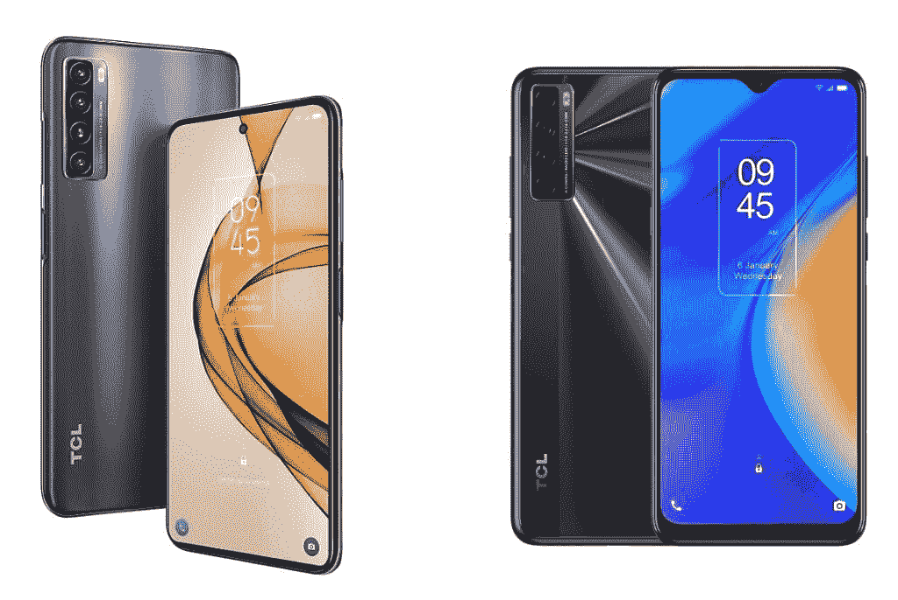
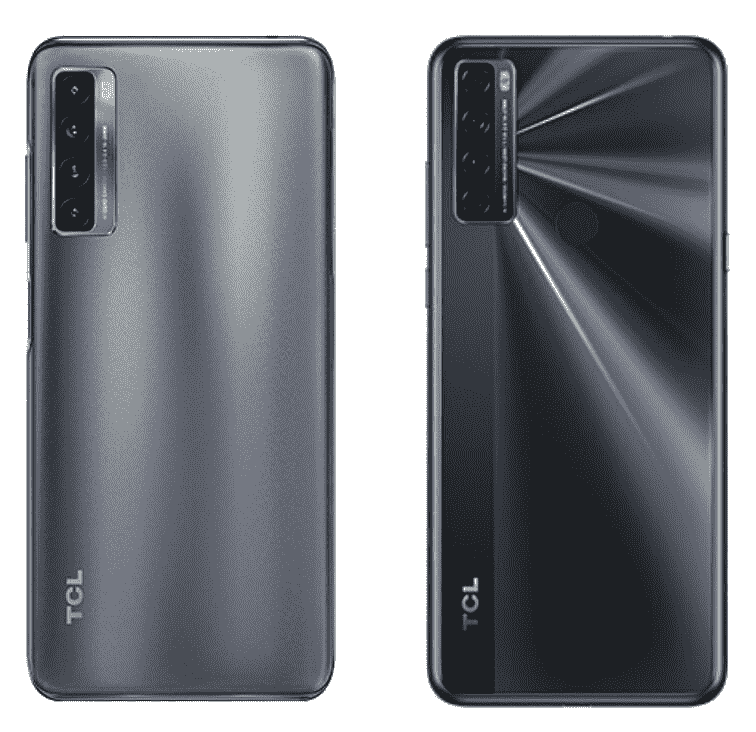

# TCL 20S vs TCL 20 SE:该买哪款手机？

> 原文：<https://www.xda-developers.com/tcl-20s-vs-tcl-20-se/>

TCL 2021 年的新手机以 TCL 20 系列的形式登陆美国。虽然 [TCL 20 Pro 5G](https://www.xda-developers.com/tcl-20-pro-5g-review/) 显然是针对中端市场，包括 5G，并有一套非常值得尊敬的规格，但 20 和 20 SE 针对的是预算人群。如果你正在寻找一款价格实惠的安卓手机，并且难以在 [TCL 20S](https://www.xda-developers.com/tcl-20s-review/) 和 [20 SE](https://www.xda-developers.com/tcl-20-se-review/) 之间做出选择，我们可以帮助你。在这次对比中，我们将了解这两款 TCL 手机的对比情况。

**浏览本指南:**

## TCL 20S 与 TCL 20 SE:规格

| 

规范

 | 

TCL 20S

 | 

TCL 20 SE

 |
| --- | --- | --- |
| **尺寸和重量** | 

*   166.2 x 76.9 x 9.1 毫米
*   199g

 | 

*   172.08 x 77.14 x 9.1mm 毫米
*   206

 |
| **显示** | 

*   6.67 英寸液晶显示器
*   全高清+电视
*   20:9 宽高比
*   穿孔显示器
*   60Hz 刷新率

 | 

*   6.82 英寸液晶显示器
*   高清+
*   20.5:9 宽高比
*   水滴凹口
*   60Hz 刷新率

 |
| **SoC** | 

*   高通骁龙 665:
    *   4 倍性能 4 倍效率 Kryo 260 CPU 内核(最高 2.0GHz)
    *   11 纳米
*   Adreno 610 GPU

 | 

*   高通骁龙 460
    *   基于 Cortex-A73 的 4x Kryo 240 @ 1.6 GHz
    *   基于 Cortex-A53 的 4x Kryo 240 @ 1.8 GHz
*   Adreno 610 GPU

 |
| **RAM 和存储器** | 

*   4GB 内存
*   128GB 闪存存储
*   MicroSD 卡支持

 | 

*   4GB
*   128GB 闪存存储 UFS 2.1
*   MicroSD 卡支持

 |
| **后置摄像头** | 

*   **初级** : 64MP 初级
*   **二级** : 8MP 超宽
*   **第三级** : 2MP 宏
*   第四系:2MP 深度

 | 

*   **主要:** 48MP，f/2.0，1/2”传感器，79°视场
*   **次要:** 5MP，广角，f/2.2，115 FoV
*   **第三级:** 2MP，微距相机，f/2.4
*   第四纪: 2MP，深度，f/2.4

 |
| **前置摄像头** |  |  |
| **电池** | 

*   5000 毫安时
*   高达 18W 的快速充电

 | 

*   5000 毫安时
*   没有快速充电

 |
| **连通性** | 

*   乐队(北美):
    *   GSM:850/900/1800/1900MHz
    *   UMTS:1/2/4/5/8
    *   LTE:1/2/3/4/5/7/8/12/13/17/20/25/26/28/29/38/40/41/66/71
*   国家足球联盟
*   WiFi 802.11 . b/g/n/AC(2.4 GHz+5 GHz)
*   蓝牙 5.0
*   USB 型

 | 

*   乐队(北美):
    *   GSM: 850/900/1800/1900MHz
    *   UMTS: 1/2/4/5/8
    *   LTE:1/2/3/4/5/7/8/12/13/17/28/66
*   无线宽带/宽带/无线
*   蓝牙 5.0
*   USB 型

 |
| **其他特征** | 

*   侧装式指纹读取器

 | 

*   后置指纹扫描仪

 |
| **软件** |  |  |

* * *

## 设计

 <picture></picture> 

TCL 20s (left) and TCL 20 SE (right)

这两款 TCL 手机看起来差别很大。他们的设计中唯一有相似之处的是垂直摄像头设置，这实际上是所有 TCL 20 系列手机的风格比喻。

TCL 20S 的外观比 20 SE 略显低调。你在前面得到一个打孔自拍相机的设计，像所有打孔相机一样，有点消失在显示器中。该公司还推出了最少的边框和圆角。此外，手机的背板嵌有微米大小的棱镜晶体，提供微光，但不会变得太分散注意力。总的来说，20S 有一个优雅的设计，看起来现代和闪亮，但没有变得太多。

另一方面，TCL 20 SE 的设计略显过时，水滴式凹槽和背板采用双纳米光刻技术，闪闪发光。此外，手机正面还具有厚下巴的特点。

因此，如果你喜欢闪亮的东西，并且不介意底部的轻微边框，20 SE 将更适合你。然而，TCL 20S 将吸引寻求低调优雅设计的消费者。

## 显示

TCL 20S 可能不是很闪亮，但它在显示部门胜过 20 SE。这款手机采用 6.67 英寸全高清+ (1，080 x 2，400 像素)液晶屏，长宽比为 20:9。然而，TCL 20 SE 配备了 6.82 英寸高清+(720 x 1640 像素)液晶屏幕，长宽比为 20.5:9。由于全高清+显示屏，20S 的每英寸像素(PPI)比 20 SE 多 130 多，而 20se 只有 263 PPI。

毫无疑问，20S 将提供更好的显示体验。但是，如果您的预算紧张，并且您可以接受较低分辨率的显示器，您可以考虑 20 SE。较低分辨率的一个积极方面是电池性能略好，如果这是任何安慰的话。

## TCL 20S 与 20 SE: SoC、RAM 和存储

虽然看 TCL 20S 和 20 SE 中 SOC 的名称，似乎 20S 会比 20 SE 有明显的优势，但并没有那么简单。20 年代的骁龙 460 实际上是比 20 年代的骁龙 665 更新的 SoC。这意味着骁龙 460 拥有一些更新的技术，如 Spectra 340 图像信号处理器(ISP)与骁龙 665 的 Spectra 165 ISP。骁龙 460 还集成了 LPDDR4X 内存，据说比骁龙 665 中的 LPDDR4 内存耗电更少。但是这些功率改进是微不足道的。

另一方面，骁龙 665 有一个更新的 X12 LTE 调制解调器，它最多支持 4K30 编码/解码，而骁龙 460 配有 X11 LTE 调制解调器，最多只支持 1080p60 编码/解码。

骁龙 665 中的四个 Cortex-A73(市场名称为 Kryo 260) CPU 内核的时钟频率也高达 2GHz，而骁龙 460 中的 Cortex-A73(市场名称为 Kryo 240)内核的时钟频率仅为 1.6GHz。两个 SOC 中的四个 Cortex-A53 内核的时钟频率相同，均为 1.8GHz。两者也都包了同样的 GPU——adre no 610。

如果我们只是比较 SOC，20 在高功耗需求下表现更好，如游戏，但在其他对功耗不太敏感的任务中，两款手机应该提供相同的性能水平。

在 RAM 和存储方面，20S 和 20 SE 都配备了 4GB 的 RAM 和 128GB 的板载存储，带有 microSD 卡插槽。

因此，如果你经常玩游戏并执行其他耗电任务，TCL 20S 更有意义。但在其他方面，TCL 20 SE 可以帮助您节省资金，而不会在性能方面损失太多。

## 摄像机

 <picture></picture> 

TCL 20S and TCL 20 SE (right)

TCL 20S 和 20 SE 都配备了四后置摄像头，但两种设置中至少有两个摄像头是不同的。20S 配备了一个 64MP 主拍摄装置和一个 8MP 广角摄像头，20 SE 配备了一个 48MP 主拍摄装置和一个 5MP 广角摄像头。20S 主射手也能够拍摄 4K 30fps 的视频，而 20 SE 仅限于 1080p 30fps 的视频。这两款手机还包括 200 万像素的微距和 200 万像素的深度摄像头，尽管这两款手机的实用性非常有限。

在自拍方面，TCL 在 20S 上安装了 16MP 定焦前置摄像头，在 20 SE 上安装了 13MP 定焦摄像头。

总的来说，20S 在成像能力方面比 20 SE 有很多优势。所以如果你拍了很多照片，20S 更有意义。

## TCL 20S 与 TCL 20 SE:电池和连接

TCL 20S 和 20 SE 在电池和连接选项方面基本处于同一水平。两款手机都有 5000 毫安时的大电池，但在美国只有 20S 支持 18W 快充。TCL 还在 20S 的包装盒中捆绑了一个兼容的 18W 充电器，20 SE 将只配备 10W 充电器。此外，这两款手机还支持反向有线充电，所以你可以用它们来为其他设备充电，比如一副 TWS 耳塞。

这两款手机具有 USB Type-C 端口，用于充电和数据传输，并配有 4G LTE、蓝牙 5.0 和 NFC。这两款手机都可以在美国的美国电话电报公司和 T-Mobile 网络上使用。20 也可以在威瑞森上工作，但 20 SE 没有同样的认证。

不过在 Wi-Fi 连接方面，20S 有 Wi-Fi 802.11ac (Wi-Fi 5)，但 20 SE 仅限于 Wi-Fi 802.11n (Wi-Fi 4)。所以 20S 支持更快的 Wi-Fi。所以除非你担心的是更快的 Wi-Fi，否则 TCL 20S 和 20 SE 在这个部门是站在同一水平的。

## Android 版本和更新

TCL 20S 和 20 SE 运行在 Android 11 上，采用 TCL UI。虽然该公司承诺为 20 年代提供 Android 12 更新，但 20 SE 的 Android 更新前景尚不明朗。然而，20 SE 在 2023 年 1 月之前仍将获得安全更新。对 20S 的安全更新支持也将持续更长时间，直到 2024 年 4 月。

所以 TCL 20S 在这个部门取得了胜利。如果你打算在未来三到四年内保留你的新 TCL 手机，鉴于更长的更新支持，包括保证更新到 Android 12，20S 更有意义。

## TCL 20S 与 TCL 20 SE:定价

TCL 在美国只销售 20 年代和 20 年代各一种型号。4GB + 128GB 的 TCL 20S 售价 250 美元，而 4GB + 128GB 的 20 SE 零售价为 190 美元。这 60 美元的价格差异解释了 20 SE 落后于 20S 的许多方面。

两款手机都有两种颜色可选。TCL 20S 有北极星蓝和银河黑，而 TCL 20 SE 有极光绿和纽特黑。

这两款新的 TCL 智能手机都可以从亚马逊购买。

## 结论

虽然 TCL 20S 在许多方面明显优于 20 SE，但在许多方面，这两款手机处于同一水平。所以这本质上取决于你的优先事项和你愿意牺牲什么。

如果高分辨率显示屏、更好的摄像头和游戏性能是你的优先选择，TCL 20S 显然是更好的选择。但如果你预算不足，可以接受分辨率较低的屏幕、略显不足的处理器和缺乏 4K 录音，TCL 20 SE 也是一个不错的选择。

 <picture></picture> 

TCL 20S

##### TCL 20S

TCL 20S 是一款价格实惠的手机，采用 6.67 英寸全高清+显示屏，骁龙 665 SoC 和 Android 11。

 <picture></picture> 

TCL 20 SE

##### TCL 20 SE

TCL 20 SE 是该公司最新的廉价手机。它运行 Android 11，并装有骁龙 460 SoC 和一个 5000 毫安时的大电池。

如果您已经购买了手机，请查看我们关于配件、外壳、屏幕保护套等的建议: