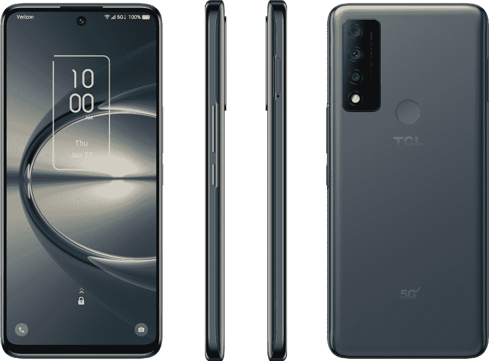

# TCL 30 V 现已在威瑞森上市，C 波段和毫米波 5G 售价 300 美元

> 原文：<https://www.xda-developers.com/tcl-30-v-5g-verizon/>

# TCL 30 V 现已在威瑞森上市，包括 C 波段和毫米波 5G，售价 300 美元

威瑞森和 TCL 准备向你出售一款 300 美元的 5G 手机，但软件支持仍是一个悬而未决的问题。

TCL 30 XE 和 TCL 30 V 都在本月早些时候的 CES 2022 期间发布，后者是威瑞森的独家车型。TCL 当时没有提供定价或供货细节，但威瑞森现在已经开始销售这款手机，售价为 299.99 美元。

这是又一款廉价的 5G 智能手机，与[三星 Galaxy A32](https://www.xda-developers.com/samsung-galaxy-a32-5g-review/) (即将被 [Galaxy A33](https://www.xda-developers.com/galaxy-a33-5g-leaked-renders/) 和[一加诺德 N200](https://www.xda-developers.com/oneplus-nord-n200-5g-launch/) 取代)大致属于同一类别。它有一个骁龙 480 芯片组，128GB 的内部存储(加上一个 microSD 卡插槽)，4GB 内存，18W 有线充电。显示屏为 6.67 英寸，分辨率为 1080 x 2400，相当不错，但刷新率只有 60Hz。5G 支持是主要卖点，支持威瑞森的毫米波、sub-6GHz 和 [C 波段](https://www.xda-developers.com/att-verizon-c-band-rollout/)网络。

| 

规格

 | 

TCL 30 V 5G

 |
| --- | --- |
| **构建** | 哑光塑料 |
| **尺寸&重量** | 

*   6.53 x 2.99 x 0.36 英寸
*   200 克

 |
| **显示** | 

*   6.67 英寸 1080 x 2400 英寸
*   大猩猩玻璃 3
*   60 赫兹

 |
| **SoC** | 高通骁龙 480 5G |
| **闸板&存放** | 

*   128GB 内部存储
*   最高 1TB 的 microSD
*   4GB 内存

 |
| **电池&充电** | 

*   4500 毫安时
*   18W 有线充电

 |
| **安全** | 后置指纹传感器 |
| **后置摄像头** | 

*   50MP 初级
*   5MP 超宽
*   2MP 宏

 |
| **前置摄像头** | 16MP |
| **端口** | 

*   USB Type-C 3.0
*   3.5 毫米耳机插孔

 |
| **音频** | 立体声扬声器 |
| **连通性** | 

*   LTE(B2/B4/B5/B12/B13/B46/B48/B66)
*   5G 低于 6GHz (n2/n5/n48/n66/n77)
*   5G 毫米波(n261，n260)
*   蓝牙 5.1
*   无线网络 802.11a/b/g/n/ac

 |
| **软件** | 安卓 11 |
| **其他特性** | 包装盒内包含 18W 墙壁电源适配器和 USB Type-C 电缆 |

对于所包含的硬件来说，这似乎不是一个可怕的价值，但软件支持一直是 TCL 智能手机的一个问题。TCL 30 V 开箱即用 Android 11，TCL 没有说明手机是否(或何时)会收到 [Android 12](https://www.xda-developers.com/android-12/) 。威瑞森还销售更老的 [TCL 10 5G UW](https://www.anrdoezrs.net/links/100122946/type/dlg/sid/UUxdaUeUpU536/https://www.verizon.com/smartphones/tcl-10-5g-uw/) ，它在 2020 年与 Android 10 一起发货，从未收到 Android 11。

尽管 TCL 30 V 可能不会获得任何重大的 Android 更新，但这款手机确实有一个 3.5 毫米的耳机插孔。接招吧，[银河 S22](https://www.xda-developers.com/samsung-galaxy-s22/) 。如果你想买 TCL 30 V，看看下面的链接。

 <picture></picture> 

TCL 30 V 5G

##### TCL 30 V 5G

TCL 的这款经济型 5G 手机现已在威瑞森独家发售。