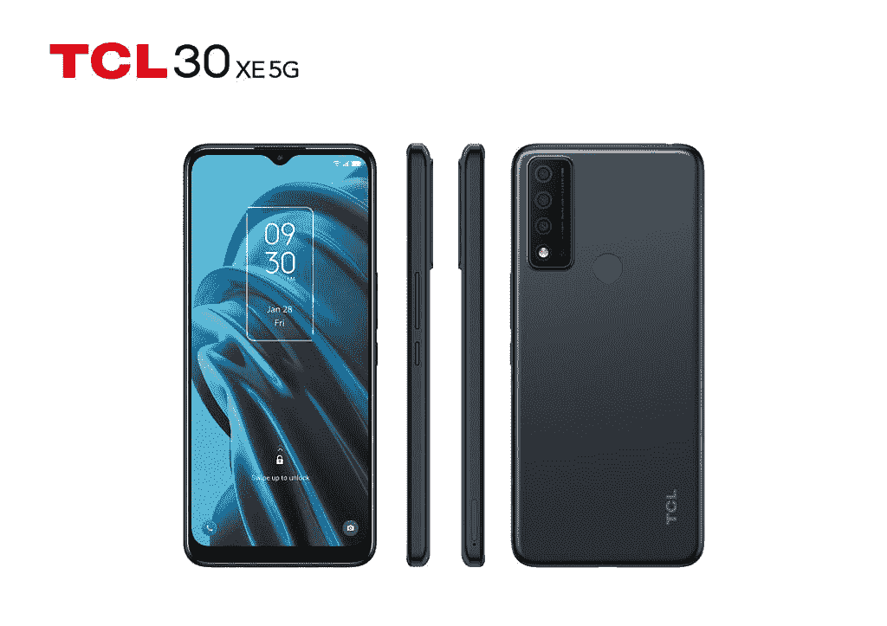
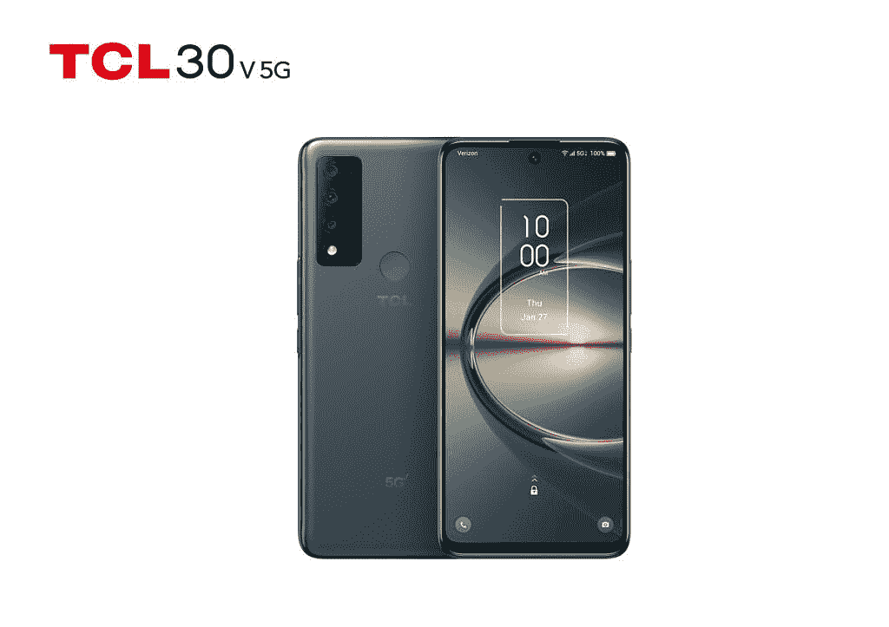

# 新的 TCL 30XE 和 TCL 30V 以实惠的价格提供 5G 支持

> 原文：<https://www.xda-developers.com/tcl-30xe-tcl-30v-launch/>

随着 5G 在美国的采用稳步上升，TCL 在负担得起的 5G 功能手机上下了大赌注。这家中国 OEM 厂商今天发布了两款新的 Android 智能手机 TCL 30XE 和 TCL 30V——以相对实惠的价格提供 5G 功能。如果你想买一部新的 5G 手机，这里有你需要知道的关于 TCL 最新实惠产品的一切。

## TCL 30XE 和 TCL 30V:规格

| 

规格

 | 

TCL 30XE 5G

 | 

TCL 30V 5G

 |
| --- | --- | --- |
| **尺寸&重量** | 

*   164.08 x 74.93 x 8.5mm 毫米
*   6.88 盎司

 | 

*   165.86 x 75.94 x 9.1mm 毫米
*   7.07 盎司

 |
| **显示** | 

*   6.52 英寸高清+ V 形凹槽显示屏
*   1600 x720 像素
*   90Hz 刷新率
*   180Hz 触摸采样速率
*   龙之旅 3

 | 

*   6.67 英寸 FHD+打孔显示屏
*   2400 x 1080p 像素
*   60Hz 刷新率
*   大猩猩玻璃 3

 |
| **SoC** | 联发科天玑 700 | 高通骁龙 480 |
| **内存&存储** | 

*   4GB 内存
*   64GB 存储
*   支持 MicroSD 卡(最高 512GB)

 | 

*   4GB 内存
*   128GB 存储
*   支持 MicroSD 卡(最高 1TB)

 |
| **电池&充电** | 

*   4500 毫安时
*   含 9V2A 充电器

 | 

*   4500 毫安时
*   含 18W 快速充电器

 |
| **安全** | 后置指纹扫描仪 | 后置指纹扫描仪 |
| **后置摄像头** | 

*   初级:1300 万
*   深度:2MP
*   宏:2MP

 | 

*   初级:50MP
*   超宽:5MP
*   宏:2MP

 |
| **前置摄像头** | 800 万像素 | 16MP |
| **端口** | 

*   USB 2.0 型
*   3.5 毫米耳机插孔

 | 

*   USB 3.0 型
*   3.5 毫米耳机插孔

 |
| **音频** | 底部点火扬声器 | 双扬声器 |
| **连通性** | 

*   5G
    *   支持的频段:n25、n41、n66、n71、n77
*   4G LTE
*   802.11 无线网络
*   蓝牙 5.1

 | 

*   5G
    *   支持的波段:
        *   Sub6: n2，n5，n48，n66，n77
        *   毫米波:n261，n260
        *   4G LTE
        *   802.11 无线网络
        *   蓝牙 5.1

 |
| **软件** | 安卓 11 | 安卓 11 |

正如你可能从规格表中看到的那样，新的 TCL 30 系列设备面向那些只想拥有基本 5G 功能手机的用户。TCL 30XE 封装了联发科的 Dimensity 700 芯片、4GB 内存、64GB 存储和 4,500mAh 电池。它采用了 6.52 英寸的高清+显示屏，顶部有一个泪珠风格的自拍相机凹槽，支持 90Hz 刷新率和 180Hz 触摸采样率。

 <picture></picture> 

TCL 30 XE 5G

在摄像头方面，TCL 30XE 提供了 1300 万像素的主摄像头，200 万像素的深度传感器，背面还有 200 万像素的微距摄像头，以及 800 万像素的自拍摄像头。就连接而言，该设备显然提供了 5G 支持，802.11 a/b/g/n/ac Wi-Fi 和蓝牙 5.1。其他连接功能包括 USB Type-C 端口(USB 2.0)和 3.5 毫米耳机插孔。该设备开箱运行 Android 11。

 <picture></picture> 

TCL 30 V 5G

另一方面，TCL 30V 集成了高通的骁龙 480 SoC、4GB RA、128GB 存储和 4,500mAh 电池。它拥有更高分辨率的 6.67 英寸 FHD+显示屏，带有用于自拍相机的打孔切口，支持 60Hz 刷新率，以及康宁大猩猩玻璃 3 保护。

TCL 30V 上的摄像头也比 TCL 30XE 上的好一点。它的背面有一个 50MP 主摄像头，一个 5MP 超宽摄像头，一个 2MP 微距摄像头，前面有一个 16MP 自拍摄像头。与 TCL 30XE 不同，TCL 30V 提供 sub-6 和 mmWave 5G 支持，802.11 ab/b/g/n/ac Wi-Fi 和蓝牙 5.1。此外，这款手机还配有一个 USB 3.0 Type-C 端口和一个 3.5 毫米耳机插孔。它也可以开箱即用地运行 Android 11。

## 定价和可用性

TCL 目前尚未分享新 TCL 30XE 和 TCL 30V 的定价和供货细节。但是，根据给定的规格，我们预计 TCL 将以可承受的价格推出这些设备。我们会在所有相关细节披露后尽快更新这篇文章。