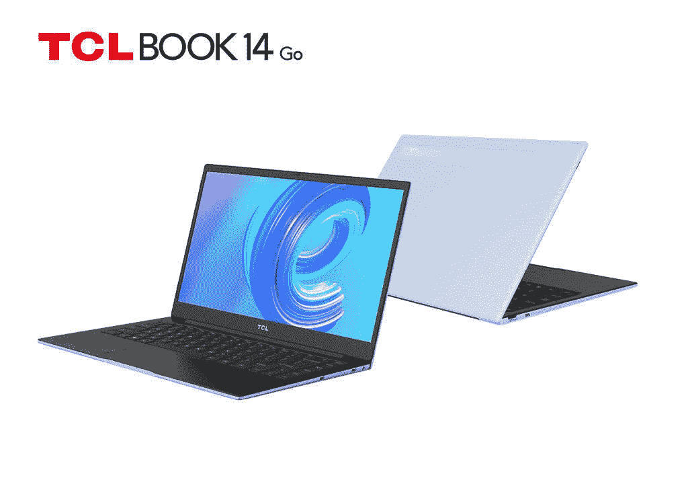
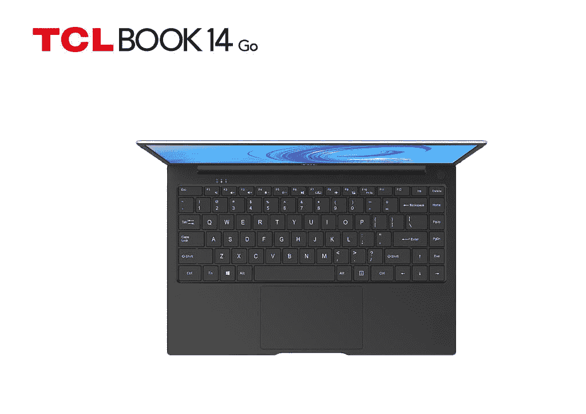

# TCL Book 14 Go 是一款面向学生的经济型 Windows 11 笔记本电脑

> 原文：<https://www.xda-developers.com/tcl-book-14-go-launch/>

随着两款新的 TCL 30 系列 5G 智能手机和一系列[安卓平板电脑](https://www.xda-developers.com/tcl-android-tablets-ces-2022/)，TCL 在 CES 2022 上发布了其首款 Windows 笔记本电脑。新的 TCL Book 14 Go 是一款基于 ARM 的笔记本电脑，开箱即可运行 [Windows 11](https://www.xda-developers.com/windows-11/) 。它采用时尚的设计，大量的 I/O 端口，以及 14.1 英寸的高清显示屏，刷新频率为 60Hz。这款笔记本电脑面向学生，价格应该可以承受。

## TCL Book 14 Go:规格

| 

规格

 | 

TCL Book 14 Go

 |
| --- | --- |
| **构建** | 金属+塑料底盘 |
| **尺寸&重量** | 

*   323.7 x 214.5 x 13.95mm 毫米
*   1300 克

 |
| **显示** | 

*   14.1 英寸 IPS
*   60Hz 刷新率
*   1366 x 768p 分辨率
*   16:9 宽高比

 |
| **CPU** | 

*   高通骁龙 7c
*   Adreno 618 GPU

 |
| **闸板&存放** | 

*   4GB 内存
*   128GB 板载存储

 |
| **电池&充电** | 

*   40 瓦时电池
*   24W 充电砖(C 型)

 |
| **摄像机** |  |
| **连通性** | 

*   802.11 无线网络(2x2)
*   蓝牙 5.1
*   4G LTE

 |
| **端口** | 

*   1 个 USB Type-C 全功能(PD+DP+USB 2.0)
*   1 个 USB 2.0 Type-C PD 充电
*   1 个 USB 3.0 类型 A
*   2 合 1 Nano + TF 卡插槽
*   3.5 毫米耳机/麦克风组合插孔

 |
| **颜色** | 空中文字 |
| **音频** | 双扬声器(1W x 2) |
| **操作系统** | Windows 11 |

TCL Book 14 Go 采用银色涂装，TCL 称之为 Skywriting。它采用金属和塑料底盘的时尚设计，小巧的外形使其非常便携。如前所述，TCL Book 14 Go 是一款基于 ARM 的 Windows 笔记本电脑，内置高通骁龙 7c 芯片、Adreno 618 GPU、4GB 内存和 128GB 板载存储。这款笔记本电脑采用 14.1 英寸 1366 x 768p 显示屏，宽高比为 16:9，刷新率为 60Hz。

 <picture></picture> 

TCL Book 14 Go

TCL Book 14 配备了丰富的连接选项，包括 4G LTE 支持、802.11 a/b/g/n/ac Wi-Fi 和蓝牙 5.1 无线连接。端口方面，它有两个 USB 2.0 Type-C 端口，一个 USB 3.0 Type-A 端口，一个 2 合 1 Nano + TF 存储卡插槽，一个 3.5mm 耳机插孔。

 <picture></picture> 

TCL Book 14 Go keyboard and trackpad

其他值得注意的功能包括双扬声器设置(1W x 2)，40Wh 电池，24W Type-C 充电砖。这款笔记本电脑开箱即可运行 Windows 11。

目前，TCL 尚未分享 TCL Book 14 的定价和可用性细节。一旦有更多的信息，我们会及时更新这篇文章。