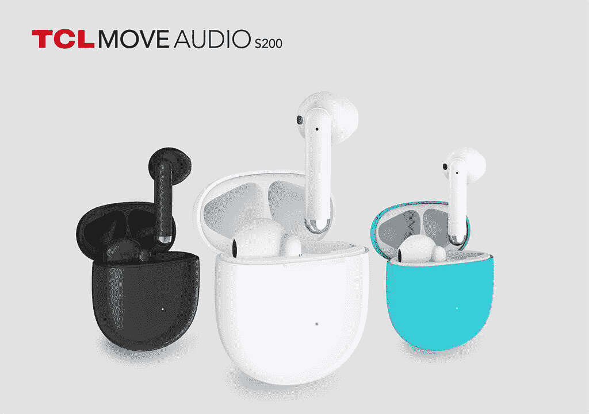

# TCL 在 IFA 2020 发布平板电脑、耳塞、智能手表和显示技术

> 原文：<https://www.xda-developers.com/tcl-tabmid-tabmax-tablets-moveaudio-tws-earbuds-movetime-smartwatch-nxtpaper-display-ifa-2020/>

TCL 在 [IFA 2020](https://b2b.ifa-berlin.com/) 上发布了一些新的移动设备和配件，包括两款新的 Android 平板电脑、一副真正的无线耳塞和一款智能手表。该公司还推出了一种新的显示技术，可以替代彩色电子墨水。这是你需要知道的一切。

## TCL 10 TabMax

TCL 10 TabMax 是该公司今天宣布的两款平板电脑中的最高端产品。这款平板电脑采用全高清+分辨率的 10.36 英寸显示屏，8.3 毫米窄边框，8000 毫安时电池，800 万像素前置摄像头，1300 万像素后置摄像头，Android 10，64GB 可扩展存储，并有 Wi-Fi 和 LTE 型号。SoC 好像是联发科的 Helio P22T。据 TCL 称，TabMax 具有“智能护眼”功能，因此您可以长时间使用该设备，而不会使眼睛疲劳。该设备还会在用户离屏幕太近(25 厘米以内)时提醒用户，支持谷歌新的儿童模式，并充当谷歌助理智能显示器。你可以使用该公司的“超低延迟”手写笔在平板电脑上绘图或书写。

TCL 10 TabMax 将于第四季度在欧洲推出，€和€的 LTE 和 Wi-Fi 型号分别为 299 美元和 249 美元。它将有深蓝色可选。

| 

规格

 | 

TCL 10 TabMax

 |
| --- | --- |
| **尺寸** | 247.8 x 157.56 x 7.65mm 毫米 |
| **显示** | 10.36 英寸全高清+显示屏 |
| **SoC** | 联发科 Helio P22T (4 个 Cortex-A73 2.0GHz，4 个 Cortex-A53 2.0GHz) |
| **内存&存储** | 4GB+64gb 可通过 microSD 卡扩展 |
| **电池** | 8000 毫安时 |
| **后置摄像头** | 1300 万 |
| **前置摄像头** | 800 万像素 |
| **其他功能** | 

*   USB 2.0 类端口
*   仅 Wi-Fi 模式
*   蓝牙 5.0
*   可选 LTE 型号

 |
| **安卓版本** | 安卓 10 |

## TCL 10 TabMid 4G

与此同时，TCL 还宣布了 TCL 10 TabMid，作为一种更小、更经济的替代产品。这款平板电脑配备了 8 英寸的 FHD 显示屏，使 TabMid 成为 TCL 新产品线中更便携的选择。这款 TabMid 还采用了高通骁龙 665 处理器，4GB 内存，64GB 可通过 microSD 卡插槽扩展的存储空间，5500 毫安时电池，800 万像素摄像头，Android 10，支持 Wi-Fi 和 4G LTE。

TCL 10 TabMid 将于第 4 季度在欧洲为€229 上市，颜色为深蓝色。

| 

规格

 | 

TCL 10 TabMid

 |
| --- | --- |
| **尺寸** | 209.4 x 125.2 x 8.55mm 毫米 |
| **显示** | 8.0 英寸 1920 x 1200 液晶显示器 |
| **SoC** | 高通骁龙 665 |
| **风筒&储存** | 4GB+64gb 可通过 microSD 卡扩展 |
| **电池** | 5000 毫安时 |
| **后置摄像头** | 800 万像素 |
| **前置摄像头** | 5MP |
| **其他特征** |  |
| **安卓版本** | 安卓 10 |

## TCL 移动音频 S200

## 

Move Audio S200 是该公司最新的真正无线耳塞。耳塞的有趣之处在于，它们的售价将低于€100 欧元，是市场上更实惠的选择之一。

Move Audio S200 的一些功能包括“ENC”降噪技术、四个采用波束成形技术的内置麦克风、蓝牙 5.0、防水、防汗和防尘的 IP54 等级，以及磨损检测，当您将它们放入或取出时，可以自动播放或暂停音乐。

TCL 表示，其无线耳塞一次性使用可提供 3.5 小时的电池寿命，并将于本月底在欧洲为€99 推出。

## TCL 移动时间系列观察

TCL 的新 MoveTime 家庭手表智能手表旨在保持老年人的联系和安全。该手表具有免提双向通话、自动跌倒检测、心率监测和药物提醒功能。TCL 推出智能手表的目标是让佩戴者感到独立，即使他们已经变老。它还具有健康监控功能，让家庭成员高枕无忧。该设备的其他一些功能包括 IP67 防水和防尘，41 x 48.5mm 毫米 AMOLED 触摸屏，针对更大的图标进行了优化，4G 连接和睡眠监控技术。

MoveTime 系列手表有两种颜色，深灰色和黑色，预计今年秋天在北美和欧洲上市，€售价 229 欧元。

## NXTPAPER

最后，TCL 还调侃了其名为 NXTPAPER 的新显示技术。该公司表示，这项新技术是两年产品研究和设计的成果，为用户提供了全彩色的纸张般的体验。该公司在一份新闻稿中表示:“与传统的电子墨水相比，TCL NXTPaper 的对比度提高了 25%，观看效果更好；与典型的 LCD 面板相比，TCL NXTPaper 的厚度减少了 36%，这使得设备更加轻薄。”。

NXTPaper 技术是为包括平板电脑在内的大幅面设备设计的，该公司计划将该技术引入未来的设备。