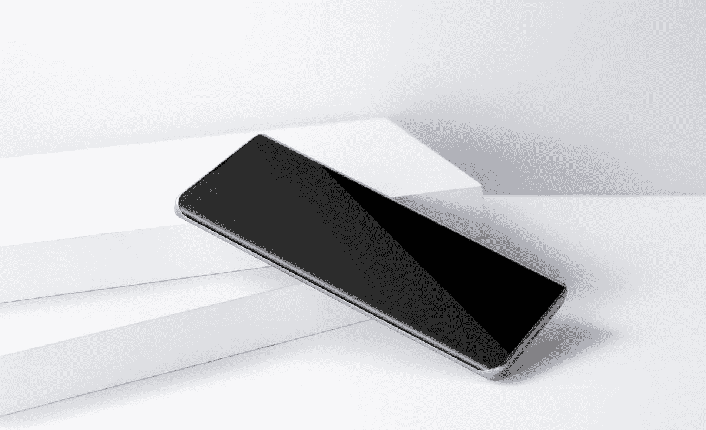
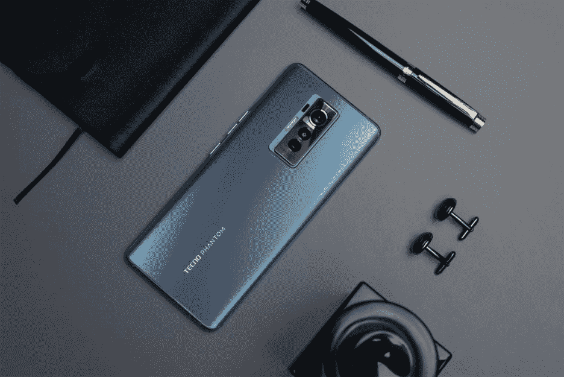
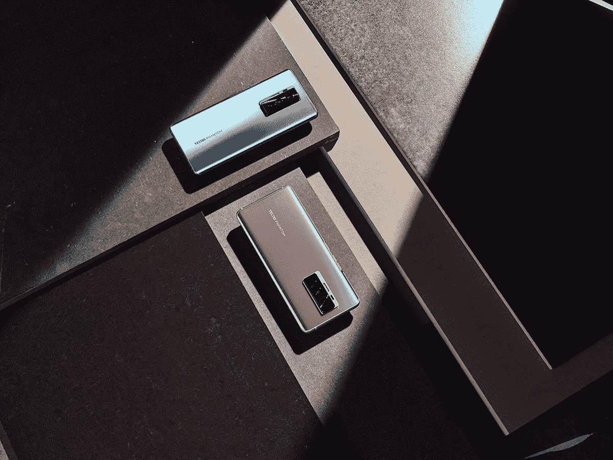
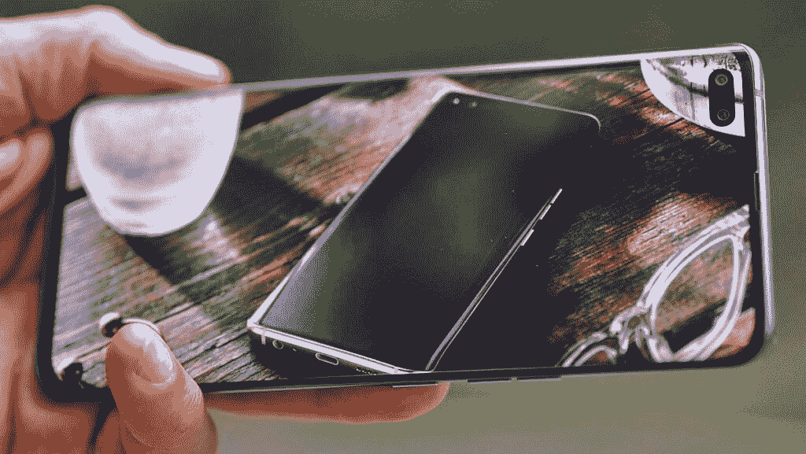
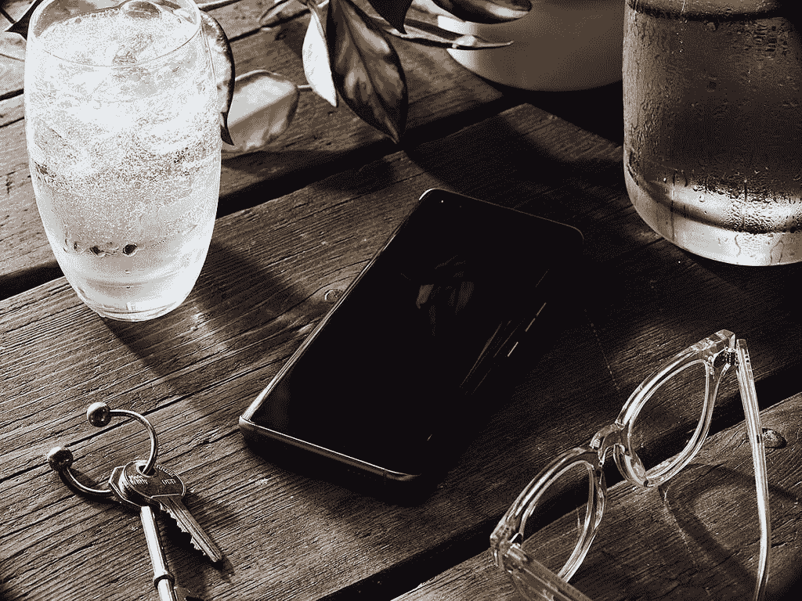
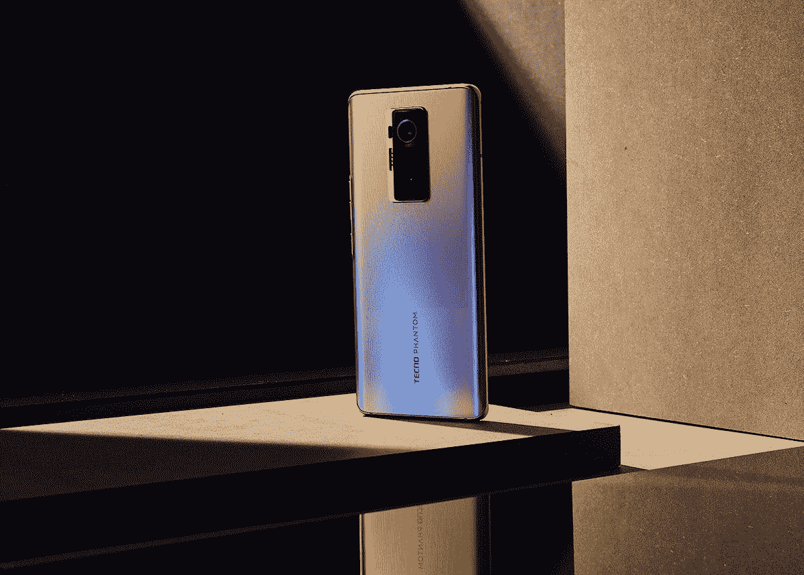

# TECNO 推出高端 PHANTOM X 旗舰产品，采用精致的设计和强大的摄像头

> 原文：<https://www.xda-developers.com/tecno-phantom-x/>

最近，TECNO 推出了其第一款名为 PHANTOM X 的高端旗舰手机。这是 TECNO 的一个里程碑，TECNO 是一家全球专家，致力于为新兴市场的消费者带来最新的技术和创新设计。让我们仔细看看 TECNO 凭借 PHANTOM X 在“Premium”方面的突破。

"有了幻影，规则受到挑战，被打破，被重新定义."

## 设计中对美的追求

。bestawarddiv {

浮动:对；

宽度:20%；

边距:1em

边距-顶部:0；

}

PHANTOM X 以精致的细节代表了设计上的巨大突破。PHANTOM X 采用 3D 无边框屏幕，并使用这种独特的 36.5°直角弧形设计，完美贴合用户的手。这款手机的屏幕较大，为 6.7 英寸，是一款完美的媒体消费设备。TECNO 将重点放在使这种显示器“无边框”上，让屏幕的边缘继续弯曲，最大角度可达 70 度。这创造了一种无限的视觉体验，图像和视频从手机侧面弯曲到无限远。

 <picture></picture> 

PHANTOM X in Van Gogh’s Starry Night and Monet’s Summer color options.

翻转手机，你会看到新的创新丝绸玻璃后盖。这种材料是基于一系列复杂的测试和制造程序而创造的，从而产生了这种“丝绸般的精致”和“玻璃般的闪亮”。这种蚀刻纹理设计显示了垂直的精致线条，给手机的设计带来了梦幻般的高级外观。由于 TECNO 承诺为用户提供顶级旗舰品质，因此在精致设计细节上的努力完全值得。

 <picture></picture> 

PHANTOM X in Van Gogh’s Starry Night

PHANTOM X 有两种不同的颜色可供选择，包括梵高的《星夜蓝》和莫奈的《夏日》。这两种颜色都有非常独特的外观，强调了手机背面使用的丝绸玻璃材料。

 <picture></picture> 

PHANTOM X in Van Gogh’s Starry Night and Monet’s Summer

这款相机是一排垂直堆叠的镜头，装在光滑的金属底座中。放置在设备的正中央，它创造了一个对称平衡的设计。电源和音量按钮与相机凸起的颜色相同，位于手机的右侧。

## 相机性能的一大飞跃

为了在 PHANTOM X 上创造强大的摄影体验，这款手机配备了一个由三个传感器组成的背部摄像头。前置摄像头具有双传感器，可捕捉大图像，从而在自拍中展现最佳细节。

 <picture></picture> 

TECNO PHANTOM X

PHANTOM X 采用了业界领先的 50MP 超夜相机，配有 1/1.3 英寸的超大传感器，即使在光线困难的情况下，用户也能捕捉到清晰的大分辨率图像。与配备 1/1.5 英寸传感器的 108 兆像素相机相比，该传感器可以从环境中吸收 33%的光线。

甚至自拍相机也支持超高分辨率图像，配有 48MP 传感器。您的自拍现在可以与许多其他后置相机具有相同的质量。自拍相机非常适合个人或团体自拍，配有人工智能辅助的 105 超广角镜头。当你的自拍包含多人时，相机能够检测到，并会建议你切换到超宽镜头。这是一个有用而方便的软件功能，可以确保您的自拍是用正确的传感器拍摄的。

至于重要的人像照片表现，PHANTOM X 采用 50mm 对焦镜头，呈现金色人像自然影像，不失真，捕捉并提升品质。

通过 PHANTOM X 的超级夜间模式，夜间摄影现在变得毫不费力，即使是休闲摄影师也不例外。当你在黑暗的环境中拍摄时，即使光线低至 0.1 勒克斯，PHANTOM X 也能够通过利用人工智能分割和夜间保护，利用支持算法的相机带来比肉眼更生动的细节。还有，在超级夜景人像的帮助下，你可以在辉煌的夜景中拥有优雅的人像。

## 强大的性能和非凡的关怀

严重依赖手机的用户，无论是工作还是娱乐，都将能够充分利用 PHANTOM X 的大存储容量、强大的电池以及高效的用户界面和操作系统设计。这款手机配有 8GB 内存和 256GB 存储空间。电池具有 4700mAh 的大容量，确保您能够全天使用您的设备。到了给手机充电的时候，使用 33W 的闪充充电器，30 分钟的充电时间可以让你的电池续航时间达到 70%。

TECNO 认为，除了独特的设计和强大的性能，高端旗舰产品还应该为用户提供独特的关怀和服务。例如，TECNO 通过 PHANTOM X 准确识别并提供了数据安全和隐私保护方面的优质服务。它提供了防窥和应用加密隐藏等安全措施来保护隐私。当用户意外丢失手机时，防盗功能可以帮助提醒和远程锁定设备。超薄的屏下指纹可以让用户在不到 0.4s 的时间内解锁 PHANTOM X，这是一个在不牺牲安全性的情况下最佳的解锁速度。

PHANTOM X 提供独家服务，涵盖 100 天意外屏幕损坏保护保修。用户可以访问为 PHANTOM X 客户量身定制的官方网站[www.mobile-phantom.com](http://www.mobile-phantom.com)，以充分利用售后服务。

 <picture></picture> 

TECNO PHANTOM X

| 

幻影 X

 | 

规范

 |
| --- | --- |
| 显示 | 6.7 英寸 FHD+ AMOLED |
| 芯片集 | MTK G95 |
| 随机存取存储 | 8GB |
| 主摄像机 | 50+13+8MP |
| 自拍相机 | 48+800 万像素 |
| 电池 | 4700 毫安时 |
| 储存；储备 | 256GB |
| 操作系统（Operating System） | 基于 Android 11 的 HiOS 7.6 |

 <picture></picture> 

PHANTOM X

我们今年给了 PHANTOM X 我们的推荐奖，因为它有一个令人印象深刻的规格列表，具有优雅和现代的设计以及强大的相机性能。

TECNO 的 PHANTOM X 是该公司的一个大胆举措，也是智能手机市场的一个新版本。这款新手机将成为领先的设备，为行业带来创新功能，如 3D 无边框显示屏和丝绸触摸玻璃设计。我们非常期待看到 TECNO 的未来。

###### 我们感谢 TECNO 赞助了这篇文章。我们的赞助商帮助我们支付与运行 XDA 相关的许多费用，包括服务器成本、全职开发人员、新闻撰稿人等等。虽然您可能会在门户内容旁边看到赞助内容(这些内容将始终被标记为赞助内容),但门户团队对这些帖子不承担任何责任。赞助内容、广告和 XDA 仓库完全由一个独立的团队管理。XDA 绝不会通过接受金钱来赞扬一家公司，或以任何方式改变我们的观点或看法，从而损害其新闻诚信。我们的意见不能被收买。