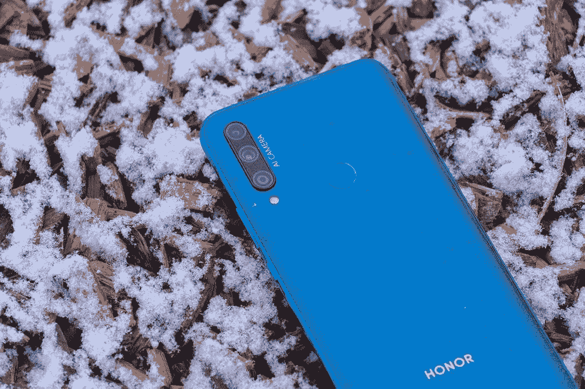
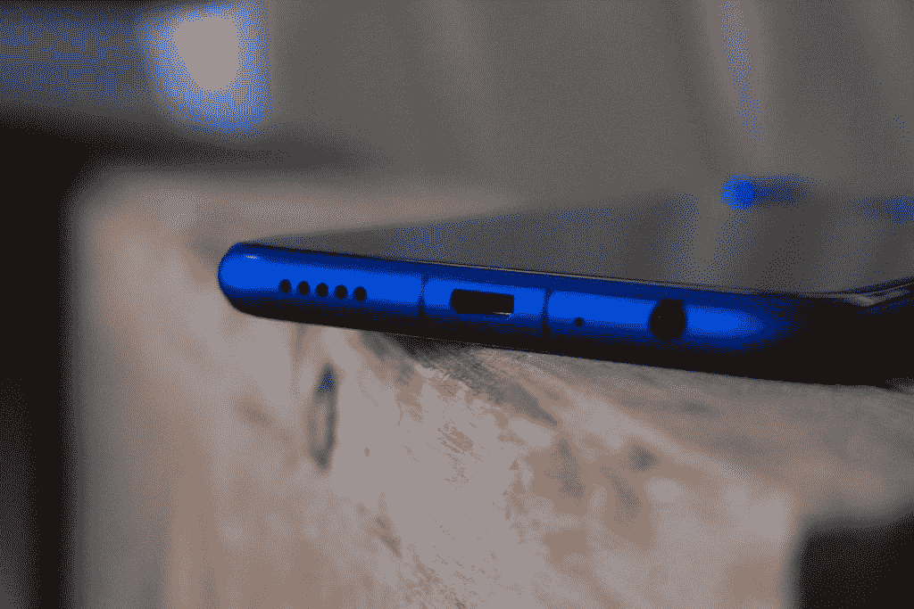
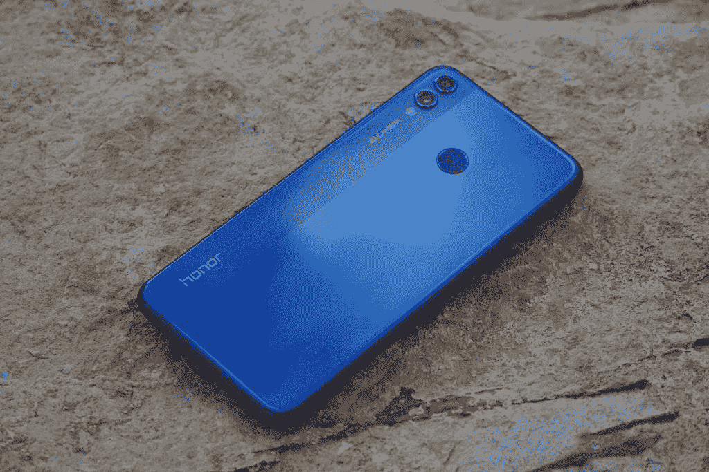
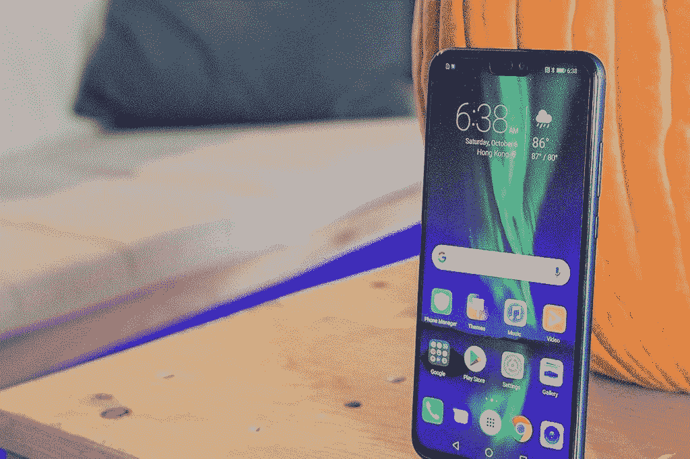
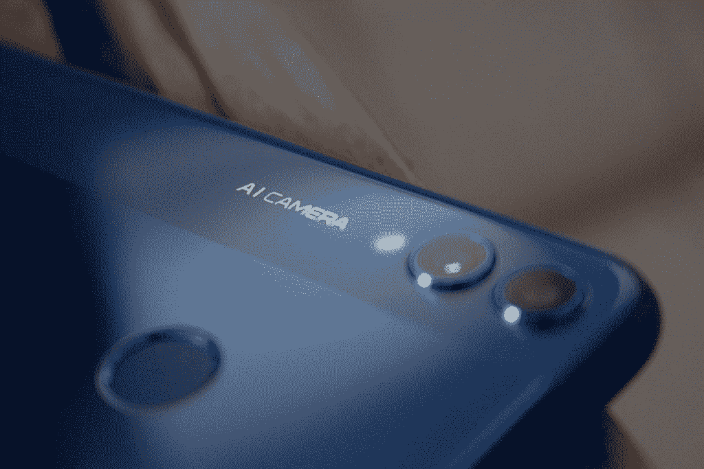

# Honor 9X 对 Honor 8X 进行了重大改进

> 原文：<https://www.xda-developers.com/the-honor-9x-makes-major-improvements-over-the-honor-8x/>

当谈到手机升级时，我们通常可以期待同一系列手机的相同类型的变化。你通常会看到一个稍微好一点的摄像头，下一个最快的芯片组，新的软件，也许还有稍微不同的设计。然而，当一部手机在下一个版本的各个方面都进行了重大改进时，你会看到一部手机的真正演变，而不仅仅是一次标准升级。

在 Honor 9X 的案例中，Honor 真正地将 X 系列产品线发展成了一个与众不同且明显更好的产品。自从 5X 颁奖典礼以来，我一直在审查 X 系列，它一直是一个坚实的预算线，以极具竞争力的价格提供智能手机的基本功能。让我们看看 Honor 9X 如何将品牌带向更令人兴奋的方向。

## 大型无缺口显示屏

 <picture></picture> 

Honor 9X Body Design

 <picture></picture> 

Honor 9X Full Screen Display

 <picture></picture> 

Honor 9X Selfie Camera

如果你认为 Honor 9X 看起来比 X 系列的其他手机大得多，你没有错。通过将自拍相机移动到电动弹出机制，Honor 能够在没有任何中断的情况下安装动态全景显示器。这意味着更多的手机正面专用于显示。Honor 9X 设法安装了一个 6.59 英寸的大显示屏，而手机机身并不比 Honor 8X 大多少。

 <picture></picture> 

Honor 8X with Micro-USB

 <picture></picture> 

Honor 8X in Blue

 <picture></picture> 

Honor 8X Display

虽然 Honor 8X 是廉价手机领域的一个很好的选择，但它感觉像一部非常不同的手机。与 Honor 9X 的新设计相比，6.5 英寸的显示屏明显更小，凹口成为一个非常突出的特征。

## 4800 万像素的更好照片

当 Honor 决定用 48MP 三摄像头处理 Honor 9X 时，它的照片质量大幅提升。48MP 摄像头是 2019 年旗舰手机中最令人兴奋的功能，这使得 Honor 9X 与今年的许多顶级手机齐名。除了 48MP 传感器，还有一个 8MP 超宽镜头和一个 2MP 深度传感器。

 <picture></picture> 

Honor 9X 48MP Triple Camera

 <picture></picture> 

Honor 8X 20MP Dual Cameras

虽然 Honor 8X 的摄像头令人尊敬，但它显然是廉价手机类别的一员。20MP 传感器与 2MP 深度传感器配对，用于双摄像头设置。Honor 9X 上的 48MP 升级使相机从优秀到卓越，并为未来的 X 系列手机设定了很高的期望。

## 更好的设计

虽然两款手机的设计在某些方面相似，但 9X 在所有重要的方面都有所改进。9X 最终放弃了 micro-USB 充电端口，代之以 USB Type-C。他们选择在手机底部仍然包括一个 3.5 毫米耳机插孔，这得到了几乎所有人的认可。更大的显示屏也是一个很大的改进，并且放弃凹槽是朝着正确方向迈出的非常必要的一步。9X 比 Honor 8X 重一点，但它的尺寸更大，这意味着它可以安装更大的电池。虽然 8X 的容量相当不错，为 3750 毫安时，但 9X 的容量却高达 4000 毫安时。

| 

荣誉 8X

 | 

规范

 |
| --- | --- |
| 显示 | 6.5 英寸 1080×2340 英寸(397 ppi) |
| 芯片集 | 海思麒麟 710 |
| 随机存取存储 | 4/6GB |
| 储存；储备 | 64/128GB |
| 主摄像机 | 20+2MP(深度传感器) |
| 自拍相机 | 16MP |
| 电池 | 3750 毫安时 |

| 

荣誉 9X

 | 

规范

 |
| --- | --- |
| 显示 | 6.59 英寸 1080 x 2340p 像素(391 ppi) |
| 芯片集 | 海思麒麟 710F |
| 随机存取存储 | 6GB |
| 储存；储备 | 128GB |
| 主摄像机 | 48MP+8MP(超宽)+2MP(深度传感器) |
| 自拍相机 | 16MP 电动弹出式 |
| 电池 | 4000 毫安时 |

这些改进使得 Honor 9X 不仅仅是 X 系列的又一次例行更新。这是一款与众不同的手机，预示着 Honor 系列更令人兴奋的未来。

[**荣誉 9X 论坛**](https://forum.xda-developers.com/honor-9x)

###### *我们感谢 Honor 赞助了这篇文章。我们的赞助商帮助我们支付与运行 XDA 相关的许多费用，包括服务器成本、全职开发人员、新闻撰稿人等等。虽然您可能会在门户内容旁边看到赞助内容(这些内容将始终被标记为赞助内容),但门户团队对这些帖子不承担任何责任。赞助内容、广告和 XDA 仓库完全由一个独立的团队管理。XDA 绝不会通过接受金钱来赞扬一家公司，或以任何方式改变我们的观点或看法，从而损害其新闻诚信。我们的意见不能被收买。*