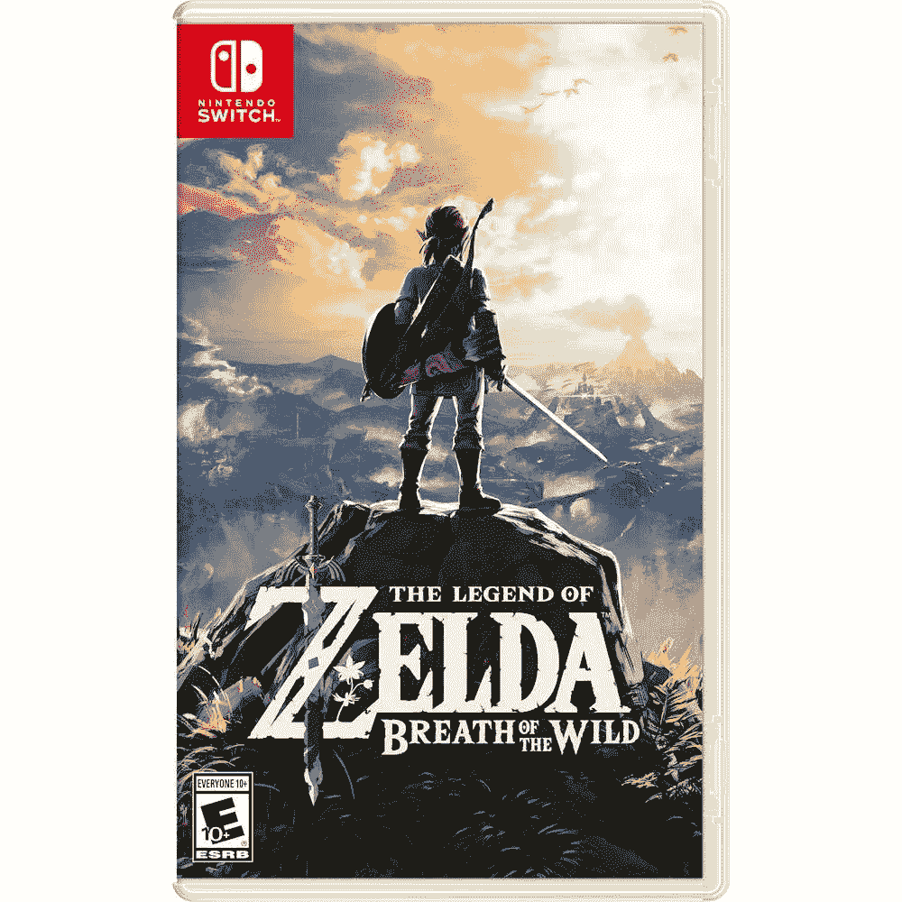

# 《塞尔达传说:野性的呼吸》现在仅售 42 美元(优惠 18 美元)

> 原文：<https://www.xda-developers.com/the-legend-of-zelda-breath-of-the-wild-is-just-42-right-now-18-off/>

# 《塞尔达传说:野性的呼吸》现在仅售 42 美元(优惠 18 美元)

任天堂近年来最好的游戏之一在多家零售商处以低于正常价格 18 美元的价格出售。

任天堂在 2017 年发布了*塞尔达传说:野性之息*，成为任天堂在 Wii U 上发布的最后一款游戏，也是 Switch 的首发游戏。它仍然是这两种主机上最好的游戏之一，有一个巨大的开放世界可供探索，还有复杂的谜题需要解决。在典型的任天堂时尚中，这款游戏在过去四年的大部分时间里一直保持在 60 美元，但现在它在多家零售商处以 41.99 美元的价格出售。

*塞尔达传说:野性的呼吸*设定在 Hyrule 的王国，在那里你扮演 Link，他在巨大的开放世界中奔跑、滑行和滑行。与其他一些塞尔达游戏类似，你的目标是将 Hyrule 从灾难性的加农中拯救出来，但是*野性之息*的非线性设计意味着你可以在任何时候轻易地偏离主要故事。

 <picture></picture> 

The Legend of Zelda: Breath of the Wild

##### 塞尔达传说野性的呼吸

这是任天堂近年来最好的游戏之一，现在比通常价格低 18 美元。

任天堂表示《荒野之息》的续作将于明年发布，所以如果你还没有拿到第一款游戏的话，现在是拿起它的最佳时机。然而，只有任天堂 Switch 版本在销售，而不是 Wii U 版本。