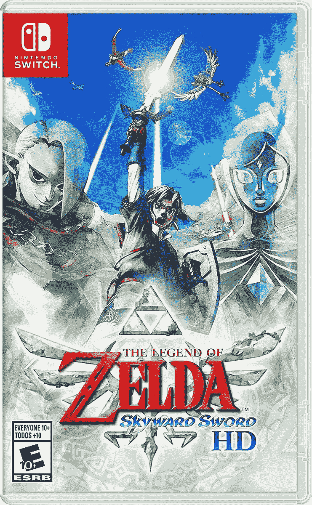

# 塞尔达传说:天空之剑高清版已经降价 10 美元

> 原文：<https://www.xda-developers.com/the-legend-of-zelda-skyward-sword-hd-is-already-10-off/>

# 塞尔达传说:天空之剑高清版已经降价 10 美元

作为任天堂《塞尔达传说:天空之剑》高清重制版中的链接，前往漂浮的天空之岛。

任天堂在不到一个月前为任天堂 Switch 发布了*塞尔达传说:天空之剑 HD* 。这是 2011 年《塞尔达传说*:天空之剑*的翻拍版，在 Wii 上，你可以在漂浮的 Skyloft 岛上扮演 Link，翻拍版和原版一样受到好评。任天堂最初将这款新游戏定价为 59.99 美元，但现在它在亚马逊的售价为 49.94 美元。如果你喜欢在百思买购物，那里的价格也差不多。

《天空之剑》是塞尔达的一款主线游戏，林克的任务是在塞尔达被绑架并被带到地表后营救她。最初的版本是第一个使用现场乐队演奏大部分音乐的游戏，也是 Wii 上评分最高的游戏之一[。新的 remaster 有两种控制方案(带 Joycons 的动作控制，像原版游戏的 Wii 遥控器，或普通控制)，更流畅的 60FPS 体验，自动保存，跳过对话框和过场动画的能力，以及其他改进。](https://www.metacritic.com/game/wii/the-legend-of-zelda-skyward-sword)

 <picture></picture> 

The Legend of Zelda: Skyward Sword HD

##### 塞尔达传说:天空之剑

Skyward Sword HD 现在在亚马逊以低于原价 10 美元的价格出售。百思买以九美元的价格出售。

天空之剑 *HD* 是由 Tantalus Media 联合开发的[，与 Wii U 上的*暮光之城公主 HD* 是同一个团队。这款游戏绝对值得任何塞尔达粉丝或任何对任天堂 2010 年最佳游戏感兴趣的人挑选。](https://www.vooks.net/aussie-developers-tantalus-return-to-hyrule-with-skyward-sword-hd/)