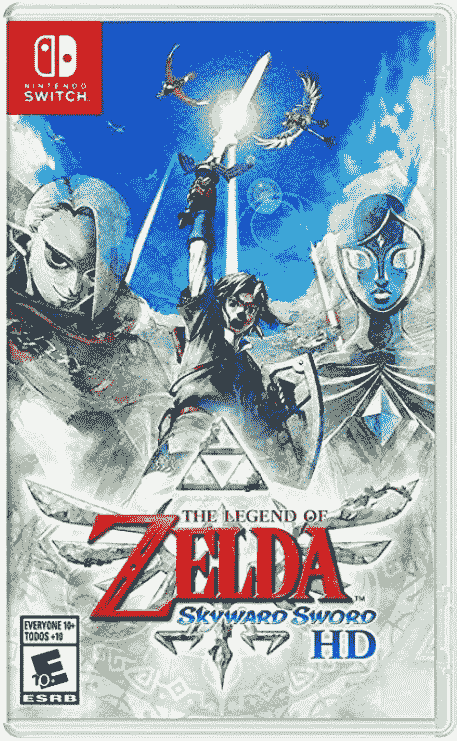

# 塞尔达传说:天空之剑高清版今天仅售 40 美元(优惠 20 美元)

> 原文：<https://www.xda-developers.com/the-legend-of-zelda-skyward-sword-hd-is-only-40-today-20-off/>

# 塞尔达传说:天空之剑高清版今天仅售 40 美元(优惠 20 美元)

Skyward Sword 现在在多家商店以 40 美元的价格出售，比通常的价格低 20 美元，比以前的销售低 10 美元。

任天堂今年早些时候为任天堂 Switch 发布了《塞尔达传说:天空之剑》。这是 2011 年任天堂 Wii 上的*塞尔达传说:天空之剑*的翻拍版，你可以在 Skyloft 的浮岛上扮演 Link，翻拍版和原版一样受到好评。这款游戏曾几次降价 10 美元，但现在在多家商店降至 39.99 美元，比通常价格低 20 美元。

*天空之剑*是一款塞尔达主线游戏，你扮演林克，任务是在塞尔达从天空之剑被绑架并带到地表后营救她。最初的版本是第一个使用现场乐队演奏大部分音乐的游戏，也是 Wii 上最好的游戏之一。新的 remaster 有两种控制方案(带 Joycons 的动作控制，像原版游戏的 Wii 遥控器，或普通控制)，更流畅的 60FPS 体验，自动保存，跳过对话框和过场动画的能力，以及其他改进。

 <picture></picture> 

The Legend of Zelda: Skyward Sword HD

##### 塞尔达传说:天空之剑

这款出色的开关塞尔达游戏售价 39.99 美元，比通常的价格节省了 20 美元。

*天空之剑* *HD* 是由 Tantalus Media 联合开发的[，该团队曾在 Wii U 上帮助开发*暮光之城公主 HD* 。这款游戏绝对值得任何塞尔达迷或任何对任天堂 2010 年最佳游戏感兴趣的人挑选。](https://www.vooks.net/aussie-developers-tantalus-return-to-hyrule-with-skyward-sword-hd/)