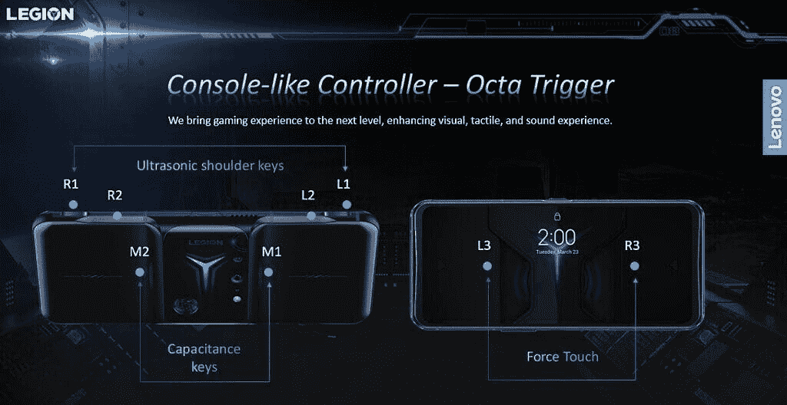

# 联想正式推出军团电话决斗 2 游戏手机

> 原文：<https://www.xda-developers.com/the-new-lenovo-legion-phone-duel-2-features-eight-trigger-keys-and-dual-active-cooling-fans/>

在多次[泄露](https://www.xda-developers.com/lenovo-legion-gaming-phone-design-landscape-use-optimized/)和戏弄之后，联想今天正式发布了它的第二款游戏手机:军团手机决斗 2。联想最新的游戏手机遵循了与它的前辈[相同的理念。它提供了一种针对景观使用而优化的设计，并集成了一些迄今为止我们在智能手机上看到的最强大的硬件。](https://www.xda-developers.com/lenovo-legion-phone-duel-snapdragon-865-plus-90w-charging-side-popup-launch/)

**[联想军团手机决斗 2 论坛](https://forum.xda-developers.com/f/lenovo-legion-phone-duel-2.12213/)**

## 联想军团手机决斗 2:规格

| 

规格

 | 

联想军团手机决斗 2

 |
| --- | --- |
| **尺寸和重量** |  |
| **显示** | 

*   6.96 英寸三星 E4 AMOLED FHD+
*   144Hz 屏幕刷新率
*   高达 720Hz 的触摸采样率
*   1300 尼特峰值亮度
*   111.1% DCI-P3
*   DC 调光
*   Pixelworks 显示芯片
*   HDR10+
*   康宁大猩猩玻璃 5

 |
| **SoC** | 

*   高通骁龙 888:
    *   1 个 Kryo 680 Prime 内核@ 2.84GHz
    *   3 个 Kryo 680 性能内核@ 2.4GHz
    *   4 个 Kryo 680 高效内核@ 1.8GHz
*   肾上腺素 660

 |
| **RAM 和存储器** | 

*   内存:12GB/16GB/18GB LPDDR5
*   存储:256GB/512GB UFS 3.1

 |
| **电池&充电** | 

*   5500 毫安时双芯电池(2750 毫安时+2750 毫安时)
*   高达 90W 的快速充电支持(单独销售)

 |
| **后置摄像头** | 

*   主要:64MP f/1.9 OmniVision OV64A
*   次要:1600 万像素 f/2.2 超宽，123 FoV

 |
| **前置摄像头** | 

*   44MP 三星 GH1+，f/2.0
*   4K 录像
*   240fps 慢动作

 |
| **端口** |  |
| **连通性** | 

*   5G(毫米波 6GHz 以下)
*   WiFi 6(双频)
*   蓝牙 5.2

 |
| **游戏功能** | 

*   双主动冷却风扇
*   4x 超声波肩键
*   背面有两个电容式触发键
*   2 个强制触摸键

 |
| **音频特性** | 

*   双 X 轴触觉振动学习电机
*   四个麦克风

 |
| **软件** | 安卓 11 |

在正面，联想军团手机 Duel 2 配备了 6.92 英寸 AMOLED(三星 E4)显示屏，可变屏幕刷新率高达 144Hz，触摸采样率高达 720Hz。从内部为手机提供动力的是高通最新最棒的骁龙 888 芯片组，搭配高达 18GB 的 LPDDR5 RAM 和高达 512GB 的 UFS 3.1 存储。

对于摄影，军团电话决斗 2 有一个双摄像头设置，由 64MP OmniVision OV64A 主拍摄者和 16MP 广角摄像头组成。右侧放置了一个 44MP 弹出式自拍相机。

联想军团手机 Duel 2 的右边框上有四个超声波肩键(R1、R2、l 2、L1)，背面有两个电容键(L3 和 R3)，允许游戏玩家同时执行多个游戏内动作和操作。联想再次与 Sentons 公司合作开发这些超声波按键。为了散热，联想使用了两个主动冷却风扇，四个石墨散热垫和一个蒸汽室，联想声称这是智能手机上最大的。与我们在 Red Magic 6 和 Realme GT 上看到的类似，联想军团手机 Duel 2 也可以通过 HDMI 连接到外部显示器，并支持键盘和游戏手柄输入。

 <picture></picture> 

Image via: Sentons

这款手机装有 5500 毫安时的双电池，支持高达 90W 的快速充电(充电器单独出售)，可进行快速充电。与[华硕 ROG 手机 5](https://www.xda-developers.com/asus-rog-phone-5/) 一样，Legion Phone Duel 2 配备了两个 USB Type C 端口，可以同时使用这两个端口为设备充电，仅需 30 分钟。

其他亮点包括 5G、WiFi 6 支持、显示指纹读取器、双前置扬声器、四个降噪麦克风和 Android 11。

### 定价和可用性

联想军团手机 Duel 2 的基本款 12GB + 256GB 机型在€的起价为 799 英镑，16GB + 256GB 机型的起价为€999 英镑。配有 18GB 内存和 512GB 存储空间的顶级版本定价为€1099 英镑。这款手机将于本月在中国[上市，并将于五月晚些时候抵达欧洲。](https://item.lenovo.com.cn/product/1013232.html?pmf_group=in-push&pmf_medium=banner-gw&pmf_source=Z00016247T001&_ga=2.119689226.32997085.1617879436-1832957119.1617879436)